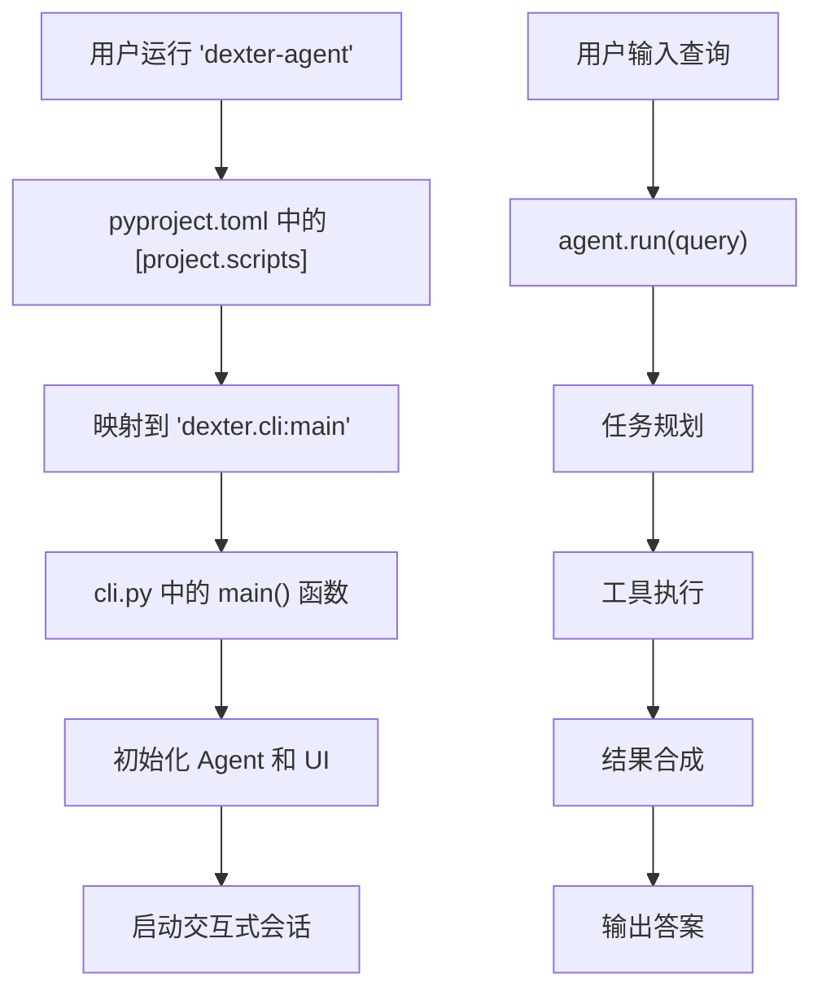
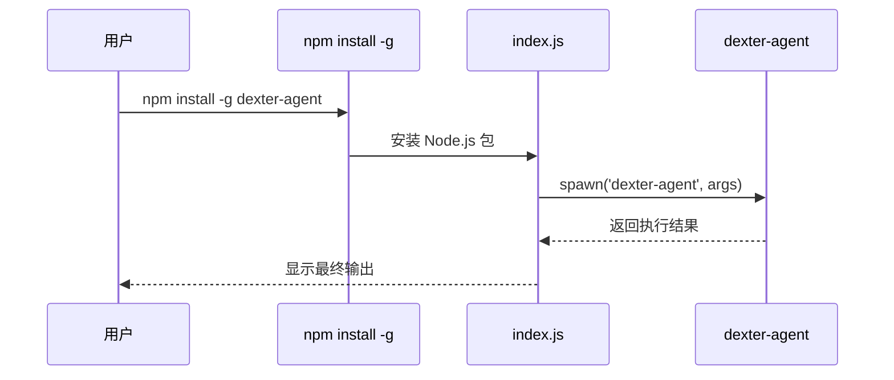
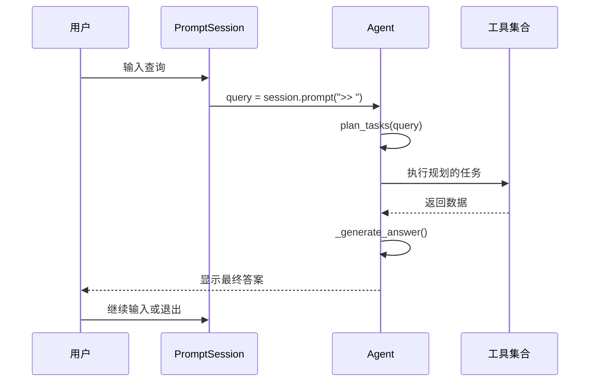
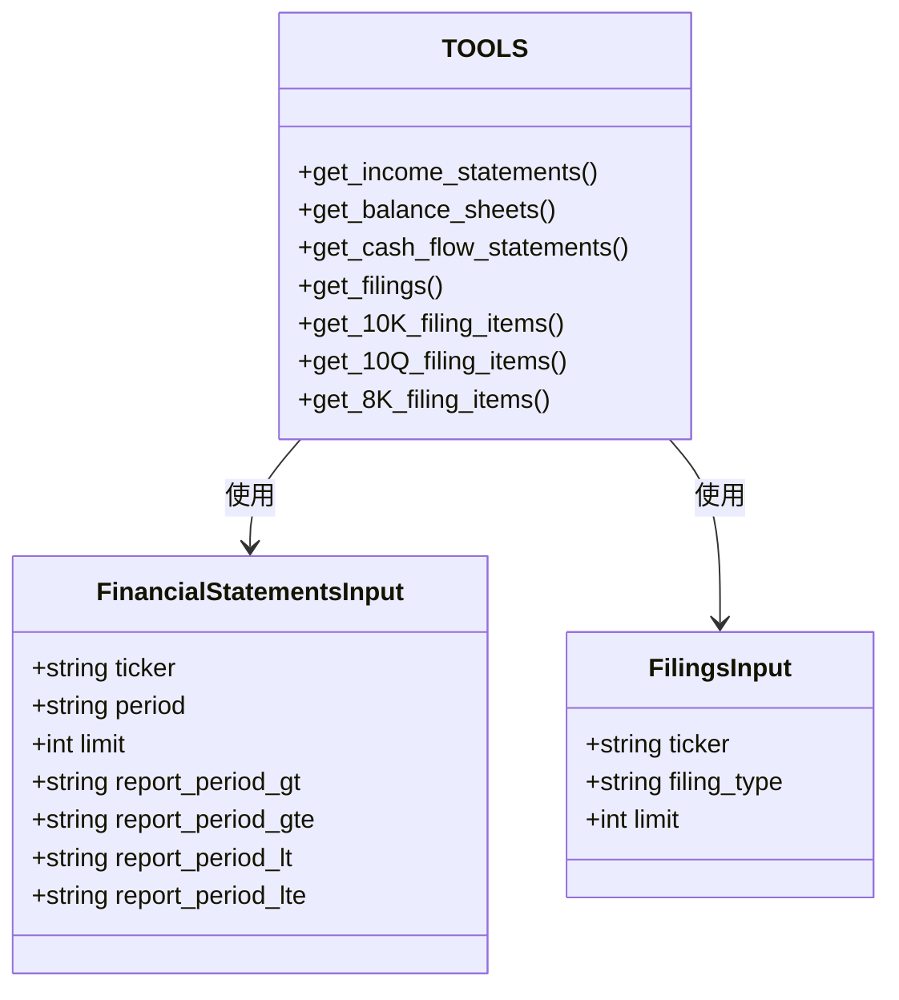
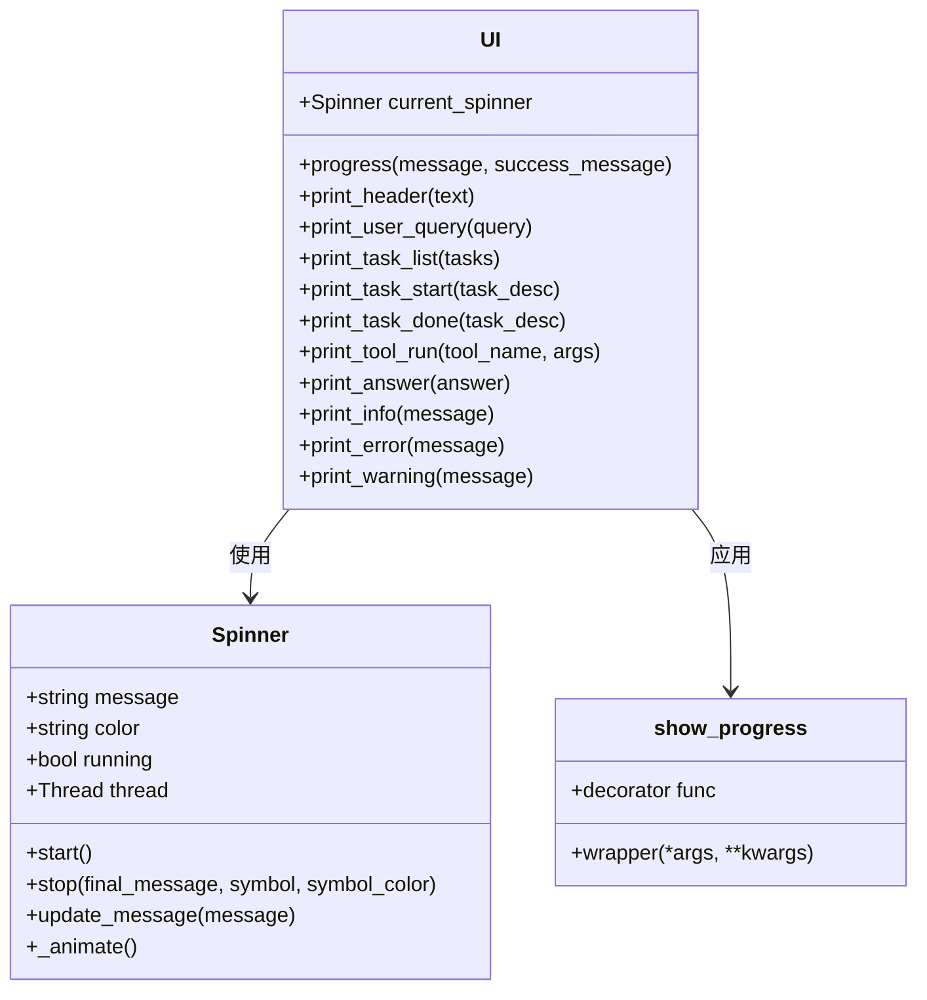
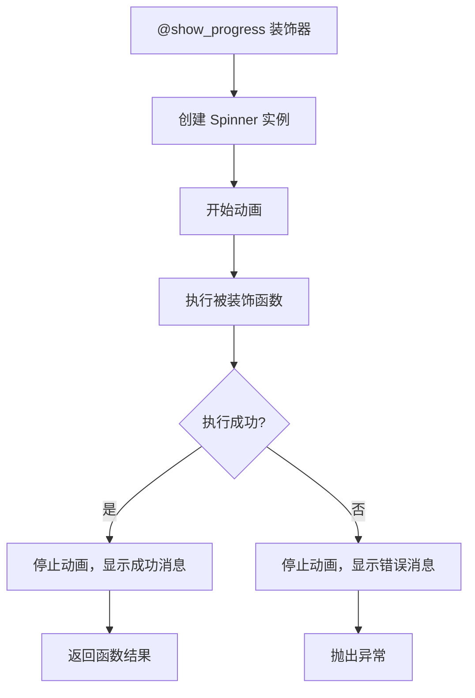
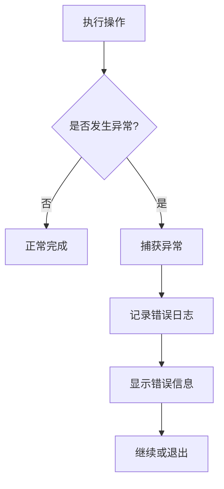

# 命令行参考

<cite>
**本文档中引用的文件**
- [pyproject.toml](file://pyproject.toml)
- [index.js](file://index.js)
- [package.json](file://package.json)
- [cli.py](file://src/dexter/cli.py)
- [ui.py](file://src/dexter/utils/ui.py)
- [intro.py](file://src/dexter/utils/intro.py)
- [agent.py](file://src/dexter/agent.py)
- [tools/__init__.py](file://src/dexter/tools/__init__.py)
- [financials.py](file://src/dexter/tools/financials.py)
- [filings.py](file://src/dexter/tools/filings.py)
- [api.py](file://src/dexter/tools/api.py)
- [constants.py](file://src/dexter/tools/constants.py)
- [prompts.py](file://src/dexter/prompts.py)
- [README.md](file://README.md)
</cite>

## 目录
1. [简介](#简介)
2. [命令行入口点](#命令行入口点)
3. [安装与设置](#安装与设置)
4. [交互模式使用](#交互模式使用)
5. [命令行选项](#命令行选项)
6. [工具与功能](#工具与功能)
7. [进度显示系统](#进度显示系统)
8. [非交互模式](#非交互模式)
9. [故障排除](#故障排除)
10. [最佳实践](#最佳实践)

## 简介

Dexter是一个专门用于金融研究的自主AI代理，提供了强大的命令行界面来执行复杂的财务分析任务。该工具采用多代理架构，能够自动分解查询、规划研究步骤、执行数据分析，并生成全面的数据驱动答案。

## 命令行入口点

### Python入口点 (`dexter-agent`)

Dexter通过Python包管理器提供的标准入口点访问：



**图表来源**
- [pyproject.toml](file://pyproject.toml#L18-L19)
- [cli.py](file://src/dexter/cli.py#L10-L32)

**章节来源**
- [pyproject.toml](file://pyproject.toml#L18-L19)
- [cli.py](file://src/dexter/cli.py#L10-L32)

### Node.js包装器

为了在Node.js环境中提供全局命令支持，项目包含了一个Node.js包装脚本：



**图表来源**
- [index.js](file://index.js#L4-L11)
- [package.json](file://package.json#L7-L8)

**章节来源**
- [index.js](file://index.js#L1-L12)
- [package.json](file://package.json#L1-L16)

## 安装与设置

### 系统要求

- Python 3.10 或更高版本
- [uv](https://github.com/astral-sh/uv) 包管理器
- OpenAI API密钥
- Financial Datasets API密钥

### 安装步骤

1. **克隆仓库**：
   ```bash
   git clone https://github.com/virattt/dexter.git
   cd dexter
   ```

2. **安装依赖**：
   ```bash
   uv sync
   ```

3. **设置环境变量**：
   ```bash
   # 复制示例环境文件
   cp env.example .env
   
   # 编辑 .env 文件并添加您的API密钥
   # OPENAI_API_KEY=your-openai-api-key
   # FINANCIAL_DATASETS_API_KEY=your-financial-datasets-api-key
   ```

**章节来源**
- [README.md](file://README.md#L25-L50)

## 交互模式使用

### 启动程序

在终端中运行以下命令启动Dexter：

```bash
uv run dexter-agent
```

### 欢迎界面

首次启动时，程序会显示欢迎界面和ASCII艺术：


**图表来源**
- [intro.py](file://src/dexter/utils/intro.py#L1-L36)
- [cli.py](file://src/dexter/cli.py#L12)

### 输入处理流程

交互模式的核心处理流程如下：



**图表来源**
- [cli.py](file://src/dexter/cli.py#L18-L28)
- [agent.py](file://src/dexter/agent.py#L125-L252)

### 退出程序

用户可以通过以下方式退出程序：
- 输入 `exit` 或 `quit`
- 使用键盘中断（Ctrl+C）
- 使用文件结束符（Ctrl+D）

**章节来源**
- [cli.py](file://src/dexter/cli.py#L18-L28)
- [intro.py](file://src/dexter/utils/intro.py#L1-L36)

## 命令行选项

当前版本的Dexter主要通过交互模式提供功能，不直接支持命令行参数。所有配置都通过环境变量和Agent类参数进行控制。

### 配置选项

| 参数 | 默认值 | 描述 |
|------|--------|------|
| `max_steps` | 20 | 全局安全限制，防止无限循环 |
| `max_steps_per_task` | 5 | 每个任务的最大迭代次数 |

### 环境变量

| 变量名 | 必需 | 描述 |
|--------|------|------|
| `OPENAI_API_KEY` | 是 | OpenAI API密钥 |
| `FINANCIAL_DATASETS_API_KEY` | 是 | Financial Datasets API密钥 |

**章节来源**
- [agent.py](file://src/dexter/agent.py#L15-L16)
- [README.md](file://README.md#L40-L45)

## 工具与功能

Dexter提供了丰富的金融数据分析工具，所有工具都集成在Agent的工具集合中：

### 可用工具列表



**图表来源**
- [tools/__init__.py](file://src/dexter/tools/__init__.py#L10-L17)
- [financials.py](file://src/dexter/tools/financials.py#L8-L16)
- [filings.py](file://src/dexter/tools/filings.py#L13-L24)

### 工具功能详解

| 工具名称 | 功能描述 | 主要参数 |
|----------|----------|----------|
| `get_income_statements` | 获取损益表 | ticker, period, limit, report_period_* |
| `get_balance_sheets` | 获取资产负债表 | ticker, period, limit, report_period_* |
| `get_cash_flow_statements` | 获取现金流量表 | ticker, period, limit, report_period_* |
| `get_filings` | 获取SEC filings元数据 | ticker, filing_type, limit |
| `get_10K_filing_items` | 获取10-K报告内容 | ticker, year, item |
| `get_10Q_filing_items` | 获取10-Q报告内容 | ticker, year, quarter, item |
| `get_8K_filing_items` | 获取8-K报告内容 | ticker, accession_number, item |

### 支持的Filing类型

| 类型 | 描述 | 用途 |
|------|------|------|
| 10-K | 年度报告 | 年度财务摘要和详细披露 |
| 10-Q | 季度报告 | 季度财务状况更新 |
| 8-K | 当前报告 | 重大事件披露 |

**章节来源**
- [tools/__init__.py](file://src/dexter/tools/__init__.py#L1-L18)
- [financials.py](file://src/dexter/tools/financials.py#L19-L96)
- [filings.py](file://src/dexter/tools/filings.py#L27-L201)

## 进度显示系统

Dexter使用先进的UI系统来提供实时反馈和进度指示：

### 进度显示组件



**图表来源**
- [ui.py](file://src/dexter/utils/ui.py#L85-L190)
- [ui.py](file://src/dexter/utils/ui.py#L21-L83)

### 进度显示特性

| 显示类型 | 图标 | 颜色 | 用途 |
|----------|------|------|------|
| 加载动画 | ⠋⠙⠹⠸⠼⠴⠦⠧⠇⠏ | 青色 | 正在执行的操作 |
| 成功完成 | ✓ | 绿色 | 操作成功完成 |
| 执行错误 | ✗ | 红色 | 操作失败 |
| 任务开始 | ▶ | 青色 | 开始新任务 |
| 任务完成 | ✓ | 绿色 | 任务完成 |

### 装饰器使用

许多核心操作使用`show_progress`装饰器来提供进度反馈：



**图表来源**
- [ui.py](file://src/dexter/utils/ui.py#L85-L95)

**章节来源**
- [ui.py](file://src/dexter/utils/ui.py#L21-L190)
- [agent.py](file://src/dexter/agent.py#L25-L252)

## 非交互模式

虽然Dexter主要设计为交互式工具，但其核心Agent类可以以编程方式使用：

### 编程接口

```python
from dexter.agent import Agent

# 创建Agent实例
agent = Agent(max_steps=20, max_steps_per_task=5)

# 直接调用run方法
result = agent.run("分析苹果公司的财务状况")
print(result)
```

### 自动化使用场景

| 场景 | 使用方式 | 示例 |
|------|----------|------|
| 批量查询 | 循环调用Agent.run() | 对多个股票执行分析 |
| 数据提取 | 结合外部调度器 | 定期获取财务数据 |
| 集成应用 | 导入Agent类 | 在其他Python应用中使用 |

**章节来源**
- [agent.py](file://src/dexter/agent.py#L125-L252)

## 故障排除

### 常见问题

| 问题 | 原因 | 解决方案 |
|------|------|----------|
| API密钥错误 | 环境变量未正确设置 | 检查.env文件中的API密钥 |
| 网络连接问题 | 网络不稳定或API不可用 | 检查网络连接，重试请求 |
| 查询超时 | 任务复杂度过高 | 调整max_steps参数 |
| 工具执行失败 | 参数错误或数据缺失 | 检查输入参数的有效性 |

### 错误处理机制



**图表来源**
- [agent.py](file://src/dexter/agent.py#L197-L210)

### 调试技巧

1. **启用详细日志**：检查Agent的日志记录功能
2. **调整安全限制**：适当增加max_steps值
3. **验证API密钥**：确保所有必需的API密钥都已正确设置
4. **简化查询**：从简单查询开始，逐步增加复杂度

**章节来源**
- [agent.py](file://src/dexter/agent.py#L197-L210)
- [api.py](file://src/dexter/tools/api.py#L10-L17)

## 最佳实践

### 查询优化建议

1. **明确具体**：提供具体的公司名称、时间范围和分析维度
2. **分步查询**：复杂问题可分解为多个相关查询
3. **合理预期**：理解工具的能力边界，避免超出范围的请求
4. **关注时效性**：注意财务数据的时间属性

### 性能优化

| 策略 | 实现方式 | 效果 |
|------|----------|------|
| 参数过滤 | 使用report_period_*参数 | 减少数据量，提高速度 |
| 限制数量 | 设置合理的limit值 | 控制响应时间和资源消耗 |
| 错误重试 | 实现指数退避重试 | 提高成功率 |
| 缓存机制 | 实现结果缓存 | 避免重复计算 |

### 安全考虑

1. **API密钥保护**：不要在代码中硬编码API密钥
2. **输入验证**：Agent会对输入进行基本验证
3. **资源限制**：内置max_steps防止资源耗尽
4. **错误隔离**：单个工具失败不会影响整体运行

### 使用示例

```bash
# 基本查询示例
uv run dexter-agent

# 分析特定公司的财务指标
"What是特斯拉过去四个季度的收入增长率？"

# 比较两家公司的财务表现
"比较微软和亚马逊2023年的运营利润率"

# 获取详细的年度报告分析
"分析苹果公司2023年10-K报告中的风险因素"
```

**章节来源**
- [README.md](file://README.md#L55-L75)
- [agent.py](file://src/dexter/agent.py#L15-L16)