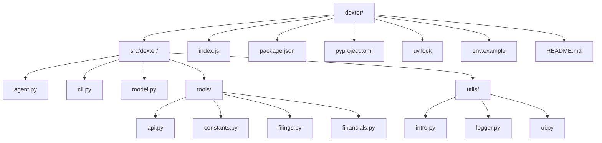
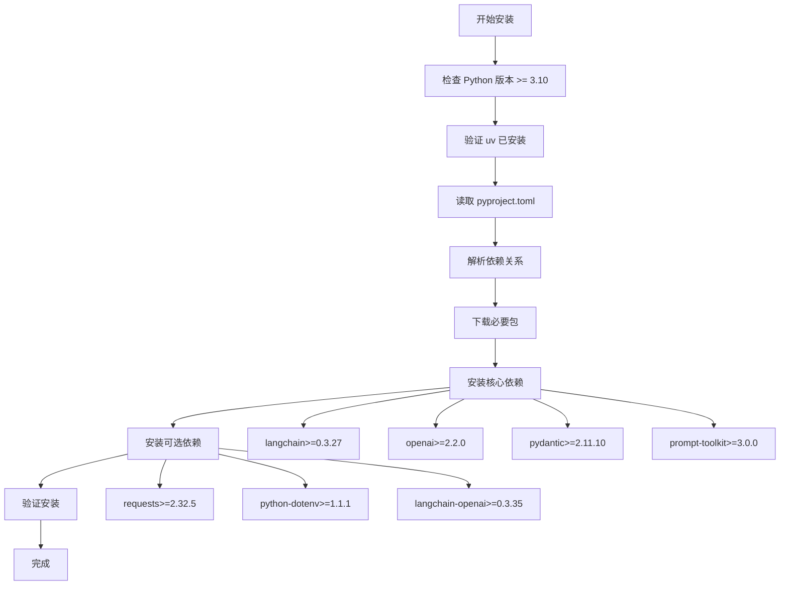
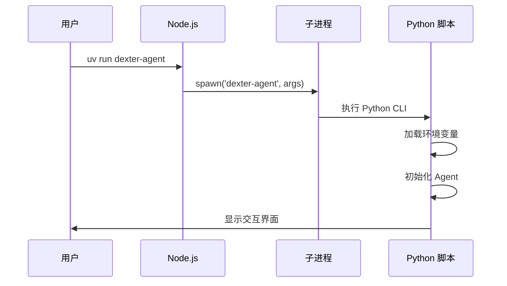
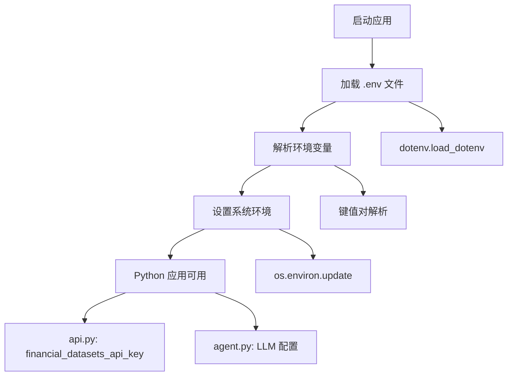
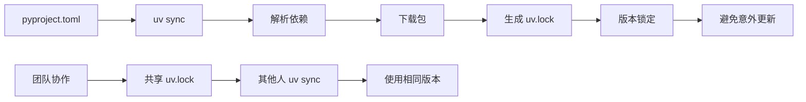

# 安装指南

<cite>
**本文档引用的文件**
- [README.md](file://README.md)
- [package.json](file://package.json)
- [pyproject.toml](file://pyproject.toml)
- [index.js](file://index.js)
- [uv.lock](file://uv.lock)
- [env.example](file://env.example)
- [src/dexter/cli.py](file://src/dexter/cli.py)
- [src/dexter/tools/api.py](file://src/dexter/tools/api.py)
</cite>

## 目录
1. [简介](#简介)
2. [前置条件](#前置条件)
3. [Python 3.10+ 安装](#python-310-安装)
4. [uv 包管理器安装](#uv-包管理器安装)
5. [项目克隆与初始化](#项目克隆与初始化)
6. [依赖安装](#依赖安装)
7. [Node.js 包装脚本详解](#nodejs-包装脚本详解)
8. [环境变量配置](#环境变量配置)
9. [常见安装问题解决](#常见安装问题解决)
10. [依赖锁定机制](#依赖锁定机制)
11. [验证安装](#验证安装)

## 简介

Dexter 是一个自主财务研究代理，能够思考、规划并学习如何工作。它使用任务规划、自我反思和实时市场数据进行分析。本指南将帮助您完成从环境准备到项目运行的完整安装过程。

## 前置条件

在开始安装之前，请确保您的系统满足以下要求：

### 系统要求
- **Python 版本**: Python 3.10 或更高版本
- **包管理器**: uv（推荐）或 pip
- **操作系统**: Windows、macOS 或 Linux
- **内存**: 至少 4GB RAM（推荐 8GB 或更多）
- **存储空间**: 至少 2GB 可用磁盘空间

### 必需的 API 密钥
- **OpenAI API 密钥**: 用于语言模型服务
- **Financial Datasets API 密钥**: 用于金融数据获取

## Python 3.10+ 安装

### Windows 系统

1. **下载 Python 安装程序**
   - 访问 [Python 官方网站](https://www.python.org/downloads/)
   - 下载最新稳定版的 Windows 安装程序（Python 3.10+）

2. **安装 Python**
   ```powershell
   # 运行下载的安装程序
   # 在安装过程中勾选 "Add Python 3.x to PATH"
   ```

3. **验证安装**
   ```powershell
   python --version
   # 应显示 Python 3.10.x 或更高版本
   ```

### macOS 系统

1. **使用 Homebrew 安装**
   ```bash
   # 如果尚未安装 Homebrew
   /bin/bash -c "$(curl -fsSL https://raw.githubusercontent.com/Homebrew/install/HEAD/install.sh)"
   
   # 安装 Python 3.10+
   brew install python@3.10
   ```

2. **验证安装**
   ```bash
   python3 --version
   # 应显示 Python 3.10.x 或更高版本
   ```

### Linux 系统

1. **Ubuntu/Debian**
   ```bash
   sudo apt update
   sudo apt install python3.10 python3.10-venv python3.10-dev
   ```

2. **CentOS/RHEL/Fedora**
   ```bash
   sudo yum install python3.10 python3.10-devel
   # 或者对于 Fedora
   sudo dnf install python3.10 python3.10-devel
   ```

3. **验证安装**
   ```bash
   python3.10 --version
   # 应显示 Python 3.10.x 或更高版本
   ```

## uv 包管理器安装

uv 是一个快速的 Python 包管理器，专为现代 Python 开发而设计。Dexter 使用 uv 来管理依赖关系。

### 安装 uv

1. **使用官方安装脚本**
   ```bash
   # macOS 和 Linux
   curl -LsSf https://astral.sh/uv/install.sh | sh
   
   # Windows (PowerShell)
   powershell -ExecutionPolicy ByPass -c "irm https://astral.sh/uv/install.ps1 | iex"
   ```

2. **手动安装**
   ```bash
   # 下载预编译二进制文件
   # macOS/Linux
   curl -LsSf https://astral.sh/uv/latest/install.sh | sh
   
   # Windows
   Invoke-WebRequest -Uri https://astral.sh/uv/latest/install.ps1 -OutFile install.ps1
   .\install.ps1
   ```

3. **验证安装**
   ```bash
   uv --version
   # 应显示 uv 的版本号
   ```

### 配置环境变量

确保 uv 已添加到系统 PATH 中：

```bash
# macOS/Linux
export PATH="$HOME/.cargo/bin:$PATH"

# Windows PowerShell
$env:Path += ";$env:USERPROFILE\.cargo\bin"

# 验证
uv --version
```

## 项目克隆与初始化

### 克隆仓库

```bash
# 使用 HTTPS
git clone https://github.com/virattt/dexter.git
cd dexter

# 或使用 SSH（需要配置 SSH 密钥）
# git clone git@github.com:virattt/dexter.git
# cd dexter
```

### 项目结构概览



**图表来源**
- [README.md](file://README.md#L83-L95)
- [pyproject.toml](file://pyproject.toml#L1-L26)

## 依赖安装

### 使用 uv 安装

Dexter 使用 uv 来管理 Python 依赖关系，提供更快的安装速度和更好的依赖解析。

```bash
# 安装所有依赖
uv sync

# 如果需要特定的开发依赖
# uv sync --dev

# 检查依赖状态
uv tree
```

### 依赖安装过程详解



**图表来源**
- [pyproject.toml](file://pyproject.toml#L10-L18)
- [uv.lock](file://uv.lock#L1-L20)

### 核心依赖说明

| 依赖包 | 版本要求 | 用途 |
|--------|----------|------|
| langchain | >=0.3.27 | AI 框架和工具集成 |
| openai | >=2.2.0 | OpenAI API 客户端 |
| pydantic | >=2.11.10 | 数据验证和序列化 |
| prompt-toolkit | >=3.0.0 | 交互式命令行界面 |
| requests | >=2.32.5 | HTTP 请求处理 |
| python-dotenv | >=1.1.1 | 环境变量管理 |

**节来源**
- [pyproject.toml](file://pyproject.toml#L10-L18)

## Node.js 包装脚本详解

Dexter 使用 Node.js 脚本来提供跨平台的 CLI 接口，这使得项目可以在不同操作系统上具有一致的用户体验。

### index.js 分析



**图表来源**
- [index.js](file://index.js#L1-L13)

### 包装脚本功能

1. **跨平台兼容性**
   - 统一的命令接口
   - 自动处理平台差异
   - 保持一致的用户体验

2. **子进程管理**
   - 创建独立的 Python 进程
   - 继承标准输入输出
   - 处理进程退出码

3. **配置逻辑**
   - 从 package.json 的 bin 字段解析入口点
   - 支持命令行参数传递
   - 错误处理和日志记录

### package.json 中的配置

```json
{
  "bin": {
    "dexter-agent": "./index.js"
  },
  "scripts": {
    "postinstall": "uv pip install ."
  }
}
```

**节来源**
- [package.json](file://package.json#L6-L8)
- [package.json](file://package.json#L11-L12)

## 环境变量配置

### 获取 API 密钥

#### OpenAI API 密钥
1. 访问 [OpenAI 平台](https://platform.openai.com/)
2. 登录您的账户
3. 导航到 "API Keys" 页面
4. 创建新的 API 密钥
5. 复制生成的密钥

#### Financial Datasets API 密钥
1. 访问 [Financial Datasets](https://financialdatasets.ai)
2. 注册免费账户
3. 在仪表板中找到 API 密钥
4. 复制您的密钥

### 设置环境变量

1. **复制示例配置文件**
   ```bash
   # 复制环境变量模板
   cp env.example .env
   
   # 验证文件创建
   ls -la .env
   ```

2. **编辑环境变量文件**
   ```bash
   # 使用文本编辑器打开
   nano .env  # 或使用其他编辑器
   
   # 添加您的 API 密钥
   OPENAI_API_KEY=sk-your-openai-api-key-here
   FINANCIAL_DATASETS_API_KEY=your-financial-datasets-api-key
   ```

3. **环境变量格式要求**
   - 不要包含空格
   - 使用等号分隔键值对
   - 每个变量占一行
   - 不要加引号

### 环境变量加载机制



**图表来源**
- [src/dexter/cli.py](file://src/dexter/cli.py#L1-L5)
- [src/dexter/tools/api.py](file://src/dexter/tools/api.py#L6-L8)

**节来源**
- [env.example](file://env.example#L1-L5)
- [src/dexter/cli.py](file://src/dexter/cli.py#L1-L5)

## 常见安装问题解决

### 依赖冲突问题

#### 问题：Python 版本过低
```bash
# 错误信息
ERROR: This project requires Python >=3.10

# 解决方案
# 升级 Python 到 3.10 或更高版本
# 参考前面的 Python 安装章节
```

#### 问题：uv 未找到命令
```bash
# 错误信息
command not found: uv

# 解决方案
# 重新安装 uv 或检查 PATH 配置
export PATH="$HOME/.cargo/bin:$PATH"
```

### 权限错误

#### Windows 权限问题
```powershell
# 错误信息
Permission denied: 'uv'

# 解决方案
# 以管理员身份运行 PowerShell
# 或检查文件权限
Get-ItemProperty -Path "C:\Users\YourName\.cargo\bin\uv.exe"
```

#### macOS/Linux 权限问题
```bash
# 错误信息
Permission denied: ~/.cargo/bin/uv

# 解决方案
chmod +x ~/.cargo/bin/uv
```

### 网络连接问题

#### 问题：无法下载依赖
```bash
# 错误信息
Could not fetch URL https://pypi.org/simple/

# 解决方案
# 检查网络连接
# 使用国内镜像源
uv sync --index-url https://pypi.tuna.tsinghua.edu.cn/simple/
```

### 环境变量问题

#### 问题：API 密钥未生效
```bash
# 检查环境变量是否正确加载
python -c "import os; print(os.getenv('OPENAI_API_KEY'))"

# 解决方案
# 确保 .env 文件格式正确
# 重启终端或重新加载环境
```

### 性能优化建议

1. **使用虚拟环境**
   ```bash
   # 创建隔离的 Python 环境
   python -m venv dexter-env
   source dexter-env/bin/activate  # Linux/macOS
   # dexter-env\Scripts\activate  # Windows
   ```

2. **使用缓存加速**
   ```bash
   # 启用 uv 缓存
   uv cache enable
   ```

## 依赖锁定机制

### uv.lock 文件的作用

uv.lock 文件是 uv 包管理器的依赖锁定文件，确保项目在不同环境中使用完全相同的依赖版本。



**图表来源**
- [uv.lock](file://uv.lock#L1-L5)

### 锁定文件特性

| 特性 | 描述 | 优势 |
|------|------|------|
| 版本固定 | 锁定精确的包版本 | 确保一致性 |
| 平台适配 | 包含平台特定的二进制 | 跨平台兼容 |
| 依赖树 | 记录完整的依赖关系 | 避免冲突 |
| 哈希验证 | 验证包完整性 | 提高安全性 |

### 更新依赖

```bash
# 更新所有依赖到最新版本
uv sync --upgrade

# 更新特定包
uv sync --upgrade-package openai

# 强制重新解析所有依赖
uv sync --locked
```

**节来源**
- [uv.lock](file://uv.lock#L1-L20)

## 验证安装

### 基础功能测试

1. **启动交互模式**
   ```bash
   # 运行 Dexter
   uv run dexter-agent
   
   # 应该看到欢迎界面和提示符
   >> 
   ```

2. **基本查询测试**
   ```bash
   # 输入简单查询
   >> 什么是苹果公司的最新财报？
   
   # 应该看到分析过程和结果
   ```

3. **退出程序**
   ```bash
   # 使用以下命令退出
   >> exit
   # 或 Ctrl+C
   ```

### 功能验证清单

- [ ] Python 3.10+ 正确安装
- [ ] uv 包管理器正常工作
- [ ] 项目成功克隆
- [ ] 依赖完整安装
- [ ] 环境变量正确配置
- [ ] API 密钥有效
- [ ] 交互模式正常启动
- [ ] 基本查询响应正常

### 故障排除

如果遇到问题，请按以下顺序检查：

1. **检查 Python 版本**
   ```bash
   python --version
   ```

2. **验证 uv 安装**
   ```bash
   uv --version
   ```

3. **确认依赖安装**
   ```bash
   uv tree
   ```

4. **检查环境变量**
   ```bash
   python -c "import os; print('API keys present:', bool(os.getenv('OPENAI_API_KEY')))"
   ```

5. **查看日志输出**
   ```bash
   uv run dexter-agent 2>&1 | tee debug.log
   ```

**节来源**
- [src/dexter/cli.py](file://src/dexter/cli.py#L10-L32)

## 结论

完成本指南后，您应该已经成功安装并配置了 Dexter 财务研究代理。现在您可以开始探索其强大的财务分析能力，执行复杂的查询并获得深入的市场洞察。

如遇到任何问题，请参考故障排除部分或查阅项目的 GitHub 仓库获取更多帮助。