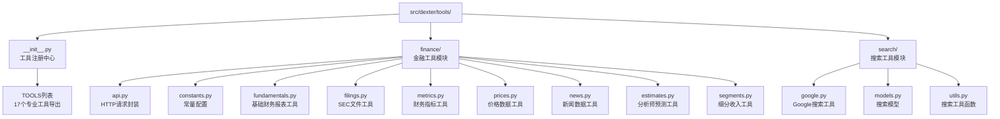
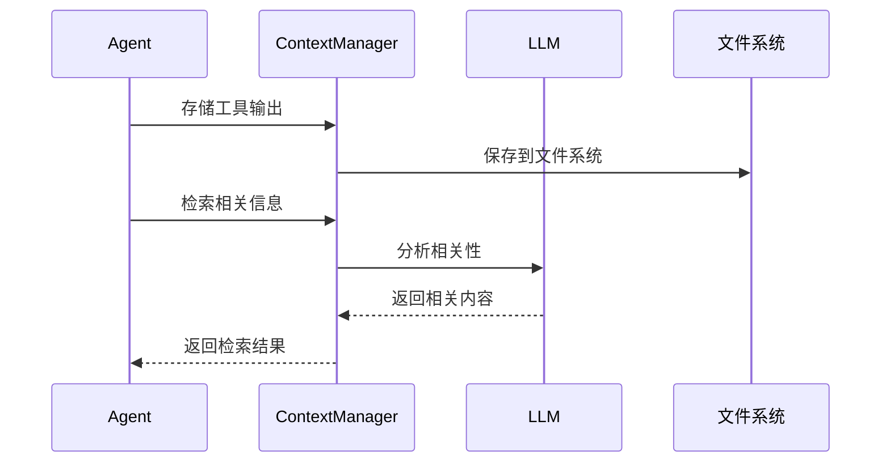
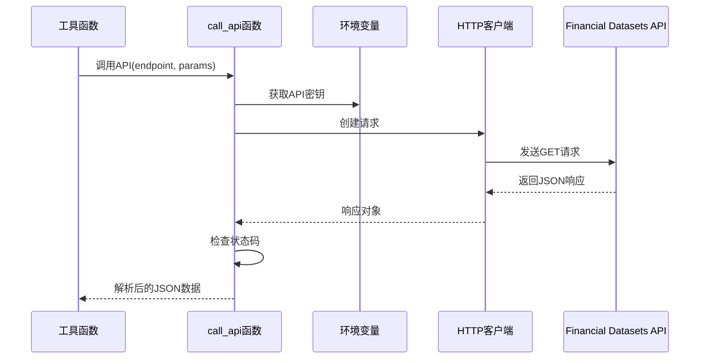
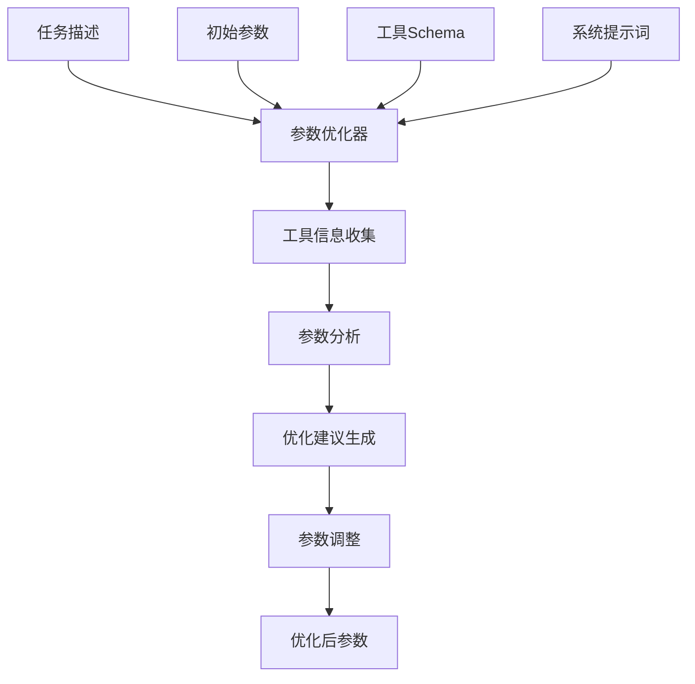

# Dexter工具集最新API文档

<cite>
**本文档中引用的文件**
- [src/dexter/tools/__init__.py](file://src/dexter/tools/__init__.py)
- [src/dexter/tools/finance/__init__.py](file://src/dexter/tools/finance/__init__.py)
- [src/dexter/tools/search/__init__.py](file://src/dexter/tools/search/__init__.py)
- [src/dexter/tools/finance/api.py](src/dexter/tools/finance/api.py)
- [src/dexter/tools/finance/constants.py](src/dexter/tools/finance/constants.py)
- [src/dexter/tools/finance/fundamentals.py](src/dexter/tools/finance/fundamentals.py)
- [src/dexter/tools/finance/filings.py](src/dexter/tools/finance/filings.py)
- [src/dexter/tools/finance/metrics.py](src/dexter/tools/finance/metrics.py)
- [src/dexter/tools/finance/prices.py](src/dexter/tools/finance/prices.py)
- [src/dexter/tools/finance/news.py](src/dexter/tools/finance/news.py)
- [src/dexter/tools/finance/estimates.py](src/dexter/tools/finance/estimates.py)
- [src/dexter/tools/finance/segments.py](src/dexter/tools/finance/segments.py)
- [src/dexter/tools/search/google.py](src/dexter/tools/search/google.py)
- [src/dexter/agent.py](src/dexter/agent.py)
- [src/dexter/utils/context.py](src/dexter/utils/context.py)
</cite>

## 目录
1. [简介](#简介)
2. [项目结构](#项目结构)
3. [工具注册机制](#工具注册机制)
4. [17个专业工具详解](#17个专业工具详解)
5. [财务报表工具](#财务报表工具)
6. [SEC文件工具](#sec文件工具)
7. [市场数据工具](#市场数据工具)
8. [新闻和搜索工具](#新闻和搜索工具)
9. [API封装与配置](#api封装与配置)
10. [ContextManager上下文管理](#contextmanager上下文管理)
11. [参数优化机制](#参数优化机制)
12. [使用示例](#使用示例)
13. [故障排除指南](#故障排除指南)
14. [总结](#总结)

## 简介

Dexter是一个自主的金融研究代理，专门设计用于处理复杂的金融数据分析任务。工具集是Dexter的核心组件之一，提供了**17个专业工具**，涵盖财务报表、SEC文件、市场数据、新闻搜索等多个领域。该工具集采用分类模块化设计，通过统一的注册机制管理和API封装，为金融研究任务提供可靠的数据源。

### 工具集统计
- **总计工具数量**: 17个专业工具
- **财务工具**: 12个（fundamentals, filings, metrics, prices, news, estimates, segments）
- **搜索工具**: 1个（Google搜索）
- **数据源**: Financial Datasets API, Google News API
- **支持的公司**: 全球主要上市公司

## 项目结构

工具集位于`src/dexter/tools/`目录下，采用分类模块化设计：



**图表来源**
- [src/dexter/tools/__init__.py](src/dexter/tools/__init__.py#L1-L37)
- [src/dexter/tools/finance/__init__.py](src/dexter/tools/finance/__init__.py#L1-37)
- [src/dexter/tools/search/__init__.py](src/dexter/tools/search/__init__.py#L1-5)

## 工具注册机制

Dexter使用基于装饰器的工具注册系统，通过`@tool`装饰器定义工具，并在`__init__.py`的TOOLS列表中统一导出。

### 17个工具完整列表

**财务报表工具 (4个)**：
1. `get_income_statements` - 获取收入报表
2. `get_balance_sheets` - 获取资产负债表
3. `get_cash_flow_statements` - 获取现金流量表
4. `get_all_financial_statements` - 获取所有财务报表

**SEC文件工具 (4个)**：
5. `get_filings` - 获取文件元数据
6. `get_10K_filing_items` - 10-K文件内容提取
7. `get_10Q_filing_items` - 10-Q文件内容提取
8. `get_8K_filing_items` - 8-K文件内容提取

**市场数据工具 (4个)**：
9. `get_price_snapshot` - 获取价格快照
10. `get_prices` - 获取价格历史数据
11. `get_financial_metrics_snapshot` - 获取财务指标快照
12. `get_financial_metrics` - 获取财务指标历史

**其他金融工具 (3个)**：
13. `get_news` - 获取金融新闻
14. `get_analyst_estimates` - 获取分析师预测
15. `get_segmented_revenues` - 获取细分收入

**搜索工具 (1个)**：
16. `search_google_news` - Google新闻搜索

**复合工具 (1个)**：
17. `get_all_financial_statements` - 综合财务报表获取

**图表来源**
- [src/dexter/tools/__init__.py](src/dexter/tools/__init__.py#L20-L37)

## 17个专业工具详解

### 1. 财务报表工具组

#### get_income_statements
- **功能**: 获取公司收入报表数据
- **主要参数**: ticker, period, limit, 时间过滤参数
- **应用场景**: 收入增长分析、盈利能力评估

#### get_balance_sheets
- **功能**: 获取公司资产负债表数据
- **主要参数**: ticker, period, limit, 时间过滤参数
- **应用场景**: 财务状况评估、债务分析

#### get_cash_flow_statements
- **功能**: 获取公司现金流量表数据
- **主要参数**: ticker, period, limit, 时间过滤参数
- **应用场景**: 现金流健康度分析、自由现金流计算

#### get_all_financial_statements
- **功能**: 一次性获取所有财务报表数据
- **主要参数**: ticker, period, limit, 时间过滤参数
- **应用场景**: 综合财务分析、完整财务画像

### 2. SEC文件工具组

#### get_filings
- **功能**: 获取SEC文件元数据列表
- **主要参数**: ticker, filing_type, limit
- **应用场景**: 文件查找、合规性检查

#### get_10K_filing_items
- **功能**: 从10-K年度报告中提取特定项目
- **主要参数**: ticker, year, item
- **应用场景**: 年度业务分析、管理层讨论分析

#### get_10Q_filing_items
- **功能**: 从10-Q季度报告中提取特定项目
- **主要参数**: ticker, year, quarter, item
- **应用场景**: 季度业绩分析、业务趋势追踪

#### get_8K_filing_items
- **功能**: 从8-K当前报告中提取特定项目
- **主要参数**: ticker, accession_number, item
- **应用场景**: 重大事件分析、及时信息披露

### 3. 市场数据工具组

#### get_price_snapshot
- **功能**: 获取当前市场价格快照
- **主要参数**: tickers (支持多个)
- **应用场景**: 实时价格监控、投资组合估值

#### get_prices
- **功能**: 获取历史价格数据
- **主要参数**: ticker, start_date, end_date, interval
- **应用场景**: 技术分析、价格趋势研究

#### get_financial_metrics_snapshot
- **功能**: 获取当前财务指标快照
- **主要参数**: tickers (支持多个), fields
- **应用场景**: 财务比率分析、公司对比

#### get_financial_metrics
- **功能**: 获取历史财务指标数据
- **主要参数**: ticker, start_date, end_date, fields
- **应用场景**: 财务指标趋势分析、行业比较

### 4. 其他金融工具组

#### get_news
- **功能**: 获取相关金融新闻
- **主要参数**: ticker, limit
- **应用场景**: 新闻分析、舆情监控

#### get_analyst_estimates
- **功能**: 获取分析师预测数据
- **主要参数**: ticker, metric_types
- **应用场景**: 预期分析、投资决策支持

#### get_segmented_revenues
- **功能**: 获取公司细分收入数据
- **主要参数**: ticker, period, limit
- **应用场景**: 业务板块分析、多元化评估

### 5. 搜索工具组

#### search_google_news
- **功能**: Google新闻搜索
- **主要参数**: query, limit
- **应用场景**: 市场新闻搜集、行业动态追踪

## ContextManager上下文管理

Dexter实现了智能的上下文管理系统，用于工具输出的持久化和智能检索。

### 核心功能



### 主要特性

1. **持久化存储**: 工具输出自动保存到文件系统
2. **智能检索**: 基于LLM的相关性选择
3. **轻量级摘要**: 提供关键信息摘要
4. **跨会话记忆**: 支持长期数据保留

**图表来源**
- [src/dexter/utils/context.py](src/dexter/utils/context.py#L1-50)

## API封装与配置

### HTTP请求封装

`finance/api.py`模块提供了统一的API调用封装：



### API配置

| 配置项 | 来源 | 描述 |
|--------|------|------|
| BASE_URL | 固定值 | `https://api.financialdatasets.ai` |
| API_KEY | 环境变量 | `FINANCIAL_DATASETS_API_KEY` |
| 请求头 | 自动生成 | 包含API密钥的认证头 |

**图表来源**
- [src/dexter/tools/finance/api.py](src/dexter/tools/finance/api.py#L10-L18)

## 参数优化机制

Dexter实现了智能的参数优化系统，通过LLM自动调整工具参数以提高查询效果。

### 优化流程



### 优化策略

#### 1. 参数完整性检查
确保所有相关参数都被正确使用：
- 检查是否遗漏了重要的过滤参数
- 验证参数值是否符合预期范围
- 确保必需参数已提供

#### 2. 过滤参数优化
根据任务需求优化过滤条件：
- **时间范围**：根据查询的时间跨度调整limit参数
- **文件类型**：明确指定filing_type参数
- **报告周期**：设置正确的period参数

#### 3. 参数值调整
智能调整参数值以获得最佳结果：
- **数量限制**：根据任务复杂度调整limit值
- **精度控制**：根据需要调整数值精度
- **范围筛选**：优化时间范围参数

**图表来源**
- [src/dexter/agent.py](src/dexter/agent.py#L78-L106)

## 使用示例

### 基本工具调用

#### 获取财务报表
```python
# 获取苹果公司最近4个季度的收入报表
income_data = get_income_statements(
    ticker="AAPL",
    period="quarterly",
    limit=4
)

# 获取微软的年度资产负债表
balance_sheet = get_balance_sheets(
    ticker="MSFT",
    period="annual",
    limit=5,
    report_period_lte="2023-12-31"
)

# 获取所有财务报表
all_statements = get_all_financial_statements(
    ticker="GOOGL",
    period="annual",
    limit=3
)
```

#### 获取市场数据
```python
# 获取价格快照
price_snapshot = get_price_snapshot(
    tickers=["AAPL", "MSFT", "GOOGL"]
)

# 获取历史价格数据
price_history = get_prices(
    ticker="TSLA",
    start_date="2023-01-01",
    end_date="2023-12-31",
    interval="daily"
)

# 获取财务指标
metrics = get_financial_metrics(
    ticker="NVDA",
    fields=["pe_ratio", "debt_to_equity", "roe"]
)
```

#### 获取SEC文件
```python
# 获取最近的10-K文件
filings = get_filings(
    ticker="GOOGL",
    filing_type="10-K",
    limit=1
)

# 从10-K中提取特定项目
ten_k_items = get_10K_filing_items(
    ticker="GOOGL",
    year=2023,
    item=["Item-1", "Item-7", "Item-8"]
)
```

#### 获取新闻和搜索
```python
# 获取公司相关新闻
news = get_news(
    ticker="AAPL",
    limit=10
)

# Google新闻搜索
search_results = search_google_news(
    query="Apple stock earnings",
    limit=5
)
```

### 高级参数优化示例

#### 复杂查询场景
```python
# 优化后的参数示例
optimized_args = {
    "ticker": "TSLA",
    "period": "quarterly",
    "limit": 8,
    "report_period_gte": "2023-01-01",
    "report_period_lte": "2023-12-31"
}

# 执行优化后的查询
cash_flows = get_cash_flow_statements(**optimized_args)
```

### ContextManager使用示例

```python
# 在Agent中使用ContextManager
from dexter.utils.context import ContextManager

context_manager = ContextManager(model="gpt-4.1")

# 存储工具输出
context_manager.add_context("get_income_statements", result)

# 检索相关信息
relevant_context = context_manager.get_relevant_context(
    query="分析收入增长趋势",
    max_contexts=3
)
```

## 故障排除指南

### 常见问题及解决方案

#### 1. API密钥问题
**症状**：出现认证错误或401状态码
**解决方案**：
- 检查环境变量`FINANCIAL_DATASETS_API_KEY`是否正确设置
- 验证API密钥的有效性和权限
- 确认网络连接正常

#### 2. 参数验证错误
**症状**：Pydantic验证失败
**解决方案**：
- 检查参数类型是否正确
- 验证枚举值是否在允许范围内
- 确认必需参数已提供

#### 3. 数据获取失败
**症状**：工具返回空数据或错误响应
**解决方案**：
- 检查公司股票代码是否正确
- 验证报告期是否存在
- 调整时间范围参数

#### 4. ContextManager问题
**症状**：上下文检索失败或存储异常
**解决方案**：
- 检查文件系统权限
- 验证LLM API连接
- 确认存储路径正确

#### 5. 参数优化失败
**症状**：优化后的参数仍然无效
**解决方案**：
- 检查任务描述是否清晰明确
- 验证工具Schema是否正确
- 查看系统日志获取详细错误信息

### 性能优化建议

#### 1. 参数调优
- 合理设置limit参数，避免过多数据请求
- 使用时间范围过滤减少数据量
- 明确指定文件类型以提高效率

#### 2. 上下文管理优化
- 定期清理过期的上下文数据
- 使用相关性阈值优化检索结果
- 合理设置上下文数量限制

#### 3. 错误恢复
- 实现重试机制处理临时性错误
- 提供降级方案处理API不可用情况
- 缓存常用数据减少重复请求

#### 4. 监控和日志
- 记录API调用统计信息
- 监控响应时间和成功率
- 分析常见错误模式

**图表来源**
- [src/dexter/tools/finance/api.py](src/dexter/tools/finance/api.py#L10-L18)
- [src/dexter/agent.py](src/dexter/agent.py#L78-L106)
- [src/dexter/utils/context.py](src/dexter/utils/context.py#L1-50)

## 总结

Dexter的工具集API提供了一个强大而灵活的金融数据访问框架，包含**17个专业工具**，涵盖财务报表、SEC文件、市场数据、新闻搜索等多个领域。通过统一的注册机制、严格的参数验证、智能的参数优化、ContextManager上下文管理和完善的错误处理，该工具集能够满足复杂的金融研究需求。

### 主要优势

1. **工具丰富**: 17个专业工具覆盖金融研究各个方面
2. **模块化设计**: 清晰的分类和职责分离
3. **类型安全**: 基于Pydantic的严格参数验证
4. **智能优化**: LLM驱动的参数优化提升查询效果
5. **上下文管理**: 智能的数据持久化和检索系统
6. **错误处理**: 完善的异常处理和恢复机制
7. **多数据源**: 整合Financial Datasets API和Google搜索

### 应用场景

- **财务分析**: 收入增长、利润率、资产负债率等指标分析
- **投资研究**: 公司基本面评估和行业对比
- **监管研究**: SEC文件分析和合规性检查
- **风险管理**: 现金流分析和财务健康度评估
- **市场研究**: 价格分析、技术指标计算
- **新闻分析**: 舆情监控和市场动态追踪

### 未来扩展

工具集设计支持持续扩展：
- 新增更多金融数据源
- 支持更多市场和资产类别
- 增强智能分析能力
- 优化性能和用户体验

该工具集为金融研究提供了坚实的基础，支持从简单的数据查询到复杂的分析任务的各种需求。通过持续的优化和扩展，它将继续为用户提供更加强大和智能的金融数据服务。