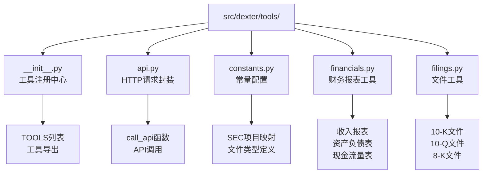
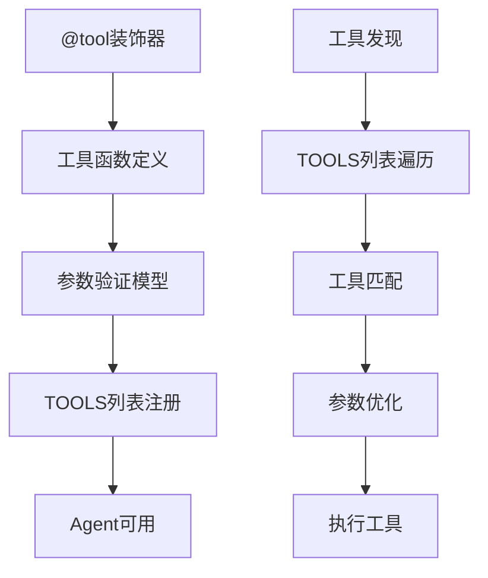
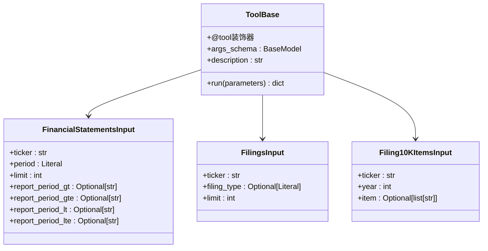
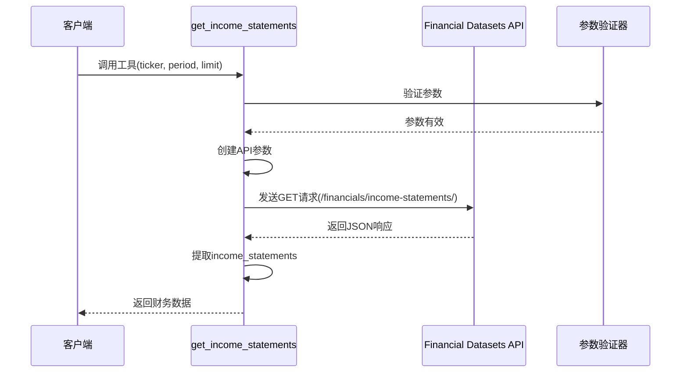
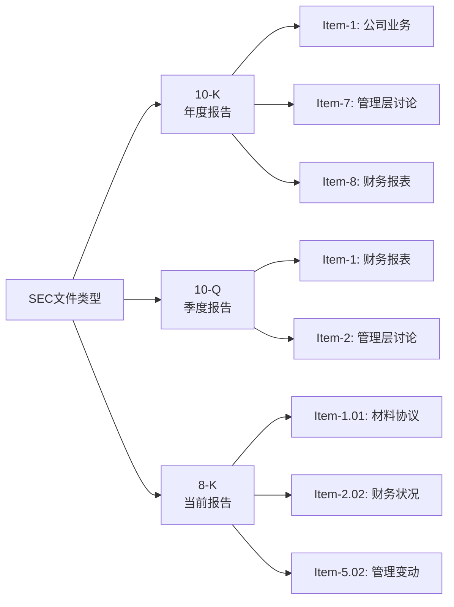
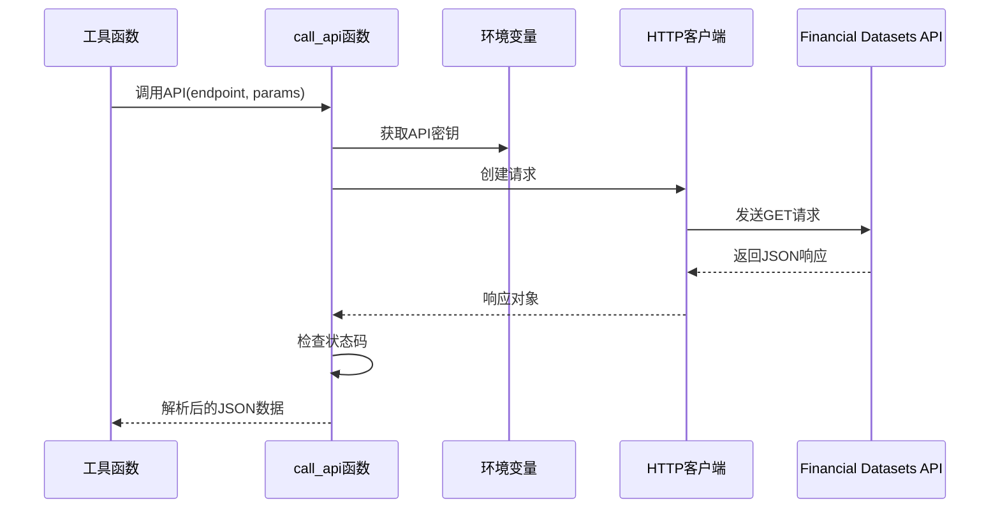
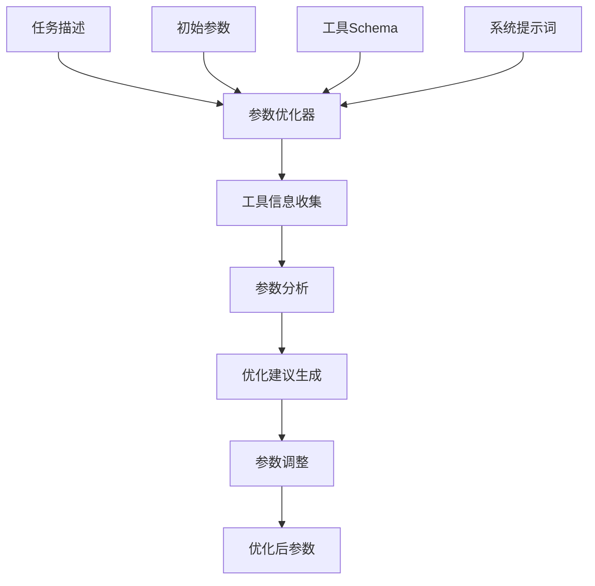

# 工具集API文档

<cite>
**本文档中引用的文件**
- [src/dexter/tools/__init__.py](file://src/dexter/tools/__init__.py)
- [src/dexter/tools/api.py](file://src/dexter/tools/api.py)
- [src/dexter/tools/constants.py](file://src/dexter/tools/constants.py)
- [src/dexter/tools/financials.py](file://src/dexter/tools/financials.py)
- [src/dexter/tools/filings.py](file://src/dexter/tools/filings.py)
- [src/dexter/agent.py](file://src/dexter/agent.py)
- [src/dexter/schemas.py](file://src/dexter/schemas.py)
- [src/dexter/prompts.py](file://src/dexter/prompts.py)
</cite>

## 目录
1. [简介](#简介)
2. [项目结构](#项目结构)
3. [工具注册机制](#工具注册机制)
4. [核心工具组件](#核心工具组件)
5. [财务报表工具](#财务报表工具)
6. [文件工具](#文件工具)
7. [API封装与配置](#api封装与配置)
8. [参数优化机制](#参数优化机制)
9. [使用示例](#使用示例)
10. [故障排除指南](#故障排除指南)
11. [总结](#总结)

## 简介

Dexter是一个自主的金融研究代理，专门设计用于处理复杂的金融数据分析任务。工具集是Dexter的核心组件之一，提供了访问实时市场数据、财务报表和SEC文件的强大接口。该工具集采用模块化设计，通过统一的注册机制管理和API封装，为金融研究任务提供可靠的数据源。

## 项目结构

工具集位于`src/dexter/tools/`目录下，包含以下核心文件：



**图表来源**
- [src/dexter/tools/__init__.py](file://src/dexter/tools/__init__.py#L1-L19)
- [src/dexter/tools/api.py](file://src/dexter/tools/api.py#L1-L20)
- [src/dexter/tools/constants.py](file://src/dexter/tools/constants.py#L1-L104)
- [src/dexter/tools/financials.py](file://src/dexter/tools/financials.py#L1-L98)
- [src/dexter/tools/filings.py](file://src/dexter/tools/filings.py#L1-L204)

**章节来源**
- [src/dexter/tools/__init__.py](file://src/dexter/tools/__init__.py#L1-L19)
- [src/dexter/tools/api.py](file://src/dexter/tools/api.py#L1-L20)
- [src/dexter/tools/constants.py](file://src/dexter/tools/constants.py#L1-L104)

## 工具注册机制

Dexter使用基于装饰器的工具注册系统，通过`@tool`装饰器定义工具，并在`__init__.py`的TOOLS列表中统一导出。

### 装饰器机制

每个工具都使用`langchain.tools.tool`装饰器进行包装，提供以下功能：

- **参数验证**：通过Pydantic模型进行输入参数验证
- **文档生成**：自动生成工具文档和参数说明
- **类型安全**：确保参数类型正确性
- **Schema支持**：提供JSON Schema用于工具调用

### TOOLS列表管理

所有工具通过`__init__.py`统一导出到TOOLS列表中：



**图表来源**
- [src/dexter/tools/__init__.py](file://src/dexter/tools/__init__.py#L14-L19)
- [src/dexter/tools/financials.py](file://src/dexter/tools/financials.py#L35-L37)
- [src/dexter/tools/filings.py](file://src/dexter/tools/filings.py#L25-L27)

**章节来源**
- [src/dexter/tools/__init__.py](file://src/dexter/tools/__init__.py#L14-L19)
- [src/dexter/tools/financials.py](file://src/dexter/tools/financials.py#L35-L37)
- [src/dexter/tools/filings.py](file://src/dexter/tools/filings.py#L25-L27)

## 核心工具组件

### 工具基类结构

所有工具都遵循统一的结构模式：



**图表来源**
- [src/dexter/tools/financials.py](file://src/dexter/tools/financials.py#L10-L20)
- [src/dexter/tools/filings.py](file://src/dexter/tools/filings.py#L13-L22)
- [src/dexter/tools/filings.py](file://src/dexter/tools/filings.py#L47-L55)

### 参数验证系统

工具使用Pydantic模型进行严格的参数验证：

| 参数类型 | 验证规则 | 示例 |
|---------|---------|------|
| 必需参数 | 非空验证 | `ticker: str` |
| 枚举参数 | 值范围验证 | `period: Literal["annual", "quarterly", "ttm"]` |
| 数值参数 | 范围验证 | `limit: int = Field(default=10, description="最大数量")` |
| 可选参数 | 类型验证 | `report_period_gt: Optional[str] = None` |

**章节来源**
- [src/dexter/tools/financials.py](file://src/dexter/tools/financials.py#L10-L20)
- [src/dexter/tools/filings.py](file://src/dexter/tools/filings.py#L13-L22)
- [src/dexter/tools/filings.py](file://src/dexter/tools/filings.py#L47-L55)

## 财务报表工具

财务报表工具提供对公司财务数据的深度访问，包括收入报表、资产负债表和现金流量表。

### 收入报表工具

`get_income_statements`函数提供公司的损益表数据：



**图表来源**
- [src/dexter/tools/financials.py](file://src/dexter/tools/financials.py#L45-L55)
- [src/dexter/tools/api.py](file://src/dexter/tools/api.py#L10-L18)

#### 功能特性

| 特性 | 描述 | 参数 |
|------|------|------|
| 报告周期 | 支持年度、季度和TTM报告 | `period: Literal["annual", "quarterly", "ttm"]` |
| 数据限制 | 控制返回记录数量 | `limit: int = 10` |
| 时间过滤 | 支持时间范围筛选 | `report_period_gt`, `report_period_lte` |
| 股票代码 | 指定目标公司 | `ticker: str` |

### 资产负债表工具

`get_balance_sheets`函数提供公司的资产负债表数据：

#### 关键指标
- **资产总额**：流动资产和非流动资产总和
- **负债总额**：短期负债和长期负债总和  
- **股东权益**：净资产价值
- **资产负债率**：负债总额/资产总额比率

### 现金流量表工具

`get_cash_flow_statements`函数提供公司的现金流量表数据：

#### 现金流分类
- **经营活动现金流**：日常运营产生的现金流
- **投资活动现金流**：资本支出和投资活动现金流
- **融资活动现金流**：债务和股权融资现金流

**章节来源**
- [src/dexter/tools/financials.py](file://src/dexter/tools/financials.py#L45-L97)

## 文件工具

文件工具专门处理SEC（美国证券交易委员会）文件的获取和解析，支持10-K、10-Q和8-K三种主要文件类型。

### SEC文件类型映射

系统维护详细的SEC文件项目映射：



**图表来源**
- [src/dexter/tools/constants.py](file://src/dexter/tools/constants.py#L10-L85)

### 文件获取工具

#### get_filings函数
获取公司SEC文件元数据：

| 参数 | 类型 | 描述 |
|------|------|------|
| ticker | str | 公司股票代码 |
| filing_type | Optional[Literal] | 文件类型：10-K/10-Q/8-K |
| limit | int | 最大返回文件数量 |

#### get_10K_filing_items函数
从10-K年度报告中提取特定项目：

| 参数 | 类型 | 描述 |
|------|------|------|
| ticker | str | 公司股票代码 |
| year | int | 报告年份 |
| item | Optional[list[str]] | 要提取的项目列表 |

#### get_10Q_filing_items函数
从10-Q季度报告中提取特定项目：

| 参数 | 类型 | 描述 |
|------|------|------|
| ticker | str | 公司股票代码 |
| year | int | 报告年份 |
| quarter | int | 季度编号(1-4) |
| item | Optional[list[str]] | 要提取的项目列表 |

#### get_8K_filing_items函数
从8-K当前报告中提取特定项目：

| 参数 | 类型 | 描述 |
|------|------|------|
| ticker | str | 公司股票代码 |
| accession_number | str | SEC索引号 |
| item | Optional[list[str]] | 要提取的项目列表 |

**章节来源**
- [src/dexter/tools/filings.py](file://src/dexter/tools/filings.py#L35-L45)
- [src/dexter/tools/filings.py](file://src/dexter/tools/filings.py#L65-L85)
- [src/dexter/tools/filings.py](file://src/dexter/tools/filings.py#L105-L125)
- [src/dexter/tools/filings.py](file://src/dexter/tools/filings.py#L145-L165)

## API封装与配置

### HTTP请求封装

`api.py`模块提供了统一的API调用封装：



**图表来源**
- [src/dexter/tools/api.py](file://src/dexter/tools/api.py#L10-L18)

### API配置

| 配置项 | 来源 | 描述 |
|--------|------|------|
| BASE_URL | 固定值 | `https://api.financialdatasets.ai` |
| API_KEY | 环境变量 | `FINANCIAL_DATASETS_API_KEY` |
| 请求头 | 自动生成 | 包含API密钥的认证头 |

### 错误处理

API封装包含完善的错误处理机制：

- **状态码检查**：自动检测HTTP错误状态
- **异常抛出**：使用`response.raise_for_status()`处理错误
- **数据验证**：确保返回数据格式正确

**章节来源**
- [src/dexter/tools/api.py](file://src/dexter/tools/api.py#L10-L18)

## 参数优化机制

Dexter实现了智能的参数优化系统，通过LLM（大语言模型）自动调整工具参数以提高查询效果。

### 优化流程



**图表来源**
- [src/dexter/agent.py](file://src/dexter/agent.py#L78-L106)

### 优化策略

#### 1. 参数完整性检查
确保所有相关参数都被正确使用：
- 检查是否遗漏了重要的过滤参数
- 验证参数值是否符合预期范围
- 确保必需参数已提供

#### 2. 过滤参数优化
根据任务需求优化过滤条件：
- **时间范围**：根据查询的时间跨度调整limit参数
- **文件类型**：明确指定filing_type参数
- **报告周期**：设置正确的period参数

#### 3. 参数值调整
智能调整参数值以获得最佳结果：
- **数量限制**：根据任务复杂度调整limit值
- **精度控制**：根据需要调整数值精度
- **范围筛选**：优化时间范围参数

### 优化示例

| 优化前参数 | 优化后参数 | 优化原因 |
|-----------|-----------|----------|
| `{ticker: "AAPL"}` | `{ticker: "AAPL", period: "annual", limit: 5}` | 明确报告周期和数据量 |
| `{filing_type: null}` | `{filing_type: "10-K", limit: 10}` | 指定具体文件类型 |
| `{year: 2023}` | `{year: 2023, quarter: 4}` | 添加季度信息以获取完整数据 |

**章节来源**
- [src/dexter/agent.py](file://src/dexter/agent.py#L78-L106)
- [src/dexter/prompts.py](file://src/dexter/prompts.py#L59-L102)

## 使用示例

### 基本工具调用

#### 获取财务报表
```python
# 获取苹果公司最近4个季度的收入报表
income_data = get_income_statements(
    ticker="AAPL",
    period="quarterly",
    limit=4
)

# 获取微软的年度资产负债表
balance_sheet = get_balance_sheets(
    ticker="MSFT",
    period="annual",
    limit=5,
    report_period_lte="2023-12-31"
)
```

#### 获取SEC文件
```python
# 获取最近的10-K文件
filings = get_filings(
    ticker="GOOGL",
    filing_type="10-K",
    limit=1
)

# 从10-K中提取特定项目
ten_k_items = get_10K_filing_items(
    ticker="GOOGL",
    year=2023,
    item=["Item-1", "Item-7", "Item-8"]
)
```

### 高级参数优化示例

#### 复杂查询场景
```python
# 优化后的参数示例
optimized_args = {
    "ticker": "TSLA",
    "period": "quarterly",
    "limit": 8,
    "report_period_gte": "2023-01-01",
    "report_period_lte": "2023-12-31"
}

# 执行优化后的查询
cash_flows = get_cash_flow_statements(**optimized_args)
```

### 错误处理示例

```python
try:
    # 尝试获取不存在的公司数据
    data = get_income_statements(ticker="INVALID", period="annual")
except Exception as e:
    print(f"获取财务数据失败: {e}")
    # 使用默认参数重试
    data = get_income_statements(ticker="AAPL", period="annual")
```

## 故障排除指南

### 常见问题及解决方案

#### 1. API密钥问题
**症状**：出现认证错误或401状态码
**解决方案**：
- 检查环境变量`FINANCIAL_DATASETS_API_KEY`是否正确设置
- 验证API密钥的有效性和权限
- 确认网络连接正常

#### 2. 参数验证错误
**症状**：Pydantic验证失败
**解决方案**：
- 检查参数类型是否正确
- 验证枚举值是否在允许范围内
- 确认必需参数已提供

#### 3. 数据获取失败
**症状**：工具返回空数据或错误响应
**解决方案**：
- 检查公司股票代码是否正确
- 验证报告期是否存在
- 调整时间范围参数

#### 4. 参数优化失败
**症状**：优化后的参数仍然无效
**解决方案**：
- 检查任务描述是否清晰明确
- 验证工具Schema是否正确
- 查看系统日志获取详细错误信息

### 性能优化建议

#### 1. 参数调优
- 合理设置limit参数，避免过多数据请求
- 使用时间范围过滤减少数据量
- 明确指定文件类型以提高效率

#### 2. 错误恢复
- 实现重试机制处理临时性错误
- 提供降级方案处理API不可用情况
- 缓存常用数据减少重复请求

#### 3. 监控和日志
- 记录API调用统计信息
- 监控响应时间和成功率
- 分析常见错误模式

**章节来源**
- [src/dexter/tools/api.py](file://src/dexter/tools/api.py#L10-L18)
- [src/dexter/agent.py](file://src/dexter/agent.py#L78-L106)

## 总结

Dexter的工具集API提供了一个强大而灵活的金融数据访问框架。通过统一的注册机制、严格的参数验证、智能的参数优化和完善的错误处理，该工具集能够满足复杂的金融研究需求。

### 主要优势

1. **模块化设计**：清晰的职责分离和可扩展的架构
2. **类型安全**：基于Pydantic的严格参数验证
3. **智能优化**：LLM驱动的参数优化提升查询效果
4. **错误处理**：完善的异常处理和恢复机制
5. **文档完善**：详细的参数说明和使用示例

### 应用场景

- **财务分析**：收入增长、利润率、资产负债率等指标分析
- **投资研究**：公司基本面评估和行业对比
- **监管研究**：SEC文件分析和合规性检查
- **风险管理**：现金流分析和财务健康度评估

该工具集为金融研究提供了坚实的基础，支持从简单的数据查询到复杂的分析任务的各种需求。通过持续的优化和扩展，它将继续为用户提供更加强大和智能的金融数据服务。