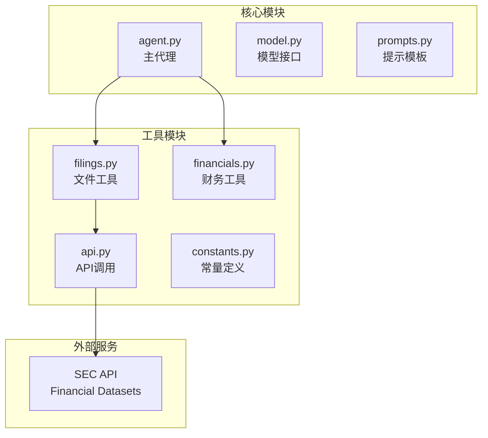
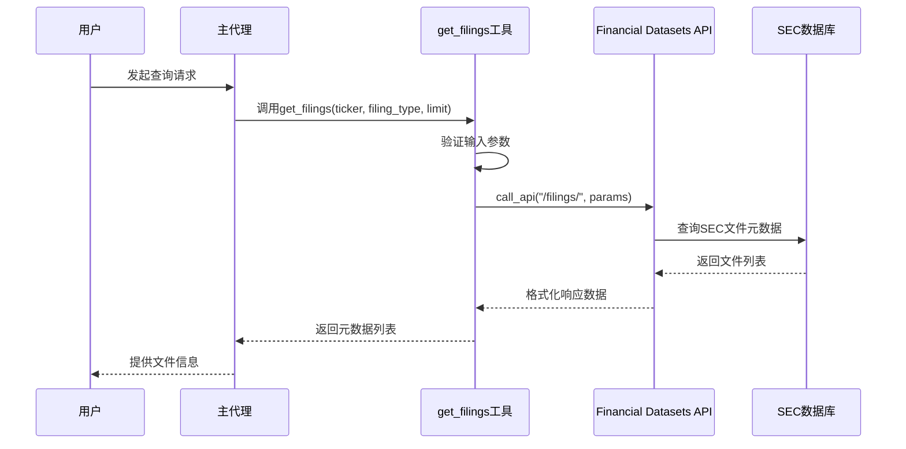
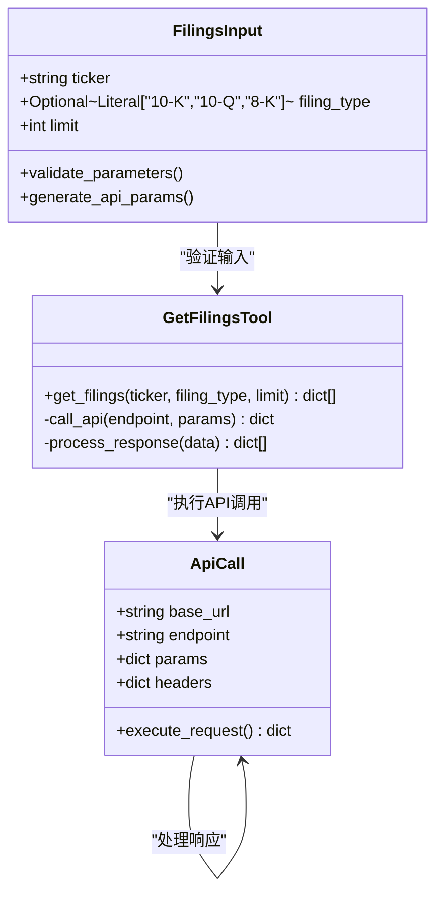
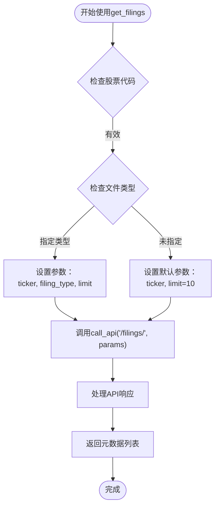
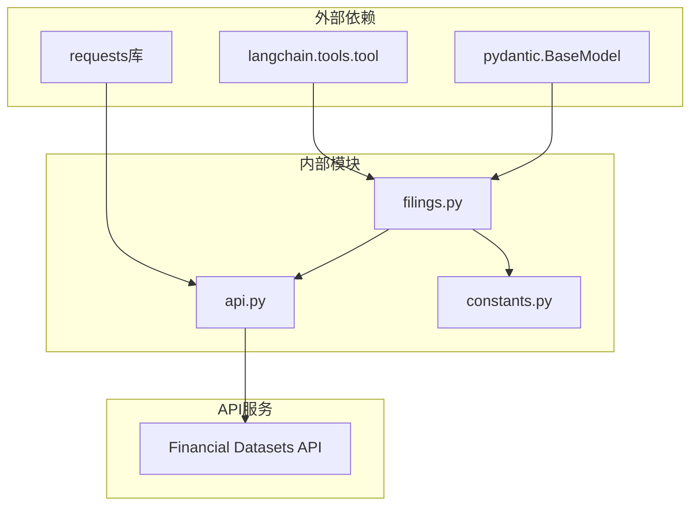

# 文件元数据检索工具

<cite>
**本文档中引用的文件**
- [filings.py](file://src/dexter/tools/filings.py)
- [api.py](file://src/dexter/tools/api.py)
- [constants.py](file://src/dexter/tools/constants.py)
- [__init__.py](file://src/dexter/tools/__init__.py)
- [prompts.py](file://src/dexter/prompts.py)
</cite>

## 目录
1. [简介](#简介)
2. [项目结构](#项目结构)
3. [核心组件](#核心组件)
4. [架构概览](#架构概览)
5. [详细组件分析](#详细组件分析)
6. [依赖关系分析](#依赖关系分析)
7. [性能考虑](#性能考虑)
8. [故障排除指南](#故障排除指南)
9. [结论](#结论)

## 简介

`get_filings`工具是Dexter金融研究代理系统中的一个关键组件，专门用于从美国证券交易委员会（SEC）检索公司的文件元数据。该工具提供了对上市公司SEC文件的访问，包括10-K年度报告、10-Q季度报告和8-K当前报告等重要财务披露文件。

该工具的核心功能是返回文件的元数据信息，包括访问编号（accession_number）、文件类型（filing_type）和文档URL，但不会返回文件的实际文本内容。这种设计使得用户能够快速定位和筛选相关的SEC文件，然后使用专门的工具提取具体的文本内容。

## 项目结构

Dexter项目采用模块化架构，将不同的功能组件分离到独立的模块中：



**图表来源**
- [filings.py](file://src/dexter/tools/filings.py#L1-L204)
- [api.py](file://src/dexter/tools/api.py#L1-L20)

**章节来源**
- [__init__.py](file://src/dexter/tools/__init__.py#L1-L19)
- [filings.py](file://src/dexter/tools/filings.py#L1-L204)

## 核心组件

`get_filings`工具的核心实现包含以下关键组件：

### 输入参数验证器
工具使用Pydantic模型进行参数验证和文档生成，确保输入参数的正确性和完整性。

### API调用封装
通过`call_api`函数与Financial Datasets API进行交互，处理认证和请求响应。

### 数据格式化
将API返回的数据转换为标准化的字典列表格式，便于后续处理。

**章节来源**
- [filings.py](file://src/dexter/tools/filings.py#L15-L54)
- [api.py](file://src/dexter/tools/api.py#L10-L19)

## 架构概览

`get_filings`工具在整个Dexter系统中的位置和作用：



**图表来源**
- [filings.py](file://src/dexter/tools/filings.py#L27-L54)
- [api.py](file://src/dexter/tools/api.py#L10-L19)

## 详细组件分析

### get_filings函数详解

`get_filings`函数是整个工具的核心，提供了完整的SEC文件元数据检索功能：

#### 函数签名和参数



**图表来源**
- [filings.py](file://src/dexter/tools/filings.py#L15-L25)
- [filings.py](file://src/dexter/tools/filings.py#L27-L54)
- [api.py](file://src/dexter/tools/api.py#L10-L19)

#### 参数详细说明

| 参数名 | 类型 | 必需性 | 默认值 | 描述 |
|--------|------|--------|--------|------|
| `ticker` | string | 必需 | 无 | 股票代码，例如"AAPL"代表苹果公司 |
| `filing_type` | Optional[Literal["10-K", "10-Q", "8-K"]] | 可选 | None | 文件类型过滤器，必需指定具体类型 |
| `limit` | int | 可选 | 10 | 返回的最大文件数量，默认10个 |

#### 关键特性

1. **智能参数处理**：根据提供的参数动态构建API请求
2. **错误处理**：自动处理API调用中的各种异常情况
3. **数据标准化**：统一返回格式，便于后续处理

**章节来源**
- [filings.py](file://src/dexter/tools/filings.py#L27-L54)

### 使用示例分析

#### 基本使用模式



**图表来源**
- [filings.py](file://src/dexter/tools/filings.py#L27-L54)

#### 具体使用场景

1. **获取特定类型的文件**：
   ```python
   # 获取苹果公司最近的5个8-K文件
   filings = get_filings(ticker='AAPL', filing_type='8-K', limit=5)
   ```

2. **获取所有类型的最新文件**：
   ```python
   # 获取苹果公司最新的10个文件（不限类型）
   filings = get_filings(ticker='AAPL', limit=10)
   ```

3. **获取年度报告**：
   ```python
   # 获取苹果公司最近的10-K文件
   filings = get_filings(ticker='AAPL', filing_type='10-K')
   ```

**章节来源**
- [filings.py](file://src/dexter/tools/filings.py#L27-L54)

### 返回值结构分析

`get_filings`工具返回的元数据结构包含以下关键字段：

| 字段名 | 类型 | 描述 |
|--------|------|------|
| `accession_number` | string | SEC访问编号，唯一标识文件 |
| `filing_type` | string | 文件类型（10-K、10-Q、8-K） |
| `primary_document_url` | string | 主要文档的下载链接 |
| `filing_date` | string | 文件提交日期 |
| `description` | string | 文件简要描述 |

**章节来源**
- [filings.py](file://src/dexter/tools/filings.py#L27-L54)

## 依赖关系分析

`get_filings`工具的依赖关系图：



**图表来源**
- [filings.py](file://src/dexter/tools/filings.py#L1-L10)
- [api.py](file://src/dexter/tools/api.py#L1-L5)

**章节来源**
- [filings.py](file://src/dexter/tools/filings.py#L1-L10)
- [api.py](file://src/dexter/tools/api.py#L1-L5)

## 性能考虑

### API调用优化

1. **批量请求**：合理设置`limit`参数，避免过多的API调用
2. **缓存策略**：对于频繁查询的股票代码，建议实现本地缓存
3. **并发处理**：在支持的情况下，可以并行处理多个股票的查询

### 内存管理

1. **流式处理**：对于大量数据，考虑使用生成器模式
2. **数据清理**：及时释放不需要的中间数据

### 错误处理

1. **重试机制**：实现指数退避的重试策略
2. **超时控制**：设置合理的API调用超时时间
3. **降级方案**：在网络不可用时提供备用数据源

## 故障排除指南

### 常见问题及解决方案

#### 1. API密钥配置错误
**症状**：出现认证失败或权限被拒绝的错误
**解决方案**：
- 检查`.env`文件中的`FINANCIAL_DATASETS_API_KEY`
- 确认API密钥的有效性和权限范围

#### 2. 股票代码无效
**症状**：返回空的结果集或错误信息
**解决方案**：
- 验证股票代码的准确性
- 确认该公司是否在SEC注册

#### 3. 文件类型过滤失效
**症状**：返回了不相关的文件类型
**解决方案**：
- 明确指定`filing_type`参数
- 使用正确的文件类型枚举值

#### 4. 请求频率限制
**症状**：收到速率限制错误
**解决方案**：
- 实现请求间隔
- 考虑使用更高级别的API计划

**章节来源**
- [api.py](file://src/dexter/tools/api.py#L10-L19)
- [prompts.py](file://src/dexter/prompts.py#L22-L33)

## 结论

`get_filings`工具是Dexter金融研究代理系统中不可或缺的组件，它为用户提供了高效、准确的SEC文件元数据检索能力。通过精心设计的参数验证、智能的API调用和标准化的数据输出，该工具成功地简化了复杂的SEC文件查询过程。

### 主要优势

1. **精确过滤**：通过`filing_type`参数实现精确的文件类型筛选
2. **灵活配置**：支持自定义返回数量和多种查询条件
3. **标准化输出**：提供一致的数据格式，便于后续处理
4. **集成友好**：与其他Dexter工具无缝集成

### 应用价值

该工具作为获取8-K文件内容的必要前置步骤，为深入分析公司财务状况、重大事件和市场影响提供了坚实的基础。通过与其他专用工具（如`get_8K_filing_items`）的配合使用，用户可以构建完整的SEC文件分析工作流程。

### 未来发展方向

1. **增强过滤能力**：添加更多的时间范围和状态过滤选项
2. **批量处理**：支持同时查询多个股票的文件信息
3. **实时监控**：提供新文件发布的实时通知功能
4. **数据分析**：内置基本的文件趋势分析功能