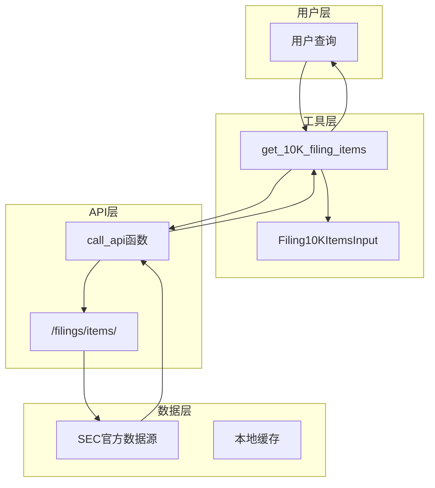
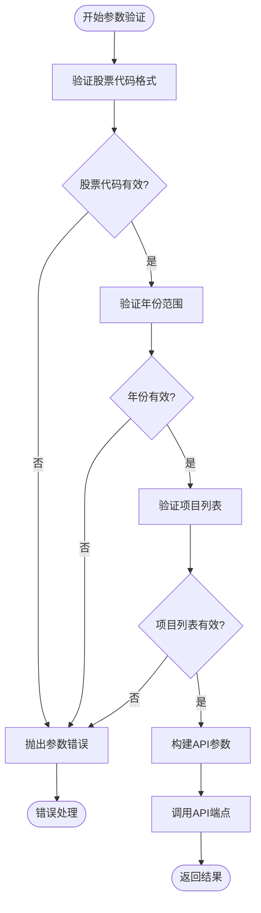
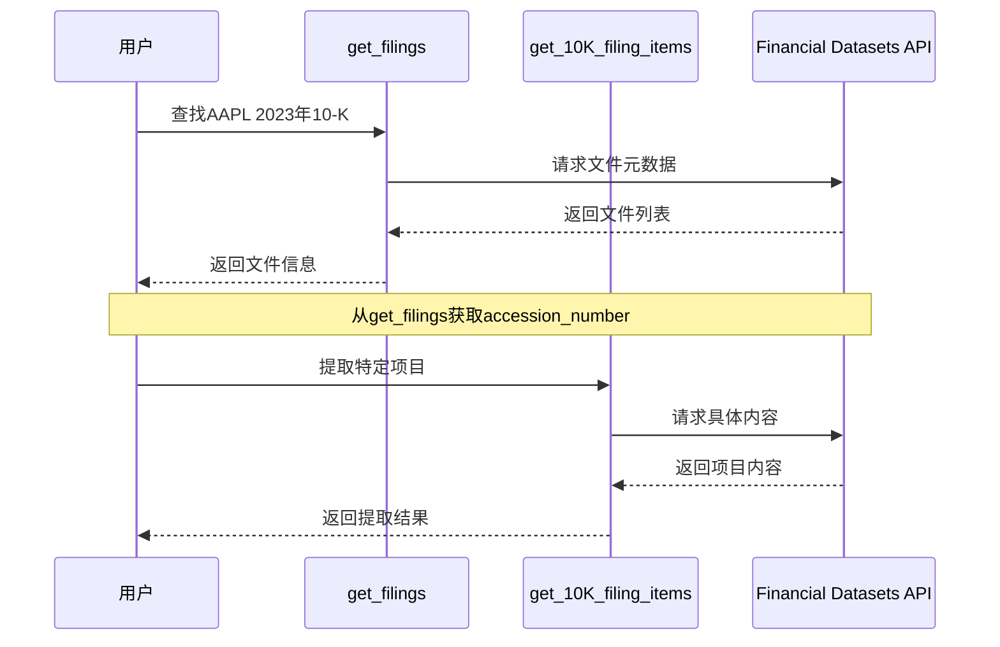
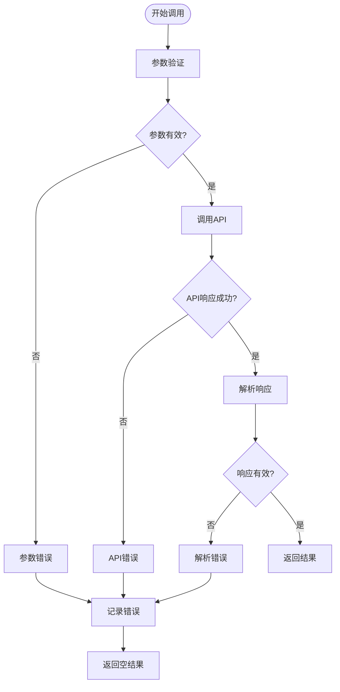

# 10-K文件内容提取工具

<cite>
**本文档中引用的文件**
- [constants.py](file://src/dexter/tools/constants.py)
- [filings.py](file://src/dexter/tools/filings.py)
- [api.py](file://src/dexter/tools/api.py)
- [__init__.py](file://src/dexter/tools/__init__.py)
- [schemas.py](file://src/dexter/schemas.py)
- [README.md](file://README.md)
</cite>

## 目录
1. [简介](#简介)
2. [工具概述](#工具概述)
3. [核心功能](#核心功能)
4. [参数详解](#参数详解)
5. [数据结构说明](#数据结构说明)
6. [使用示例](#使用示例)
7. [与其他工具的集成](#与其他工具的集成)
8. [错误处理](#错误处理)
9. [最佳实践](#最佳实践)
10. [故障排除指南](#故障排除指南)

## 简介

`get_10K_filing_items` 是 Dexter 财务研究代理的核心工具之一，专门用于从公司的10-K年度报告中提取特定章节的内容。该工具通过调用SEC（美国证券交易委员会）的官方数据源，提供精确的财务报告内容提取功能，支持用户获取如"Item-1A: Risk Factors"（风险因素）或"Item-7: Management's Discussion and Analysis"（管理层讨论与分析）等关键章节。

## 工具概述

### 基本信息

- **工具名称**: get_10K_filing_items
- **所属模块**: dexter.tools.filings
- **功能类型**: 数据提取工具
- **数据来源**: Financial Datasets API
- **API端点**: `/filings/items/`

### 技术架构



**图表来源**
- [filings.py](file://src/dexter/tools/filings.py#L57-L104)
- [api.py](file://src/dexter/tools/api.py#L8-L19)

## 核心功能

### 主要特性

1. **精准内容提取**: 从10-K报告中提取指定章节的详细内容
2. **灵活筛选**: 支持按具体项目编号筛选需要的内容
3. **标准化输出**: 提供统一的数据结构和格式
4. **批量处理**: 可同时提取多个章节内容
5. **实时更新**: 访问最新的SEC官方数据

### 支持的10-K项目

工具基于`ITEMS_10K_MAP`常量提供完整的10-K项目映射：

| 项目编号 | 描述 |
|---------|------|
| Item-1 | Business（业务） |
| Item-1A | Risk Factors（风险因素） |
| Item-1B | Unresolved Staff Comments（未解决的工作人员评论） |
| Item-2 | Properties（财产） |
| Item-3 | Legal Proceedings（法律程序） |
| Item-4 | Mine Safety Disclosures（矿山安全披露） |
| Item-5 | Common Equity市场信息 |
| Item-7 | Management's Discussion and Analysis（管理层讨论与分析） |
| Item-7A | Market Risk披露 |
| Item-8 | Financial Statements（财务报表） |
| Item-9 | 会计变更和分歧 |
| Item-9A | Controls and Procedures（内部控制程序） |
| Item-10 | 董事、高管和公司治理 |
| Item-11 | Executive Compensation（执行官薪酬） |
| Item-12 | 股权所有权信息 |
| Item-13 | 关联交易和董事独立性 |
| Item-14 | 会计服务费用 |
| Item-15 | 附表和声明 |
| Item-16 | Form 10-K摘要 |

**节来源**
- [constants.py](file://src/dexter/tools/constants.py#L10-L33)

## 参数详解

### 必需参数

#### ticker（股票代码）
- **类型**: str
- **描述**: 公司的股票代码，例如 "AAPL" 表示苹果公司
- **要求**: 必须提供有效的股票代码
- **验证**: 自动转换为大写格式

#### year（报告年份）
- **类型**: int
- **描述**: 10-K报告的年份，例如 2023
- **范围**: 通常为当前年份之前的几年
- **要求**: 必须提供有效的年份

### 可选参数

#### item（项目列表）
- **类型**: list[str] 或 None
- **描述**: 要提取的具体项目列表，默认为None（提取所有可用项目）
- **格式**: 使用标准的项目编号格式，如 ["Item-1A", "Item-7"]
- **默认值**: None
- **限制**: 只能包含在ITEMS_10K_MAP中的有效项目

### 参数验证流程



**图表来源**
- [filings.py](file://src/dexter/tools/filings.py#L67-L85)

**节来源**
- [filings.py](file://src/dexter/tools/filings.py#L42-L54)

## 数据结构说明

### 返回数据结构

`get_10K_filing_items` 返回一个包含以下字段的字典：

| 字段名 | 类型 | 描述 |
|--------|------|------|
| resource | str | 固定值："filing_items" |
| ticker | str | 公司股票代码 |
| cik | str | 公司的中央索引键（CIK）号码 |
| filing_type | str | 文件类型："10-K" |
| accession_number | str | SEC访问编号 |
| year | int | 报告年份 |
| items | list | 包含提取内容的项目列表 |

### 项目数据结构

每个提取的项目包含以下字段：

| 字段名 | 类型 | 描述 |
|--------|------|------|
| number | str | 项目编号，如 "Item-1A" |
| title | str | 项目标题，如 "Risk Factors" |
| text | str | 项目正文内容 |

### 完整响应示例

```json
{
    "resource": "filing_items",
    "ticker": "AAPL",
    "cik": "0000320193",
    "filing_type": "10-K",
    "accession_number": "0000320193-24-000123",
    "year": 2023,
    "items": [
        {
            "number": "Item-1A",
            "title": "Risk Factors",
            "text": "This is the detailed risk factors section content..."
        },
        {
            "number": "Item-7",
            "title": "Management's Discussion and Analysis",
            "text": "This is the management's discussion and analysis content..."
        }
    ]
}
```

**节来源**
- [filings.py](file://src/dexter/tools/filings.py#L67-L85)

## 使用示例

### 基础用法示例

#### 示例1：提取所有10-K项目
```python
result = get_10K_filing_items(ticker="AAPL", year=2023)
# 提取Apple公司2023年10-K报告的所有可用项目
```

#### 示例2：提取特定项目
```python
result = get_10K_filing_items(
    ticker="AAPL", 
    year=2023,
    item=["Item-1A", "Item-7"]
)
# 只提取风险因素和管理层讨论与分析
```

#### 示例3：提取单个项目
```python
result = get_10K_filing_items(
    ticker="MSFT", 
    year=2022,
    item=["Item-1A"]
)
# 只提取微软公司的风险因素部分
```

### 高级使用场景

#### 场景1：风险分析研究
```python
# 获取特定公司的风险因素
risk_data = get_10K_filing_items(
    ticker="TSLA",
    year=2023,
    item=["Item-1A"]
)

# 分析风险因素内容
risk_text = risk_data['items'][0]['text']
# 进行文本分析和风险评估
```

#### 场景2：管理层分析比较
```python
# 比较不同公司的管理层讨论
apple_mda = get_10K_filing_items(
    ticker="AAPL",
    year=2023,
    item=["Item-7"]
)

msft_mda = get_10K_filing_items(
    ticker="MSFT",
    year=2023,
    item=["Item-7"]
)

# 对比两家公司的管理层观点
```

### 实际应用案例

#### 案例：AAPL 2023年风险因素分析
```python
# 查询AAPL公司2023年10-K报告中的风险因素
result = get_10K_filing_items(
    ticker="AAPL",
    year=2023,
    item=["Item-1A"]
)

if result and result.get('items'):
    risk_section = result['items'][0]
    print(f"提取到的风险因素内容 ({len(risk_section['text'])}字符):")
    print(risk_section['text'][:500] + "...")  # 显示前500字符
else:
    print("未找到风险因素内容")
```

**节来源**
- [filings.py](file://src/dexter/tools/filings.py#L57-L85)

## 与其他工具的集成

### 与get_filings工具的协作

`get_10K_filing_items` 与 `get_filings` 工具形成完整的SEC文件获取链：



**图表来源**
- [filings.py](file://src/dexter/tools/filings.py#L27-L54)
- [filings.py](file://src/dexter/tools/filings.py#L57-L85)

### 集成使用模式

#### 模式1：完整的文件获取流程
```python
# 第一步：查找可用的10-K文件
filings = get_filings(
    ticker="AAPL",
    filing_type="10-K",
    limit=5
)

# 第二步：选择特定的文件（根据年份或日期）
target_filing = next((f for f in filings if f['year'] == 2023), None)

if target_filing:
    # 第三步：提取特定项目
    result = get_10K_filing_items(
        ticker="AAPL",
        year=2023,
        item=["Item-1A", "Item-7"]
    )
```

#### 模式2：数据验证流程
```python
# 获取文件元数据进行验证
metadata = get_filings(ticker="AAPL", filing_type="10-K", limit=1)

if metadata:
    # 验证文件存在后提取内容
    content = get_10K_filing_items(
        ticker="AAPL",
        year=metadata[0]['year'],
        item=["Item-1A"]
    )
    
    # 验证提取结果
    if content and len(content.get('items', [])) > 0:
        print("成功提取风险因素内容")
    else:
        print("未找到指定项目")
```

### 工具组合优势

1. **数据完整性**: 结合元数据获取和内容提取确保数据准确性
2. **效率优化**: 先获取元数据再提取具体内容，减少不必要的API调用
3. **错误预防**: 通过双重验证机制提高数据可靠性
4. **灵活性**: 支持多种查询模式和过滤条件

**节来源**
- [filings.py](file://src/dexter/tools/filings.py#L27-L54)
- [filings.py](file://src/dexter/tools/filings.py#L57-L85)

## 错误处理

### 常见错误类型

#### 1. 参数验证错误
```python
# 错误示例：无效的股票代码
try:
    result = get_10K_filing_items(ticker="INVALID", year=2023)
except ValueError as e:
    print(f"参数错误: {e}")
```

#### 2. 文件不存在错误
```python
# 错误示例：不存在的年份
try:
    result = get_10K_filing_items(ticker="AAPL", year=1900)
except Exception as e:
    print(f"文件不存在: {e}")
```

#### 3. API调用错误
```python
# 错误示例：网络连接问题
try:
    result = get_10K_filing_items(ticker="AAPL", year=2023)
except requests.RequestException as e:
    print(f"API调用失败: {e}")
```

### 错误处理策略



**图表来源**
- [api.py](file://src/dexter/tools/api.py#L8-L19)

### 最佳错误处理实践

1. **参数验证**: 在调用前验证输入参数的有效性
2. **异常捕获**: 使用适当的异常处理机制
3. **日志记录**: 记录详细的错误信息用于调试
4. **降级处理**: 提供合理的默认值或备选方案

**节来源**
- [api.py](file://src/dexter/tools/api.py#L8-L19)

## 最佳实践

### 性能优化建议

#### 1. 批量查询优化
```python
# 推荐：一次查询多个项目
items = ["Item-1A", "Item-7", "Item-8"]
result = get_10K_filing_items(ticker="AAPL", year=2023, item=items)

# 避免：多次单独查询
for item in ["Item-1A", "Item-7", "Item-8"]:
    result = get_10K_filing_items(ticker="AAPL", year=2023, item=[item])
```

#### 2. 缓存策略
```python
# 实现简单的缓存机制
cache = {}

def cached_get_10K(ticker, year, items=None):
    cache_key = f"{ticker}_{year}_{'_'.join(sorted(items or []))}"
    
    if cache_key in cache:
        return cache[cache_key]
    
    result = get_10K_filing_items(ticker, year, items)
    cache[cache_key] = result
    return result
```

### 数据质量保证

#### 1. 内容验证
```python
def validate_extraction(result):
    """验证提取结果的质量"""
    if not result or not result.get('items'):
        return False
    
    # 检查是否有足够的内容
    total_chars = sum(len(item.get('text', '')) for item in result['items'])
    return total_chars > 100  # 至少100个字符
```

#### 2. 版本兼容性
```python
# 处理可能的API版本变化
def safe_extract(ticker, year, items=None):
    try:
        return get_10K_filing_items(ticker, year, items)
    except KeyError as e:
        # 处理API结构变化
        print(f"API结构更新: {e}")
        return None
```

### 使用场景推荐

#### 1. 研究分析场景
- **风险评估**: 使用Item-1A提取风险因素
- **财务分析**: 使用Item-7和Item-8分析财务状况
- **管理层评估**: 使用Item-10分析公司治理

#### 2. 监控场景
- **定期检查**: 设置自动化脚本监控特定公司的风险变化
- **趋势分析**: 比较多年的数据变化趋势
- **事件追踪**: 关注特定项目内容的变化

## 故障排除指南

### 常见问题及解决方案

#### 问题1：API密钥配置错误
**症状**: 403 Forbidden错误
**解决方案**: 
1. 检查环境变量`FINANCIAL_DATASETS_API_KEY`
2. 确认API密钥有效且有足够配额
3. 验证网络连接

#### 问题2：股票代码识别错误
**症状**: 无法找到对应的10-K文件
**解决方案**:
1. 确认股票代码拼写正确
2. 检查是否为上市公司
3. 验证目标年份是否存在该文件

#### 问题3：项目编号无效
**症状**: 返回空结果或部分项目缺失
**解决方案**:
1. 使用`ITEMS_10K_MAP`验证项目编号
2. 确认项目编号格式正确（如Item-1A而不是Item1A）
3. 检查项目是否在对应年份的文件中存在

### 调试技巧

#### 1. 启用详细日志
```python
import logging
logging.basicConfig(level=logging.DEBUG)

# 添加调试信息
def debug_extraction(ticker, year, items=None):
    print(f"尝试提取 {ticker} {year} 的 {items}")
    result = get_10K_filing_items(ticker, year, items)
    print(f"提取结果: {len(result.get('items', []))} 个项目")
    return result
```

#### 2. 渐进式测试
```python
# 逐步测试不同的参数组合
test_cases = [
    ("AAPL", 2023, None),
    ("AAPL", 2023, ["Item-1A"]),
    ("AAPL", 2023, ["Item-1A", "Item-7"]),
]

for ticker, year, items in test_cases:
    try:
        result = get_10K_filing_items(ticker, year, items)
        print(f"成功: {ticker} {year} {items}")
    except Exception as e:
        print(f"失败: {ticker} {year} {items} - {e}")
```

### 性能监控

#### 1. 响应时间监控
```python
import time

def timed_extraction(ticker, year, items=None):
    start_time = time.time()
    result = get_10K_filing_items(ticker, year, items)
    elapsed = time.time() - start_time
    
    print(f"提取耗时: {elapsed:.2f}秒")
    return result
```

#### 2. 成功率统计
```python
extraction_stats = {
    'total': 0,
    'success': 0,
    'failures': []
}

def monitored_extraction(ticker, year, items=None):
    extraction_stats['total'] += 1
    
    try:
        result = get_10K_filing_items(ticker, year, items)
        extraction_stats['success'] += 1
        return result
    except Exception as e:
        extraction_stats['failures'].append({
            'ticker': ticker,
            'year': year,
            'items': items,
            'error': str(e)
        })
        raise
```

**节来源**
- [api.py](file://src/dexter/tools/api.py#L8-L19)

## 结论

`get_10K_filing_items` 工具是Dexter系统中不可或缺的组件，它提供了从SEC官方数据源提取10-K报告内容的强大能力。通过合理使用该工具，用户可以：
- 获取精确的财务报告内容
- 进行深入的公司分析
- 支持投资决策和研究工作
- 构建自动化的财务监控系统

该工具的设计充分考虑了金融研究的实际需求，提供了灵活的参数配置、可靠的数据质量和良好的错误处理机制。结合其他工具的使用，可以构建完整的财务数据分析工作流。