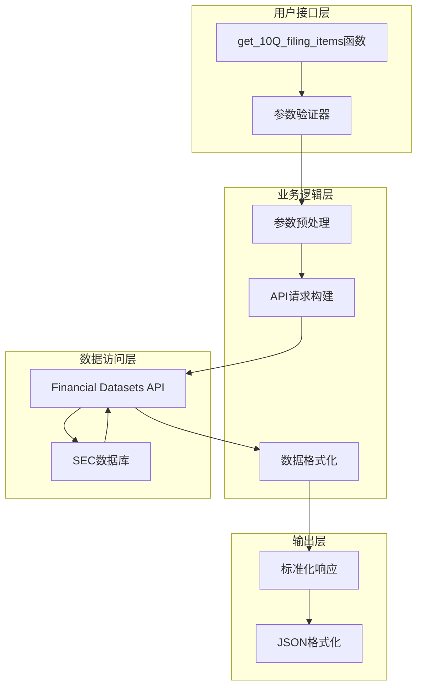
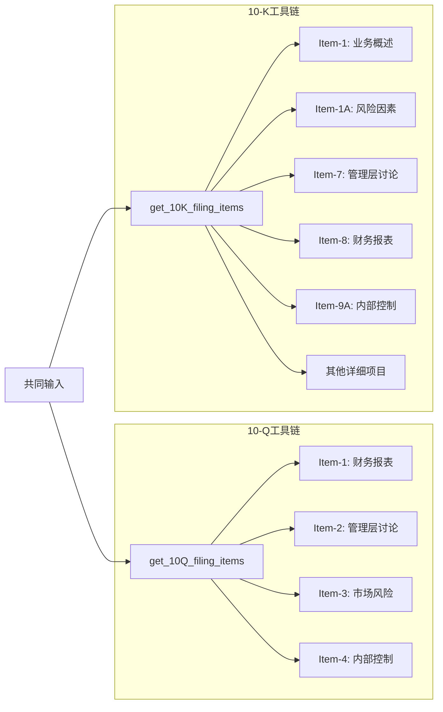

# 10-Q文件内容提取工具

<cite>
**本文档中引用的文件**
- [filings.py](file://src/dexter/tools/filings.py)
- [constants.py](file://src/dexter/tools/constants.py)
- [api.py](file://src/dexter/tools/api.py)
- [schemas.py](file://src/dexter/schemas.py)
- [__init__.py](file://src/dexter/tools/__init__.py)
- [README.md](file://README.md)
</cite>

## 目录
1. [简介](#简介)
2. [工具概述](#工具概述)
3. [核心功能](#核心功能)
4. [参数详解](#参数详解)
5. [数据结构说明](#数据结构说明)
6. [使用示例](#使用示例)
7. [与其他工具的对比](#与其他工具的对比)
8. [错误处理](#错误处理)
9. [最佳实践](#最佳实践)
10. [故障排除指南](#故障排除指南)

## 简介

get_10Q_filing_items工具是Dexter金融研究代理的核心组件之一，专门用于从公司10-Q季度报告中提取特定章节内容。该工具通过SEC（美国证券交易委员会）数据库获取实时的财务报告信息，为用户提供精确的季度财务分析数据。

10-Q报告是上市公司每季度向SEC提交的财务报告，包含了公司的季度财务状况、管理层讨论与分析等内容。该工具特别适用于需要及时了解公司季度经营情况的研究者和投资者。

## 工具概述

### 主要特性

- **季度专用**：专为10-Q季度报告设计，与年度报告工具区分
- **精准提取**：支持按具体项目编号提取报告中的特定章节
- **实时数据**：直接从SEC数据库获取最新报告内容
- **灵活过滤**：支持单个项目或多个项目的批量提取
- **标准化输出**：提供统一的数据格式便于后续分析

### 技术架构



**图表来源**
- [filings.py](file://src/dexter/tools/filings.py#L107-L147)
- [api.py](file://src/dexter/tools/api.py#L9-L19)

## 核心功能

### 主要用途

1. **财务状况分析**：提取管理层对财务状况的讨论与分析
2. **季度业绩评估**：获取季度财务报表和关键指标
3. **风险披露审查**：分析市场风险和其他重要风险因素
4. **内部控制检查**：审查公司内部控制程序的有效性
5. **趋势分析**：比较不同季度间的财务表现

### 功能特点

- **项目级提取**：支持按Item编号精确提取报告内容
- **多项目支持**：可同时提取多个指定项目
- **文本完整性**：保留原始报告的完整文本内容
- **元数据丰富**：提供CIK号、访问号等关键标识信息

## 参数详解

### 必需参数

#### ticker（股票代码）
- **类型**：字符串
- **描述**：公司的公开交易股票代码，例如"MSFT"代表微软公司
- **验证规则**：必须为有效的股票代码格式
- **示例**："AAPL", "GOOGL", "MSFT"

#### year（报告年份）
- **类型**：整数
- **描述**：10-Q报告对应的会计年度
- **验证规则**：必须为正整数，通常为当前年份或过去几年
- **示例**：2023, 2022, 2021

#### quarter（季度）
- **类型**：整数
- **描述**：报告所属的季度，范围为1-4
- **验证规则**：必须为1、2、3或4
- **重要性**：此参数是区分10-Q与10-K工具的关键要素
- **示例**：1（第一季度），2（第二季度），3（第三季度），4（第四季度）

### 可选参数

#### item（要提取的项目列表）
- **类型**：字符串列表
- **描述**：指定要提取的具体报告项目，如果不提供则返回所有可用项目
- **有效值**：来源于ITEMS_10Q_MAP常量的项目代码
- **默认行为**：如果未指定，返回该季度报告中的所有项目
- **示例**：["Item-1", "Item-2", "Item-3"]

**节来源**
- [filings.py](file://src/dexter/tools/filings.py#L107-L147)
- [constants.py](file://src/dexter/tools/constants.py#L35-L42)

## 数据结构说明

### 返回数据结构

get_10Q_filing_items工具返回一个包含以下字段的字典对象：

| 字段名 | 类型 | 描述 |
|--------|------|------|
| resource | 字符串 | 固定值："filing_items"，表示资源类型 |
| ticker | 字符串 | 公司股票代码 |
| cik | 字符串 | 公司的中央索引键（Central Index Key） |
| filing_type | 字符串 | 填报类型，固定为"10-Q" |
| accession_number | 字符串 | SEC访问编号，唯一标识该报告 |
| year | 整数 | 报告年度 |
| quarter | 整数 | 报告季度（1-4） |
| items | 列表 | 包含提取项目的详细信息列表 |

### items字段结构

每个项目包含以下子字段：

| 子字段名 | 类型 | 描述 |
|----------|------|------|
| number | 字符串 | 项目编号，如"Item-1" |
| title | 字符串 | 项目标题，如"Financial Statements" |
| text | 字符串 | 项目完整文本内容 |

### 完整响应示例

```json
{
    "resource": "filing_items",
    "ticker": "MSFT",
    "cik": "0000789019",
    "filing_type": "10-Q",
    "accession_number": "0001193125-24-030001",
    "year": 2024,
    "quarter": 1,
    "items": [
        {
            "number": "Item-1",
            "title": "Financial Statements",
            "text": "Complete financial statements including balance sheet..."
        },
        {
            "number": "Item-2",
            "title": "Management's Discussion and Analysis of Financial Condition and Results of Operations",
            "text": "Management provides analysis of financial performance..."
        }
    ]
}
```

**节来源**
- [filings.py](file://src/dexter/tools/filings.py#L107-L147)

## 使用示例

### 基本用法示例

#### 示例1：提取MSFT公司2023年第三季度的所有10-Q报告内容

```python
result = get_10Q_filing_items(
    ticker="MSFT",
    year=2023,
    quarter=3
)
```

#### 示例2：提取特定项目的详细信息

```python
result = get_10Q_filing_items(
    ticker="AAPL",
    year=2024,
    quarter=1,
    item=["Item-2", "Item-3"]
)
```

#### 示例3：提取财务报表和管理层讨论

```python
result = get_10Q_filing_items(
    ticker="GOOGL",
    year=2023,
    quarter=4,
    item=["Item-1", "Item-2"]
)
```

### 实际应用场景

#### 财务分析师场景
```python
# 分析公司季度财务表现
def analyze_quarterly_performance(ticker, year, quarter):
    items = ["Item-1", "Item-2", "Item-3"]
    result = get_10Q_filing_items(ticker, year, quarter, items)
    
    # 提取管理层讨论部分进行深入分析
    md_analysis = next(item for item in result['items'] 
                      if item['number'] == 'Item-2')['text']
    
    return md_analysis
```

#### 风险评估场景
```python
# 评估市场风险披露
def assess_market_risk(ticker, year, quarter):
    result = get_10Q_filing_items(ticker, year, quarter, ["Item-3"])
    
    # 分析风险披露的详细程度
    risk_disclosure = result['items'][0]['text']
    
    return risk_disclosure
```

### 参数组合示例

| 股票代码 | 年份 | 季度 | 提取项目 | 用途 |
|----------|------|------|----------|------|
| MSFT | 2024 | 1 | ["Item-1", "Item-2"] | 获取财务报表和管理层讨论 |
| AAPL | 2023 | 4 | ["Item-2"] | 仅提取管理层讨论部分 |
| GOOGL | 2024 | 2 | ["Item-3"] | 重点关注市场风险披露 |
| NFLX | 2023 | 3 | ["Item-1", "Item-4"] | 比较财务状况和内部控制 |

**节来源**
- [filings.py](file://src/dexter/tools/filings.py#L107-L147)

## 与其他工具的对比

### 10-Q vs 10-K 工具对比

| 特征 | get_10Q_filing_items | get_10K_filing_items |
|------|---------------------|---------------------|
| **报告频率** | 季度报告 | 年度报告 |
| **数据时效性** | 更及时，反映最新季度表现 | 较滞后，反映全年综合情况 |
| **适用场景** | 短期趋势分析、季度业绩跟踪 | 长期战略分析、全面业务评估 |
| **项目数量** | 4个核心项目 | 16个详细项目 |
| **管理层讨论深度** | 季度总结和展望 | 全面回顾和长期规划 |
| **风险披露范围** | 市场风险披露 | 全面风险因素分析 |

### 架构差异图



**图表来源**
- [filings.py](file://src/dexter/tools/filings.py#L107-L147)
- [filings.py](file://src/dexter/tools/filings.py#L57-L104)

### 使用场景建议

#### 选择10-Q工具的情况：
- 需要分析最近几个季度的财务表现
- 关注公司短期经营策略和市场应对措施
- 追踪管理层对当前季度业绩的评价
- 了解季度性的市场风险变化

#### 选择10-K工具的情况：
- 进行年度财务分析和业务评估
- 深入了解公司的整体业务模式
- 分析长期风险因素和战略方向
- 对比多年来的财务表现趋势

**节来源**
- [filings.py](file://src/dexter/tools/filings.py#L57-L104)
- [constants.py](file://src/dexter/tools/constants.py#L35-L42)

## 错误处理

### 常见错误类型

#### 参数验证错误
```python
# 错误示例：无效的季度参数
try:
    get_10Q_filing_items(ticker="MSFT", year=2023, quarter=5)
except Exception as e:
    print(f"参数错误: {e}")
    # 输出：季度参数必须在1-4范围内
```

#### 数据不存在错误
```python
# 错误示例：不存在的报告
try:
    result = get_10Q_filing_items(ticker="NONEXIST", year=2023, quarter=1)
except Exception as e:
    print(f"数据错误: {e}")
    # 输出：未找到指定的10-Q报告
```

#### API调用错误
```python
# 错误示例：网络连接问题
try:
    result = get_10Q_filing_items(ticker="MSFT", year=2023, quarter=1)
except requests.exceptions.RequestException as e:
    print(f"网络错误: {e}")
```

### 错误处理最佳实践

```python
def robust_get_10Q_data(ticker, year, quarter, items=None):
    """
    带有错误处理的10-Q数据获取函数
    """
    try:
        # 参数验证
        if not isinstance(year, int) or year < 2000:
            raise ValueError("年份必须是大于2000的整数")
        
        if not 1 <= quarter <= 4:
            raise ValueError("季度必须在1-4范围内")
        
        # 调用API
        result = get_10Q_filing_items(
            ticker=ticker,
            year=year,
            quarter=quarter,
            item=items
        )
        
        # 数据验证
        if not result.get('items'):
            print(f"警告: 未找到{ticker} {year}年第{quarter}季度的报告")
            return None
            
        return result
        
    except ValueError as e:
        print(f"参数错误: {e}")
        return None
    except Exception as e:
        print(f"系统错误: {e}")
        return None
```

**节来源**
- [filings.py](file://src/dexter/tools/filings.py#L107-L147)
- [api.py](file://src/dexter/tools/api.py#L9-L19)

## 最佳实践

### 参数优化建议

#### 1. 合理使用item参数
```python
# 推荐：只提取需要的项目
result = get_10Q_filing_items(
    ticker="MSFT", 
    year=2024, 
    quarter=1,
    item=["Item-2"]  # 只提取管理层讨论
)

# 不推荐：提取过多不必要的项目
result = get_10Q_filing_items(
    ticker="MSFT", 
    year=2024, 
    quarter=1,
    item=["Item-1", "Item-2", "Item-3", "Item-4"]  # 包含大量冗余数据
)
```

#### 2. 批量处理策略
```python
def batch_process_quarters(ticker, start_year, start_quarter, end_year, end_quarter):
    """批量处理多个季度的报告"""
    results = []
    
    for year in range(start_year, end_year + 1):
        quarter_start = start_quarter if year == start_year else 1
        quarter_end = end_quarter if year == end_year else 4
        
        for quarter in range(quarter_start, quarter_end + 1):
            try:
                result = get_10Q_filing_items(
                    ticker=ticker,
                    year=year,
                    quarter=quarter,
                    item=["Item-2"]  # 只关注管理层讨论
                )
                results.append(result)
            except Exception as e:
                print(f"获取{ticker} {year}年第{quarter}季度失败: {e}")
                
    return results
```

#### 3. 缓存机制
```python
import hashlib
import json
from pathlib import Path

def cached_get_10Q_filing_items(ticker, year, quarter, items=None):
    """带缓存的10-Q数据获取"""
    cache_dir = Path("cache/10q")
    cache_dir.mkdir(parents=True, exist_ok=True)
    
    # 创建缓存键
    cache_key = f"{ticker}_{year}_{quarter}_{'_'.join(sorted(items or []))}"
    hash_obj = hashlib.md5(cache_key.encode())
    cache_file = cache_dir / f"{hash_obj.hexdigest()}.json"
    
    # 检查缓存
    if cache_file.exists():
        with open(cache_file, 'r') as f:
            return json.load(f)
    
    # 获取数据并缓存
    result = get_10Q_filing_items(ticker, year, quarter, items)
    
    with open(cache_file, 'w') as f:
        json.dump(result, f)
    
    return result
```

### 性能优化技巧

#### 1. 并行处理多个公司
```python
import asyncio
from concurrent.futures import ThreadPoolExecutor

async def async_get_10Q_data(ticker, year, quarter, items=None):
    """异步获取10-Q数据"""
    loop = asyncio.get_event_loop()
    with ThreadPoolExecutor() as executor:
        future = loop.run_in_executor(
            executor, 
            lambda: get_10Q_filing_items(ticker, year, quarter, items)
        )
        return await future
```

#### 2. 数据预处理
```python
def preprocess_md_content(text):
    """预处理管理层讨论内容"""
    # 移除多余的空白字符
    text = re.sub(r'\s+', ' ', text)
    
    # 提取关键段落
    paragraphs = text.split('\n\n')
    relevant_paragraphs = [p for p in paragraphs if len(p) > 100]
    
    return '\n\n'.join(relevant_paragraphs[:5])  # 只保留前5个段落
```

## 故障排除指南

### 常见问题及解决方案

#### 1. API密钥问题
**症状**：出现认证错误或访问被拒绝
**解决方案**：
- 检查环境变量`FINANCIAL_DATASETS_API_KEY`是否正确设置
- 验证API密钥的有效性和权限
- 确认账户余额充足

#### 2. 参数格式错误
**症状**：参数验证失败或返回空结果
**解决方案**：
```python
# 正确的参数格式验证
def validate_parameters(ticker, year, quarter):
    errors = []
    
    if not isinstance(ticker, str) or not ticker.isalpha():
        errors.append("股票代码必须是字母组成的字符串")
    
    if not isinstance(year, int) or year < 2000:
        errors.append("年份必须是大于2000的整数")
    
    if not isinstance(quarter, int) or quarter not in [1, 2, 3, 4]:
        errors.append("季度必须是1-4之间的整数")
    
    if errors:
        raise ValueError("; ".join(errors))
```

#### 3. 数据缺失问题
**症状**：返回结果中items为空列表
**解决方案**：
- 检查公司是否在指定时间存在10-Q报告
- 验证股票代码是否正确
- 确认报告是否已正式发布

#### 4. 网络连接问题
**症状**：API调用超时或连接失败
**解决方案**：
```python
import requests
from requests.adapters import HTTPAdapter
from urllib3.util.retry import Retry

def create_reliable_session():
    """创建具有重试机制的会话"""
    session = requests.Session()
    
    retry_strategy = Retry(
        total=3,
        backoff_factor=1,
        status_forcelist=[429, 500, 502, 503, 504],
    )
    
    adapter = HTTPAdapter(max_retries=retry_strategy)
    session.mount("http://", adapter)
    session.mount("https://", adapter)
    
    return session
```

### 调试技巧

#### 1. 启用详细日志
```python
import logging

logging.basicConfig(level=logging.DEBUG)
logger = logging.getLogger(__name__)

def debug_get_10Q_filing_items(ticker, year, quarter, items=None):
    """带调试信息的10-Q数据获取"""
    logger.info(f"开始获取 {ticker} {year}年第{quarter}季度报告")
    
    try:
        result = get_10Q_filing_items(ticker, year, quarter, items)
        logger.info(f"成功获取 {len(result.get('items', []))} 个项目")
        return result
    except Exception as e:
        logger.error(f"获取报告失败: {e}")
        raise
```

#### 2. 数据质量检查
```python
def validate_report_quality(result):
    """验证报告数据的质量"""
    if not result:
        return False, "结果为空"
    
    items = result.get('items', [])
    if not items:
        return False, "未找到任何项目"
    
    # 检查每个项目的完整性
    for item in items:
        required_fields = ['number', 'title', 'text']
        missing_fields = [field for field in required_fields if not item.get(field)]
        
        if missing_fields:
            return False, f"项目缺少字段: {missing_fields}"
        
        if len(item['text']) < 100:  # 文本过短可能不完整
            return False, f"项目 {item['number']} 文本过短"
    
    return True, "数据质量良好"
```

**节来源**
- [api.py](file://src/dexter/tools/api.py#L9-L19)
- [filings.py](file://src/dexter/tools/filings.py#L107-L147)

## 结论

get_10Q_filing_items工具是Dexter金融研究代理中不可或缺的核心组件，它为用户提供了精确、及时的10-Q季度报告内容提取能力。通过合理使用该工具，用户可以：

1. **获得及时的财务信息**：利用季度报告的时效性优势
2. **进行深入的财务分析**：提取管理层讨论等关键内容
3. **支持投资决策**：基于最新的季度数据做出判断
4. **监控公司表现**：持续跟踪公司的经营状况

该工具的设计充分考虑了金融分析的实际需求，在保证数据准确性的同时，提供了灵活的参数配置和强大的错误处理能力。随着金融市场的不断发展，该工具将继续为用户提供可靠、高效的10-Q报告分析服务。