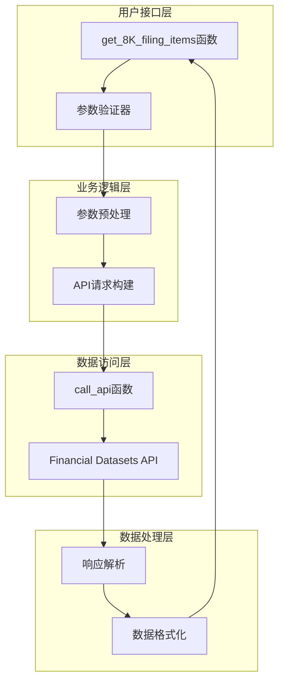
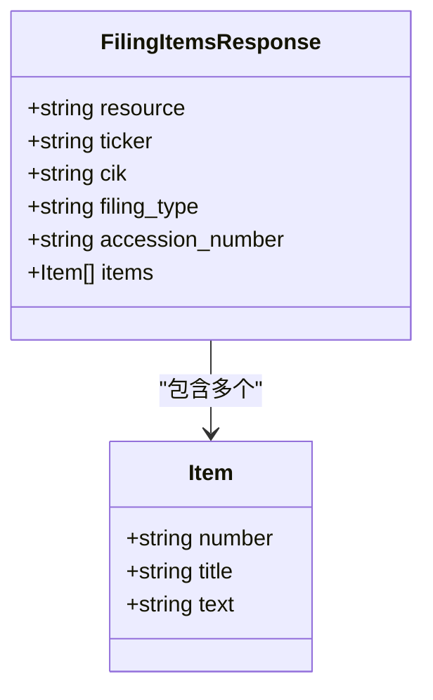
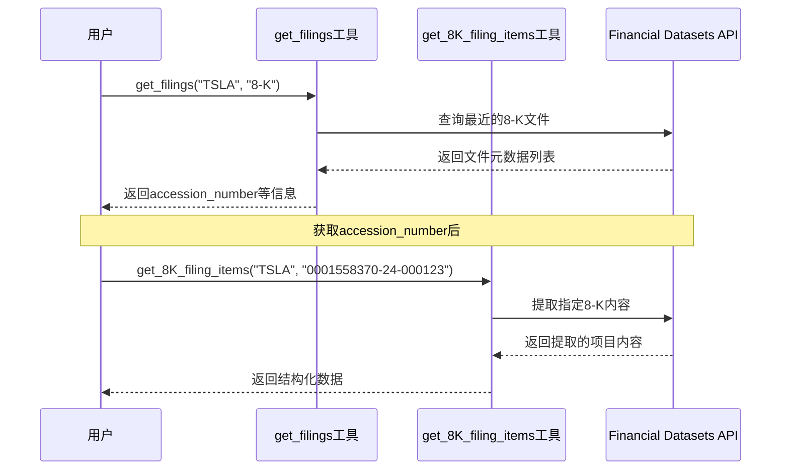
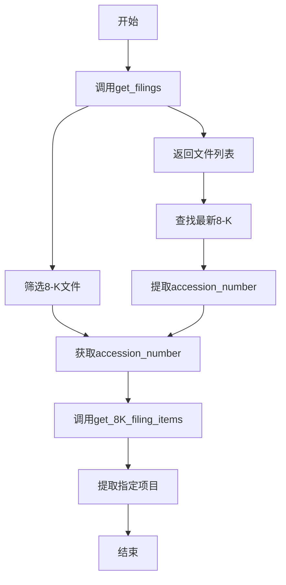

# 8-K文件内容提取工具

<cite>
**本文档中引用的文件**
- [filings.py](file://src/dexter/tools/filings.py)
- [constants.py](file://src/dexter/tools/constants.py)
- [api.py](file://src/dexter/tools/api.py)
- [__init__.py](file://src/dexter/tools/__init__.py)
</cite>

## 目录
1. [简介](#简介)
2. [工具概述](#工具概述)
3. [核心功能](#核心功能)
4. [参数详解](#参数详解)
5. [数据结构](#数据结构)
6. [使用示例](#使用示例)
7. [与其他工具的关系](#与其他工具的关系)
8. [错误处理](#错误处理)
9. [最佳实践](#最佳实践)
10. [故障排除](#故障排除)

## 简介

get_8K_filing_items工具是一个专门用于从美国证券交易委员会(SEC)的8-K特别报告中提取关键事件内容的API工具。该工具能够识别并提取8-K文件中的特定项目(section)，如财务结果、管理层变动、重大协议等重要公司事件。

8-K报告是上市公司向SEC提交的季度报告，用于披露对公司运营产生重大影响的事件。这些报告包含了诸如收购、财务业绩、管理变更等关键信息，对于投资者和分析师来说具有重要的参考价值。

## 工具概述

### 核心特性

- **专业化的8-K内容提取**：专注于提取8-K报告中的关键事件信息
- **精确的项目定位**：支持按具体项目编号提取相关内容
- **标准化的数据格式**：返回结构化数据，便于后续处理
- **与SEC数据源集成**：直接访问官方SEC数据库

### 技术架构



**图表来源**
- [filings.py](file://src/dexter/tools/filings.py#L159-L201)
- [api.py](file://src/dexter/tools/api.py#L8-L19)

## 核心功能

### 主要用途

1. **事件监控**：实时跟踪公司的重大事件变化
2. **投资决策支持**：为投资者提供及时的公司动态信息
3. **合规检查**：确保公司及时披露重要信息
4. **市场研究**：分析行业趋势和公司行为模式

### 支持的项目类型

根据SEC标准，8-K报告包含以下主要项目类别：

| 项目编号 | 项目名称 | 描述 |
|---------|---------|------|
| Item-1.01 | 进入重大最终协议 | 公司签署的重要合同或协议 |
| Item-2.02 | 营运成果和财务状况 | 财务业绩和经营情况更新 |
| Item-5.02 | 董事或高级官员变动 | 董事会成员或高管的离职、选举或任命 |
| Item-8.01 | 其他事件 | 未包含在其他项目的重大事件 |

**节来源**
- [constants.py](file://src/dexter/tools/constants.py#L35-L85)

## 参数详解

### 必需参数

#### ticker (股票代码)
- **类型**: `str`
- **描述**: 公司的股票交易代码，例如"MSFT"代表微软公司
- **要求**: 必须提供有效的股票代码
- **示例**: `"TSLA"` (特斯拉)

#### accession_number (访问编号)
- **类型**: `str`
- **描述**: SEC分配给特定8-K报告的唯一标识符，格式为"0000320193-24-000123"
- **特殊性**: 这个参数必须通过先调用`get_filings`工具查询获得，这是与其他两个工具的最大区别
- **来源**: 通过`get_filings(ticker, "8-K")`获取的返回结果中的accession_number字段
- **示例**: `"0001558370-24-000123"`

### 可选参数

#### item (项目列表)
- **类型**: `list[str] | None`
- **描述**: 要提取的具体8-K项目列表，如果未指定则返回所有可用项目
- **有效值**: 来自`ITEMS_8K_MAP`常量中的项目代码
- **示例**: `["Item-2.02", "Item-5.02"]`

**节来源**
- [filings.py](file://src/dexter/tools/filings.py#L150-L159)

## 数据结构

### 返回数据格式

get_8K_filing_items工具返回一个包含以下字段的字典：



**图表来源**
- [filings.py](file://src/dexter/tools/filings.py#L159-L201)

### 字段详细说明

| 字段名 | 类型 | 描述 |
|--------|------|------|
| resource | string | 固定值："filing_items" |
| ticker | string | 公司股票代码 |
| cik | string | 公司的中央索引键(CIK)编号 |
| filing_type | string | 填报类型："8-K" |
| accession_number | string | SEC访问编号 |
| items | list | 包含提取的项目列表 |

### Item对象结构

每个Item对象包含三个核心字段：

| 字段名 | 类型 | 描述 |
|--------|------|------|
| number | string | 项目编号，如"Item-2.02" |
| title | string | 项目标题，如"Results of Operations and Financial Condition" |
| text | string | 项目具体内容文本 |

**节来源**
- [filings.py](file://src/dexter/tools/filings.py#L159-L201)

## 使用示例

### 基本使用流程

以下是使用get_8K_filing_items工具的标准流程：



**图表来源**
- [filings.py](file://src/dexter/tools/filings.py#L27-L54)
- [filings.py](file://src/dexter/tools/filings.py#L159-L201)

### 示例1：提取特定项目

```python
# 第一步：查找最近的8-K文件
filings = get_filings("TSLA", "8-K")

# 第二步：选择第一个8-K文件的accession_number
accession_number = filings[0]["accession_number"]

# 第三步：提取特定项目(Item-2.02: Results of Operations)
result = get_8K_filing_items(
    ticker="TSLA",
    accession_number=accession_number,
    item=["Item-2.02"]
)

# 处理结果
for item in result["items"]:
    print(f"项目编号: {item['number']}")
    print(f"项目标题: {item['title']}")
    print(f"内容摘要: {item['text'][:200]}...")  # 显示前200字符
```

### 示例2：提取多个项目

```python
# 提取多个相关项目
items_to_extract = ["Item-2.02", "Item-5.02", "Item-8.01"]
result = get_8K_filing_items("MSFT", "0001558370-24-000123", items_to_extract)

# 批量处理项目
for item in result["items"]:
    print(f"\n=== {item['number']} - {item['title']} ===")
    print(item["text"])
```

### 示例3：提取所有可用项目

```python
# 不指定项目，提取所有可用内容
full_result = get_8K_filing_items("AAPL", "0001558370-24-000123")

# 遍历所有项目
print(f"共提取了 {len(full_result['items'])} 个项目")
for i, item in enumerate(full_result["items"], 1):
    print(f"{i}. {item['number']}: {item['title']}")
```

**节来源**
- [filings.py](file://src/dexter/tools/filings.py#L159-L201)

## 与其他工具的关系

### 工具对比表

| 工具名称 | 文件类型 | 特殊参数 | 主要用途 |
|----------|----------|----------|----------|
| get_filings | 任意 | filing_type | 查找文件元数据 |
| get_10K_filing_items | 10-K | year | 提取年度报告内容 |
| get_10Q_filing_items | 10-Q | year, quarter | 提取季度报告内容 |
| get_8K_filing_items | 8-K | accession_number | 提取特别报告内容 |

### 关键差异

#### accession_number参数的独特性
get_8K_filing_items工具的accession_number参数是其最大特色，也是与其他两个工具的主要区别：

1. **数据来源不同**：accession_number必须通过`get_filings`工具查询获得
2. **唯一性要求**：每个8-K报告都有唯一的accession_number
3. **间接获取**：需要先调用`get_filings`工具获取文件列表，再从中提取accession_number



**图表来源**
- [filings.py](file://src/dexter/tools/filings.py#L27-L54)
- [filings.py](file://src/dexter/tools/filings.py#L159-L201)

**节来源**
- [filings.py](file://src/dexter/tools/filings.py#L27-L54)
- [filings.py](file://src/dexter/tools/filings.py#L159-L201)

## 错误处理

### 常见错误类型

1. **无效的accession_number**
   - 错误原因：提供的accession_number不存在或格式不正确
   - 解决方案：重新调用`get_filings`工具获取正确的accession_number

2. **不存在的项目**
   - 错误原因：指定的item不在该8-K报告中
   - 解决方案：检查`ITEMS_8K_MAP`常量确认项目存在

3. **API限制**
   - 错误原因：超出API调用频率限制
   - 解决方案：添加适当的延迟或联系API提供商

### 错误处理最佳实践

```python
def safe_get_8k_items(ticker, filing_info, target_items=None):
    """
    安全地调用get_8K_filing_items，包含错误处理
    """
    try:
        # 检查accession_number是否存在
        if "accession_number" not in filing_info:
            raise ValueError("缺少accession_number参数")
        
        # 调用工具
        result = get_8K_filing_items(
            ticker=ticker,
            accession_number=filing_info["accession_number"],
            item=target_items
        )
        
        # 验证结果
        if not result.get("items"):
            print(f"警告：未找到任何项目内容")
        
        return result
        
    except Exception as e:
        print(f"提取8-K内容时出错: {e}")
        return None
```

## 最佳实践

### 性能优化建议

1. **批量处理**：当需要提取多个项目时，尽量一次性指定所有目标项目
2. **缓存机制**：对频繁访问的8-K报告建立本地缓存
3. **并发控制**：避免同时发起过多API请求

### 数据质量保证

1. **验证accession_number**：在调用前确认accession_number的有效性
2. **内容完整性检查**：验证提取的文本是否完整
3. **时间戳记录**：记录数据获取的时间戳以便追踪时效性

### 使用场景推荐

- **实时监控**：结合定时任务监控特定公司的8-K发布
- **事件分析**：分析特定事件类型在不同公司中的出现频率
- **投资研究**：作为基本面分析的一部分

## 故障排除

### 常见问题及解决方案

#### 问题1：无法获取accession_number
**症状**：调用`get_filings`返回空列表或无8-K文件
**解决方案**：
1. 检查股票代码是否正确
2. 尝试增加limit参数值
3. 确认该公司确实有8-K报告

#### 问题2：提取内容为空
**症状**：get_8K_filing_items返回空的items列表
**解决方案**：
1. 验证accession_number是否正确
2. 检查item参数是否存在于该报告中
3. 确认网络连接正常

#### 问题3：API调用失败
**症状**：出现网络错误或认证失败
**解决方案**：
1. 检查API密钥配置
2. 验证网络连接
3. 查看API服务状态

### 调试技巧

1. **启用详细日志**：在开发环境中启用详细的API调用日志
2. **分步测试**：分别测试`get_filings`和`get_8K_filing_items`的功能
3. **数据验证**：打印中间结果进行调试

**节来源**
- [api.py](file://src/dexter/tools/api.py#L8-L19)

## 结论

get_8K_filing_items工具是Dexter金融研究代理中提取8-K特别报告内容的核心组件。它通过专业的参数设计和标准化的数据输出，为用户提供了一个强大而灵活的工具来获取公司的重要事件信息。

该工具的独特之处在于其accession_number参数的设计，这一设计虽然增加了使用的复杂性，但确保了数据的准确性和可靠性。通过与`get_filings`工具的配合使用，用户可以构建完整的8-K报告监控和分析系统。

随着金融市场的不断发展，8-K报告中的信息对于投资者决策的重要性日益增加。get_8K_filing_items工具为研究人员提供了获取这些关键信息的便捷途径，是现代金融研究不可或缺的工具之一。