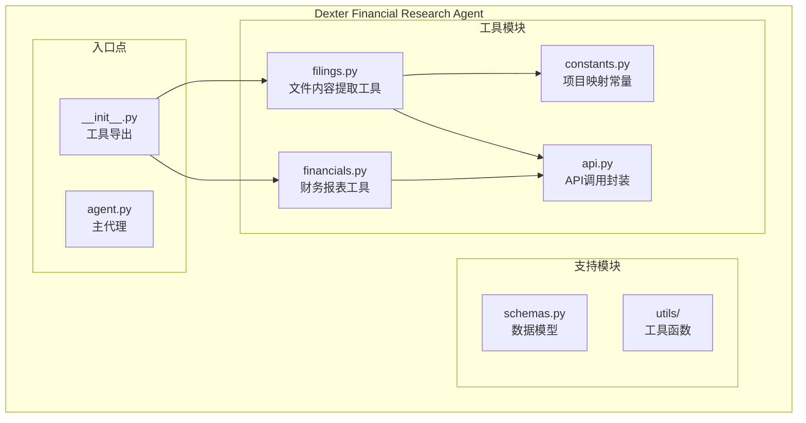
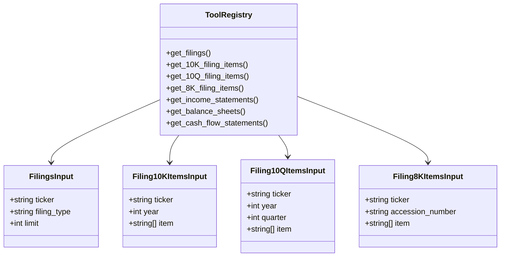
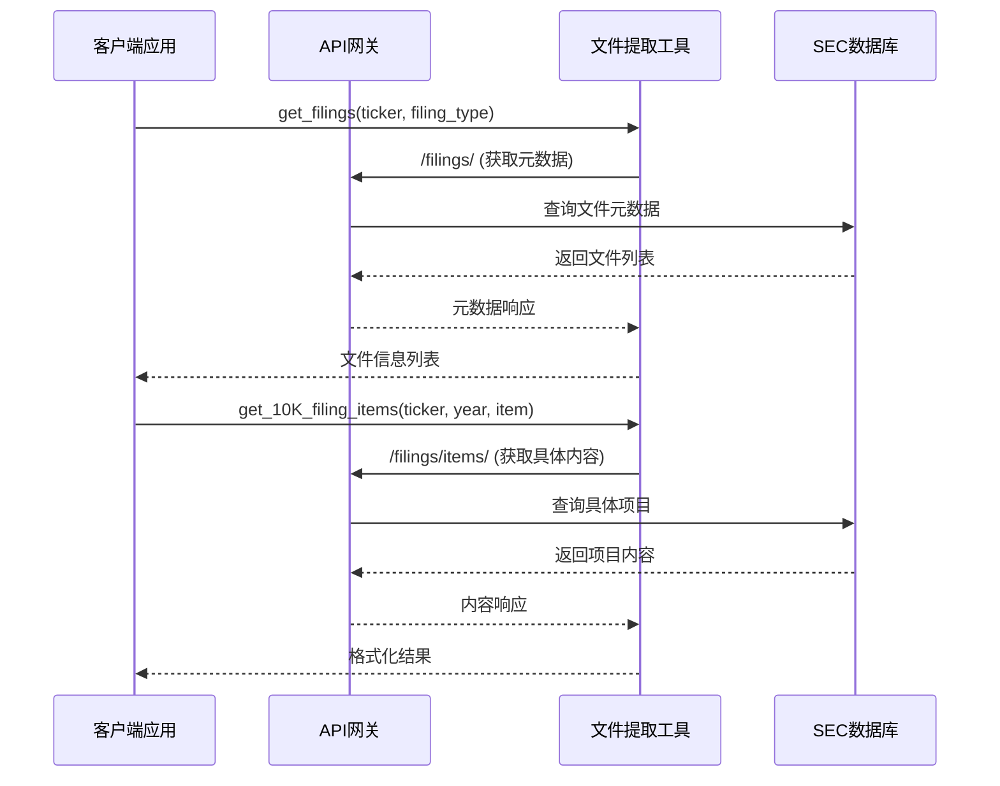
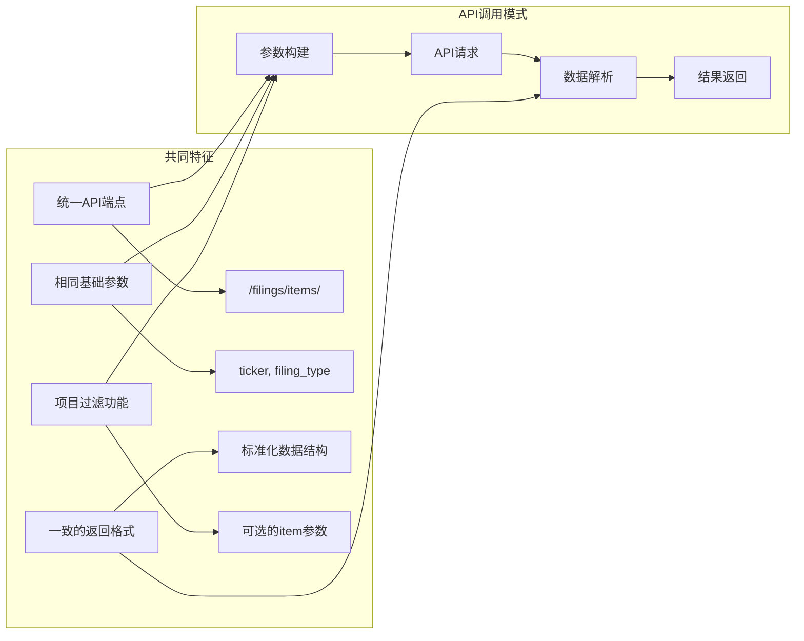
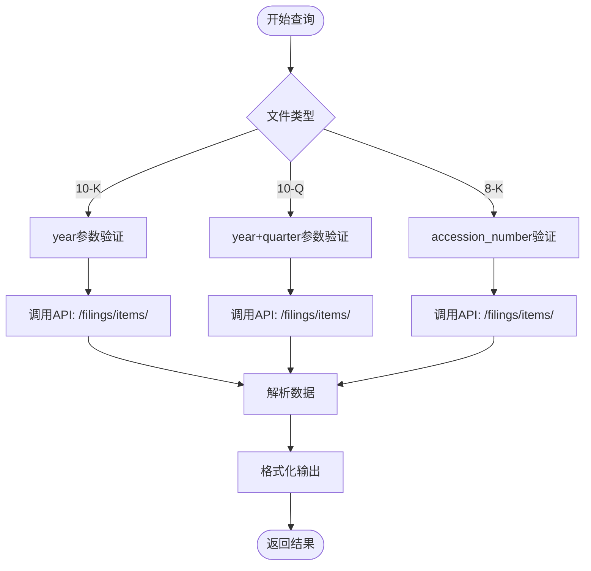
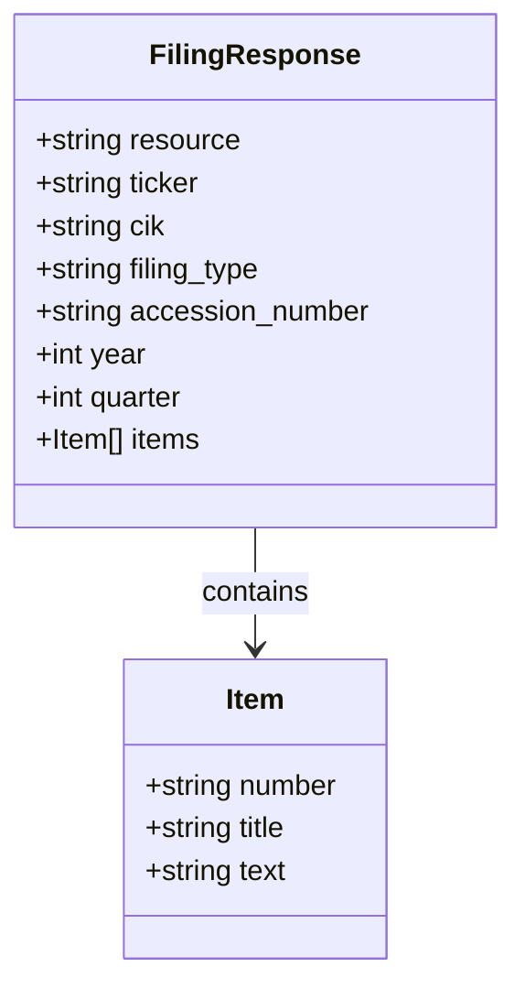

# 文件内容提取工具综合API文档

<cite>
**本文档中引用的文件**
- [filings.py](file://src/dexter/tools/filings.py)
- [constants.py](file://src/dexter/tools/constants.py)
- [api.py](file://src/dexter/tools/api.py)
- [schemas.py](file://src/dexter/schemas.py)
- [__init__.py](file://src/dexter/tools/__init__.py)
- [financials.py](file://src/dexter/tools/financials.py)
- [README.md](file://README.md)
</cite>

## 目录
1. [简介](#简介)
2. [项目结构](#项目结构)
3. [核心组件](#核心组件)
4. [架构概览](#架构概览)
5. [详细组件分析](#详细组件分析)
6. [三类文件对比分析](#三类文件对比分析)
7. [统一返回格式](#统一返回格式)
8. [端到端使用示例](#端到端使用示例)
9. [最佳实践指南](#最佳实践指南)
10. [故障排除指南](#故障排除指南)
11. [总结](#总结)

## 简介

Dexter是一个自主的财务研究代理，专门设计用于处理SEC（美国证券交易委员会）文件内容提取任务。该系统提供了三个核心工具，专门针对不同类型的SEC文件：10-K年度报告、10-Q季度报告和8-K当前报告。这些工具共享统一的`/filings/items/` API端点，但具有不同的参数结构以适应各自的文件类型需求。

系统的核心优势在于：
- **统一的API接口**：所有文件类型都通过相同的API端点访问
- **灵活的参数配置**：每种文件类型都有针对性的参数设计
- **标准化的数据输出**：统一的返回格式便于后续处理
- **智能的项目映射**：内置的项目名称到描述的映射表

## 项目结构



**图表来源**
- [filings.py](file://src/dexter/tools/filings.py#L1-L20)
- [constants.py](file://src/dexter/tools/constants.py#L1-L20)
- [api.py](file://src/dexter/tools/api.py#L1-L20)
- [financials.py](file://src/dexter/tools/financials.py#L1-L20)

**节来源**
- [filings.py](file://src/dexter/tools/filings.py#L1-L204)
- [constants.py](file://src/dexter/tools/constants.py#L1-L104)
- [api.py](file://src/dexter/tools/api.py#L1-L20)

## 核心组件

### 主要工具集合

系统提供了六个核心工具，其中三个专门用于SEC文件内容提取：



**图表来源**
- [__init__.py](file://src/dexter/tools/__init__.py#L1-L17)
- [filings.py](file://src/dexter/tools/filings.py#L15-L204)

### 项目映射常量

系统维护了三个主要的项目映射字典，每个对应一种文件类型：

| 常量名 | 描述 | 包含的项目数量 |
|--------|------|----------------|
| `ITEMS_10K_MAP` | 10-K年度报告项目映射 | 16个项目 |
| `ITEMS_10Q_MAP` | 10-Q季度报告项目映射 | 4个项目 |
| `ITEMS_8K_MAP` | 8-K当前报告项目映射 | 30个项目 |

**节来源**
- [constants.py](file://src/dexter/tools/constants.py#L10-L101)

## 架构概览



**图表来源**
- [filings.py](file://src/dexter/tools/filings.py#L27-L204)
- [api.py](file://src/dexter/tools/api.py#L10-L19)

## 详细组件分析

### get_filings - 文件元数据获取工具

`get_filings`工具负责检索公司的SEC文件元数据，是获取具体文件内容的第一步。

#### 参数规范

| 参数名 | 类型 | 必需 | 描述 |
|--------|------|------|------|
| `ticker` | string | 是 | 股票代码，如"AAPL" |
| `filing_type` | "10-K" \| "10-Q" \| "8-K" | 否 | 指定文件类型，不指定时返回最近的任何类型 |
| `limit` | int | 否 | 最大返回文件数量，默认10 |

#### 使用场景
- 查找特定公司的所有SEC文件
- 获取最新的几个文件记录
- 筛选特定类型的文件

**节来源**
- [filings.py](file://src/dexter/tools/filings.py#L27-L54)

### get_10K_filing_items - 10-K年度报告内容提取

`get_10K_filing_items`专门用于提取10-K年度报告的具体章节内容。

#### 参数规范

| 参数名 | 类型 | 必需 | 描述 |
|--------|------|------|------|
| `ticker` | string | 是 | 股票代码，如"AAPL" |
| `year` | int | 是 | 年度报告年份，如2023 |
| `item` | list[string] | 否 | 要提取的具体项目列表 |

#### 支持的10-K项目

系统支持以下10-K项目：

| 项目编号 | 描述 |
|----------|------|
| Item-1 | Business（业务） |
| Item-1A | Risk Factors（风险因素） |
| Item-1B | Unresolved Staff Comments（未解决的工作人员评论） |
| Item-2 | Properties（财产） |
| Item-3 | Legal Proceedings（法律程序） |
| Item-4 | Mine Safety Disclosures（矿山安全披露） |
| Item-5 | 市场、股东事项等 |
| Item-7 | 管理层讨论与分析 |
| Item-7A | 市场风险的定量和定性披露 |
| Item-8 | 财务报表和补充数据 |
| Item-9 | 会计变更等争议 |
| Item-9A | 控制程序 |
| Item-9B | 其他信息 |
| Item-10 | 董事、高管和公司治理 |
| Item-11 | 执行薪酬 |
| Item-12 | 股权所有权信息 |
| Item-13 | 关联交易 |
| Item-14 | 会计服务费用 |
| Item-15 | 附录和财务报表 |
| Item-16 | 10-K摘要 |

#### 示例用法
```python
# 提取所有项目
result = get_10K_filing_items(ticker="AAPL", year=2023)

# 只提取风险因素和管理层讨论
result = get_10K_filing_items(
    ticker="AAPL", 
    year=2023,
    item=["Item-1A", "Item-7"]
)
```

**节来源**
- [filings.py](file://src/dexter/tools/filings.py#L57-L104)
- [constants.py](file://src/dexter/tools/constants.py#L10-L33)

### get_10Q_filing_items - 10-Q季度报告内容提取

`get_10Q_filing_items`用于提取10-Q季度报告的具体章节内容。

#### 参数规范

| 参数名 | 类型 | 必需 | 描述 |
|--------|------|------|------|
| `ticker` | string | 是 | 股票代码，如"AAPL" |
| `year` | int | 是 | 季度报告年份，如2023 |
| `quarter` | int | 是 | 季度号（1-4） |
| `item` | list[string] | 否 | 要提取的具体项目列表 |

#### 支持的10-Q项目

| 项目编号 | 描述 |
|----------|------|
| Item-1 | Financial Statements（财务报表） |
| Item-2 | Management's Discussion and Analysis（管理层讨论与分析） |
| Item-3 | 市场风险的定量和定性披露 |
| Item-4 | Controls and Procedures（控制程序） |

#### 示例用法
```python
# 提取第3季度的所有项目
result = get_10Q_filing_items(ticker="AAPL", year=2023, quarter=3)

# 只提取财务报表和管理层讨论
result = get_10Q_filing_items(
    ticker="AAPL", 
    year=2023, 
    quarter=3,
    item=["Item-1", "Item-2"]
)
```

**节来源**
- [filings.py](file://src/dexter/tools/filings.py#L107-L147)
- [constants.py](file://src/dexter/tools/constants.py#L35-L42)

### get_8K_filing_items - 8-K当前报告内容提取

`get_8K_filing_items`专门用于提取8-K当前报告的具体事件内容。

#### 参数规范

| 参数名 | 类型 | 必需 | 描述 |
|--------|------|------|------|
| `ticker` | string | 是 | 股票代码，如"AAPL" |
| `accession_number` | string | 是 | SEC收录编号，如"0000320193-24-000123" |
| `item` | list[string] | 否 | 要提取的具体项目列表 |

#### 支持的8-K项目

| 项目编号 | 描述 |
|----------|------|
| Item-1.01 | 进入重要协议 |
| Item-1.02 | 终止重要协议 |
| Item-1.03 | 破产或接管 |
| Item-1.04 | 矿山安全披露 |
| Item-2.01 | 资产收购或处置完成 |
| Item-2.02 | 营运结果和财务状况 |
| Item-2.03 | 直接财务义务创建 |
| Item-2.04 | 加速或增加财务义务的触发事件 |
| Item-2.05 | 处置活动成本 |
| Item-2.06 | 重大减值 |
| Item-3.01 | 列市通知或持续上市规则失败 |
| Item-3.02 | 未注册股权证券销售 |
| Item-3.03 | 对证券持有人权利的重大修改 |
| Item-4.01 | 注册人审计师变更 |
| Item-4.02 | 不依赖先前发布的财务报表 |
| Item-5.01 | 控制权变更 |
| Item-5.02 | 董事或高级官员变动 |
| Item-5.03 | 公司章程修改 |
| Item-5.04 | 员工福利计划交易暂停 |
| Item-5.05 | 公司道德准则变更 |
| Item-5.06 | 壳公司状态变更 |
| Item-5.07 | 提交事项投票 |
| Item-5.08 | 股东董事提名 |
| Item-6.01 | ABS信息和计算材料 |
| Item-6.02 | 服务商或受托人变更 |
| Item-6.03 | 信用增强或其他外部支持变更 |
| Item-6.04 | 未能做出要求的分配 |
| Item-6.05 | 证券法更新披露 |
| Item-7.01 | 规制FD披露 |
| Item-8.01 | 其他事件 |
| Item-9.01 | 财务报表和附录 |

#### 获取accession_number的流程
```python
# 第一步：获取文件元数据
filings = get_filings(ticker="AAPL", filing_type="8-K", limit=5)

# 第二步：选择特定的8-K文件
target_filing = filings[0]
accession_number = target_filing['accession_number']

# 第三步：提取具体内容
result = get_8K_filing_items(
    ticker="AAPL",
    accession_number=accession_number,
    item=["Item-2.02"]  # 结果和财务状况
)
```

**节来源**
- [filings.py](file://src/dexter/tools/filings.py#L159-L201)
- [constants.py](file://src/dexter/tools/constants.py#L44-L101)

## 三类文件对比分析

### 共享特性

所有三种文件类型都共享以下特性：



### 参数差异对比

| 特征 | 10-K | 10-Q | 8-K |
|------|------|------|-----|
| **必需参数** | `ticker`, `year` | `ticker`, `year`, `quarter` | `ticker`, `accession_number` |
| **时间维度** | 年度 | 年度+季度 | 单一文件 |
| **参数复杂度** | 中等 | 较高 | 最高 |
| **适用场景** | 年度报告 | 季度报告 | 事件报告 |

### 数据流对比



**图表来源**
- [filings.py](file://src/dexter/tools/filings.py#L57-L201)

**节来源**
- [filings.py](file://src/dexter/tools/filings.py#L57-L201)

## 统一返回格式

所有文件内容提取工具都遵循统一的返回格式，确保数据的一致性和可预测性。

### 标准返回结构



### 字段详细说明

| 字段名 | 类型 | 描述 | 示例值 |
|--------|------|------|--------|
| `resource` | string | 固定为"filing_items" | "filing_items" |
| `ticker` | string | 公司股票代码 | "AAPL" |
| `cik` | string | 公司CIK编号 | "0000320193" |
| `filing_type` | string | 文件类型 | "10-K", "10-Q", "8-K" |
| `accession_number` | string | SEC收录编号 | "0000320193-24-000123" |
| `year` | int | 文件年份 | 2023 |
| `quarter` | int | 季度号（仅10-Q有） | 3 |
| `items` | list | 提取的项目列表 | [{number, title, text}] |

### 项目对象结构

每个提取的项目包含以下字段：

| 字段名 | 类型 | 描述 |
|--------|------|------|
| `number` | string | 项目编号，如"Item-1A" |
| `title` | string | 项目标题，如"Risk Factors" |
| `text` | string | 项目文本内容 |

**节来源**
- [filings.py](file://src/dexter/tools/filings.py#L57-L201)

## 端到端使用示例

### 示例1：提取特定8-K的'Item-2.02'内容

这是一个完整的端到端示例，展示如何从8-K报告中提取特定事件内容：

```python
# 步骤1：查找特定的8-K文件
filings = get_filings(
    ticker="AAPL", 
    filing_type="8-K", 
    limit=10
)

print(f"找到 {len(filings)} 个8-K文件")

# 步骤2：筛选出包含特定事件的文件
target_filings = [
    f for f in filings 
    if f['description'] and 'acquisition' in f['description'].lower()
]

if target_filings:
    target_filing = target_filings[0]
    accession_number = target_filing['accession_number']
    print(f"找到目标文件: {accession_number}")
    print(f"文件描述: {target_filing['description']}")
    
    # 步骤3：提取Item-2.02内容
    result = get_8K_filing_items(
        ticker="AAPL",
        accession_number=accession_number,
        item=["Item-2.02"]  # 结果和财务状况
    )
    
    # 步骤4：处理结果
    if result['items']:
        item_data = result['items'][0]
        print(f"\n提取的项目:")
        print(f"编号: {item_data['number']}")
        print(f"标题: {item_data['title']}")
        print(f"内容长度: {len(item_data['text'])} 字符")
        print(f"内容示例: {item_data['text'][:200]}...")
    else:
        print("未找到Item-2.02内容")
else:
    print("未找到包含收购的8-K文件")
```

### 示例2：批量提取10-K风险因素

```python
# 批量提取多个年度的风险因素
years = [2021, 2022, 2023]
results = {}

for year in years:
    try:
        result = get_10K_filing_items(
            ticker="AAPL",
            year=year,
            item=["Item-1A"]  # 风险因素
        )
        
        if result['items']:
            risk_factors = result['items'][0]['text']
            results[year] = {
                'length': len(risk_factors),
                'has_content': True
            }
        else:
            results[year] = {'has_content': False}
            
    except Exception as e:
        results[year] = {'error': str(e)}

# 输出结果
print("风险因素提取结果:")
for year, data in results.items():
    status = "✓" if data.get('has_content') else "✗"
    length = data.get('length', 0)
    print(f"  {year}: {status} ({length} 字符)")
```

### 示例3：比较10-Q季度报告

```python
# 比较不同季度的管理层讨论
quarters = [1, 2, 3, 4]
comparison_results = {}

for quarter in quarters:
    try:
        result = get_10Q_filing_items(
            ticker="AAPL",
            year=2023,
            quarter=quarter,
            item=["Item-2"]  # 管理层讨论
        )
        
        if result['items']:
            md_content = result['items'][0]['text']
            comparison_results[quarter] = {
                'word_count': len(md_content.split()),
                'has_content': True
            }
        else:
            comparison_results[quarter] = {'has_content': False}
            
    except Exception as e:
        comparison_results[quarter] = {'error': str(e)}

# 分析季度变化
print("管理层讨论分析:")
prev_count = None
for q in sorted(comparison_results.keys()):
    data = comparison_results[q]
    if data.get('has_content'):
        word_count = data['word_count']
        change = "↑" if prev_count and word_count > prev_count else "↓" if prev_count and word_count < prev_count else "="
        print(f"  Q{q}: {word_count} 字词 ({change})")
        prev_count = word_count
    else:
        print(f"  Q{q}: 无内容")
```

## 最佳实践指南

### 1. 参数验证策略

```python
def validate_10k_parameters(ticker, year, items=None):
    """验证10-K参数的有效性"""
    errors = []
    
    if not ticker or not isinstance(ticker, str):
        errors.append("ticker必须是非空字符串")
    
    if not isinstance(year, int) or year < 1990 or year > 2030:
        errors.append("year必须是有效的年份（1990-2030）")
    
    if items and not isinstance(items, list):
        errors.append("items必须是字符串列表")
    
    return errors

# 使用示例
errors = validate_10k_parameters("AAPL", 2023, ["Item-1A"])
if errors:
    print("参数验证错误:", errors)
```

### 2. 错误处理模式

```python
import logging
from typing import Optional

def safe_extract_10k_filing(
    ticker: str, 
    year: int, 
    item: Optional[list[str]] = None
) -> Optional[dict]:
    """安全地提取10-K文件内容"""
    try:
        # 参数预验证
        if not ticker or not isinstance(ticker, str):
            raise ValueError("无效的ticker参数")
        
        if not isinstance(year, int) or year < 1990:
            raise ValueError("无效的year参数")
        
        # 调用API
        result = get_10K_filing_items(
            ticker=ticker,
            year=year,
            item=item
        )
        
        # 结果验证
        if not result.get('items'):
            logging.warning(f"未找到{ticker} {year}年的文件内容")
            return None
            
        return result
        
    except Exception as e:
        logging.error(f"提取10-K文件失败: {str(e)}")
        return None
```

### 3. 性能优化建议

```python
# 批量处理优化
def batch_extract_10k_items(ticker: str, years: list[int], items: list[str]):
    """批量提取多个年度的相同项目"""
    results = {}
    
    for year in years:
        try:
            # 使用缓存机制避免重复请求
            cache_key = f"{ticker}_{year}_{'_'.join(sorted(items))}"
            if cache_key in cache_store:
                results[year] = cache_store[cache_key]
                continue
                
            result = get_10K_filing_items(
                ticker=ticker,
                year=year,
                item=items
            )
            
            # 缓存结果
            cache_store[cache_key] = result
            results[year] = result
            
        except Exception as e:
            results[year] = {'error': str(e)}
    
    return results
```

### 4. 数据质量检查

```python
def validate_extraction_quality(result: dict) -> dict:
    """验证提取内容的质量"""
    quality_checks = {
        'content_present': False,
        'reasonable_length': False,
        'proper_format': False,
        'consistent_structure': False
    }
    
    if result.get('items'):
        item = result['items'][0]
        text = item.get('text', '')
        
        # 检查内容存在性
        quality_checks['content_present'] = bool(text.strip())
        
        # 检查合理长度（至少100字符）
        quality_checks['reasonable_length'] = len(text) >= 100
        
        # 检查格式完整性
        quality_checks['proper_format'] = (
            item.get('number') and 
            item.get('title') and 
            text
        )
        
        # 检查结构一致性
        quality_checks['consistent_structure'] = all([
            item.get('number'),
            item.get('title'),
            text
        ])
    
    return quality_checks
```

## 故障排除指南

### 常见问题及解决方案

#### 1. API调用失败

**问题症状**：收到HTTP错误或连接超时

**可能原因**：
- API密钥配置错误
- 网络连接问题
- 请求频率过高

**解决方案**：
```python
# 检查API密钥配置
import os
api_key = os.getenv("FINANCIAL_DATASETS_API_KEY")
if not api_key:
    print("请设置FINANCIAL_DATASETS_API_KEY环境变量")

# 实现重试机制
import time
from requests.exceptions import RequestException

def robust_api_call(endpoint, params, max_retries=3):
    for attempt in range(max_retries):
        try:
            return call_api(endpoint, params)
        except RequestException as e:
            if attempt == max_retries - 1:
                raise e
            time.sleep(2 ** attempt)  # 指数退避
```

#### 2. 文件不存在或无法找到

**问题症状**：返回空结果或找不到指定文件

**诊断步骤**：
```python
def diagnose_file_availability(ticker, filing_type, year=None, quarter=None):
    """诊断文件可用性"""
    
    # 1. 检查基本参数
    if not ticker or not filing_type:
        return {"error": "ticker和filing_type是必需的"}
    
    # 2. 获取文件列表
    filings = get_filings(ticker=ticker, filing_type=filing_type, limit=20)
    
    if not filings:
        return {"available": False, "message": "未找到任何文件"}
    
    # 3. 分析文件可用性
    available_years = set()
    available_quarters = set()
    
    for filing in filings:
        if filing.get('year'):
            available_years.add(filing['year'])
        if filing.get('quarter'):
            available_quarters.add(filing['quarter'])
    
    result = {
        "available": True,
        "total_files": len(filings),
        "available_years": sorted(available_years),
        "available_quarters": sorted(available_quarters)
    }
    
    # 4. 提供建议
    if year and year not in available_years:
        closest_year = min(available_years, key=lambda y: abs(y - year))
        result["suggestion"] = f"建议尝试年份: {closest_year}"
    
    return result
```

#### 3. 项目提取失败

**问题症状**：指定的项目编号无法匹配

**解决方案**：
```python
def suggest_valid_items(filing_type: str, input_items: list[str]) -> tuple[list[str], list[str]]:
    """根据输入建议有效的项目编号"""
    
    # 根据文件类型获取有效项目
    if filing_type == "10-K":
        valid_map = ITEMS_10K_MAP
    elif filing_type == "10-Q":
        valid_map = ITEMS_10Q_MAP
    elif filing_type == "8-K":
        valid_map = ITEMS_8K_MAP
    else:
        return [], input_items
    
    # 分离有效和无效项目
    valid_items = []
    invalid_items = []
    
    for item in input_items:
        if item in valid_map:
            valid_items.append(item)
        else:
            # 尝试模糊匹配
            suggestions = [k for k in valid_map.keys() if item.lower() in k.lower()]
            if suggestions:
                valid_items.extend(suggestions)
            else:
                invalid_items.append(item)
    
    return valid_items, invalid_items
```

#### 4. 性能问题

**问题症状**：API响应缓慢或超时

**优化策略**：
```python
# 实现分页处理
def process_large_extraction(ticker, filing_type, year_range, chunk_size=5):
    """分块处理大量数据提取"""
    results = {}
    
    for start_year in range(min(year_range), max(year_range) + 1, chunk_size):
        end_year = min(start_year + chunk_size - 1, max(year_range))
        chunk_years = list(range(start_year, end_year + 1))
        
        # 并行处理（如果需要）
        chunk_results = batch_extract_10k_items(ticker, chunk_years, ["Item-1A"])
        results.update(chunk_results)
        
        # 添加延迟避免过载
        time.sleep(1)
    
    return results
```

**节来源**
- [api.py](file://src/dexter/tools/api.py#L10-L19)
- [constants.py](file://src/dexter/tools/constants.py#L75-L101)

## 总结

Dexter的文件内容提取工具提供了一个强大而灵活的框架，用于处理SEC文件的各种分析需求。通过统一的API接口和灵活的参数配置，用户可以轻松地提取所需的文件内容。

### 主要优势

1. **统一的用户体验**：所有文件类型共享相同的API端点和返回格式
2. **精确的参数控制**：每种文件类型都有针对性的参数设计
3. **丰富的项目支持**：内置完整的SEC项目映射表
4. **灵活的结果过滤**：支持按项目编号精确提取
5. **强大的错误处理**：完善的验证和错误恢复机制

### 应用场景

- **财务分析**：提取关键财务指标和管理层讨论
- **风险管理**：分析风险因素和市场风险披露
- **事件监控**：跟踪公司重要事件和公告
- **合规检查**：验证公司信息披露的完整性
- **学术研究**：进行大规模的文本分析和研究

### 发展方向

随着系统的不断完善，未来可能会添加更多功能，如：
- 自然语言处理集成
- 文本相似度分析
- 时间序列分析
- 可视化支持

这套工具为金融研究和分析提供了一个坚实的基础，使复杂的SEC文件处理变得简单而高效。