# 文件（Filings）工具

<cite>
**本文档中引用的文件**
- [filings.py](file://src/dexter/tools/filings.py)
- [constants.py](file://src/dexter/tools/constants.py)
- [api.py](file://src/dexter/tools/api.py)
- [schemas.py](file://src/dexter/schemas.py)
- [__init__.py](file://src/dexter/tools/__init__.py)
- [README.md](file://README.md)
</cite>

## 目录
1. [简介](#简介)
2. [项目结构](#项目结构)
3. [核心组件](#核心组件)
4. [架构概览](#架构概览)
5. [详细组件分析](#详细组件分析)
6. [依赖关系分析](#依赖关系分析)
7. [性能考虑](#性能考虑)
8. [故障排除指南](#故障排除指南)
9. [结论](#结论)

## 简介

Dexter的SEC文件工具模块提供了全面的美国证券交易委员会（SEC）文件检索和分析功能。该模块包含四类核心工具，专门用于处理不同类型的SEC文件：`get_filings`用于检索文件元数据，以及三个专门的文件内容提取工具：`get_10K_filing_items`、`get_10Q_filing_items`和`get_8K_filing_items`。

这些工具通过统一的API端点`/filings/items/`实现，支持按公司股票代码、文件类型和时间范围进行精确查询。每个工具都采用Pydantic模型进行参数验证，并提供详细的错误处理和数据格式化功能。

## 项目结构

SEC文件工具模块位于`src/dexter/tools/`目录下，包含以下核心文件：

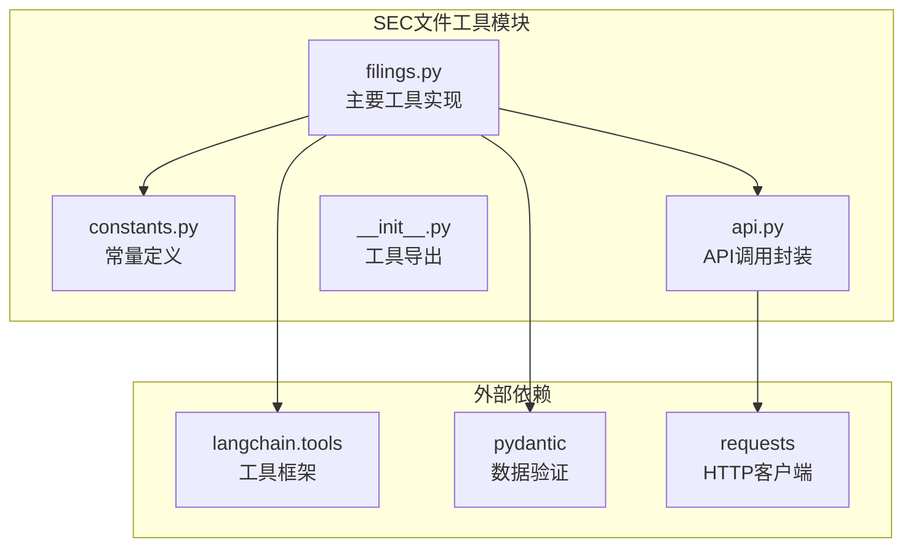

**图表来源**
- [filings.py](file://src/dexter/tools/filings.py#L1-L20)
- [constants.py](file://src/dexter/tools/constants.py#L1-L10)
- [api.py](file://src/dexter/tools/api.py#L1-L20)

**节来源**
- [filings.py](file://src/dexter/tools/filings.py#L1-L204)
- [constants.py](file://src/dexter/tools/constants.py#L1-L104)
- [api.py](file://src/dexter/tools/api.py#L1-L20)

## 核心组件

### 四类文件工具分类

SEC文件工具模块包含以下四类核心工具：

1. **元数据检索工具** (`get_filings`)
   - 检索SEC文件的基本信息
   - 返回访问号、文件类型和文档URL
   - 不包含实际文本内容

2. **10-K年度报告工具** (`get_10K_filing_items`)
   - 提取10-K文件的具体章节内容
   - 支持按年份和特定章节过滤
   - 包含业务描述、风险因素等关键信息

3. **10-Q季度报告工具** (`get_10Q_filing_items`)
   - 提取10-Q文件的具体章节内容
   - 支持按年份、季度和章节过滤
   - 包含财务报表和管理层讨论分析

4. **8-K当前报告工具** (`get_8K_filing_items`)
   - 提取8-K文件的具体事件报告
   - 需要从元数据工具获取访问号
   - 处理重大事件披露信息

### 统一API端点设计

所有文件内容工具共享相同的API端点`/filings/items/`，通过`filing_type`参数区分请求类型：

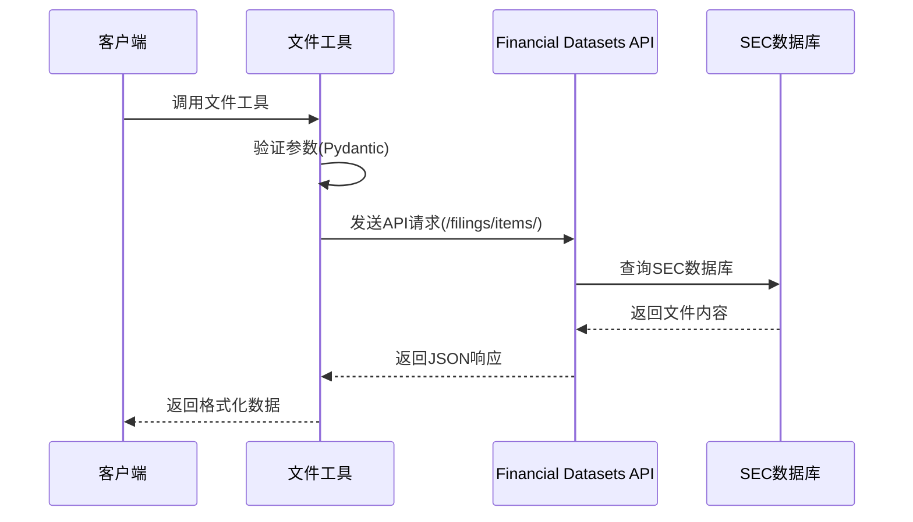

**图表来源**
- [filings.py](file://src/dexter/tools/filings.py#L27-L54)
- [api.py](file://src/dexter/tools/api.py#L10-L19)

**节来源**
- [filings.py](file://src/dexter/tools/filings.py#L27-L204)

## 架构概览

SEC文件工具模块采用分层架构设计，确保了良好的可维护性和扩展性：

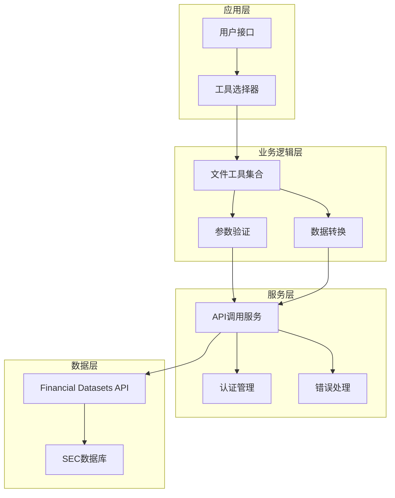

**图表来源**
- [filings.py](file://src/dexter/tools/filings.py#L1-L20)
- [api.py](file://src/dexter/tools/api.py#L1-L20)

## 详细组件分析

### 元数据检索工具 - get_filings

#### 功能描述
`get_filings`工具专门用于检索SEC文件的元数据信息，是其他文件内容工具的基础。

#### 输入参数模型

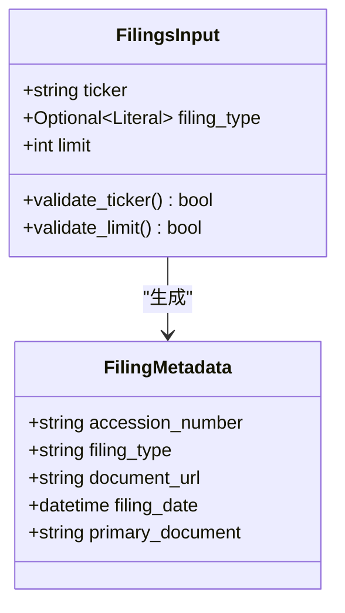

**图表来源**
- [filings.py](file://src/dexter/tools/filings.py#L12-L26)

#### 参数详解

| 参数名 | 类型 | 必需 | 描述 |
|--------|------|------|------|
| `ticker` | string | 是 | 公司股票代码，例如"AAPL"代表苹果公司 |
| `filing_type` | Optional[Literal["10-K", "10-Q", "8-K"]] | 否 | 文件类型过滤器，必需时指定具体类型 |
| `limit` | int | 否 | 最大返回文件数量，默认为10 |

#### 使用场景
- 查找特定公司的最新文件
- 按文件类型筛选历史记录
- 获取最近N个文件的访问信息

**节来源**
- [filings.py](file://src/dexter/tools/filings.py#L27-L54)

### 10-K年度报告工具 - get_10K_filing_items

#### 功能描述
专门提取10-K年度报告的具体章节内容，支持按年份和特定章节过滤。

#### 输入参数模型

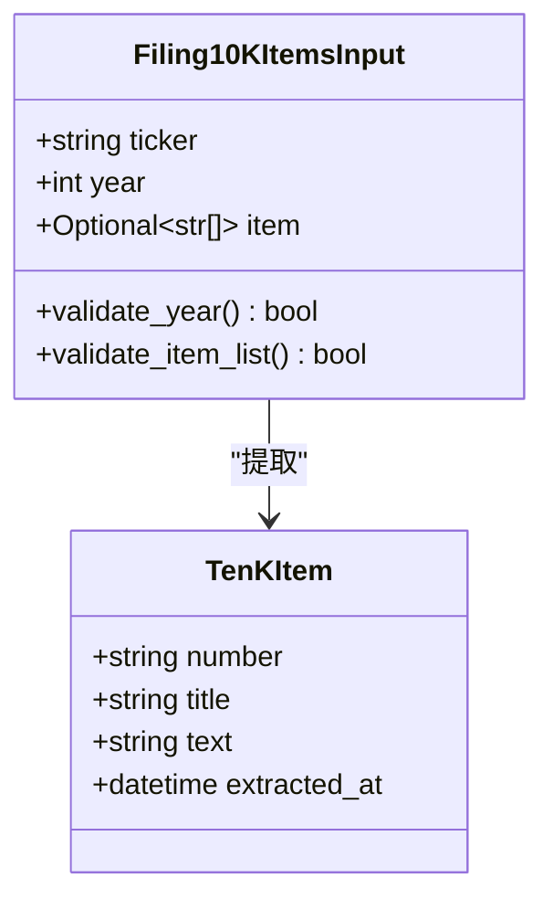

**图表来源**
- [filings.py](file://src/dexter/tools/filings.py#L56-L66)

#### 支持的10-K章节

| 章节编号 | 标题 | 描述 |
|----------|------|------|
| Item-1 | Business | 公司业务概述 |
| Item-1A | Risk Factors | 风险因素分析 |
| Item-1B | Unresolved Staff Comments | 未解决的工作人员评论 |
| Item-2 | Properties | 财产信息 |
| Item-3 | Legal Proceedings | 法律诉讼 |
| Item-7 | MD&A | 管理层讨论与分析 |
| Item-8 | Financial Statements | 财务报表 |
| Item-9A | Controls and Procedures | 控制程序 |
| Item-10 | Directors | 董事信息 |
| Item-11 | Executive Compensation | 执行官薪酬 |
| Item-14 | Accounting Fees | 会计费用 |

#### 示例用法
```python
# 提取特定年份的所有10-K章节
result = get_10K_filing_items(ticker="AAPL", year=2023)

# 只提取风险因素章节
result = get_10K_filing_items(ticker="AAPL", year=2023, item=["Item-1A"])
```

**节来源**
- [filings.py](file://src/dexter/tools/filings.py#L57-L104)
- [constants.py](file://src/dexter/tools/constants.py#L12-L33)

### 10-Q季度报告工具 - get_10Q_filing_items

#### 功能描述
专门提取10-Q季度报告的具体章节内容，支持按年份、季度和章节过滤。

#### 输入参数模型

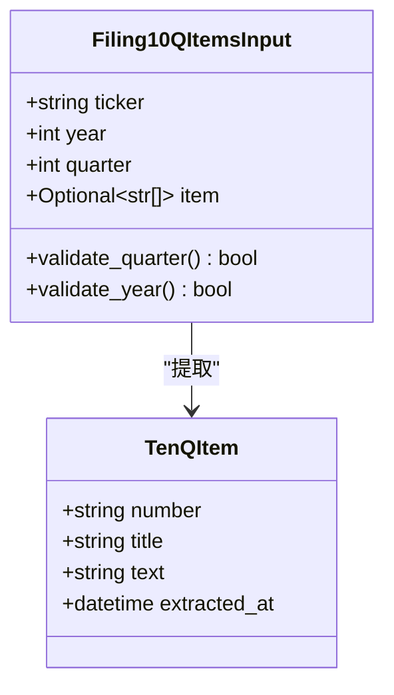

**图表来源**
- [filings.py](file://src/dexter/tools/filings.py#L89-L99)

#### 支持的10-Q章节

| 章节编号 | 标题 | 描述 |
|----------|------|------|
| Item-1 | Financial Statements | 财务报表 |
| Item-2 | MD&A | 管理层讨论与分析 |
| Item-3 | Market Risk | 市场风险披露 |
| Item-4 | Controls and Procedures | 控制程序 |

#### 季度参数说明
- 第一季度：`quarter=1`（1月-3月）
- 第二季度：`quarter=2`（4月-6月）
- 第三季度：`quarter=3`（7月-9月）
- 第四季度：`quarter=4`（10月-12月）

**节来源**
- [filings.py](file://src/dexter/tools/filings.py#L107-L147)
- [constants.py](file://src/dexter/tools/constants.py#L35-L40)

### 8-K当前报告工具 - get_8K_filing_items

#### 功能描述
专门提取8-K当前报告的具体事件报告，需要从`get_filings`工具获取访问号。

#### 输入参数模型

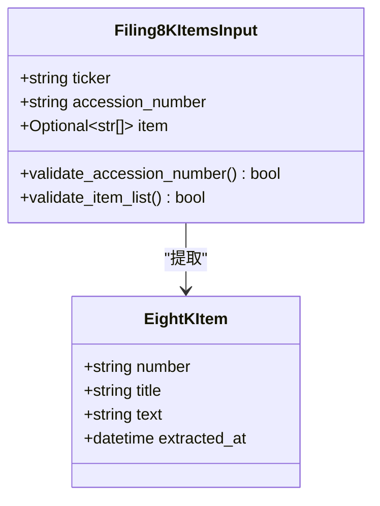

**图表来源**
- [filings.py](file://src/dexter/tools/filings.py#L150-L158)

#### 支持的8-K事件类型

| 事件编号 | 标题 | 描述 |
|----------|------|------|
| Item-1.01 | Material Agreement | 重大协议签订 |
| Item-2.02 | Financial Results | 财务结果 |
| Item-5.02 | Management Changes | 管理层变动 |
| Item-8.01 | Other Events | 其他事件 |

#### 端到端使用流程

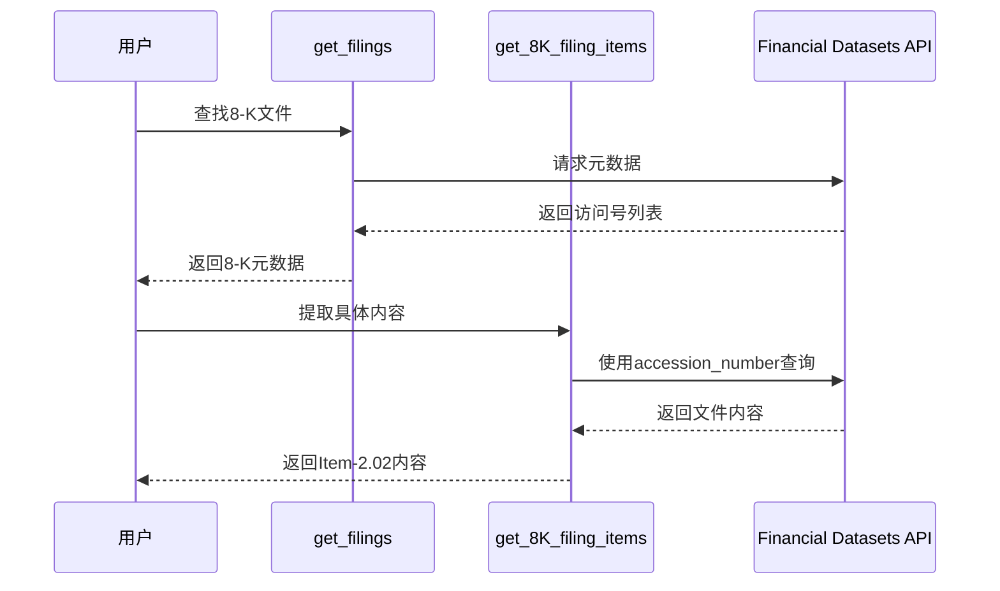

**图表来源**
- [filings.py](file://src/dexter/tools/filings.py#L27-L54)
- [filings.py](file://src/dexter/tools/filings.py#L159-L201)

**节来源**
- [filings.py](file://src/dexter/tools/filings.py#L159-L201)
- [constants.py](file://src/dexter/tools/constants.py#L42-L78)

### Pydantic模型验证系统

所有工具都采用Pydantic模型进行严格的参数验证：

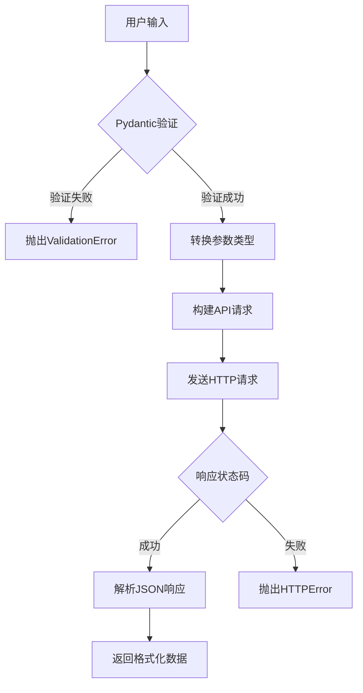

**图表来源**
- [filings.py](file://src/dexter/tools/filings.py#L12-L26)
- [api.py](file://src/dexter/tools/api.py#L10-L19)

**节来源**
- [filings.py](file://src/dexter/tools/filings.py#L12-L204)

## 依赖关系分析

SEC文件工具模块的依赖关系体现了清晰的分层架构：

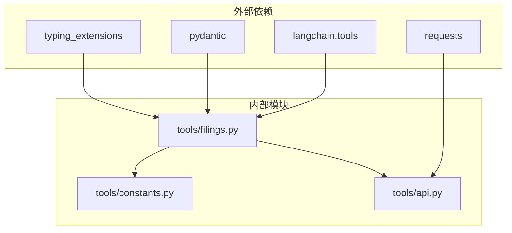

**图表来源**
- [filings.py](file://src/dexter/tools/filings.py#L1-L10)
- [api.py](file://src/dexter/tools/api.py#L1-L5)

### 关键依赖说明

1. **langchain.tools.tool装饰器**
   - 提供工具注册和调用机制
   - 自动处理参数序列化和反序列化

2. **pydantic.BaseModel**
   - 实现严格的参数验证
   - 自动生成工具参数文档

3. **requests库**
   - 封装HTTP请求逻辑
   - 处理API认证和错误响应

4. **自定义常量模块**
   - 定义SEC文件章节映射
   - 提供格式化辅助函数

**节来源**
- [filings.py](file://src/dexter/tools/filings.py#L1-L10)
- [api.py](file://src/dexter/tools/api.py#L1-L20)

## 性能考虑

### API调用优化策略

1. **批量请求处理**
   - 单次API调用获取多个文件的元数据
   - 减少网络往返次数

2. **参数验证缓存**
   - Pydantic模型自动缓存验证结果
   - 避免重复的参数检查开销

3. **响应数据预处理**
   - 自动解析JSON响应
   - 提取所需字段，减少内存占用

### 错误处理机制

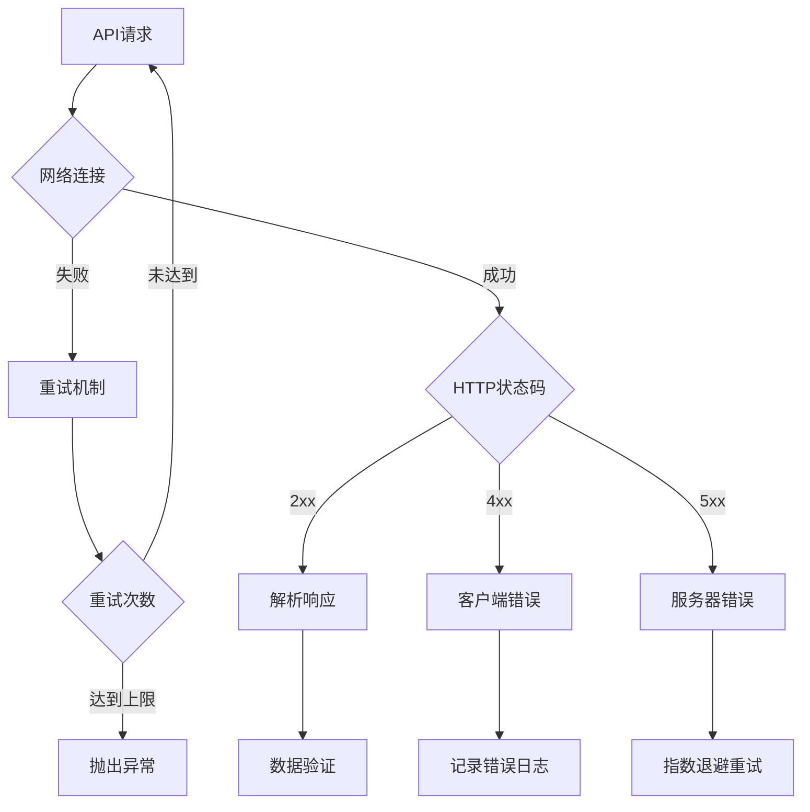

**图表来源**
- [api.py](file://src/dexter/tools/api.py#L10-L19)

## 故障排除指南

### 常见问题及解决方案

#### 1. API密钥配置问题
**症状**: `FINANCIAL_DATASETS_API_KEY`未设置或无效
**解决方案**: 
- 检查环境变量配置
- 确认API密钥有效性
- 验证网络连接

#### 2. 参数验证失败
**症状**: Pydantic验证错误
**解决方案**:
- 检查参数类型是否正确
- 验证必填参数是否提供
- 确认参数值在有效范围内

#### 3. 文件不存在或已删除
**症状**: API返回空结果
**解决方案**:
- 验证公司股票代码
- 检查文件类型和时间范围
- 确认文件是否公开可用

#### 4. 访问号格式错误
**症状**: 8-K文件查询失败
**解决方案**:
- 使用`get_filings`工具获取正确的访问号
- 验证访问号格式（YYYY-MM-DD-NNNNNN）
- 确认访问号对应正确的文件类型

**节来源**
- [api.py](file://src/dexter/tools/api.py#L10-L19)
- [filings.py](file://src/dexter/tools/filings.py#L27-L54)

## 结论

Dexter的SEC文件工具模块提供了一个完整、可靠的SEC文件检索和分析解决方案。通过四个专门的工具，用户可以：
- 便捷地检索公司SEC文件元数据
- 精确提取特定文件的章节内容
- 处理不同类型的SEC文件（10-K、10-Q、8-K）
- 利用统一的API端点和参数验证系统

该模块的设计充分考虑了金融研究的需求，提供了灵活的查询选项和严格的数据验证，确保了结果的准确性和可靠性。通过合理的错误处理和性能优化，该工具能够满足专业金融分析的各种需求。