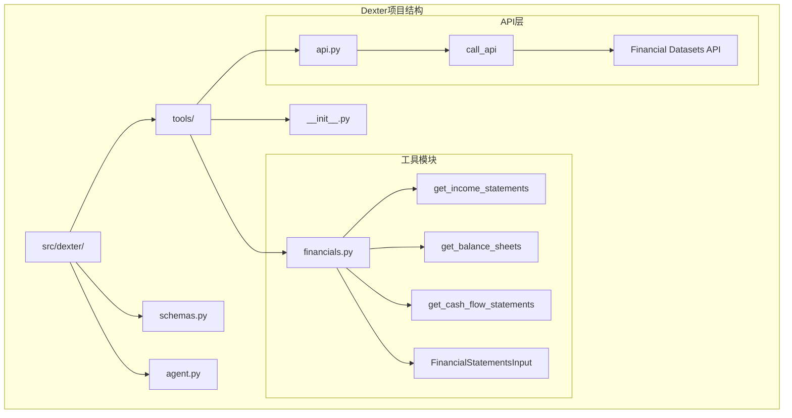
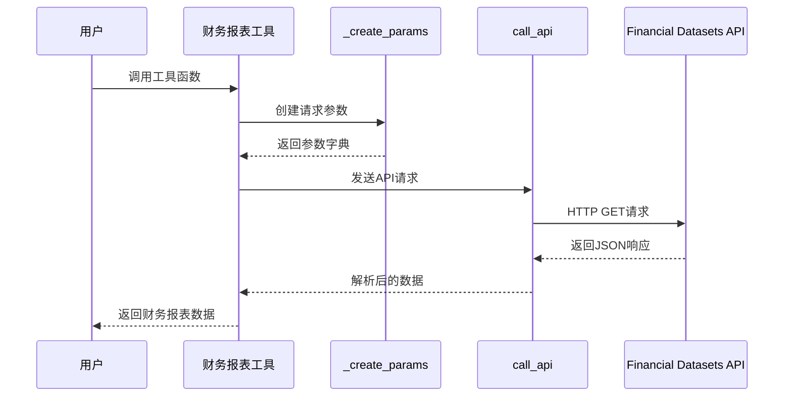
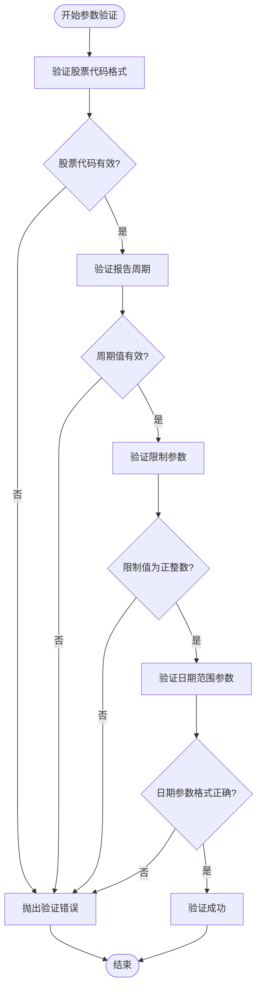
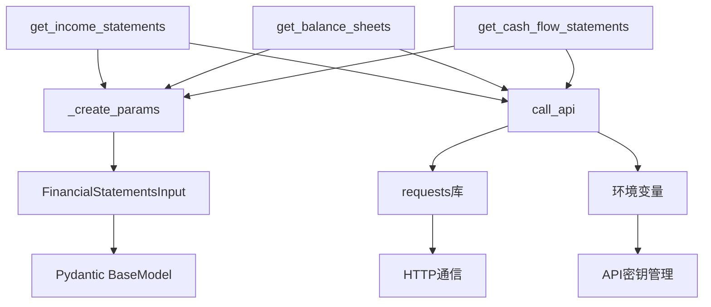

# 财务报表工具

<cite>
**本文档中引用的文件**
- [financials.py](file://src/dexter/tools/financials.py)
- [api.py](file://src/dexter/tools/api.py)
- [schemas.py](file://src/dexter/schemas.py)
- [__init__.py](file://src/dexter/tools/__init__.py)
- [README.md](file://README.md)
</cite>

## 目录
1. [简介](#简介)
2. [项目结构](#项目结构)
3. [核心组件](#核心组件)
4. [架构概览](#架构概览)
5. [详细组件分析](#详细组件分析)
6. [依赖关系分析](#依赖关系分析)
7. [性能考虑](#性能考虑)
8. [故障排除指南](#故障排除指南)
9. [结论](#结论)

## 简介

Dexter财务报表工具是一套专门设计用于获取和分析公司财务报表的API集合。该工具集包含三个核心功能：利润表（Income Statements）、资产负债表（Balance Sheets）和现金流量表（Cash Flow Statements）。这些工具通过统一的接口为金融研究代理提供实时的财务数据访问能力，支持按年度、季度和TTM（Trailing Twelve Months）周期进行数据查询。

财务报表工具的主要目标是为Dexter代理提供结构化的财务数据分析能力，帮助用户评估公司的盈利能力、财务状况和现金流状况。通过集成Financial Datasets API，这些工具能够提供高质量、准确的财务数据，支持复杂的财务分析任务。

## 项目结构

财务报表工具位于Dexter项目的工具模块中，采用模块化设计，便于维护和扩展。

**图表来源**
- [financials.py](file://src/dexter/tools/financials.py#L1-L98)
- [api.py](file://src/dexter/tools/api.py#L1-L20)
- [__init__.py](file://src/dexter/tools/__init__.py#L1-L19)

**章节来源**
- [financials.py](file://src/dexter/tools/financials.py#L1-L98)
- [__init__.py](file://src/dexter/tools/__init__.py#L1-L19)

## 核心组件

财务报表工具的核心由以下关键组件构成：

### FinancialStatementsInput 模型
这是所有财务报表工具共享的输入参数模型，定义了查询财务报表所需的所有参数。

### 辅助函数 _create_params
负责将输入参数转换为API调用所需的格式。

### 主要工具函数
- `get_income_statements`: 获取利润表数据
- `get_balance_sheets`: 获取资产负债表数据  
- `get_cash_flow_statements`: 获取现金流量表数据

### API调用层
通过`call_api`函数与Financial Datasets API进行交互。

**章节来源**
- [financials.py](file://src/dexter/tools/financials.py#L10-L25)
- [financials.py](file://src/dexter/tools/financials.py#L27-L40)

## 架构概览

财务报表工具采用分层架构设计，确保了良好的可维护性和扩展性。

**图表来源**
- [financials.py](file://src/dexter/tools/financials.py#L42-L98)
- [api.py](file://src/dexter/tools/api.py#L9-L19)

## 详细组件分析

### FinancialStatementsInput 模型详解

FinancialStatementsInput 是一个基于Pydantic的模型，提供了严格的参数验证和清晰的文档说明。

#### 核心字段说明

| 字段名 | 类型 | 必需 | 默认值 | 描述 |
|--------|------|------|--------|------|
| ticker | str | 是 | - | 股票代码，例如 'AAPL' 表示苹果公司 |
| period | Literal["annual", "quarterly", "ttm"] | 是 | - | 报告周期：annual（年度）、quarterly（季度）、ttm（过去12个月） |
| limit | int | 否 | 10 | 返回的财务报表数量限制 |
| report_period_gt | Optional[str] | 否 | None | 大于指定报告期的筛选条件 |
| report_period_gte | Optional[str] | 否 | None | 大于等于指定报告期的筛选条件 |
| report_period_lt | Optional[str] | 否 | None | 小于指定报告期的筛选条件 |
| report_period_lte | Optional[str] | 否 | None | 小于等于指定报告期的筛选条件 |

#### 参数验证规则

**图表来源**
- [financials.py](file://src/dexter/tools/financials.py#L10-L25)

### _create_params 辅助函数

_create_params 函数是一个内部辅助函数，负责将输入参数转换为API调用所需的格式。

#### 功能特性
- **动态参数构建**: 根据提供的参数动态创建请求字典
- **条件参数添加**: 只有当参数不为None时才添加到请求中
- **参数标准化**: 确保所有参数都符合API要求的格式

#### 使用示例路径
- [financials.py](file://src/dexter/tools/financials.py#L27-L40)

### 主要工具函数分析

#### get_income_statements 函数

该函数专门用于获取公司的利润表数据，包括收入、支出、净利润等关键财务指标。

**主要功能**:
- 获取公司的收入、成本、费用和净利润数据
- 支持按年度、季度和TTM周期查询
- 提供时间范围过滤功能
- 返回结构化的收入报表数据

**应用场景**:
- 评估公司盈利能力
- 分析收入增长趋势
- 计算毛利率和净利率
- 对比不同期间的经营效率

#### get_balance_sheets 函数

该函数用于获取公司的资产负债表数据，提供公司在特定时点的财务状况快照。

**主要功能**:
- 获取资产、负债和股东权益数据
- 支持流动性比率计算
- 提供财务杠杆分析基础
- 支持资产负债率等关键指标计算

**应用场景**:
- 评估公司财务稳定性
- 分析资产结构和负债水平
- 计算流动比率和速动比率
- 评估偿债能力和资本结构

#### get_cash_flow_statements 函数

该函数获取公司的现金流量表数据，展示公司现金的产生和使用情况。

**主要功能**:
- 获取经营活动、投资活动和融资活动的现金流
- 支持自由现金流计算
- 提供现金流质量分析
- 支持现金流趋势分析

**应用场景**:
- 评估公司现金流健康状况
- 分析现金生成能力
- 评估投资和筹资活动的影响
- 预测未来现金流状况

**章节来源**
- [financials.py](file://src/dexter/tools/financials.py#L42-L98)

### call_api 函数分析

call_api 函数是整个工具链的底层API调用层，负责与Financial Datasets API的实际通信。

#### 核心功能
- **API密钥管理**: 从环境变量读取API密钥
- **请求构建**: 构建完整的API请求URL和头部信息
- **HTTP通信**: 执行GET请求并与API服务器通信
- **错误处理**: 处理API响应状态码和异常情况

#### 安全特性
- **环境变量配置**: API密钥存储在环境变量中，避免硬编码
- **请求头设置**: 正确设置API密钥认证头部
- **响应验证**: 使用`raise_for_status()`确保请求成功

**章节来源**
- [api.py](file://src/dexter/tools/api.py#L9-L19)

## 依赖关系分析

财务报表工具的依赖关系相对简单，但设计合理，便于维护和扩展。

**图表来源**
- [financials.py](file://src/dexter/tools/financials.py#L1-L10)
- [api.py](file://src/dexter/tools/api.py#L1-L5)

### 外部依赖

| 依赖项 | 版本要求 | 用途 |
|--------|----------|------|
| requests | 最新稳定版 | HTTP客户端，用于API通信 |
| pydantic | 最新稳定版 | 数据验证和序列化 |
| typing | 内置 | 类型提示支持 |

### 内部模块依赖

- **financials.py**: 包含所有财务报表工具函数
- **api.py**: 提供API调用基础设施
- **schemas.py**: 定义通用数据模型（虽然当前未直接使用）

**章节来源**
- [financials.py](file://src/dexter/tools/financials.py#L1-L10)
- [api.py](file://src/dexter/tools/api.py#L1-L5)

## 性能考虑

### 查询优化策略

1. **参数限制**: 通过`limit`参数控制返回数据量，避免过大数据传输
2. **条件筛选**: 使用时间范围参数精确过滤数据，减少不必要的网络传输
3. **缓存友好**: 支持重复查询相同数据，提高效率

### 内存使用优化

- **流式处理**: API响应直接解析为Python字典，避免中间对象创建
- **按需加载**: 只获取需要的财务报表类型，减少内存占用

### 网络性能

- **连接复用**: 使用requests库的连接池功能
- **超时控制**: 可配置的请求超时机制
- **重试机制**: 基础的错误恢复能力

## 故障排除指南

### 常见错误类型

#### 1. API密钥问题
**症状**: `requests.exceptions.HTTPError: 401 Client Error`
**解决方案**: 
- 检查环境变量`FINANCIAL_DATASETS_API_KEY`是否正确设置
- 验证API密钥的有效性
- 确认账户有足够的API配额

#### 2. 股票代码无效
**症状**: `ValidationError` 或空结果
**解决方案**:
- 确认股票代码格式正确（大写字母）
- 验证股票代码是否存在于Financial Datasets数据库中
- 检查是否有拼写错误

#### 3. 参数验证错误
**症状**: Pydantic验证错误
**解决方案**:
- 检查`period`参数是否为有效值（annual/quaterly/ttm）
- 确认`limit`参数为正整数
- 验证日期字符串格式（YYYY-MM-DD）

#### 4. 网络连接问题
**症状**: `requests.exceptions.ConnectionError`
**解决方案**:
- 检查网络连接状态
- 验证防火墙设置
- 确认Financial Datasets API服务可用性

### 调试技巧

1. **启用详细日志**: 在调试模式下查看完整的API请求和响应
2. **参数验证**: 使用Pydantic模型的内置验证功能
3. **分步测试**: 先测试基本查询，再添加复杂参数
4. **错误捕获**: 实现适当的异常处理逻辑

**章节来源**
- [api.py](file://src/dexter/tools/api.py#L15-L19)

## 结论

Dexter财务报表工具提供了一套完整、可靠的财务数据分析解决方案。通过统一的接口设计、严格的参数验证和灵活的查询选项，这些工具能够满足各种财务分析需求。

### 主要优势

1. **易用性**: 清晰的API设计和详细的参数说明
2. **可靠性**: 完善的错误处理和参数验证机制
3. **灵活性**: 支持多种查询条件和时间范围筛选
4. **集成性**: 与Dexter代理系统无缝集成

### 应用价值

这些工具在Dexter代理中发挥着关键作用：
- **盈利能力分析**: 通过利润表数据评估公司经营效率
- **财务状况评估**: 利用资产负债表分析公司财务健康度
- **现金流管理**: 通过现金流量表监控公司流动性状况
- **综合财务分析**: 结合多种报表进行全面的财务诊断

### 未来发展

- **扩展支持**: 可以添加更多财务指标计算功能
- **性能优化**: 进一步优化查询速度和内存使用
- **功能增强**: 添加更复杂的时间序列分析功能
- **可视化集成**: 提供图表生成功能支持直观的数据展示

财务报表工具作为Dexter金融研究代理的重要组成部分，为用户提供了专业级的财务数据分析能力，是现代金融研究不可或缺的工具。