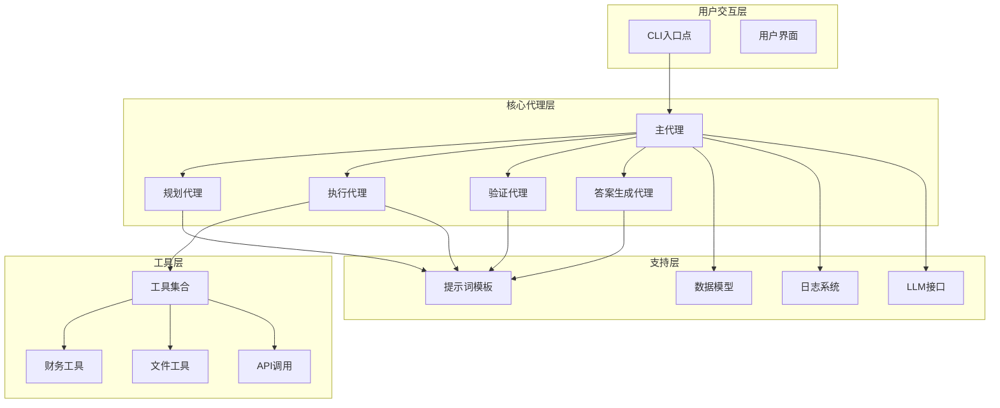

# 开发者指南

<cite>
**本文档引用的文件**
- [src/dexter/__init__.py](file://src/dexter/__init__.py)
- [src/dexter/tools/__init__.py](file://src/dexter/tools/__init__.py)
- [src/dexter/prompts.py](file://src/dexter/prompts.py)
- [src/dexter/utils/logger.py](file://src/dexter/utils/logger.py)
- [src/dexter/agent.py](file://src/dexter/agent.py)
- [src/dexter/tools/financials.py](file://src/dexter/tools/financials.py)
- [src/dexter/tools/filings.py](file://src/dexter/tools/filings.py)
- [src/dexter/utils/ui.py](file://src/dexter/utils/ui.py)
- [src/dexter/schemas.py](file://src/dexter/schemas.py)
- [src/dexter/tools/api.py](file://src/dexter/tools/api.py)
- [src/dexter/model.py](file://src/dexter/model.py)
- [README.md](file://README.md)
</cite>

## 目录
1. [简介](#简介)
2. [项目架构概览](#项目架构概览)
3. [添加新工具指南](#添加新工具指南)
4. [修改提示词指南](#修改提示词指南)
5. [调试技巧](#调试技巧)
6. [测试新工具](#测试新工具)
7. [最佳实践](#最佳实践)
8. [故障排除](#故障排除)

## 简介

Dexter是一个自主的金融研究代理，能够思考、规划并学习如何工作。它使用任务规划、自我反思和实时市场数据进行分析。本指南专为希望扩展Dexter功能的二次开发者设计，涵盖添加新工具、修改提示词、调试技巧和测试流程。

## 项目架构概览

Dexter采用多代理架构，包含以下核心组件：



**图表来源**
- [src/dexter/agent.py](file://src/dexter/agent.py#L1-L253)
- [src/dexter/tools/__init__.py](file://src/dexter/tools/__init__.py#L1-L19)
- [src/dexter/prompts.py](file://src/dexter/prompts.py#L1-L103)

**章节来源**
- [src/dexter/agent.py](file://src/dexter/agent.py#L1-L50)
- [src/dexter/tools/__init__.py](file://src/dexter/tools/__init__.py#L1-L19)

## 添加新工具指南

### 工具开发步骤

#### 1. 创建工具文件

在`src/dexter/tools/`目录下创建新的Python文件，例如`custom_tool.py`。

#### 2. 定义输入参数模型

使用Pydantic BaseModel定义工具的输入参数：

```python
from pydantic import BaseModel, Field
from typing import Optional

class CustomToolInput(BaseModel):
    """自定义工具的输入参数模型"""
    ticker: str = Field(description="股票代码，例如 'AAPL' 对苹果公司")
    period: Optional[str] = Field(default="annual", description="报告期类型：annual 或 quarterly")
    limit: int = Field(default=5, description="要检索的数据条目数量")
```

#### 3. 实现工具函数

使用`@tool`装饰器定义工具函数：

```python
from langchain.tools import tool
from dexter.tools.api import call_api

@tool(args_schema=CustomToolInput)
def custom_financial_analysis(
    ticker: str,
    period: str = "annual",
    limit: int = 5
) -> dict:
    """
    执行自定义的财务分析。
    
    参数:
        ticker: 股票代码
        period: 报告期类型
        limit: 数据条目限制
        
    返回:
        包含分析结果的字典
    """
    params = {
        "ticker": ticker,
        "period": period,
        "limit": limit
    }
    
    # 调用API获取数据
    data = call_api("/custom/analysis/", params)
    return data.get("results", {})
```

#### 4. 注册工具到系统

在`src/dexter/tools/__init__.py`中添加工具：

```python
from typing_extensions import Callable
from dexter.tools.custom_tool import custom_financial_analysis

TOOLS: list[Callable[..., any]] = [
    # 现有工具...
    custom_financial_analysis,  # 新增工具
]
```

#### 5. 验证工具接口

确保工具符合以下要求：
- 使用`@tool`装饰器
- 提供`args_schema`参数
- 继承`BaseTool`接口
- 在`TOOLS`列表中注册

**章节来源**
- [src/dexter/tools/__init__.py](file://src/dexter/tools/__init__.py#L1-L19)
- [src/dexter/tools/financials.py](file://src/dexter/tools/financials.py#L1-L98)
- [src/dexter/tools/filings.py](file://src/dexter/tools/filings.py#L1-L204)

### 工具开发最佳实践

#### 输入参数验证
- 使用Pydantic模型进行参数验证
- 提供清晰的参数描述
- 设置合理的默认值

#### 错误处理
- 实现适当的异常处理
- 提供有意义的错误消息
- 记录详细的错误信息

#### 性能优化
- 实现参数过滤以减少数据量
- 使用适当的缓存策略
- 优化API调用频率

## 修改提示词指南

### 提示词位置

Dexter的关键提示词定义在`src/dexter/prompts.py`中：

| 提示词名称 | 用途 | 影响范围 |
|-----------|------|----------|
| `DEFAULT_SYSTEM_PROMPT` | 默认系统提示 | 基础对话行为 |
| `PLANNING_SYSTEM_PROMPT` | 任务规划提示 | 任务分解逻辑 |
| `ACTION_SYSTEM_PROMPT` | 动作选择提示 | 工具选择决策 |
| `VALIDATION_SYSTEM_PROMPT` | 验证提示 | 任务完成判断 |
| `TOOL_ARGS_SYSTEM_PROMPT` | 参数优化提示 | 工具参数调优 |
| `ANSWER_SYSTEM_PROMPT` | 答案生成提示 | 最终回答格式 |

### 修改提示词的步骤

#### 1. 备份原始提示词

在修改前备份原始提示词内容。

#### 2. 分析当前行为

使用调试功能观察当前Agent的行为模式。

#### 3. 修改提示词

编辑`prompts.py`中的相应提示词。例如：

```python
# 修改PLANNING_SYSTEM_PROMPT以增强特定领域的规划能力
PLANNING_SYSTEM_PROMPT = """你是一个专门的财务研究规划专家。你的责任是分析用户的财务研究查询，
并将其分解为清晰、逻辑性的可操作任务序列。每个任务应该代表研究过程中的一个独立步骤...

# 警告：不当修改可能导致的稳定性问题
- 过于宽泛的提示可能导致Agent产生不相关或无效的任务
- 过于严格的提示可能限制Agent的创造性思维
- 修改系统级提示词可能影响整个Agent的行为模式
- 不同提示词之间可能存在依赖关系
```

#### 4. 测试修改效果

使用小规模测试验证修改后的效果。

**章节来源**
- [src/dexter/prompts.py](file://src/dexter/prompts.py#L1-L103)

### 提示词修改注意事项

#### 系统稳定性风险
- **全局影响**：修改系统提示词会影响所有组件的行为
- **依赖关系**：不同提示词之间存在相互依赖
- **行为一致性**：保持Agent行为的一致性和可预测性

#### 推荐修改方式
- 使用版本控制管理提示词变更
- 进行充分的测试验证
- 保持向后兼容性

## 调试技巧

### 日志系统

Dexter提供了完整的日志系统用于调试：

#### 使用Logger类

```python
from dexter.utils.logger import Logger

logger = Logger()

# 记录不同类型的消息
logger.log_header("调试信息")
logger.log_user_query("用户查询")
logger.log_task_list(tasks)
logger.log_task_start("开始任务")
logger.log_task_done("任务完成")
logger.log_tool_run("工具名称", "结果摘要")
logger.log_summary("最终总结")
```

#### 进度监控

使用`show_progress`装饰器监控函数执行：

```python
from dexter.utils.ui import show_progress

@show_progress("正在执行...", "执行完成")
def my_debug_function():
    # 函数逻辑
    pass
```

### 调试配置

#### 启用详细日志

```python
# 在agent初始化时启用详细日志
agent = Agent(max_steps=20, max_steps_per_task=5)
```

#### 异常处理

```python
try:
    # 可能出错的代码
    result = agent.run("复杂查询")
except Exception as e:
    logger._log(f"调试错误: {e}")
    # 记录堆栈跟踪
    import traceback
    logger._log(traceback.format_exc())
```

**章节来源**
- [src/dexter/utils/logger.py](file://src/dexter/utils/logger.py#L1-L43)
- [src/dexter/utils/ui.py](file://src/dexter/utils/ui.py#L1-L191)

### 调试工具使用

#### 实时进度显示
- 使用彩色终端输出
- 显示执行状态和进度
- 提供详细的错误信息

#### 任务跟踪
- 监控任务执行流程
- 记录工具调用历史
- 分析性能瓶颈

## 测试新工具

### 测试流程

#### 1. 单元测试

```python
import unittest
from dexter.tools.custom_tool import custom_financial_analysis
from dexter.tools.custom_tool import CustomToolInput

class TestCustomTool(unittest.TestCase):
    
    def test_tool_input_validation(self):
        # 测试输入参数验证
        input_data = CustomToolInput(ticker="AAPL", period="annual", limit=5)
        self.assertEqual(input_data.ticker, "AAPL")
    
    def test_tool_execution(self):
        # 测试工具执行
        result = custom_financial_analysis.run({
            "ticker": "AAPL",
            "period": "annual",
            "limit": 3
        })
        self.assertIsInstance(result, dict)
        self.assertIn("results", result)
```

#### 2. 集成测试

```python
def test_tool_integration():
    """测试工具与Agent系统的集成"""
    from dexter.agent import Agent
    
    agent = Agent(max_steps=10, max_steps_per_task=3)
    
    # 测试工具是否能被正确识别和调用
    query = "分析苹果公司的财务状况"
    result = agent.run(query)
    
    # 验证结果
    assert result is not None
    assert len(result) > 0
```

#### 3. 性能测试

```python
import time
import cProfile

def benchmark_tool_performance():
    """基准测试工具性能"""
    start_time = time.time()
    
    # 执行多次调用来获得平均性能
    for _ in range(10):
        custom_financial_analysis.run({
            "ticker": "AAPL",
            "period": "annual",
            "limit": 5
        })
    
    end_time = time.time()
    print(f"工具平均执行时间: {(end_time - start_time) / 10:.2f}秒")
```

### 测试环境配置

#### 模拟API响应

```python
from unittest.mock import patch

@patch('dexter.tools.api.call_api')
def test_tool_with_mock(mock_call_api):
    """使用模拟API测试工具"""
    # 设置模拟响应
    mock_call_api.return_value = {
        "results": {
            "revenue": 1000000,
            "profit": 200000,
            "growth_rate": 0.15
        }
    }
    
    # 执行测试
    result = custom_financial_analysis.run({"ticker": "AAPL"})
    
    # 验证结果
    assert result["revenue"] == 1000000
    mock_call_api.assert_called_once()
```

**章节来源**
- [src/dexter/agent.py](file://src/dexter/agent.py#L108-L147)
- [src/dexter/tools/api.py](file://src/dexter/tools/api.py#L1-L20)

## 最佳实践

### 工具开发规范

#### 1. 命名约定
- 工具函数使用描述性名称
- 输入模型类名以`Input`结尾
- 保持命名一致性

#### 2. 文档规范
- 为每个工具提供详细文档字符串
- 描述参数含义和预期格式
- 提供使用示例

#### 3. 错误处理
- 实现适当的异常处理
- 提供有意义的错误消息
- 记录详细的错误信息

### 系统集成原则

#### 1. 向后兼容性
- 保持现有工具接口不变
- 为新功能提供可选参数
- 提供迁移路径

#### 2. 性能考虑
- 优化API调用频率
- 实现适当的缓存机制
- 控制并发请求数量

#### 3. 安全性
- 验证所有输入参数
- 实现适当的访问控制
- 记录敏感操作

### 代码质量保证

#### 1. 代码审查
- 使用版本控制系统
- 实施同行评审
- 保持代码简洁性

#### 2. 测试覆盖率
- 编写全面的单元测试
- 进行集成测试
- 实施持续集成

## 故障排除

### 常见问题及解决方案

#### 1. 工具无法识别

**症状**: Agent无法找到新添加的工具

**解决方案**:
- 检查`TOOLS`列表中的导入语句
- 确认工具函数已正确装饰
- 验证模块导入路径

#### 2. 提示词修改导致行为异常

**症状**: Agent行为变得不可预测

**解决方案**:
- 回滚到之前的提示词版本
- 逐步修改提示词内容
- 进行充分的测试验证

#### 3. API调用失败

**症状**: 工具执行过程中出现网络错误

**解决方案**:
- 检查API密钥配置
- 验证网络连接
- 实现重试机制

#### 4. 内存泄漏

**症状**: 长时间运行后内存使用量持续增长

**解决方案**:
- 检查循环引用
- 实现资源清理
- 使用内存分析工具

### 调试工具清单

#### 1. 日志分析
- 检查`Logger`输出
- 分析错误堆栈跟踪
- 监控系统资源使用

#### 2. 性能分析
- 使用性能分析工具
- 监控函数执行时间
- 分析内存使用模式

#### 3. 网络诊断
- 检查API调用状态
- 验证网络连接
- 分析响应时间

**章节来源**
- [src/dexter/agent.py](file://src/dexter/agent.py#L197-L220)
- [src/dexter/model.py](file://src/dexter/model.py#L1-L46)

## 结论

本指南提供了Dexter系统的完整扩展开发框架。通过遵循这些最佳实践，开发者可以安全、有效地扩展现有功能，同时保持系统的稳定性和可靠性。记住，在进行任何重大修改之前都要进行充分的测试和验证。

对于更复杂的扩展需求，建议：
- 保持修改的原子性
- 使用版本控制管理变更
- 进行全面的回归测试
- 维护详细的文档记录