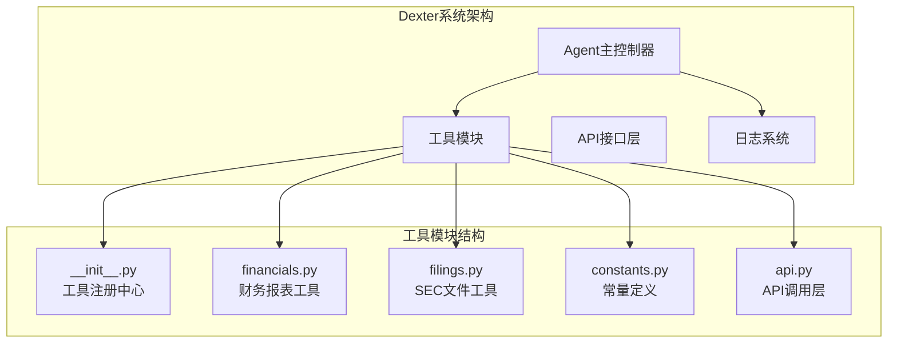
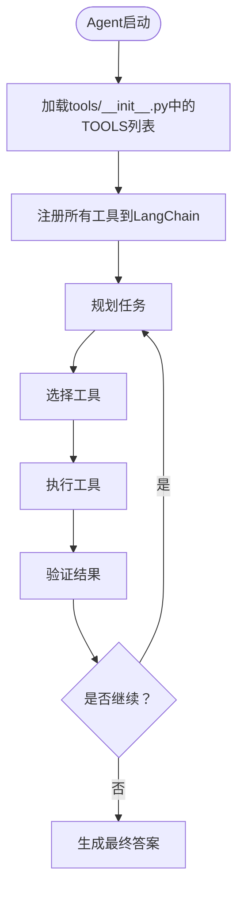
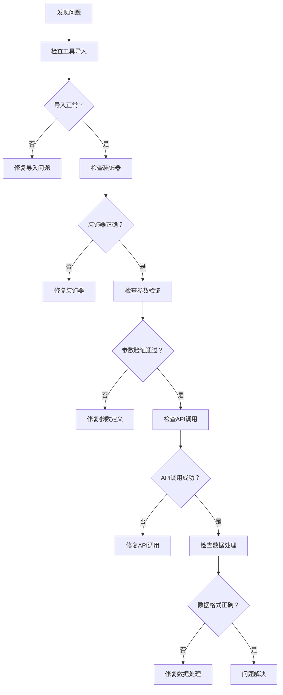

# 添加新工具

<cite>
**本文档中引用的文件**
- [src/dexter/tools/__init__.py](file://src/dexter/tools/__init__.py)
- [src/dexter/tools/api.py](file://src/dexter/tools/api.py)
- [src/dexter/tools/constants.py](file://src/dexter/tools/constants.py)
- [src/dexter/tools/financials.py](file://src/dexter/tools/financials.py)
- [src/dexter/tools/filings.py](file://src/dexter/tools/filings.py)
- [src/dexter/utils/logger.py](file://src/dexter/utils/logger.py)
- [src/dexter/agent.py](file://src/dexter/agent.py)
- [src/dexter/schemas.py](file://src/dexter/schemas.py)
- [src/dexter/prompts.py](file://src/dexter/prompts.py)
</cite>

## 目录
1. [简介](#简介)
2. [系统架构概述](#系统架构概述)
3. [工具开发规范](#工具开发规范)
4. [创建新工具的完整流程](#创建新工具的完整流程)
5. [具体示例：添加get_dividend_history工具](#具体示例添加get_dividend_history工具)
6. [工具注册与集成](#工具注册与集成)
7. [调试与验证](#调试与验证)
8. [最佳实践](#最佳实践)
9. [故障排除](#故障排除)

## 简介

Dexter是一个自主的金融研究代理系统，能够智能地规划、执行和验证复杂的金融研究任务。本指南将详细介绍如何向Dexter系统添加新的功能工具，包括工具开发规范、注册流程以及调试方法。

## 系统架构概述

Dexter采用多组件架构，其中工具系统是核心功能模块之一：



**图表来源**
- [src/dexter/agent.py](file://src/dexter/agent.py#L1-L50)
- [src/dexter/tools/__init__.py](file://src/dexter/tools/__init__.py#L1-L19)

**章节来源**
- [src/dexter/agent.py](file://src/dexter/agent.py#L1-L253)
- [src/dexter/tools/__init__.py](file://src/dexter/tools/__init__.py#L1-L19)

## 工具开发规范

### 必须遵循的规范

1. **LangChain兼容性**：所有工具必须使用`@tool`装饰器，并符合LangChain的`BaseTool`接口规范
2. **参数验证**：使用Pydantic的`BaseModel`定义参数结构，确保类型安全
3. **文档字符串**：每个工具函数必须有清晰的描述，说明用途和参数
4. **返回类型**：明确指定返回类型，便于LLM理解和处理
5. **错误处理**：实现适当的异常处理机制

### 基础模板结构

```python
from langchain.tools import tool
from typing import Optional, Literal
from pydantic import BaseModel, Field
from dexter.tools.api import call_api

class ToolInputSchema(BaseModel):
    """工具输入参数的Pydantic模型"""
    param1: str = Field(description="参数1的描述")
    param2: Optional[int] = Field(default=None, description="参数2的可选描述")

@tool(args_schema=ToolInputSchema)
def tool_function(param1: str, param2: Optional[int] = None) -> dict:
    """
    工具功能的详细描述。
    
    参数:
        param1 (str): 参数1的详细说明
        param2 (Optional[int]): 参数2的详细说明
        
    返回:
        dict: 工具执行结果
    """
    # 实现逻辑
    pass
```

**章节来源**
- [src/dexter/tools/financials.py](file://src/dexter/tools/financials.py#L1-L98)
- [src/dexter/tools/filings.py](file://src/dexter/tools/filings.py#L1-L204)

## 创建新工具的完整流程

### 步骤1：确定工具位置

根据功能特性选择合适的模块：
- **财务相关**：`src/dexter/tools/financials.py`
- **文件相关**：`src/dexter/tools/filings.py`
- **通用工具**：`src/dexter/tools/`下的新模块

### 步骤2：定义输入参数模型

使用Pydantic创建参数验证模型：

```python
class DividendHistoryInput(BaseModel):
    """获取股息历史记录的输入参数"""
    ticker: str = Field(description="股票代码，例如：'AAPL'表示苹果公司")
    start_date: Optional[str] = Field(default=None, description="开始日期，格式：YYYY-MM-DD")
    end_date: Optional[str] = Field(default=None, description="结束日期，格式：YYYY-MM-DD")
    limit: int = Field(default=10, description="最多返回的记录数量")
```

### 步骤3：实现工具函数

```python
@tool(args_schema=DividendHistoryInput)
def get_dividend_history(
    ticker: str,
    start_date: Optional[str] = None,
    end_date: Optional[str] = None,
    limit: int = 10
) -> dict:
    """
    获取公司的股息历史记录。
    
    这个工具用于查询特定公司的股息支付历史，包括支付日期、金额等信息。
    对于投资分析和收益计算非常有用。
    
    参数:
        ticker (str): 股票代码
        start_date (Optional[str]): 开始日期
        end_date (Optional[str]): 结束日期
        limit (int): 最大返回记录数
        
    返回:
        dict: 包含股息历史数据的字典
    """
    params = {
        "ticker": ticker.upper(),
        "limit": limit
    }
    
    if start_date:
        params["start_date"] = start_date
    if end_date:
        params["end_date"] = end_date
        
    try:
        data = call_api("/dividends/history/", params)
        return data.get("dividend_history", {})
    except Exception as e:
        logger.log_error(f"获取股息历史失败: {e}")
        return {"error": str(e)}
```

### 步骤4：添加到工具注册表

在`src/dexter/tools/__init__.py`中导入并注册工具：

```python
from typing_extensions import Callable
from dexter.tools.financials import get_income_statements
from dexter.tools.financials import get_balance_sheets
from dexter.tools.financials import get_cash_flow_statements
from dexter.tools.financials import get_dividend_history  # 新增导入
from dexter.tools.filings import get_filings
from dexter.tools.filings import get_10K_filing_items
from dexter.tools.filings import get_10Q_filing_items
from dexter.tools.filings import get_8K_filing_items

TOOLS: list[Callable[..., any]] = [
    get_income_statements,
    get_balance_sheets,
    get_cash_flow_statements,
    get_dividend_history,  # 新增工具
    get_10K_filing_items,
    get_10Q_filing_items,
    get_8K_filing_items,
    get_filings,
]
```

**章节来源**
- [src/dexter/tools/__init__.py](file://src/dexter/tools/__init__.py#L1-L19)
- [src/dexter/tools/financials.py](file://src/dexter/tools/financials.py#L40-L98)

## 具体示例：添加get_dividend_history工具

### 完整实现过程

以下是一个完整的`get_dividend_history`工具实现示例：

#### 1. 定义输入参数模型

```python
class DividendHistoryInput(BaseModel):
    """获取股息历史记录的输入参数"""
    ticker: str = Field(description="股票代码，例如：'AAPL'表示苹果公司")
    start_date: Optional[str] = Field(default=None, description="开始日期，格式：YYYY-MM-DD")
    end_date: Optional[str] = Field(default=None, description="结束日期，格式：YYYY-MM-DD")
    limit: int = Field(default=10, description="最多返回的记录数量")
```

#### 2. 实现工具函数

```python
@tool(args_schema=DividendHistoryInput)
def get_dividend_history(
    ticker: str,
    start_date: Optional[str] = None,
    end_date: Optional[str] = None,
    limit: int = 10
) -> dict:
    """
    获取公司的股息历史记录。
    
    这个工具用于查询特定公司的股息支付历史，包括支付日期、金额等信息。
    对于投资分析和收益计算非常有用。
    
    参数:
        ticker (str): 股票代码
        start_date (Optional[str]): 开始日期
        end_date (Optional[str]): 结束日期
        limit (int): 最大返回记录数
        
    返回:
        dict: 包含股息历史数据的字典
    """
    params = {
        "ticker": ticker.upper(),
        "limit": limit
    }
    
    if start_date:
        params["start_date"] = start_date
    if end_date:
        params["end_date"] = end_date
        
    try:
        data = call_api("/dividends/history/", params)
        return data.get("dividend_history", {})
    except Exception as e:
        logger.log_error(f"获取股息历史失败: {e}")
        return {"error": str(e)}
```

#### 3. API调用实现

```python
def call_api(endpoint: str, params: dict) -> dict:
    """调用Financial Datasets API的辅助函数"""
    base_url = "https://api.financialdatasets.ai"
    url = f"{base_url}{endpoint}"
    headers = {"x-api-key": financial_datasets_api_key}
    response = requests.get(url, params=params, headers=headers)
    response.raise_for_status()
    return response.json()
```

#### 4. 注册工具

```python
from dexter.tools.financials import get_dividend_history

TOOLS: list[Callable[..., any]] = [
    get_income_statements,
    get_balance_sheets,
    get_cash_flow_statements,
    get_dividend_history,  # 注册新工具
    get_10K_filing_items,
    get_10Q_filing_items,
    get_8K_filing_items,
    get_filings,
]
```

**章节来源**
- [src/dexter/tools/api.py](file://src/dexter/tools/api.py#L1-L20)
- [src/dexter/tools/financials.py](file://src/dexter/tools/financials.py#L40-L98)

## 工具注册与集成

### 全局工具列表管理

Dexter使用全局`TOOLS`列表来管理所有可用工具：



**图表来源**
- [src/dexter/agent.py](file://src/dexter/agent.py#L15-L30)
- [src/dexter/tools/__init__.py](file://src/dexter/tools/__init__.py#L10-L19)

### 工具发现机制

Agent通过以下方式发现和使用工具：

1. **工具描述收集**：从`TOOLS`列表中提取每个工具的名称和描述
2. **参数验证**：使用Pydantic模型验证工具参数
3. **执行控制**：通过装饰器控制工具执行流程

**章节来源**
- [src/dexter/agent.py](file://src/dexter/agent.py#L15-L30)
- [src/dexter/tools/__init__.py](file://src/dexter/tools/__init__.py#L10-L19)

## 调试与验证

### 使用日志系统

Dexter提供了专门的日志系统来跟踪工具执行：

```python
from dexter.utils.logger import Logger

# 初始化日志记录器
logger = Logger()

# 记录工具执行
logger.log_tool_run("get_dividend_history", result)
```

### 验证工具是否被Agent识别

1. **检查工具列表**：确认工具已正确添加到`TOOLS`列表
2. **测试工具签名**：验证工具的名称、描述和参数
3. **模拟Agent行为**：手动调用工具验证功能

### 调试技巧

```python
# 在工具函数中添加调试输出
def debug_info(func):
    def wrapper(*args, **kwargs):
        logger.log_header(f"调用工具: {func.__name__}")
        logger.log(f"参数: {args}, {kwargs}")
        result = func(*args, **kwargs)
        logger.log(f"结果: {result}")
        return result
    return wrapper

@debug_info
@tool(args_schema=DividendHistoryInput)
def get_dividend_history(ticker: str, ...) -> dict:
    # 工具实现
    pass
```

**章节来源**
- [src/dexter/utils/logger.py](file://src/dexter/utils/logger.py#L1-L43)
- [src/dexter/agent.py](file://src/dexter/agent.py#L100-L120)

## 最佳实践

### 1. 参数设计原则

- **最小必要参数**：只包含完成任务必需的参数
- **合理默认值**：为可选参数提供有意义的默认值
- **清晰描述**：使用准确的语言描述每个参数的含义

### 2. 错误处理策略

```python
try:
    # 主要业务逻辑
    data = call_api(endpoint, params)
    return process_data(data)
except requests.RequestException as e:
    # 处理网络请求错误
    return {"error": f"网络请求失败: {str(e)}"}
except ValueError as e:
    # 处理数据解析错误
    return {"error": f"数据格式错误: {str(e)}"}
except Exception as e:
    # 处理其他未知错误
    return {"error": f"未知错误: {str(e)}"}
```

### 3. 性能优化

- **限制返回数据量**：通过`limit`参数控制返回结果数量
- **添加过滤条件**：使用时间范围等参数缩小搜索范围
- **缓存机制**：对频繁查询的数据实施缓存策略

### 4. 文档完整性

每个工具都应包含：
- 清晰的功能描述
- 参数详细说明
- 返回值格式说明
- 使用示例
- 注意事项和限制

## 故障排除

### 常见问题及解决方案

#### 1. 工具未被Agent识别

**症状**：Agent无法看到新添加的工具

**解决方案**：
- 检查`TOOLS`列表是否包含新工具
- 确认工具函数已正确导入
- 验证装饰器语法是否正确

#### 2. 参数验证失败

**症状**：工具调用时出现参数验证错误

**解决方案**：
- 检查Pydantic模型定义
- 验证参数类型注解
- 确认默认值设置正确

#### 3. API调用失败

**症状**：工具执行过程中出现网络错误

**解决方案**：
- 检查API密钥配置
- 验证网络连接状态
- 查看API响应内容

#### 4. 数据格式不匹配

**症状**：返回的数据格式不符合预期

**解决方案**：
- 检查API响应结构
- 更新数据处理逻辑
- 添加数据验证步骤

### 调试流程图



**章节来源**
- [src/dexter/agent.py](file://src/dexter/agent.py#L180-L220)
- [src/dexter/tools/api.py](file://src/dexter/tools/api.py#L10-L20)

## 总结

通过本指南，您已经掌握了向Dexter系统添加新工具的完整流程：

1. **理解系统架构**：熟悉Dexter的多组件架构和工具系统设计
2. **遵循开发规范**：使用LangChain兼容的装饰器和Pydantic模型
3. **实现工具功能**：创建参数验证模型和业务逻辑实现
4. **注册工具**：将新工具添加到全局工具列表
5. **调试验证**：使用日志系统验证工具功能

记住，良好的工具设计应该注重用户体验、性能优化和错误处理。通过遵循这些最佳实践，您可以为Dexter系统贡献高质量的功能扩展。