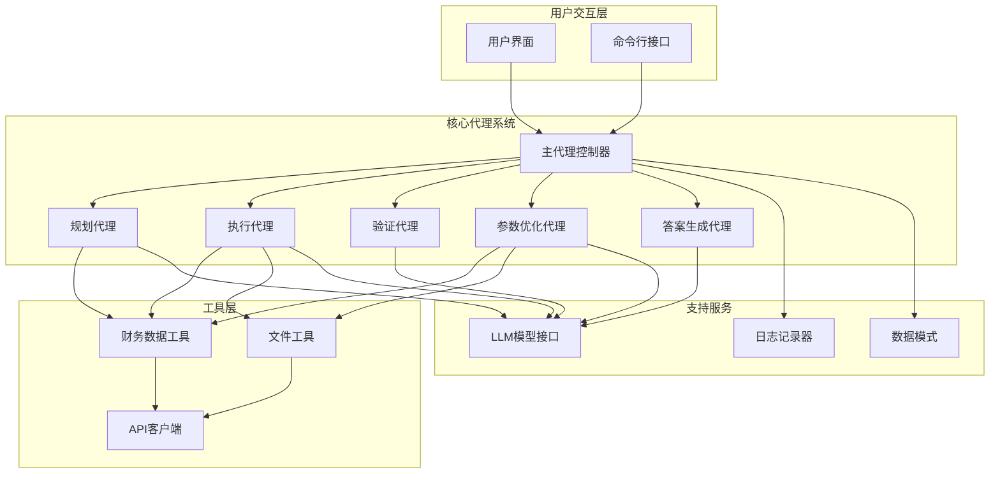
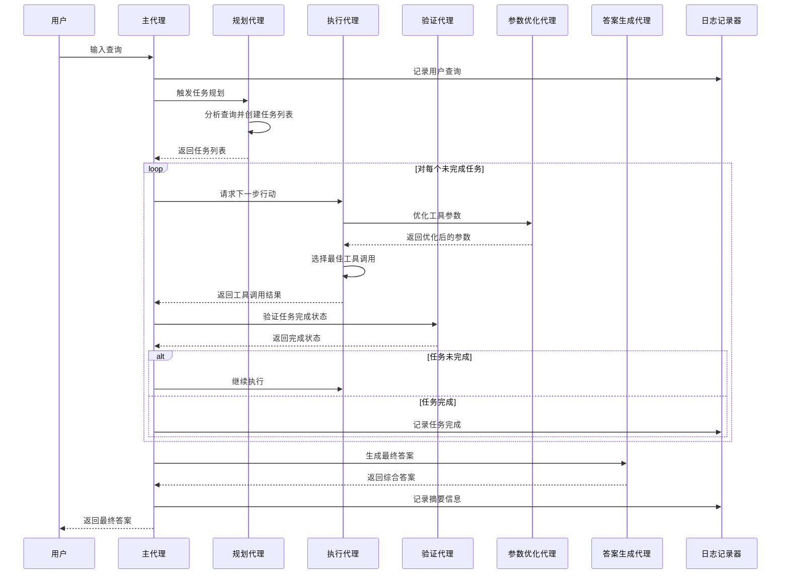
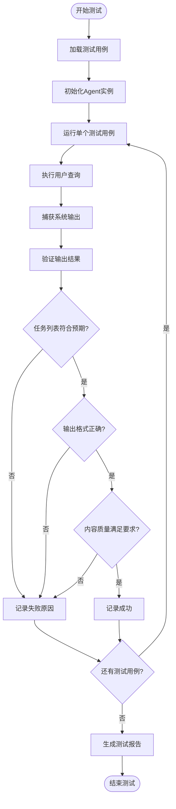
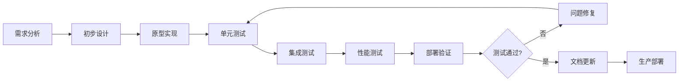

# 自定义提示词

<cite>
**本文档中引用的文件**
- [prompts.py](file://src/dexter/prompts.py)
- [agent.py](file://src/dexter/agent.py)
- [model.py](file://src/dexter/model.py)
- [schemas.py](file://src/dexter/schemas.py)
- [logger.py](file://src/dexter/utils/logger.py)
- [tools/__init__.py](file://src/dexter/tools/__init__.py)
- [financials.py](file://src/dexter/tools/financials.py)
- [filings.py](file://src/dexter/tools/filings.py)
- [README.md](file://README.md)
</cite>

## 目录
1. [简介](#简介)
2. [系统架构概述](#系统架构概述)
3. [核心提示词组件](#核心提示词组件)
4. [提示词在多代理决策链中的作用](#提示词在多代理决策链中的作用)
5. [提示词定制指南](#提示词定制指南)
6. [安全注意事项](#安全注意事项)
7. [测试与验证](#测试与验证)
8. [最佳实践](#最佳实践)
9. [故障排除](#故障排除)
10. [总结](#总结)

## 简介

Dexter是一个自主的金融研究代理系统，采用多代理架构设计，能够智能地分析复杂的金融问题并生成全面的数据驱动答案。该系统的核心在于其精心设计的提示词系统，这些提示词定义了六个关键组件的行为模式：规划、执行、验证、参数优化、答案生成和默认提示词。

本文档提供了关于如何修改和定制Dexter系统中各类提示词的深入指导，帮助开发者根据具体的业务需求调整系统行为，同时确保系统的稳定性和安全性。

## 系统架构概述

Dexter采用模块化的多代理架构，每个代理负责特定的功能领域：



**图表来源**
- [agent.py](file://src/dexter/agent.py#L1-L253)
- [prompts.py](file://src/dexter/prompts.py#L1-L103)

**章节来源**
- [agent.py](file://src/dexter/agent.py#L1-L50)
- [README.md](file://README.md#L70-L85)

## 核心提示词组件

Dexter系统包含六个核心提示词组件，每个都承担着特定的角色和职责：

### 1. 默认系统提示词 (DEFAULT_SYSTEM_PROMPT)

这是系统的基础提示词，定义了Dexter作为金融研究代理的基本身份和行为准则。

**主要特性：**
- 定义代理的专业身份
- 指导方法论和工作方式
- 强调准确性和全面性
- 建立与用户的沟通框架

### 2. 规划系统提示词 (PLANNING_SYSTEM_PROMPT)

负责将用户查询分解为可执行的任务序列。

**核心功能：**
- 分析用户查询的复杂性
- 创建逻辑清晰的任务列表
- 考虑可用工具的能力
- 处理超出范围的查询

### 3. 执行系统提示词 (ACTION_SYSTEM_PROMPT)

选择最适合当前任务的工具并确定执行策略。

**关键职责：**
- 分析任务描述
- 评估先前工具输出
- 选择最佳工具调用
- 避免不相关的工具使用

### 4. 验证系统提示词 (VALIDATION_SYSTEM_PROMPT)

评估任务是否已成功完成。

**验证标准：**
- 收集的信息是否充分
- 结果是否直接回答任务描述
- 数据的完整性和准确性
- 特定场景下的特殊处理规则

### 5. 工具参数系统提示词 (TOOL_ARGS_SYSTEM_PROMPT)

优化工具调用参数以提高效率和准确性。

**优化原则：**
- 使用所有相关参数
- 确保参数与任务要求匹配
- 利用过滤和类型参数
- 根据数据需求调整限制

### 6. 答案系统提示词 (ANSWER_SYSTEM_PROMPT)

基于收集的数据生成简洁明了的答案。

**输出规范：**
- 包含具体数字和财务数据
- 提供清晰的推理和分析
- 直接回应用户问题
- 避免无关信息

**章节来源**
- [prompts.py](file://src/dexter/prompts.py#L1-L103)

## 提示词在多代理决策链中的作用

Dexter的多代理决策链遵循严格的流程，每个提示词都在其中发挥关键作用：



**图表来源**
- [agent.py](file://src/dexter/agent.py#L146-L251)
- [prompts.py](file://src/dexter/prompts.py#L1-L103)

### 各阶段的具体作用

#### 规划阶段
- **输入**：用户原始查询
- **输出**：结构化的任务列表
- **关键考虑**：任务的逻辑顺序、工具依赖关系、资源限制

#### 执行阶段
- **输入**：当前任务描述、历史工具输出
- **输出**：具体的工具调用和参数
- **关键考虑**：工具选择的合理性、参数的准确性

#### 验证阶段
- **输入**：任务目标、收集到的结果
- **输出**：布尔完成状态
- **关键考虑**：数据的充分性、结果的相关性

#### 参数优化阶段
- **输入**：工具名称、初始参数、任务描述
- **输出**：优化后的参数字典
- **关键考虑**：参数的有效利用、过滤条件的应用

**章节来源**
- [agent.py](file://src/dexter/agent.py#L24-L251)

## 提示词定制指南

### 修改前的准备工作

在开始修改提示词之前，请确保：

1. **理解系统架构**：熟悉Dexter的多代理架构和各组件职责
2. **了解工具能力**：掌握可用工具的功能和参数
3. **明确业务需求**：清楚需要解决的具体问题或改进点
4. **备份原始代码**：保存原始提示词版本以便回滚

### 修改步骤

#### 1. 确定修改目标

根据业务需求确定需要修改的提示词：
- **增强特定领域的关注**：如增加对财务比率的重视
- **改变输出格式**：调整答案的结构和风格
- **优化工具选择逻辑**：改进执行阶段的决策过程
- **加强验证标准**：提高任务完成的质量要求

#### 2. 修改提示词内容

以PLANNING_SYSTEM_PROMPT为例，展示修改过程：

**原始提示词**：
```python
PLANNING_SYSTEM_PROMPT = """You are the planning component for Dexter, a financial research agent. 
Your responsibility is to analyze a user's financial research query and break it down into a clear, logical sequence of actionable tasks. 
Each task should represent a distinct step in the research process...
```

**修改示例**：增强对财务指标的关注

```python
PLANNING_SYSTEM_PROMPT = """You are the planning component for Dexter, a financial research agent. 
Your responsibility is to analyze a user's financial research query and break it down into a clear, logical sequence of actionable tasks. 
Focus particularly on identifying key financial metrics and ratios that need to be calculated or compared. 
Each task should represent a distinct step in the research process, such as:
- 'Calculate Apple's revenue growth rate over the last 4 quarters'
- 'Compare Microsoft's operating margin with industry average'
- 'Analyze Tesla's debt-to-equity ratio trend over the past 5 years'

The output must be a JSON object containing a list of these tasks. 
Ensure the plan is comprehensive enough to fully address the user's query.
You have access to the following tools:
---
{tools}
---
Based on the user's query and the tools available, create a list of tasks.
The tasks should be achievable with the given tools.

IMPORTANT: If the user's query is not related to financial research or cannot be addressed with the available tools, 
return an EMPTY task list (no tasks). The system will answer the query directly without executing any tasks or tools.
"""
```

#### 3. 测试修改效果

使用典型查询测试修改后的提示词：

```python
# 典型测试查询
test_queries = [
    "分析AAPL的现金流趋势",
    "比较MSFT和GOOGL的利润率",
    "计算AMZN的ROE在过去5年中的变化"
]
```

### 具体修改建议

#### 增强财务指标关注

**针对PLANNING_SYSTEM_PROMPT**：
- 添加对关键财务指标的识别要求
- 强调需要计算的比率和增长率
- 要求包含时间维度的分析任务

**针对ACTION_SYSTEM_PROMPT**：
- 增加对财务计算工具的优先级
- 强调参数设置的重要性
- 提醒使用适当的过滤条件

#### 修改输出格式要求

**针对ANSWER_SYSTEM_PROMPT**：
- 明确要求包含具体数值
- 规范数据展示格式
- 强调结论的简洁性

#### 优化工具选择逻辑

**针对TOOL_ARGS_SYSTEM_PROMPT**：
- 增加对特定数据类型的处理指导
- 提供更详细的参数优化示例
- 强调过滤参数的重要性

**章节来源**
- [prompts.py](file://src/dexter/prompts.py#L1-L103)
- [agent.py](file://src/dexter/agent.py#L24-L251)

## 安全注意事项

### 不当修改的风险

错误的提示词修改可能导致以下问题：

#### 1. LLM行为异常
- **忽略工具参数**：导致工具返回不相关结果
- **生成无效JSON**：影响系统解析和后续流程
- **陷入无限循环**：由于验证逻辑错误导致的重复执行

#### 2. 功能失效
- **任务规划失败**：无法正确分解复杂查询
- **工具选择错误**：选择不合适的工具或参数
- **验证机制失效**：无法正确判断任务完成状态

#### 3. 性能问题
- **过度迭代**：不必要的工具调用次数
- **资源浪费**：无效的API请求
- **响应延迟**：系统处理时间延长

### 防护措施

#### 1. 渐进式修改
- **小步快跑**：每次只修改少量内容
- **逐步测试**：及时验证修改效果
- **快速回滚**：发现问题立即恢复原始版本

#### 2. 严格测试
- **单元测试**：验证每个提示词的输出格式
- **集成测试**：测试整个流程的稳定性
- **边界测试**：检查极端情况下的系统表现

#### 3. 监控机制
- **日志监控**：通过日志观察系统行为
- **性能监控**：跟踪响应时间和资源使用
- **错误监控**：及时发现和处理异常

**章节来源**
- [agent.py](file://src/dexter/agent.py#L174-L200)
- [logger.py](file://src/dexter/utils/logger.py#L1-L43)

## 测试与验证

### 结构化测试用例

为了确保提示词修改的有效性，建议使用结构化测试用例：

#### 基础功能测试

```python
# 测试用例模板
test_cases = [
    {
        "name": "基本财务分析",
        "query": "分析AAPL的收入增长趋势",
        "expected_tasks": ["获取AAPL最近4个季度的收入数据", "计算季度收入增长率", "分析增长趋势"],
        "validation_criteria": ["包含时间序列分析", "包含增长率计算", "包含趋势描述"]
    },
    {
        "name": "跨公司比较",
        "query": "比较MSFT和GOOGL的毛利率",
        "expected_tasks": ["获取MSFT的历史毛利率数据", "获取GOOGL的历史毛利率数据", "进行对比分析"],
        "validation_criteria": ["包含两个公司的数据", "包含直接比较结果", "包含差异分析"]
    }
]
```

#### 边界情况测试

```python
# 边界情况测试
boundary_tests = [
    {
        "name": "非金融查询",
        "query": "解释量子力学的基本原理",
        "expected_behavior": "直接回答，不执行任何工具调用"
    },
    {
        "name": "模糊查询",
        "query": "告诉我一些关于苹果的信息",
        "expected_behavior": "触发尽可能多的工具调用以收集相关信息"
    },
    {
        "name": "技术术语查询",
        "query": "什么是CAPM模型？",
        "expected_behavior": "使用通用知识回答，可能涉及少量工具调用"
    }
]
```

### 测试执行流程



**图表来源**
- [agent.py](file://src/dexter/agent.py#L146-L251)
- [logger.py](file://src/dexter/utils/logger.py#L1-L43)

### 日志监控指导

使用logger.py提供的日志功能监控系统行为：

#### 关键日志点

1. **任务规划阶段**
   ```python
   # 监控任务列表的生成
   self.logger.log_task_list(task_dicts)
   ```

2. **工具执行阶段**
   ```python
   # 监控工具调用和参数优化
   self.logger.log_tool_run(tool_name, f"{result}")
   ```

3. **验证阶段**
   ```python
   # 监控任务完成状态
   self.logger.log_task_done(task.description)
   ```

4. **错误处理**
   ```python
   # 监控异常情况
   self.logger._log(f"Planning failed: {e}")
   ```

**章节来源**
- [logger.py](file://src/dexter/utils/logger.py#L15-L42)

## 最佳实践

### 提示词设计原则

#### 1. 清晰性原则
- **明确角色定位**：每个提示词都要清楚定义代理的角色和职责
- **具体指令**：避免模糊的表述，提供具体的行动指导
- **结构化输出**：确保输出格式的一致性和可解析性

#### 2. 一致性原则
- **术语统一**：在整个系统中保持术语的一致性
- **格式规范**：输出格式应该标准化
- **逻辑连贯**：各提示词之间应该有良好的逻辑衔接

#### 3. 可扩展性原则
- **模块化设计**：提示词应该易于修改和扩展
- **参数化配置**：允许通过配置调整行为
- **向后兼容**：新版本应该保持与旧版本的兼容性

### 开发工作流

#### 1. 迭代开发模式



#### 2. 版本控制策略

- **分支管理**：为每个修改创建独立的开发分支
- **提交规范**：使用清晰的提交消息描述修改内容
- **标签管理**：为重要版本打上标签便于回滚
- **合并策略**：采用squash合并减少历史复杂度

#### 3. 文档维护

- **实时更新**：修改提示词时同步更新相关文档
- **示例丰富**：提供修改前后的对比示例
- **最佳实践**：总结常见问题和解决方案
- **培训材料**：为团队成员提供修改指导

### 性能优化建议

#### 1. 提示词优化

- **精简内容**：去除冗余信息，保持提示词简洁
- **关键词突出**：将重要信息放在提示词开头
- **结构化组织**：使用清晰的段落和列表结构

#### 2. 系统级优化

- **缓存机制**：对频繁使用的工具调用结果进行缓存
- **批量处理**：将多个相关操作合并为批量请求
- **异步处理**：对于耗时操作采用异步处理方式

#### 3. 监控指标

建立关键性能指标监控：

- **响应时间**：从查询到答案的总时间
- **成功率**：任务完成的成功率
- **资源使用**：CPU和内存使用情况
- **错误率**：系统错误的发生频率

**章节来源**
- [agent.py](file://src/dexter/agent.py#L1-L50)
- [prompts.py](file://src/dexter/prompts.py#L1-L103)

## 故障排除

### 常见问题及解决方案

#### 1. 提示词修改后系统行为异常

**症状**：系统不再正常工作，出现错误或无限循环

**排查步骤**：
1. 检查提示词语法和格式
2. 验证输出格式的正确性
3. 回滚到之前的版本进行对比
4. 检查与其他组件的兼容性

**解决方案**：
```python
# 临时禁用修改的提示词
# 将修改后的提示词替换为原始版本进行测试
```

#### 2. 工具调用失败

**症状**：系统尝试调用工具但返回错误

**排查要点**：
- 检查工具参数的正确性
- 验证API密钥的有效性
- 确认网络连接状态
- 检查工具可用性

#### 3. 输出格式错误

**症状**：系统无法解析提示词的输出

**解决方法**：
- 严格按照提示词要求的格式输出
- 使用JSON模式确保格式正确
- 添加必要的验证逻辑

#### 4. 性能下降

**症状**：系统响应时间明显增加

**优化策略**：
- 减少提示词的长度
- 优化工具调用的频率
- 实施适当的缓存机制
- 调整并发处理参数

### 调试技巧

#### 1. 日志分析

利用logger.py提供的详细日志进行调试：

```python
# 启用详细日志
import logging
logging.basicConfig(level=logging.DEBUG)

# 查看关键日志信息
# 在agent.py中添加调试输出
print(f"Task description: {task_desc}")
print(f"Tool calls: {ai_message.tool_calls}")
```

#### 2. 单元测试

为每个提示词编写专门的测试：

```python
def test_planning_prompt():
    """测试规划提示词的输出格式"""
    # 模拟输入并验证输出
    pass
```

#### 3. 人工验证

对于关键修改，进行人工验证：

- **样本测试**：使用代表性查询验证修改效果
- **边界测试**：测试极端情况下的系统表现
- **对比测试**：与原始版本进行功能对比

### 错误恢复机制

#### 1. 自动恢复

```python
try:
    response = call_llm(prompt, system_prompt=modified_prompt)
except Exception as e:
    # 自动回退到原始提示词
    response = call_llm(prompt, system_prompt=original_prompt)
```

#### 2. 人工干预

建立紧急联系机制，在系统出现严重问题时能够及时通知相关人员。

**章节来源**
- [agent.py](file://src/dexter/agent.py#L174-L200)
- [logger.py](file://src/dexter/utils/logger.py#L15-L42)

## 总结

Dexter系统的提示词定制是一个需要谨慎对待的过程，它直接影响着整个系统的性能和用户体验。通过本文档提供的指导，开发者可以：

1. **理解系统架构**：深入了解Dexter的多代理架构和各组件职责
2. **掌握修改技巧**：学会如何安全有效地修改各种提示词
3. **实施测试验证**：建立完善的测试体系确保修改效果
4. **防范潜在风险**：识别和规避提示词修改可能带来的问题
5. **遵循最佳实践**：采用科学的方法进行提示词优化

提示词定制不是一蹴而就的过程，需要持续的测试、验证和优化。建议开发者在修改提示词时保持谨慎，采用渐进式的修改策略，并始终以系统的稳定性和用户体验为首要考虑因素。

随着Dexter系统的不断发展和完善，提示词的设计也将继续演进。保持对最新技术动态的关注，及时更新和优化提示词内容，将有助于充分发挥Dexter系统的潜力，为用户提供更加优质和专业的金融研究服务。