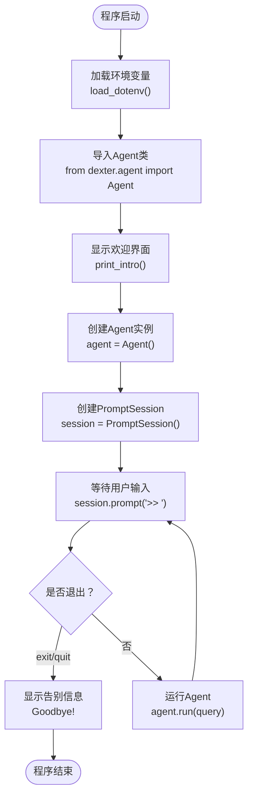
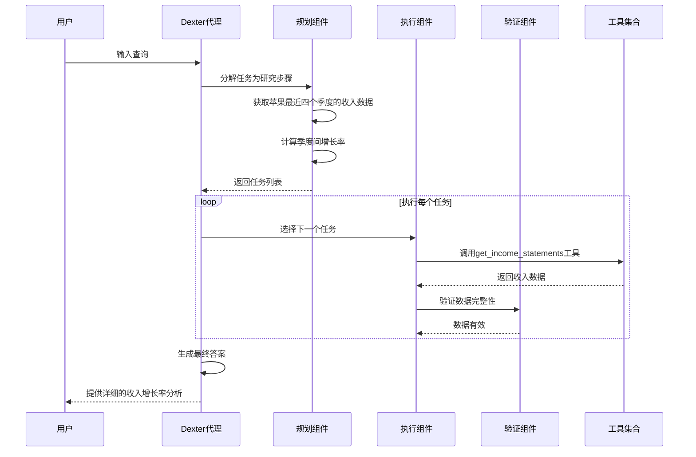
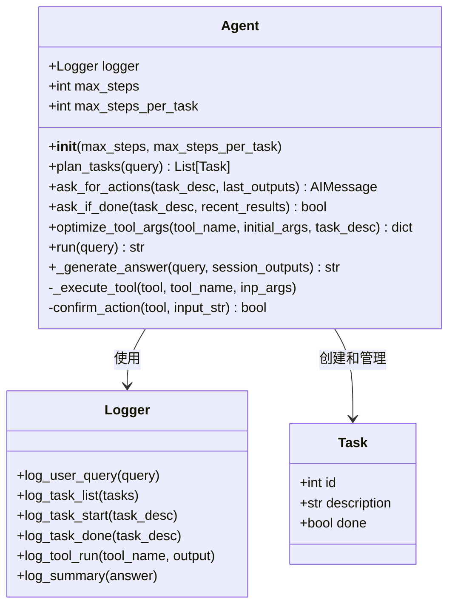
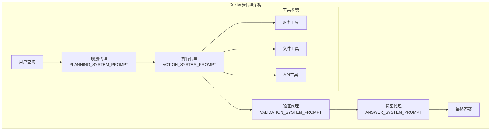
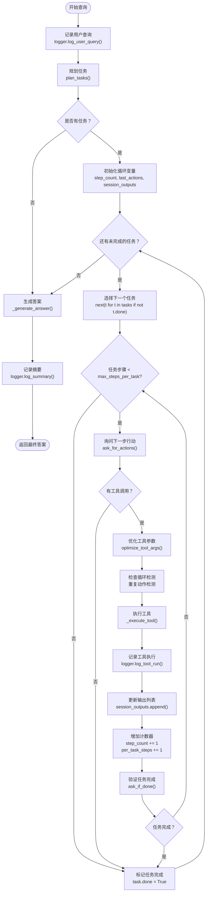

# 快速开始

<cite>
**本文档中引用的文件**
- [README.md](file://README.md)
- [src/dexter/cli.py](file://src/dexter/cli.py)
- [src/dexter/__init__.py](file://src/dexter/__init__.py)
- [src/dexter/agent.py](file://src/dexter/agent.py)
- [src/dexter/utils/intro.py](file://src/dexter/utils/intro.py)
- [src/dexter/prompts.py](file://src/dexter/prompts.py)
- [src/dexter/tools/__init__.py](file://src/dexter/tools/__init__.py)
- [src/dexter/tools/financials.py](file://src/dexter/tools/financials.py)
- [src/dexter/tools/filings.py](file://src/dexter/tools/filings.py)
- [pyproject.toml](file://pyproject.toml)
</cite>

## 目录
1. [简介](#简介)
2. [系统要求](#系统要求)
3. [安装步骤](#安装步骤)
4. [启动Dexter](#启动dexter)
5. [交互式CLI界面](#交互式cli界面)
6. [查询示例与工作流程](#查询示例与工作流程)
7. [内部工作机制详解](#内部工作机制详解)
8. [故障排除指南](#故障排除指南)
9. [总结](#总结)

## 简介

Dexter是一个自主的金融研究代理，能够思考、计划并学习如何工作。它使用任务规划、自我反思和实时市场数据进行分析。Dexter不是普通的聊天机器人，而是一个能够提前规划、验证进度并在任务完成前不断迭代的智能代理。

### 核心能力
- **智能任务规划**：自动将复杂查询分解为结构化的研究步骤
- **自主执行**：选择并执行正确的工具来收集财务数据
- **自我验证**：检查自己的工作并迭代直到任务完成
- **实时财务数据**：访问损益表、资产负债表和现金流量表
- **安全特性**：内置循环检测和步骤限制以防止失控执行

## 系统要求

在开始之前，请确保您的系统满足以下要求：

### 基本要求
- **Python 3.10或更高版本**
- **uv包管理器** - 用于依赖管理
- **OpenAI API密钥** - 用于语言模型服务
- **Financial Datasets API密钥** - 从[financialdatasets.ai](https://financialdatasets.ai)获取

### 推荐配置
- 至少8GB RAM
- 稳定的互联网连接
- 最新版本的Python 3.10+

## 安装步骤

### 第一步：克隆仓库

```bash
git clone https://github.com/virattt/dexter.git
cd dexter
```

### 第二步：安装依赖

使用uv包管理器安装所有必要的依赖：

```bash
uv sync
```

### 第三步：设置环境变量

复制示例环境文件并添加您的API密钥：

```bash
# 复制环境配置文件
cp env.example .env

# 编辑.env文件并添加您的API密钥
# OPENAI_API_KEY=your-openai-api-key
# FINANCIAL_DATASETS_API_KEY=your-financial-datasets-api-key
```

**节来源**
- [README.md](file://README.md#L25-L50)
- [pyproject.toml](file://pyproject.toml#L10-L20)

## 启动Dexter

### 使用uv运行Dexter

最简单的方法是使用uv直接运行Dexter：

```bash
uv run dexter-agent
```

这将启动Dexter的交互式CLI界面，您可以在其中输入任何金融相关的问题。

### 入口点分析

让我们看看`cli.py`中的主要入口点是如何工作的：



**图表来源**
- [src/dexter/cli.py](file://src/dexter/cli.py#L10-L30)

**节来源**
- [src/dexter/cli.py](file://src/dexter/cli.py#L1-L33)
- [src/dexter/utils/intro.py](file://src/dexter/utils/intro.py#L1-L37)

## 交互式CLI界面

### 欢迎界面

当您首次启动Dexter时，会看到一个精心设计的欢迎界面：

```
==================================================
║                     Welcome to Dexter                    ║
==================================================

██████╗ ███████╗██╗  ██╗████████╗███████╗██████╗ 
██╔══██╗██╔════╝╚██╗██╔╝╚══██╔══╝██╔════╝██╔══██╗
██║  ██║█████╗   ╚███╔╝    ██║   █████╗  ██████╔╝
██║  ██║██╔══╝   ██╔██╗    ██║   ██╔══╝  ██╔══██╗
██████╔╝███████╗██╔╝ ██╗   ██║   ███████╗██║  ██║
╚═════╝ ╚══════╝╚═╝  ╚═╝   ╚═╝   ╚══════╝╚═╝  ╚═╝

Your AI assistant for financial analysis.
Ask me any questions. Type 'exit' or 'quit' to end.
```

### 命令行提示符

启动后，您会看到`>>`提示符，表示Dexter正在等待您的输入：

```
>> 
```

### 输入等待状态

在等待输入时，Dexter处于非活动状态，但随时准备响应您的查询。您可以：
- 输入任何金融相关的问题
- 使用`exit`或`quit`命令退出程序
- 在任何时候中断程序（Ctrl+C）

**节来源**
- [src/dexter/utils/intro.py](file://src/dexter/utils/intro.py#L1-L37)
- [src/dexter/cli.py](file://src/dexter/cli.py#L15-L30)

## 查询示例与工作流程

### 示例查询1：苹果公司收入增长

**输入查询：**
```
>> 苹果公司的过去四个季度收入增长率是多少？
```

**Dexter的响应流程：**



**图表来源**
- [src/dexter/agent.py](file://src/dexter/agent.py#L100-L200)
- [src/dexter/tools/financials.py](file://src/dexter/tools/financials.py#L40-L70)

### 示例查询2：微软与谷歌利润率对比

**输入查询：**
```
>> 比较微软和谷歌2023年的营业利润率
```

**Dexter的工作机制：**

1. **任务规划阶段**：
   - 获取微软2023年财务报表
   - 获取谷歌2023年财务报表
   - 计算各自的营业利润率
   - 进行对比分析

2. **工具调用阶段**：
   - `get_income_statements` - 获取损益表数据
   - 数据处理和计算

3. **自我验证阶段**：
   - 验证数据的完整性和准确性
   - 确保计算过程正确

4. **答案生成阶段**：
   - 整合所有收集到的信息
   - 提供清晰的对比分析

### 示例查询3：特斯拉现金流趋势分析

**输入查询：**
```
>> 分析特斯拉过去一年的现金流趋势
```

**节来源**
- [src/dexter/agent.py](file://src/dexter/agent.py#L100-L252)
- [src/dexter/tools/financials.py](file://src/dexter/tools/financials.py#L1-L98)

## 内部工作机制详解

### Agent类的核心架构

Dexter的核心是一个名为`Agent`的类，它负责整个查询处理流程：



**图表来源**
- [src/dexter/agent.py](file://src/dexter/agent.py#L15-L50)

### 四个核心组件

Dexter采用多代理架构，包含四个专门的组件：



**图表来源**
- [src/dexter/prompts.py](file://src/dexter/prompts.py#L1-L103)
- [src/dexter/tools/__init__.py](file://src/dexter/tools/__init__.py#L1-L19)

### 任务执行循环

Dexter使用一个复杂的循环来处理每个查询：



**图表来源**
- [src/dexter/agent.py](file://src/dexter/agent.py#L150-L252)

### 可用工具概览

Dexter提供了丰富的工具集来支持各种财务分析需求：

| 工具名称 | 功能描述 | 主要用途 |
|---------|----------|----------|
| `get_income_statements` | 获取损益表 | 分析盈利能力、收入增长 |
| `get_balance_sheets` | 获取资产负债表 | 评估财务状况、杠杆比率 |
| `get_cash_flow_statements` | 获取现金流量表 | 分析流动性、资本支出 |
| `get_filings` | 获取SEC文件元数据 | 查找年度报告、季度报告 |
| `get_10K_filing_items` | 获取10-K文件内容 | 详细业务分析、风险因素 |
| `get_10Q_filing_items` | 获取10-Q文件内容 | 季度业绩分析 |
| `get_8K_filing_items` | 获取8-K文件内容 | 重大事件披露 |

**节来源**
- [src/dexter/agent.py](file://src/dexter/agent.py#L15-L252)
- [src/dexter/tools/__init__.py](file://src/dexter/tools/__init__.py#L1-L19)
- [src/dexter/prompts.py](file://src/dexter/prompts.py#L1-L103)

## 故障排除指南

### 常见问题及解决方案

#### 1. 启动失败
**问题**：`uv run dexter-agent`无法运行
**解决方案**：
- 确保已正确安装uv包管理器
- 检查Python版本是否符合要求（3.10+）
- 验证环境变量是否正确设置

#### 2. API密钥错误
**问题**：收到API密钥相关的错误
**解决方案**：
- 检查`.env`文件中的API密钥格式
- 确认OpenAI API密钥有效
- 验证Financial Datasets API密钥正确

#### 3. 工具调用失败
**问题**：某些查询无法获得预期结果
**解决方案**：
- 检查查询是否过于宽泛，尝试具体化问题
- 确认公司代码（ticker）拼写正确
- 尝试简化查询，逐步细化

#### 4. 循环检测
**问题**：程序提示检测到重复动作
**解决方案**：
- 这是安全机制，防止无限循环
- 简化查询或提供更多上下文信息
- 检查查询是否过于模糊

### 性能优化建议

1. **查询优化**：提供具体的公司代码和时间范围
2. **分步查询**：将复杂问题分解为多个简单查询
3. **合理使用工具**：避免同时请求过多数据

**节来源**
- [src/dexter/agent.py](file://src/dexter/agent.py#L200-L252)

## 总结

Dexter是一个功能强大的金融分析代理，通过智能的任务规划、工具调用和自我验证机制，能够为您提供深入的财务洞察。本教程涵盖了从安装到实际使用的完整流程，帮助您快速上手并充分利用Dexter的强大功能。

### 关键要点回顾

1. **启动方式**：使用`uv run dexter-agent`命令启动Dexter
2. **交互界面**：通过简单的命令行提示符与Dexter交互
3. **查询处理**：Dexter会自动分解复杂查询为可执行的任务
4. **工具支持**：利用丰富的财务工具获取准确的数据
5. **安全保障**：内置循环检测和步骤限制确保程序稳定运行

### 下一步建议

- 尝试更多不同类型的查询来探索Dexter的能力
- 结合实际投资决策，使用Dexter提供的分析结果
- 关注Dexter的输出格式，理解其分析逻辑
- 如有问题，参考故障排除指南或查阅相关文档

通过遵循本教程的指导，您应该能够熟练使用Dexter进行金融分析，并从中获得有价值的洞察。祝您使用愉快！