# 故障排除指南

<cite>
**本文档中引用的文件**
- [model.py](file://src/dexter/model.py)
- [agent.py](file://src/dexter/agent.py)
- [logger.py](file://src/dexter/utils/logger.py)
- [cli.py](file://src/dexter/cli.py)
- [prompts.py](file://src/dexter/prompts.py)
- [schemas.py](file://src/dexter/schemas.py)
- [ui.py](file://src/dexter/utils/ui.py)
- [api.py](file://src/dexter/tools/api.py)
- [__init__.py](file://src/dexter/tools/__init__.py)
- [README.md](file://README.md)
</cite>

## 目录
1. [简介](#简介)
2. [常见运行时问题](#常见运行时问题)
3. [API密钥问题](#api密钥问题)
4. [网络连接问题](#网络连接问题)
5. [LLM调用失败](#llm调用失败)
6. [工具执行异常](#工具执行异常)
7. [循环执行问题](#循环执行问题)
8. [错误日志分析](#错误日志分析)
9. [监控和诊断](#监控和诊断)
10. [故障排除流程](#故障排除流程)

## 简介

Dexter是一个自主的金融研究代理，采用多智能体架构设计。本指南提供了全面的故障排除方法，帮助用户识别、诊断和解决在使用Dexter过程中遇到的各种运行时问题。

## 常见运行时问题

### 系统架构概览

Dexter的核心架构包含以下关键组件：

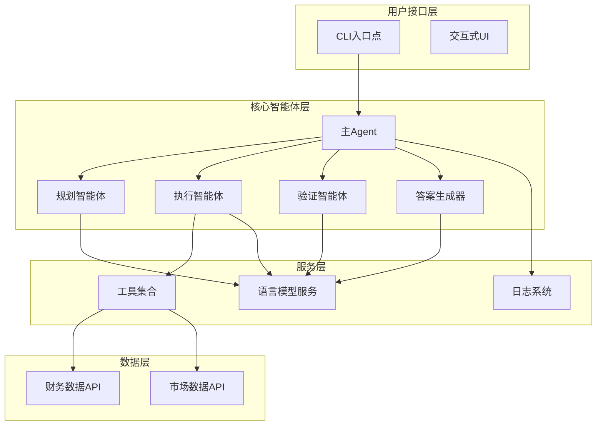

**图表来源**
- [agent.py](file://src/dexter/agent.py#L1-L50)
- [cli.py](file://src/dexter/cli.py#L1-L33)
- [ui.py](file://src/dexter/utils/ui.py#L1-L50)

### 错误处理层次结构

Dexter实现了分层的错误处理机制：

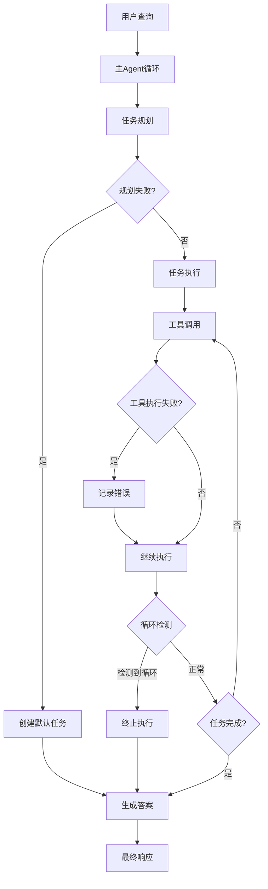

**图表来源**
- [agent.py](file://src/dexter/agent.py#L30-L250)
- [logger.py](file://src/dexter/utils/logger.py#L1-L43)

**章节来源**
- [agent.py](file://src/dexter/agent.py#L1-L253)
- [model.py](file://src/dexter/model.py#L1-L46)

## API密钥问题

### OPENAI_API_KEY配置问题

#### 问题症状
- `openai.AuthenticationError` 或类似的认证错误
- "API key not found" 错误消息
- LLM调用被拒绝

#### 诊断步骤
1. 检查环境变量设置：
   ```bash
   echo $OPENAI_API_KEY
   ```

2. 验证.env文件配置：
   ```bash
   cat .env | grep OPENAI_API_KEY
   ```

3. 检查导入状态：
   ```python
   import os
   print(os.getenv("OPENAI_API_KEY"))
   ```

#### 解决方案

1. **设置正确的API密钥**：
   ```bash
   # 编辑.env文件
   nano .env
   
   # 添加或更新API密钥
   OPENAI_API_KEY=your-valid-openai-api-key-here
   ```

2. **验证密钥有效性**：
   ```python
   from langchain_openai import ChatOpenAI
   llm = ChatOpenAI(api_key="your-test-key")
   response = llm.invoke("Hello")  # 测试基本连通性
   ```

3. **检查密钥格式**：
   - 确保密钥以`sk-`开头
   - 不要包含任何额外的空格或字符
   - 密钥长度通常为56个字符

### FINANCIAL_DATASETS_API_KEY配置问题

#### 问题症状
- 工具调用返回"Unauthorized"错误
- 财务数据获取失败
- API请求被拒绝

#### 诊断步骤
1. 检查API密钥环境变量：
   ```bash
   echo $FINANCIAL_DATASETS_API_KEY
   ```

2. 验证API密钥是否有效：
   ```python
   import requests
   import os
   
   api_key = os.getenv("FINANCIAL_DATASETS_API_KEY")
   url = "https://api.financialdatasets.ai/test"
   headers = {"x-api-key": api_key}
   
   response = requests.get(url, headers=headers)
   print(f"Status: {response.status_code}")
   print(f"Response: {response.text}")
   ```

#### 解决方案

1. **获取有效的API密钥**：
   - 访问 [financialdatasets.ai](https://financialdatasets.ai) 注册账户
   - 获取有效的API密钥
   - 更新.env文件

2. **验证API密钥权限**：
   - 确认密钥具有适当的访问权限
   - 检查是否有配额限制
   - 验证IP白名单设置

**章节来源**
- [api.py](file://src/dexter/tools/api.py#L1-L20)
- [README.md](file://README.md#L31-L50)

## 网络连接问题

### 连接超时和重试机制

Dexter内置了智能的网络重试机制来处理临时连接问题。

#### 重试逻辑分析

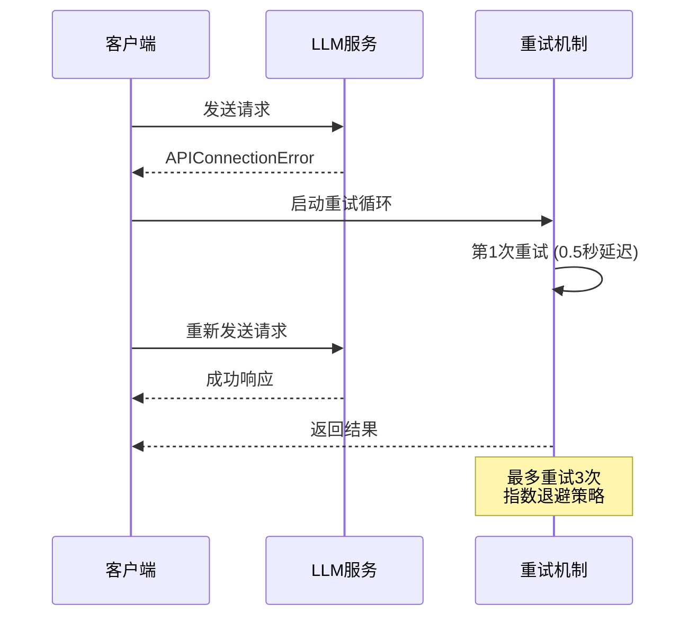

**图表来源**
- [model.py](file://src/dexter/model.py#L35-L46)

#### 超时配置参数

| 参数 | 默认值 | 描述 |
|------|--------|------|
| 最大重试次数 | 3 | 连接失败时的最大重试次数 |
| 初始延迟 | 0.5秒 | 第一次重试的延迟时间 |
| 退避因子 | 2 | 每次重试延迟时间的倍增因子 |
| 最大延迟 | 4秒 | 重试延迟的最大上限 |

#### 网络问题诊断

1. **检查基础连接**：
   ```bash
   ping api.openai.com
   curl -I https://api.openai.com
   ```

2. **测试API可用性**：
   ```python
   import requests
   import time
   
   urls = [
       "https://api.openai.com",
       "https://api.financialdatasets.ai"
   ]
   
   for url in urls:
       try:
           start_time = time.time()
           response = requests.get(url, timeout=10)
           elapsed = time.time() - start_time
           print(f"{url}: OK ({elapsed:.2f}s)")
       except Exception as e:
           print(f"{url}: ERROR - {e}")
   ```

3. **检查防火墙设置**：
   ```bash
   # 检查出站连接
   telnet api.openai.com 443
   telnet api.financialdatasets.ai 443
   ```

#### 解决方案

1. **网络配置优化**：
   - 确保防火墙允许HTTPS流量
   - 检查代理设置（如果需要）
   - 验证DNS解析

2. **超时参数调整**：
   ```python
   # 在model.py中调整超时参数
   llm = ChatOpenAI(
       model="gpt-4.1", 
       temperature=0, 
       api_key=os.getenv("OPENAI_API_KEY"),
       timeout=30.0  # 增加超时时间
   )
   ```

3. **网络监控**：
   ```python
   import logging
   logging.basicConfig(level=logging.DEBUG)
   ```

**章节来源**
- [model.py](file://src/dexter/model.py#L35-L46)

## LLM调用失败

### call_llm函数中的错误处理

`model.py`中的`call_llm`函数实现了robust的错误处理机制。

#### 错误类型分类

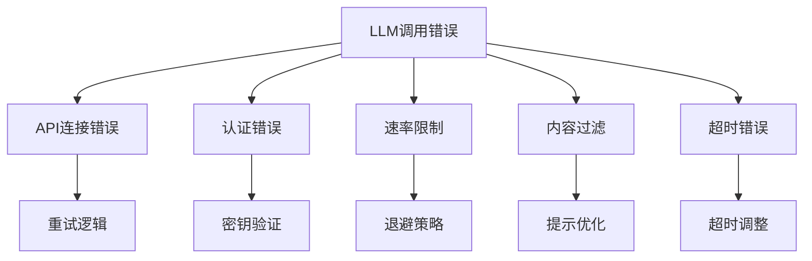

**图表来源**
- [model.py](file://src/dexter/model.py#L15-L46)

#### 典型错误信息及解决方案

| 错误类型 | 错误信息示例 | 解决方案 |
|----------|--------------|----------|
| API密钥无效 | `AuthenticationError: Invalid API key` | 检查OPENAI_API_KEY设置 |
| 请求超时 | `TimeoutError: Request timed out` | 增加超时时间或检查网络 |
| 速率限制 | `RateLimitError: Rate limit exceeded` | 实现退避策略 |
| 内容过滤 | `ContentFilterError: Content filtered` | 优化提示词 |
| 模型不可用 | `ModelError: Model not found` | 检查模型名称 |

#### LLM调用失败的诊断流程

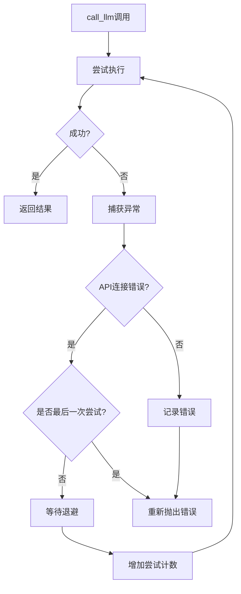

**图表来源**
- [model.py](file://src/dexter/model.py#L35-L46)

#### 解决方案

1. **重试机制配置**：
   ```python
   # 在model.py中调整重试参数
   MAX_RETRIES = 5
   INITIAL_DELAY = 1.0
   BACKOFF_FACTOR = 2.0
   ```

2. **错误日志分析**：
   ```python
   import traceback
   
   def debug_llm_call(prompt, system_prompt=None):
       try:
           return call_llm(prompt, system_prompt)
       except Exception as e:
           print(f"LLM Call Failed: {e}")
           print(f"Prompt: {prompt[:100]}...")
           print(f"System Prompt: {system_prompt[:100]}...")
           traceback.print_exc()
   ```

3. **提示词优化**：
   - 简化复杂的提示词
   - 使用更明确的指令
   - 减少上下文长度

**章节来源**
- [model.py](file://src/dexter/model.py#L15-L46)

## 工具执行异常

### 工具调用失败的处理机制

Dexter在`agent.py`中实现了完善的工具执行异常处理。

#### 工具执行流程

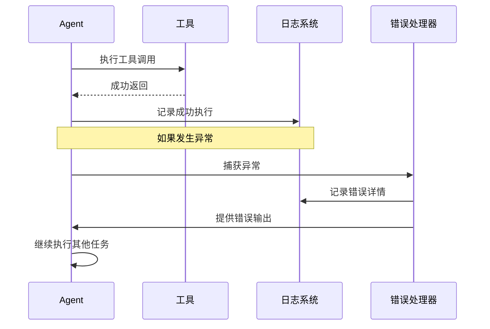

**图表来源**
- [agent.py](file://src/dexter/agent.py#L190-L220)

#### 工具执行异常类型

| 异常类型 | 触发条件 | 处理策略 |
|----------|----------|----------|
| 工具不存在 | 工具名称无效 | 记录错误并跳过 |
| 参数错误 | 工具参数不匹配 | 使用原始参数 |
| 网络错误 | API调用失败 | 记录错误并继续 |
| 数据格式错误 | 返回数据格式异常 | 记录错误并提供默认值 |
| 权限错误 | API密钥无权限 | 记录错误并跳过 |

#### 循环执行检测

Dexter实现了智能的循环检测机制来防止无限循环：

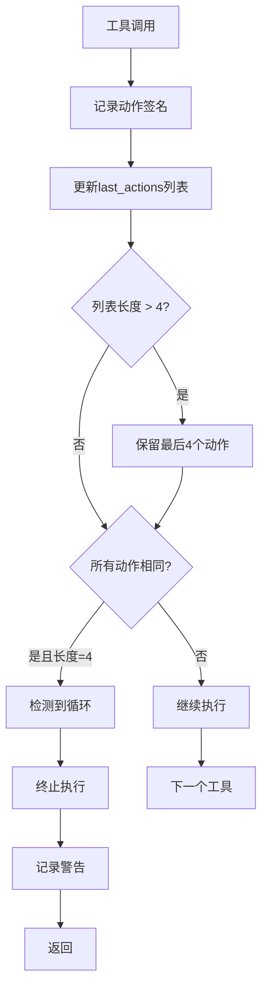

**图表来源**
- [agent.py](file://src/dexter/agent.py#L197-L205)

#### 工具执行异常的诊断和解决

1. **工具调用失败诊断**：
   ```python
   # 在agent.py中添加调试信息
   def _execute_tool(self, tool, tool_name: str, inp_args):
       self.logger._log(f"Executing tool: {tool_name} with args: {inp_args}")
       try:
           result = tool.run(inp_args)
           self.logger._log(f"Tool {tool_name} executed successfully")
           return result
       except Exception as e:
           self.logger._log(f"Tool {tool_name} failed: {e}")
           return f"Error executing {tool_name}: {e}"
   ```

2. **工具参数验证**：
   ```python
   # 在optimize_tool_args中添加参数验证
   def optimize_tool_args(self, tool_name: str, initial_args: dict, task_desc: str):
       tool = next((t for t in TOOLS if t.name == tool_name), None)
       if not tool:
           self.logger._log(f"Invalid tool: {tool_name}")
           return initial_args
       
       # 验证必需参数
       if not all(param in initial_args for param in getattr(tool, 'required_params', [])):
           self.logger._log(f"Missing required parameters for {tool_name}")
           return initial_args
   ```

3. **工具可用性检查**：
   ```python
   # 在工具初始化时进行健康检查
   def validate_tools():
       for tool in TOOLS:
           try:
               # 尝试简单的工具调用
               tool.run({"test": "valid"})
               print(f"✓ {tool.name} is available")
           except Exception as e:
               print(f"✗ {tool.name} failed: {e}")
   ```

**章节来源**
- [agent.py](file://src/dexter/agent.py#L190-L220)
- [__init__.py](file://src/dexter/tools/__init__.py#L1-L19)

## 循环执行问题

### last_actions列表检测机制

Dexter使用`last_actions`列表来检测和防止循环执行问题。

#### 循环检测算法

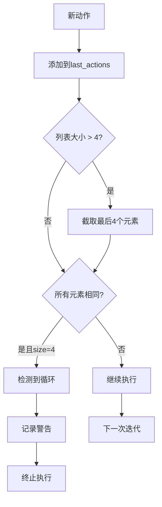

**图表来源**
- [agent.py](file://src/dexter/agent.py#L197-L205)

#### 循环检测的关键参数

| 参数 | 默认值 | 作用 |
|------|--------|------|
| 最大历史记录 | 4 | 保存最近的动作历史 |
| 循环阈值 | 4 | 检测循环所需的最小连续重复次数 |
| 动作签名格式 | `{tool_name}:{optimized_args}` | 唯一标识每个动作 |

#### 循环问题的识别和解决

1. **循环检测日志**：
   ```python
   # 在logger.py中添加循环检测日志
   def log_loop_detection(self, action_signature):
       self._log(f"Loop detected: {action_signature}")
       self._log(f"Last actions: {self.last_actions}")
   ```

2. **循环预防策略**：
   ```python
   # 在agent.py中实现循环预防
   def prevent_loops(self, action_signature):
       self.last_actions.append(action_signature)
       if len(self.last_actions) > 4:
           self.last_actions = self.last_actions[-4:]
       
       # 检测循环
       if len(set(self.last_actions)) == 1 and len(self.last_actions) == 4:
           self.logger._log("Detected repeating action loop - aborting")
           return True
       return False
   ```

3. **循环恢复机制**：
   ```python
   # 实现循环后的恢复策略
   def handle_loop_recovery(self):
       self.logger._log("Recovery mode activated")
       # 清空任务状态
       self.current_task = None
       self.task_outputs = []
       # 重置步数计数器
       self.step_count = 0
   ```

#### 循环问题的根本原因

1. **工具选择不当**：LLM反复选择相同的工具但参数不变
2. **参数优化失败**：工具参数优化未能产生新的有效参数
3. **任务描述模糊**：任务描述不够具体导致工具选择重复
4. **验证逻辑问题**：任务完成验证逻辑过于宽松

#### 解决循环问题的策略

1. **改进工具选择**：
   - 增加工具多样性考虑
   - 实现工具使用频率控制
   - 添加工具依赖关系检查

2. **增强参数优化**：
   - 实现更智能的参数搜索
   - 添加参数约束检查
   - 实现参数记忆功能

3. **优化任务分解**：
   - 改进任务规划逻辑
   - 增加任务优先级排序
   - 实现任务依赖关系管理

**章节来源**
- [agent.py](file://src/dexter/agent.py#L197-L205)

## 错误日志分析

### 日志系统架构

Dexter使用分层的日志系统来记录和诊断问题。

#### 日志层次结构

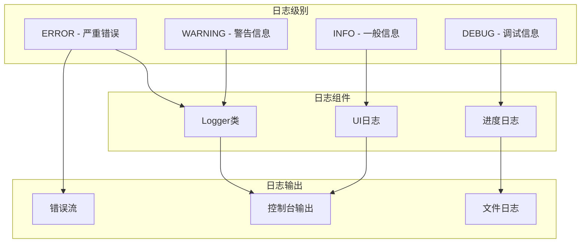

**图表来源**
- [logger.py](file://src/dexter/utils/logger.py#L1-L43)
- [ui.py](file://src/dexter/utils/ui.py#L1-L50)

#### 关键日志消息类型

| 日志类型 | 消息模式 | 诊断价值 |
|----------|----------|----------|
| 计划失败 | `"Planning failed: {error}"` | LLM调用或提示词问题 |
| 工具执行失败 | `"Tool execution failed: {error}"` | 工具或网络问题 |
| 循环检测 | `"Detected repeating action — aborting to avoid loop."` | 循环执行问题 |
| 任务完成 | `"Task completed: {task_description}"` | 正常执行路径 |
| 网络错误 | `"Network error: {error}"` | 网络连接问题 |
| API限制 | `"Rate limit exceeded"` | API配额问题 |

#### 日志分析工具

1. **实时日志监控**：
   ```python
   # 在cli.py中添加实时日志监控
   def monitor_logs(agent):
       while True:
           if agent.logger.log:
               latest_log = agent.logger.log[-1]
               print(f"[LOG] {latest_log}")
           time.sleep(0.1)
   ```

2. **日志聚合分析**：
   ```python
   # 分析日志中的错误模式
   def analyze_logs(log_entries):
       error_counts = {}
       for log in log_entries:
           if "failed" in log.lower() or "error" in log.lower():
               error_type = extract_error_type(log)
               error_counts[error_type] = error_counts.get(error_type, 0) + 1
       return error_counts
   ```

3. **性能指标提取**：
   ```python
   # 提取执行时间和成功率
   def extract_performance_metrics(log_entries):
       metrics = {
           "total_executions": 0,
           "successful_executions": 0,
           "average_duration": 0,
           "error_rate": 0
       }
       # 解析日志条目提取指标
       return metrics
   ```

#### 错误根因分析流程

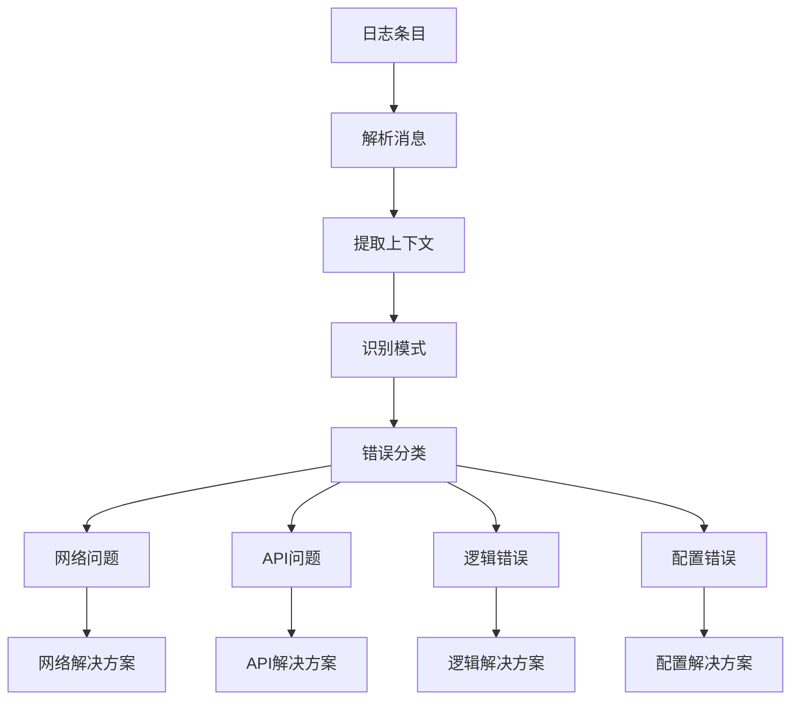

**图表来源**
- [logger.py](file://src/dexter/utils/logger.py#L10-L20)

**章节来源**
- [logger.py](file://src/dexter/utils/logger.py#L1-L43)
- [agent.py](file://src/dexter/agent.py#L30-L50)

## 监控和诊断

### 实时监控系统

Dexter集成了实时监控和诊断功能来帮助用户跟踪系统状态。

#### 监控指标体系

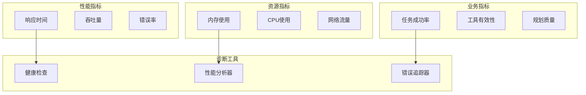

**图表来源**
- [ui.py](file://src/dexter/utils/ui.py#L67-L82)
- [agent.py](file://src/dexter/agent.py#L200-L250)

#### 诊断命令和工具

1. **系统健康检查**：
   ```python
   # 健康检查函数
   def health_check():
       checks = {
           "openai_api": check_openai_api(),
           "financial_api": check_financial_api(),
           "memory_usage": check_memory_usage(),
           "task_queue": check_task_queue()
       }
       return checks
   ```

2. **性能分析工具**：
   ```python
   # 性能分析装饰器
   def performance_monitor(func):
       @wraps(func)
       def wrapper(*args, **kwargs):
           start_time = time.time()
           result = func(*args, **kwargs)
           duration = time.time() - start_time
           logger.log(f"Function {func.__name__} took {duration:.2f} seconds")
           return result
       return wrapper
   ```

3. **资源监控**：
   ```python
   # 资源使用监控
   def monitor_resources():
       import psutil
       memory = psutil.virtual_memory()
       cpu = psutil.cpu_percent()
       disk = psutil.disk_usage('/')
       
       return {
           "memory_percent": memory.percent,
           "cpu_percent": cpu,
           "disk_free_gb": disk.free / (1024**3)
       }
   ```

#### 自动诊断脚本

```python
# comprehensive_diagnosis.py
import os
import sys
import time
import requests
from dexter.agent import Agent
from dexter.utils.logger import Logger

def run_comprehensive_diagnosis():
    """运行全面的系统诊断"""
    logger = Logger()
    results = {}
    
    # 1. 环境检查
    results["environment"] = check_environment()
    
    # 2. API连接检查
    results["api_connectivity"] = check_api_connectivity()
    
    # 3. LLM功能检查
    results["llm_functionality"] = check_llm_functionality()
    
    # 4. 工具可用性检查
    results["tool_availability"] = check_tool_availability()
    
    # 5. 性能基准测试
    results["performance_benchmark"] = benchmark_performance()
    
    return results

def check_environment():
    """检查环境变量和配置"""
    required_vars = ["OPENAI_API_KEY", "FINANCIAL_DATASETS_API_KEY"]
    missing_vars = [var for var in required_vars if not os.getenv(var)]
    
    return {
        "missing_variables": missing_vars,
        "python_version": sys.version,
        "platform": sys.platform
    }

def check_api_connectivity():
    """检查API连接"""
    apis = {
        "OpenAI": "https://api.openai.com/v1/models",
        "Financial": "https://api.financialdatasets.ai/ping"
    }
    
    results = {}
    for name, url in apis.items():
        try:
            response = requests.get(url, timeout=10)
            results[name] = {"status": "connected", "code": response.status_code}
        except Exception as e:
            results[name] = {"status": "failed", "error": str(e)}
    
    return results
```

**章节来源**
- [cli.py](file://src/dexter/cli.py#L1-L33)
- [ui.py](file://src/dexter/utils/ui.py#L67-L82)

## 故障排除流程

### 系统化故障排除方法

建立系统化的故障排除流程来快速定位和解决问题。

#### 故障排除决策树

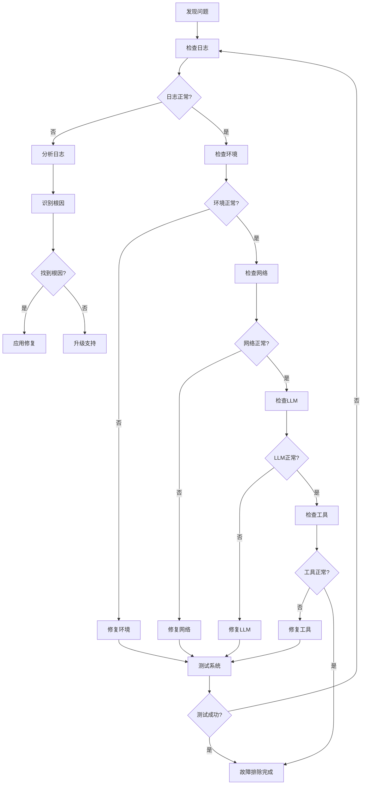

#### 故障排除检查清单

##### 1. 环境配置检查
- [ ] ✅ OPENAI_API_KEY已正确设置
- [ ] ✅ FINANCIAL_DATASETS_API_KEY已正确设置
- [ ] ✅ Python版本 ≥ 3.10
- [ ] ✅ 所有依赖包已安装
- [ ] ✅ 网络连接正常

##### 2. 系统健康检查
- [ ] ✅ 内存使用率 < 80%
- [ ] ✅ CPU使用率 < 70%
- [ ] ✅ 磁盘空间充足
- [ ] ✅ 进程运行正常

##### 3. 服务连接检查
- [ ] ✅ OpenAI API可访问
- [ ] ✅ Financial Datasets API可访问
- [ ] ✅ DNS解析正常
- [ ] ✅ 防火墙配置正确

##### 4. 应用功能检查
- [ ] ✅ Agent初始化成功
- [ ] ✅ 任务规划功能正常
- [ ] ✅ 工具调用功能正常
- [ ] ✅ 答案生成功能正常

#### 快速修复指南

1. **立即修复操作**：
   ```bash
   # 重启Dexter
   uv run dexter-agent
   
   # 清理缓存
   rm -rf ~/.dexter/cache/*
   
   # 重置配置
   cp env.example .env
   ```

2. **配置修复**：
   ```bash
   # 更新API密钥
   nano .env
   # 重新加载环境变量
   source .env
   ```

3. **网络修复**：
   ```bash
   # 检查网络连接
   ping api.openai.com
   
   # 重置网络设置
   sudo networksetup -setdnsservers Wi-Fi 8.8.8.8 8.8.4.4
   ```

#### 预防措施

1. **监控设置**：
   ```python
   # 设置定期健康检查
   def schedule_health_checks():
       import schedule
       schedule.every(5).minutes.do(run_health_check)
   ```

2. **自动恢复机制**：
   ```python
   # 实现自动重启
   def auto_restart_on_failure():
       while True:
           try:
               agent.run(query)
           except Exception as e:
               logger.log(f"Agent failed: {e}")
               time.sleep(30)  # 等待30秒后重试
   ```

3. **备份和恢复**：
   ```python
   # 创建系统快照
   def create_system_snapshot():
       import shutil
       backup_dir = f"backup_{time.strftime('%Y%m%d_%H%M%S')}"
       shutil.copytree(".", backup_dir)
   ```

**章节来源**
- [agent.py](file://src/dexter/agent.py#L200-L250)
- [cli.py](file://src/dexter/cli.py#L10-L33)

## 结论

本故障排除指南涵盖了Dexter系统中可能遇到的各种运行时问题，从API密钥配置到复杂的循环执行问题。通过系统化的诊断方法和预防措施，用户可以有效地识别、分析和解决大多数技术问题。

关键要点：
- 建立完善的日志监控系统
- 实施多层次的错误处理机制
- 使用系统化的故障排除流程
- 保持环境配置的正确性和一致性
- 定期进行系统健康检查

当遇到复杂问题时，建议按照本指南的顺序逐步排查，并参考具体的错误日志信息来精确定位问题根源。如果问题仍然无法解决，可以联系技术支持团队并提供完整的错误日志和系统信息。