# 数据模型

<cite>
**本文档中引用的文件**
- [schemas.py](file://src/dexter/schemas.py)
- [agent.py](file://src/dexter/agent.py)
- [model.py](file://src/dexter/model.py)
- [prompts.py](file://src/dexter/prompts.py)
- [tools/__init__.py](file://src/dexter/tools/__init__.py)
- [tools/financials.py](file://src/dexter/tools/financials.py)
</cite>

## 目录
1. [简介](#简介)
2. [项目结构](#项目结构)
3. [核心数据模型](#核心数据模型)
4. [架构概览](#架构概览)
5. [详细模型分析](#详细模型分析)
6. [与LLM的结构化输出集成](#与llm的结构化输出集成)
7. [JSON Schema示例](#json-schema示例)
8. [使用场景分析](#使用场景分析)
9. [数据验证与安全](#数据验证与安全)
10. [总结](#总结)

## 简介

Dexter是一个自主的金融研究代理，采用多层架构设计，其中Pydantic数据模型扮演着关键的数据验证和结构化输出角色。这些模型确保了与大型语言模型（LLM）交互时的数据可靠性和格式一致性，有效防止LLM幻觉问题。

本文档详细分析了`schemas.py`中定义的核心数据模型，包括它们的字段类型、约束条件、业务含义以及在系统中的具体应用场景。

## 项目结构

Dexter项目采用模块化架构，核心数据模型位于专门的`schemas.py`文件中，与其他组件协同工作：

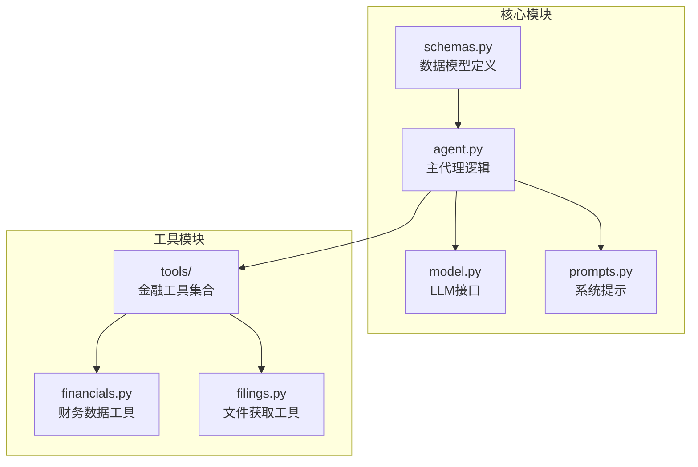

**图表来源**
- [schemas.py](file://src/dexter/schemas.py#L1-L25)
- [agent.py](file://src/dexter/agent.py#L1-L20)
- [model.py](file://src/dexter/model.py#L1-L44)

**章节来源**
- [schemas.py](file://src/dexter/schemas.py#L1-L25)
- [agent.py](file://src/dexter/agent.py#L1-L253)

## 核心数据模型

Dexter定义了五个核心Pydantic数据模型，每个模型都有特定的业务用途和验证规则：

| 模型名称 | 主要用途 | 字段数量 | 验证特性 |
|---------|---------|---------|---------|
| `Task` | 单个任务表示 | 3个字段 | 唯一标识符、描述、完成状态 |
| `TaskList` | 任务列表容器 | 1个字段 | 包含多个Task对象的列表 |
| `IsDone` | 任务完成状态 | 1个布尔字段 | 确保布尔值的有效性 |
| `Answer` | 最终答案生成 | 1个字符串字段 | 综合性回答内容 |
| `OptimizedToolArgs` | 工具参数优化 | 1个字典字段 | 动态参数配置 |

**章节来源**
- [schemas.py](file://src/dexter/schemas.py#L1-L25)

## 架构概览

数据模型在Dexter系统架构中起到桥梁作用，连接用户查询、任务规划、工具执行和结果生成等各个阶段：

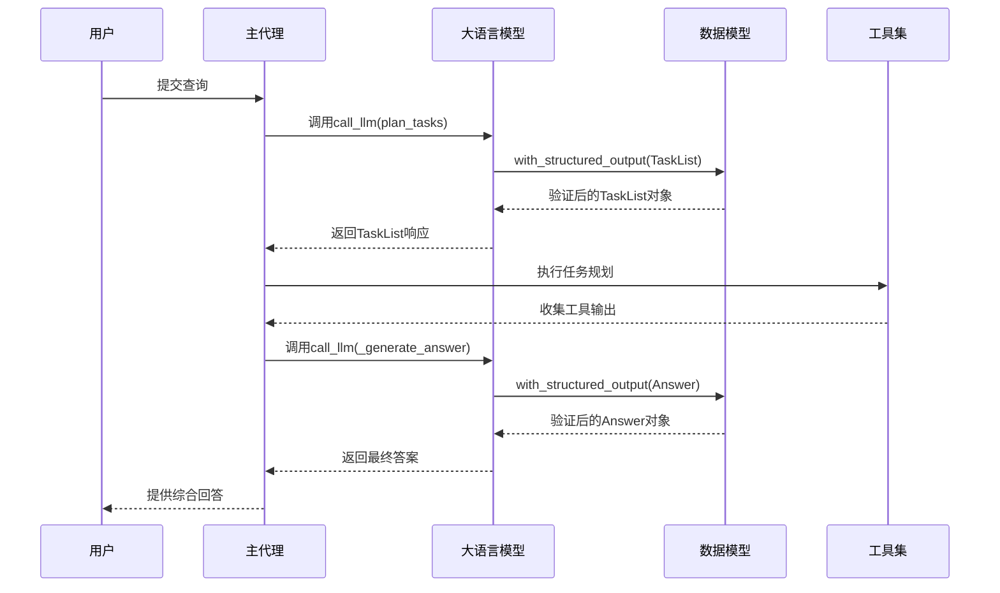

**图表来源**
- [agent.py](file://src/dexter/agent.py#L24-L51)
- [agent.py](file://src/dexter/agent.py#L240-L251)
- [model.py](file://src/dexter/model.py#L15-L44)

## 详细模型分析

### Task模型 - 单个任务表示

`Task`模型是系统中最基础的任务单元，用于表示单个可执行的研究任务。

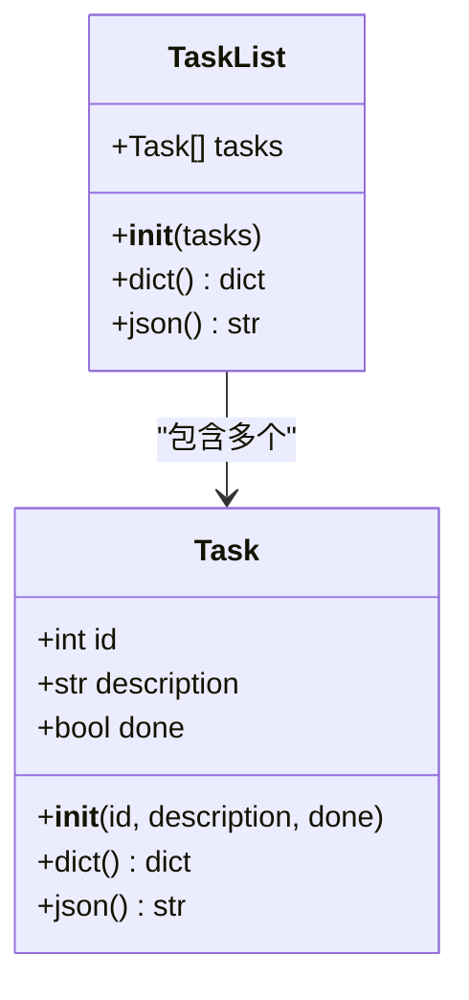

**图表来源**
- [schemas.py](file://src/dexter/schemas.py#L4-L9)

#### 字段详细说明

| 字段名 | 类型 | 默认值 | 描述 | 验证规则 |
|-------|------|--------|------|---------|
| `id` | `int` | - | 任务的唯一标识符 | 必填字段，确保任务可追踪 |
| `description` | `str` | - | 任务的详细描述 | 必填字段，明确任务目标 |
| `done` | `bool` | `False` | 任务完成状态标志 | 可选，默认为未完成 |

**业务含义**：
- `id`字段确保每个任务在系统中有唯一标识，便于跟踪和管理
- `description`字段提供任务的详细说明，指导工具选择和参数设置
- `done`字段支持任务状态管理，实现迭代式任务处理

**章节来源**
- [schemas.py](file://src/dexter/schemas.py#L4-L9)

### TaskList模型 - 任务列表容器

`TaskList`模型作为`Task`对象的容器，支持批量任务管理和序列化操作。

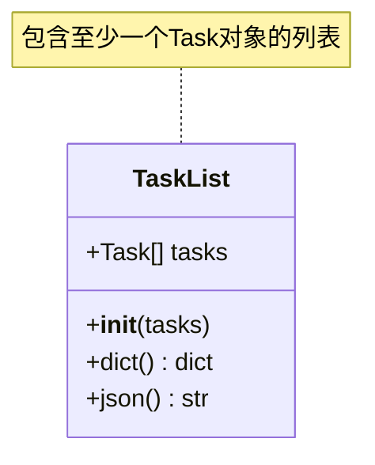

**图表来源**
- [schemas.py](file://src/dexter/schemas.py#L11-L14)

#### 关键特性

- **列表容器**：支持存储多个`Task`对象，实现批量任务处理
- **类型验证**：自动验证列表中的每个元素都是有效的`Task`实例
- **序列化支持**：提供`dict()`和`json()`方法，便于数据传输和存储

**章节来源**
- [schemas.py](file://src/dexter/schemas.py#L11-L14)

### IsDone模型 - 任务验证

`IsDone`模型专门用于任务完成状态的验证和确认，确保系统能够准确判断任务是否完成。

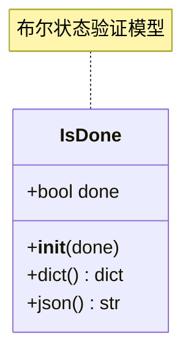

**图表来源**
- [schemas.py](file://src/dexter/schemas.py#L16-L18)

#### 设计考量

- **简单性原则**：仅包含一个布尔字段，避免过度复杂化
- **强类型保证**：确保返回值始终是布尔类型
- **默认值处理**：即使解析失败，也能提供合理的默认值

**章节来源**
- [schemas.py](file://src/dexter/schemas.py#L16-L18)

### Answer模型 - 最终答案生成

`Answer`模型负责封装综合性的金融研究答案，确保输出内容的完整性和准确性。

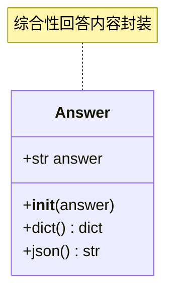

**图表来源**
- [schemas.py](file://src/dexter/schemas.py#L20-L23)

#### 内容要求

- **完整性**：包含相关的数字、数据、推理和洞察
- **可读性**：提供清晰、结构化的回答格式
- **准确性**：基于收集到的实际数据生成答案

**章节来源**
- [schemas.py](file://src/dexter/schemas.py#L20-L23)

### OptimizedToolArgs模型 - 参数优化

`OptimizedToolArgs`模型用于封装经过优化的工具调用参数，支持动态参数配置和过滤。

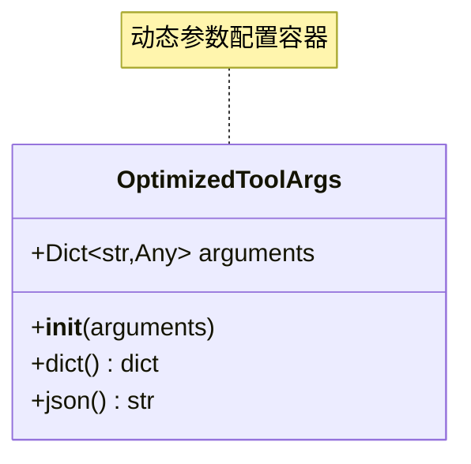

**图表来源**
- [schemas.py](file://src/dexter/schemas.py#L25-L25)

#### 功能特性

- **动态参数**：支持任意类型的参数配置
- **灵活性**：适应不同工具的参数需求
- **优化能力**：根据任务需求调整参数设置

**章节来源**
- [schemas.py](file://src/dexter/schemas.py#L25-L25)

## 与LLM的结构化输出集成

Dexter通过`call_llm`函数实现了与大型语言模型的结构化输出集成，确保LLM的响应符合预定义的数据模型。

### 结构化输出机制

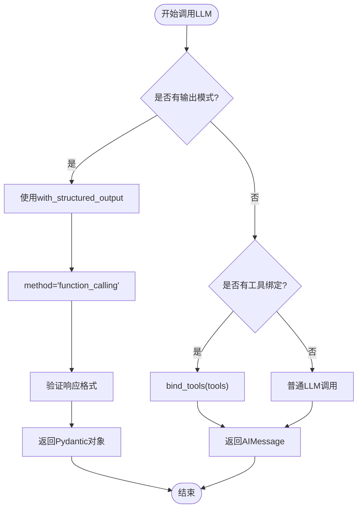

**图表来源**
- [model.py](file://src/dexter/model.py#L15-L44)

### 具体实现方式

在`agent.py`中，不同的方法使用不同的模式调用LLM：

#### 任务规划场景
```python
response = call_llm(prompt, system_prompt=system_prompt, output_schema=TaskList)
```

#### 任务验证场景
```python
resp = call_llm(prompt, system_prompt=VALIDATION_SYSTEM_PROMPT, output_schema=IsDone)
```

#### 参数优化场景
```python
response = call_llm(prompt, system_prompt=TOOL_ARGS_SYSTEM_PROMPT, output_schema=OptimizedToolArgs)
```

#### 最终答案生成场景
```python
answer_obj = call_llm(answer_prompt, system_prompt=ANSWER_SYSTEM_PROMPT, output_schema=Answer)
```

**章节来源**
- [model.py](file://src/dexter/model.py#L15-L44)
- [agent.py](file://src/dexter/agent.py#L24-L51)
- [agent.py](file://src/dexter/agent.py#L53-L74)
- [agent.py](file://src/dexter/agent.py#L76-L106)
- [agent.py](file://src/dexter/agent.py#L240-L251)

## JSON Schema示例

以下是各模型对应的JSON Schema示例，展示了预期的输入和输出格式：

### Task模型JSON Schema
```json
{
  "type": "object",
  "properties": {
    "id": {
      "type": "integer",
      "description": "Unique identifier for the task."
    },
    "description": {
      "type": "string",
      "description": "The description of the task."
    },
    "done": {
      "type": "boolean",
      "default": false,
      "description": "Whether the task is completed."
    }
  },
  "required": ["id", "description"]
}
```

### TaskList模型JSON Schema
```json
{
  "type": "object",
  "properties": {
    "tasks": {
      "type": "array",
      "items": {
        "$ref": "#/definitions/Task"
      },
      "description": "The list of tasks."
    }
  },
  "required": ["tasks"]
}
```

### IsDone模型JSON Schema
```json
{
  "type": "object",
  "properties": {
    "done": {
      "type": "boolean",
      "description": "Whether the task is done or not."
    }
  },
  "required": ["done"]
}
```

### Answer模型JSON Schema
```json
{
  "type": "object",
  "properties": {
    "answer": {
      "type": "string",
      "description": "A comprehensive answer to the user's query, including relevant numbers, data, reasoning, and insights."
    }
  },
  "required": ["answer"]
}
```

### OptimizedToolArgs模型JSON Schema
```json
{
  "type": "object",
  "properties": {
    "arguments": {
      "type": "object",
      "additionalProperties": true,
      "description": "The optimized arguments dictionary for the tool call."
    }
  },
  "required": ["arguments"]
}
```

## 使用场景分析

### 场景一：任务规划流程

在任务规划阶段，`TaskList`模型确保LLM生成的计划具有正确的结构：

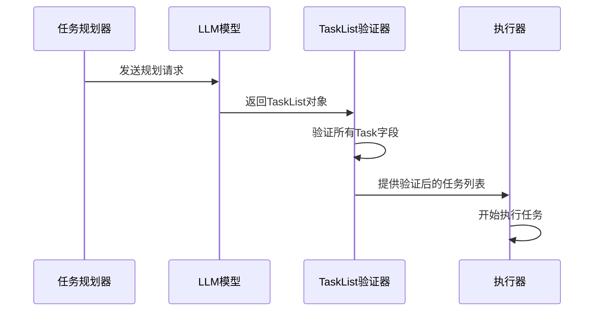

**图表来源**
- [agent.py](file://src/dexter/agent.py#L24-L51)

### 场景二：任务完成验证

`IsDone`模型在每个任务完成后进行状态验证：

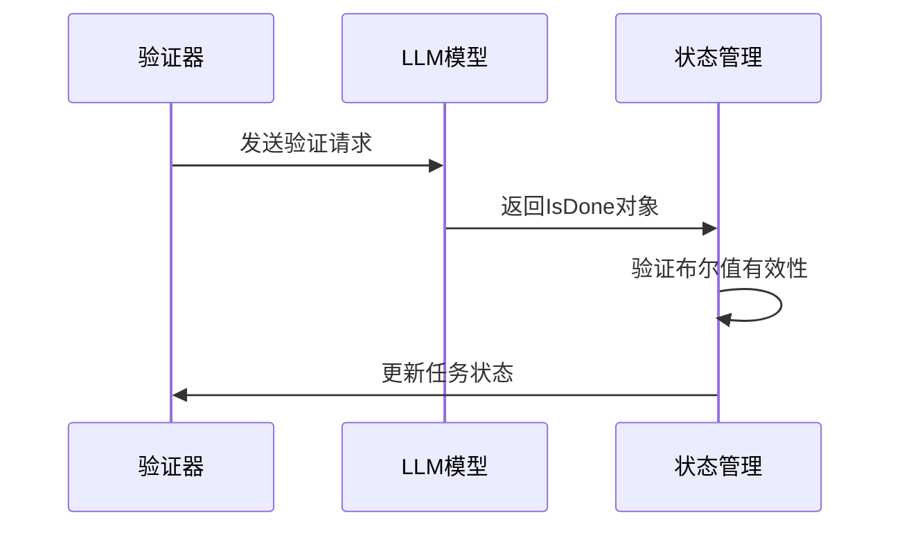

**图表来源**
- [agent.py](file://src/dexter/agent.py#L53-L74)

### 场景三：工具参数优化

`OptimizedToolArgs`模型支持动态参数配置：

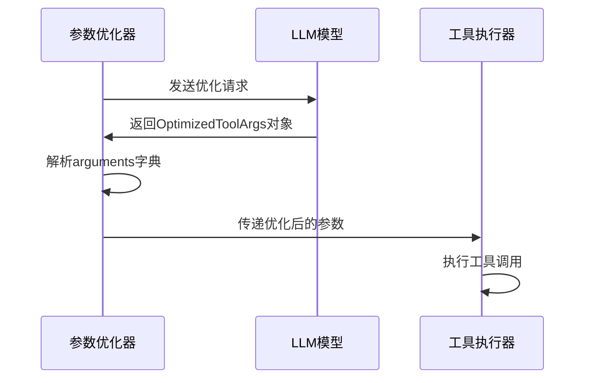

**图表来源**
- [agent.py](file://src/dexter/agent.py#L76-L106)

### 场景四：最终答案生成

`Answer`模型确保最终输出的质量和完整性：

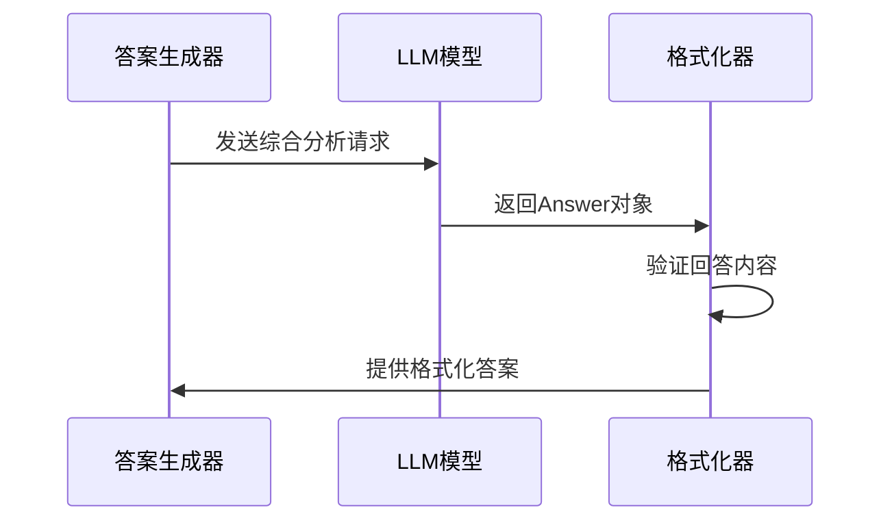

**图表来源**
- [agent.py](file://src/dexter/agent.py#L240-L251)

**章节来源**
- [agent.py](file://src/dexter/agent.py#L24-L251)

## 数据验证与安全

### 防止LLM幻觉的关键机制

Dexter通过以下机制有效防止LLM幻觉问题：

#### 1. 强类型验证
每个模型都定义了严格的字段类型和验证规则：
- `Task`模型确保`id`是整数，`description`是字符串
- `IsDone`模型强制布尔值验证
- `Answer`模型保证文本内容的完整性

#### 2. 结构化输出约束
通过`with_structured_output`方法，LLM只能返回符合预定义模式的对象：
- 防止LLM生成意外的字段或数据类型
- 确保输出格式的一致性
- 自动处理解析错误和异常情况

#### 3. 默认值和错误处理
当LLM响应不符合预期时，系统提供合理的默认行为：
```python
# 如果任务规划失败，创建默认任务
tasks = [Task(id=1, description=query, done=False)]
```

#### 4. 输入验证链
系统在多个层次进行验证：
- 模型级别：Pydantic自动验证
- 函数级别：参数检查和转换
- 应用级别：业务逻辑验证

### 安全特性

| 特性 | 实现方式 | 安全收益 |
|------|---------|---------|
| 类型安全 | Pydantic字段验证 | 防止类型混淆攻击 |
| 格式约束 | 结构化输出模式 | 避免格式化漏洞 |
| 默认值保护 | 合理的默认行为 | 减少异常处理开销 |
| 错误恢复 | 降级策略 | 提高系统稳定性 |

**章节来源**
- [schemas.py](file://src/dexter/schemas.py#L1-L25)
- [agent.py](file://src/dexter/agent.py#L35-L40)

## 总结

Dexter的Pydantic数据模型系统体现了现代AI应用开发的最佳实践，通过以下关键设计实现了高效、安全、可靠的金融研究代理：

### 核心优势

1. **类型安全**：每个模型都定义了严格的字段类型和验证规则，确保数据的正确性
2. **结构化输出**：通过`with_structured_output`方法，有效防止LLM幻觉问题
3. **模块化设计**：独立的模型定义便于维护和扩展
4. **错误处理**：完善的默认值和降级策略提高系统鲁棒性

### 技术创新

- **多层验证**：从模型到应用的多层次数据验证机制
- **动态参数优化**：支持运行时参数调整和优化
- **统一接口**：通过`call_llm`函数提供一致的LLM交互体验

### 应用价值

这些数据模型不仅确保了Dexter系统的稳定性和可靠性，还为其他AI代理系统的开发提供了宝贵的参考经验。通过结构化数据流和严格验证机制，成功解决了大型语言模型在实际应用中面临的主要挑战之一——输出不可靠性。