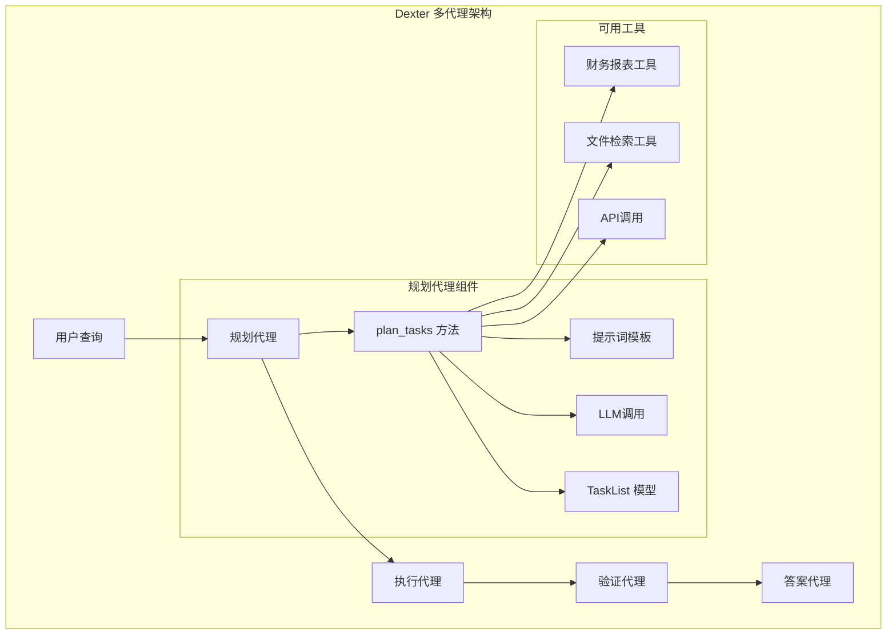
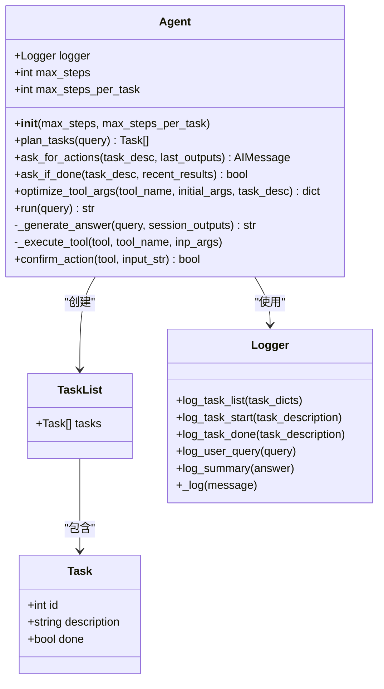
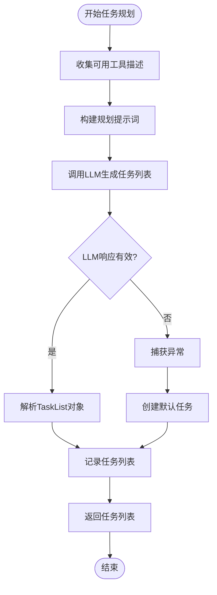
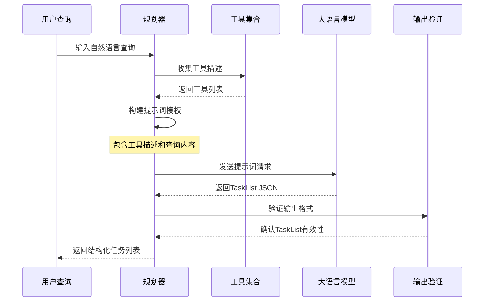
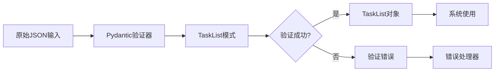
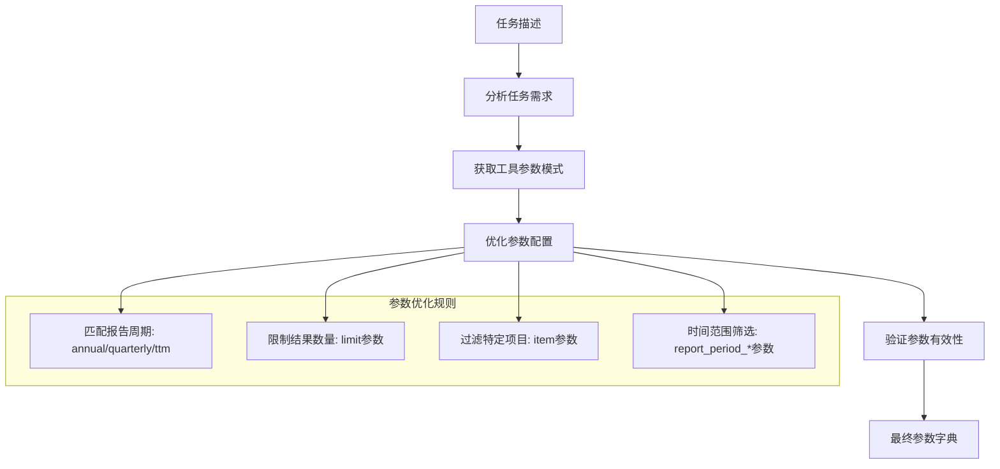
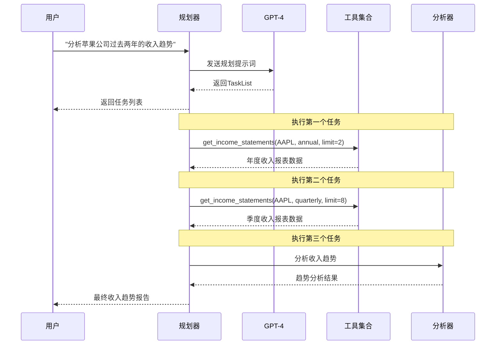

# Dexter任务规划模块技术文档

<cite>
**本文档中引用的文件**
- [agent.py](file://src/dexter/agent.py)
- [schemas.py](file://src/dexter/schemas.py)
- [prompts.py](file://src/dexter/prompts.py)
- [model.py](file://src/dexter/model.py)
- [tools/__init__.py](file://src/dexter/tools/__init__.py)
- [tools/financials.py](file://src/dexter/tools/financials.py)
- [tools/filings.py](file://src/dexter/tools/filings.py)
- [tools/constants.py](file://src/dexter/tools/constants.py)
- [README.md](file://README.md)
</cite>

## 目录
1. [概述](#概述)
2. [系统架构](#系统架构)
3. [核心组件分析](#核心组件分析)
4. [任务规划流程详解](#任务规划流程详解)
5. [数据模型设计](#数据模型设计)
6. [提示词模板系统](#提示词模板系统)
7. [工具集成机制](#工具集成机制)
8. [错误处理与降级策略](#错误处理与降级策略)
9. [完整案例分析](#完整案例分析)
10. [性能优化考虑](#性能优化考虑)
11. [总结](#总结)

## 概述

Dexter任务规划模块是整个代理系统的核心组件之一，负责将用户的自然语言查询分解为可执行的结构化任务列表。该模块通过智能的LLM调用来实现复杂的任务分解，为后续的工具执行和数据分析奠定基础。

### 主要功能特性

- **智能查询解析**：将自然语言查询转换为结构化的任务序列
- **多工具协调**：根据任务需求选择合适的工具组合
- **容错机制**：LLM调用失败时的降级处理策略
- **类型安全**：基于Pydantic的数据验证和类型约束
- **进度跟踪**：完整的任务状态管理和日志记录

## 系统架构

Dexter采用多代理架构，任务规划模块作为独立的规划组件，与其他三个核心代理协同工作：



**图表来源**
- [agent.py](file://src/dexter/agent.py#L1-L253)
- [prompts.py](file://src/dexter/prompts.py#L1-L103)

## 核心组件分析

### Agent类设计

Agent类是Dexter系统的核心控制器，其中plan_tasks方法是任务规划功能的主要入口点：



**图表来源**
- [agent.py](file://src/dexter/agent.py#L15-L253)
- [schemas.py](file://src/dexter/schemas.py#L1-L25)

**章节来源**
- [agent.py](file://src/dexter/agent.py#L15-L253)
- [schemas.py](file://src/dexter/schemas.py#L1-L25)

## 任务规划流程详解

### plan_tasks方法实现

plan_tasks方法是任务规划的核心逻辑，其执行流程如下：



**图表来源**
- [agent.py](file://src/dexter/agent.py#L25-L45)

### 提示词构建过程

任务规划的关键在于精心设计的提示词模板，该模板指导LLM生成符合要求的任务列表：



**图表来源**
- [agent.py](file://src/dexter/agent.py#L25-L45)
- [prompts.py](file://src/dexter/prompts.py#L10-L33)

**章节来源**
- [agent.py](file://src/dexter/agent.py#L25-L45)
- [prompts.py](file://src/dexter/prompts.py#L10-L33)

## 数据模型设计

### Task数据模型

Task模型定义了单个任务的基本结构，包含唯一标识、描述和完成状态：

| 字段名 | 类型 | 描述 | 默认值 |
|--------|------|------|--------|
| id | int | 任务的唯一标识符 | 必填 |
| description | str | 任务的详细描述 | 必填 |
| done | bool | 任务是否已完成 | False |

### TaskList数据模型

TaskList模型封装了多个Task对象，形成完整的任务列表：

| 字段名 | 类型 | 描述 | 默认值 |
|--------|------|------|--------|
| tasks | List[Task] | 任务列表 | 必填 |

### 数据验证机制

系统使用Pydantic进行严格的数据验证：



**图表来源**
- [schemas.py](file://src/dexter/schemas.py#L1-L25)

**章节来源**
- [schemas.py](file://src/dexter/schemas.py#L1-L25)

## 提示词模板系统

### PLANNING_SYSTEM_PROMPT设计

PLANNING_SYSTEM_PROMPT是任务规划的核心提示词模板，其设计遵循以下原则：

#### 模板结构分析

1. **角色定位**：明确规划代理的身份和职责
2. **工具介绍**：提供可用工具的完整描述
3. **任务要求**：定义任务分解的标准和格式
4. **边界条件**：处理无法用工具解决的查询

#### 工具描述格式

系统动态生成工具描述字符串，格式如下：
```
- 工具名称: 工具描述
- get_income_statements: 获取公司收入报表
- get_balance_sheets: 获取资产负债表
- get_cash_flow_statements: 获取现金流量表
- get_10K_filing_items: 获取10-K文件特定项目
- get_10Q_filing_items: 获取10-Q文件特定项目
- get_8K_filing_items: 获取8-K文件特定项目
- get_filings: 获取SEC文件元数据
```

#### 输出格式规范

提示词模板明确规定了期望的输出格式：
```json
{
    "tasks": [
        {
            "id": 1,
            "description": "具体的任务描述",
            "done": false
        }
    ]
}
```

**章节来源**
- [prompts.py](file://src/dexter/prompts.py#L10-L33)

## 工具集成机制

### 可用工具概览

Dexter提供了丰富的金融研究工具集合：

#### 财务报表工具
- **get_income_statements**: 获取损益表数据
- **get_balance_sheets**: 获取资产负债表数据  
- **get_cash_flow_statements**: 获取现金流量表数据

#### SEC文件工具
- **get_filings**: 获取公司文件元数据
- **get_10K_filing_items**: 获取10-K年度报告特定项目
- **get_10Q_filing_items**: 获取10-Q季度报告特定项目
- **get_8K_filing_items**: 获取8-K当前报告特定项目

### 工具参数优化

系统不仅规划任务，还优化工具调用参数：



**图表来源**
- [tools/__init__.py](file://src/dexter/tools/__init__.py#L1-L19)
- [tools/financials.py](file://src/dexter/tools/financials.py#L1-L98)
- [tools/filings.py](file://src/dexter/tools/filings.py#L1-L204)

**章节来源**
- [tools/__init__.py](file://src/dexter/tools/__init__.py#L1-L19)
- [tools/financials.py](file://src/dexter/tools/financials.py#L1-L98)
- [tools/filings.py](file://src/dexter/tools/filings.py#L1-L204)

## 错误处理与降级策略

### LLM调用失败处理

当LLM调用失败时，系统实现了优雅的降级机制：

```mermaid
flowchart TD
LLMCall[LLM调用] --> TryCatch{尝试捕获异常}
TryCatch --> |成功| ParseResponse[解析响应]
TryCatch --> |失败| LogError[记录错误日志]
LogError --> CreateDefaultTask[创建默认任务]
CreateDefaultTask --> DefaultTask[Task(id=1, description=query, done=False)]
ParseResponse --> ValidateOutput{验证输出}
ValidateOutput --> |有效| ReturnTasks[返回任务列表]
ValidateOutput --> |无效| LogError
DefaultTask --> ReturnTasks
ReturnTasks --> End[结束]
```

**图表来源**
- [agent.py](file://src/dexter/agent.py#L35-L45)

### 安全防护机制

系统内置多层安全防护：

1. **全局步数限制**：防止无限循环执行
2. **任务步数限制**：单个任务的最大迭代次数
3. **重复动作检测**：识别并阻止循环执行
4. **工具确认机制**：确保工具调用的安全性

**章节来源**
- [agent.py](file://src/dexter/agent.py#L35-L45)
- [agent.py](file://src/dexter/agent.py#L130-L150)

## 完整案例分析

### 案例：分析苹果公司过去两年的收入趋势

让我们通过一个具体的例子来展示任务规划的完整流程：

#### 用户查询
```
"分析苹果公司过去两年的收入趋势"
```

#### 任务规划过程

1. **工具收集阶段**
   ```
   - get_income_statements: 获取公司收入报表
   - get_balance_sheets: 获取资产负债表
   - get_cash_flow_statements: 获取现金流量表
   - get_10K_filing_items: 获取10-K文件特定项目
   - get_10Q_filing_items: 获取10-Q文件特定项目
   - get_8K_filing_items: 获取8-K文件特定项目
   - get_filings: 获取SEC文件元数据
   ```

2. **提示词构建**
   ```
   给定用户查询："分析苹果公司过去两年的收入趋势"
   创建一个要完成的任务列表。
   
   示例：{"tasks": [{"id": 1, "description": "获取苹果公司最近两年的收入报表", "done": false}]}
   ```

3. **LLM响应**
   ```json
   {
     "tasks": [
       {
         "id": 1,
         "description": "获取苹果公司过去两年的年度收入报表",
         "done": false
       },
       {
         "id": 2,
         "description": "获取苹果公司过去两年的季度收入报表",
         "done": false
       },
       {
         "id": 3,
         "description": "分析收入增长趋势并计算增长率",
         "done": false
       }
     ]
   }
   ```

4. **任务列表结构**
   ```
   TaskList(
     tasks=[
       Task(id=1, description="获取苹果公司过去两年的年度收入报表", done=False),
       Task(id=2, description="获取苹果公司过去两年的季度收入报表", done=False),
       Task(id=3, description="分析收入增长趋势并计算增长率", done=False)
     ]
   )
   ```

#### 后续执行流程

基于上述任务列表，系统将按顺序执行：

1. **执行任务1**：调用`get_income_statements`获取年度收入数据
2. **执行任务2**：调用`get_income_statements`获取季度收入数据  
3. **执行任务3**：分析数据并生成收入趋势报告



**图表来源**
- [agent.py](file://src/dexter/agent.py#L25-L45)
- [tools/financials.py](file://src/dexter/tools/financials.py#L40-L57)

**章节来源**
- [agent.py](file://src/dexter/agent.py#L25-L45)
- [prompts.py](file://src/dexter/prompts.py#L10-L33)

## 性能优化考虑

### LLM调用优化

1. **提示词压缩**：精简不必要的描述，提高响应速度
2. **参数验证缓存**：避免重复的参数验证操作
3. **批量处理**：对相似任务进行批量化处理

### 内存管理

1. **任务状态管理**：及时清理已完成的任务状态
2. **日志轮换**：定期清理过期的日志记录
3. **资源释放**：确保工具调用后的资源正确释放

### 并发处理

虽然当前实现是同步的，但系统架构支持未来的并发扩展：
- 异步任务规划
- 并行工具调用
- 流式响应处理

## 总结

Dexter任务规划模块是一个精心设计的智能系统，它通过以下关键特性实现了高效的查询分解：

### 核心优势

1. **智能化分解**：能够准确理解复杂金融查询并分解为可执行任务
2. **工具协调**：智能选择和配置最适合的工具组合
3. **容错能力**：具备完善的错误处理和降级机制
4. **类型安全**：基于Pydantic的严格数据验证
5. **可扩展性**：模块化设计支持新工具的轻松集成

### 技术创新

- **提示词工程**：精心设计的提示词模板确保高质量的任务分解
- **参数优化**：自动优化工具调用参数以提高效率
- **多代理协作**：与其他代理组件无缝集成
- **安全防护**：多层次的安全机制保护系统稳定运行

### 应用价值

该模块为Dexter系统提供了强大的任务规划能力，使其能够：
- 处理复杂的金融研究查询
- 自动化数据收集和分析流程
- 生成全面、准确的研究报告
- 在各种金融场景下提供可靠的服务

通过这种智能的任务规划机制，Dexter能够真正实现自主化的金融研究，为用户提供专业级的投资分析服务。