# 动作决策

<cite>
**本文档中引用的文件**
- [agent.py](file://src/dexter/agent.py)
- [prompts.py](file://src/dexter/prompts.py)
- [model.py](file://src/dexter/model.py)
- [tools/__init__.py](file://src/dexter/tools/__init__.py)
- [tools/financials.py](file://src/dexter/tools/financials.py)
- [tools/filings.py](file://src/dexter/tools/filings.py)
- [schemas.py](file://src/dexter/schemas.py)
- [utils/logger.py](file://src/dexter/utils/logger.py)
- [utils/ui.py](file://src/dexter/utils/ui.py)
</cite>

## 目录
1. [简介](#简介)
2. [系统架构概览](#系统架构概览)
3. [核心组件分析](#核心组件分析)
4. [动作决策机制详解](#动作决策机制详解)
5. [提示词系统](#提示词系统)
6. [工具集成机制](#工具集成机制)
7. [错误处理与边界情况](#错误处理与边界情况)
8. [性能优化策略](#性能优化策略)
9. [故障排除指南](#故障排除指南)
10. [总结](#总结)

## 简介

Dexter的动作决策机制是其智能代理系统的核心组件，负责根据当前任务描述和历史执行结果，智能地决定下一步应该调用哪个工具。该机制通过`Agent.ask_for_actions()`方法实现，该方法作为执行代理的核心，体现了Dexter在金融研究领域的自主决策能力。

动作决策机制采用基于语言模型的方法，结合上下文信息、历史结果和可用工具库，为每个任务阶段提供精确的行动指导。该系统特别强调在财务研究范围内进行有针对性的数据检索和分析，确保所有工具调用都符合特定的业务需求。

## 系统架构概览

Dexter的动作决策系统采用分层架构设计，包含多个相互协作的组件：

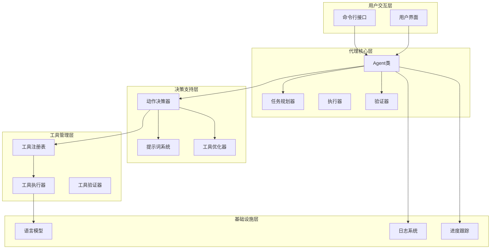

**图表来源**
- [agent.py](file://src/dexter/agent.py#L1-L253)
- [prompts.py](file://src/dexter/prompts.py#L1-L103)
- [model.py](file://src/dexter/model.py#L1-L46)

**章节来源**
- [agent.py](file://src/dexter/agent.py#L1-L253)
- [prompts.py](file://src/dexter/prompts.py#L1-L103)

## 核心组件分析

### Agent类：动作决策的中央控制器

Agent类是动作决策机制的主要容器，提供了完整的生命周期管理：

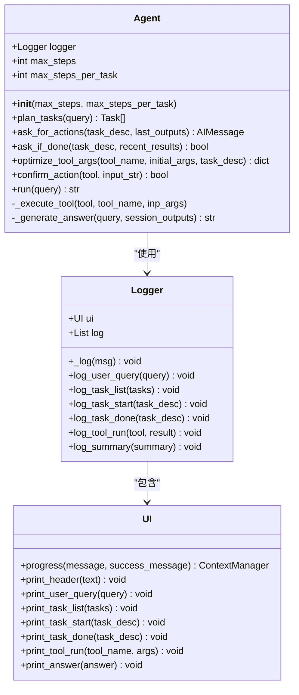

**图表来源**
- [agent.py](file://src/dexter/agent.py#L17-L253)
- [utils/logger.py](file://src/dexter/utils/logger.py#L5-L43)
- [utils/ui.py](file://src/dexter/utils/ui.py#L100-L191)

### 工具注册系统

Dexter维护了一个统一的工具注册表，包含了所有可用的金融研究工具：

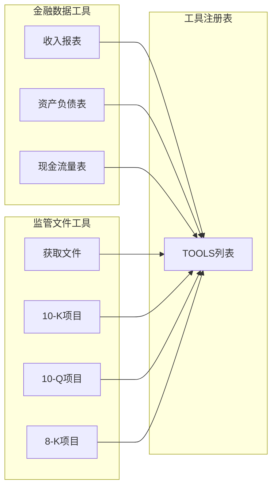

**图表来源**
- [tools/__init__.py](file://src/dexter/tools/__init__.py#L10-L18)
- [tools/financials.py](file://src/dexter/tools/financials.py#L1-L98)
- [tools/filings.py](file://src/dexter/tools/filings.py#L1-L204)

**章节来源**
- [agent.py](file://src/dexter/agent.py#L17-L253)
- [tools/__init__.py](file://src/dexter/tools/__init__.py#L1-L19)

## 动作决策机制详解

### ask_for_actions方法的核心逻辑

`Agent.ask_for_actions()`方法是动作决策机制的核心，它接收当前任务描述和历史输出，返回LLM建议的下一步行动：

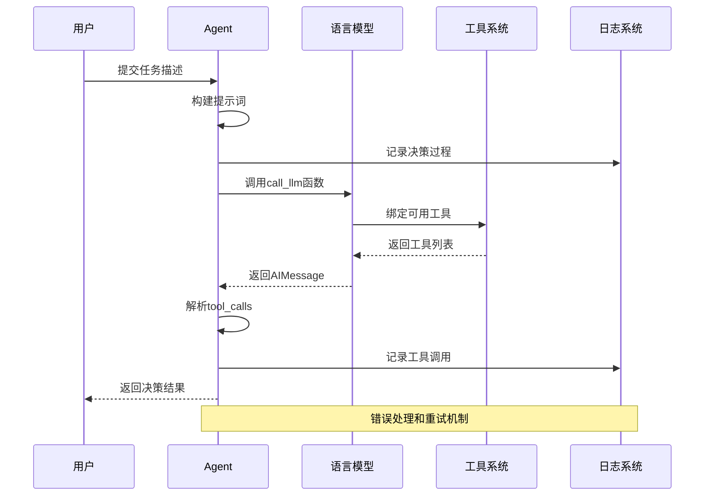

**图表来源**
- [agent.py](file://src/dexter/agent.py#L50-L62)
- [model.py](file://src/dexter/model.py#L15-L45)

### 动作决策的工作流程

动作决策过程遵循严格的步骤序列，确保每个决策都基于充分的信息：

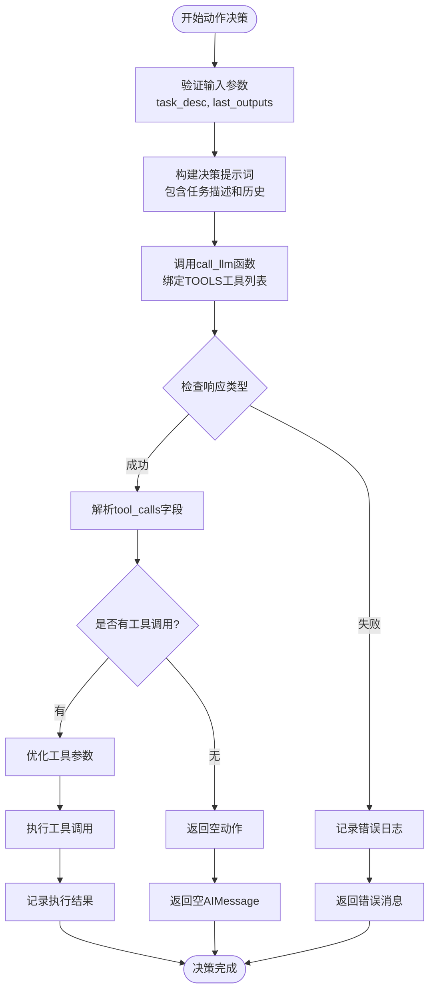

**图表来源**
- [agent.py](file://src/dexter/agent.py#L50-L62)
- [model.py](file://src/dexter/model.py#L15-L45)

### LLM响应结构分析

当`ask_for_actions()`方法成功执行时，它返回一个`AIMessage`对象，其中包含重要的`tool_calls`字段：

| 字段名称 | 类型 | 描述 | 示例值 |
|---------|------|------|--------|
| `content` | str | LLM生成的文本内容 | "基于最新的财务数据，建议查询最近的10-Q报告" |
| `tool_calls` | List[Dict] | 工具调用列表 | `[{"name": "get_10Q_filing_items", "args": {"ticker": "AAPL", "year": 2024, "quarter": 1}}]` |
| `name` | str | 工具名称 | "get_filings" |
| `args` | Dict | 工具参数 | `{"ticker": "MSFT", "filing_type": "10-K", "limit": 5}` |

**章节来源**
- [agent.py](file://src/dexter/agent.py#L50-L62)
- [model.py](file://src/dexter/model.py#L15-L45)

## 提示词系统

### ACTION_SYSTEM_PROMPT的关键规则

`ACTION_SYSTEM_PROMPT`是动作决策的核心提示词，定义了LLM在选择工具时必须遵循的关键规则：

#### 关键规则1：必须使用filing_type过滤参数

提示词明确规定，当需要特定类型的SEC文件时，必须使用`filing_type`参数进行过滤：

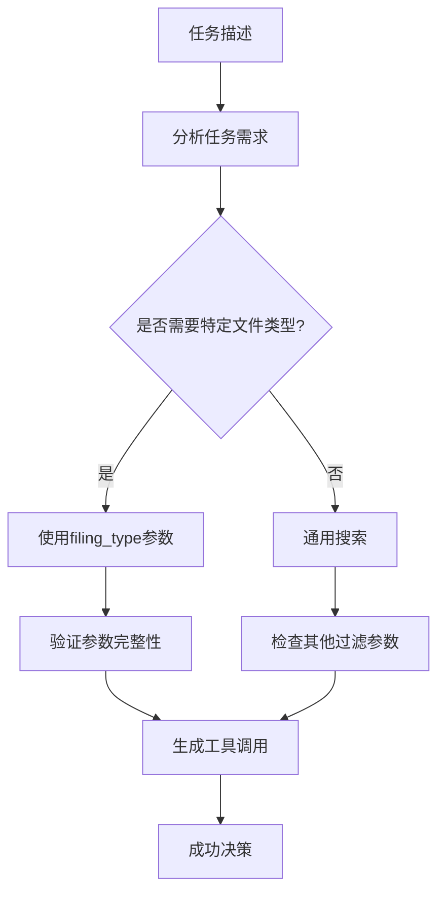

**图表来源**
- [prompts.py](file://src/dexter/prompts.py#L35-L45)

#### 关键规则2：范围限制和边界检测

提示词强调动作决策的范围限制，明确指出如果任务超出财务研究范围，则不应调用任何工具：

| 检测条件 | 处理方式 | 结果 |
|---------|---------|------|
| 一般知识问题 | 不调用工具 | 直接回答 |
| 数学计算问题 | 不调用工具 | 直接回答 |
| 非财务研究主题 | 不调用工具 | 直接回答 |
| 可用工具可解决 | 调用相应工具 | 执行具体操作 |
| 工具组合需求 | 顺序调用多个工具 | 连续执行 |

#### 关键规则3：参数匹配和优化

提示词要求仔细阅读所有参数描述，并使用与任务要求相匹配的参数：

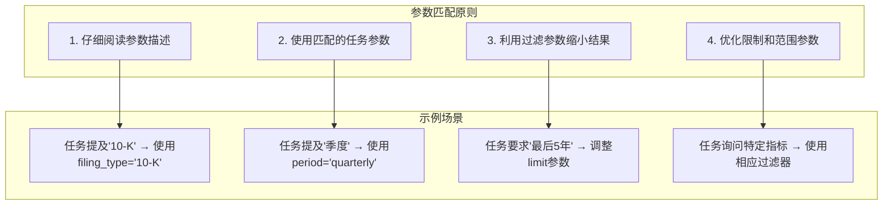

**图表来源**
- [prompts.py](file://src/dexter/prompts.py#L35-L45)
- [tools/filings.py](file://src/dexter/tools/filings.py#L15-L25)

**章节来源**
- [prompts.py](file://src/dexter/prompts.py#L35-L45)

## 工具集成机制

### call_llm函数的bind_tools功能

动作决策机制通过`call_llm`函数的`bind_tools`功能将可用工具列表暴露给LLM：

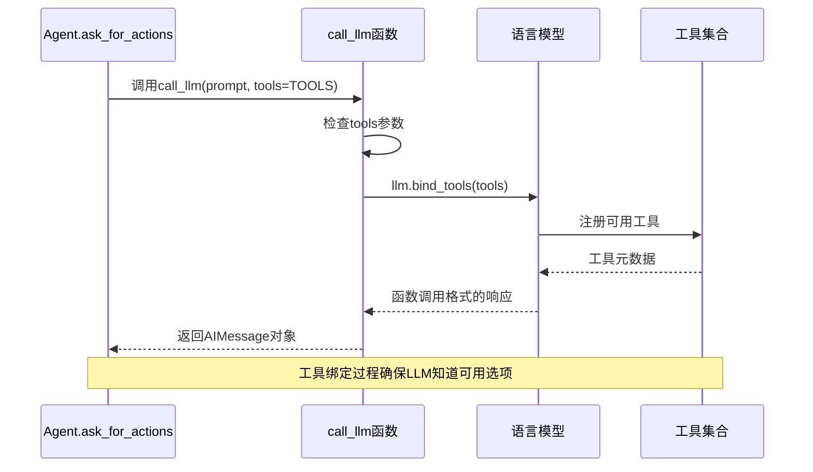

**图表来源**
- [model.py](file://src/dexter/model.py#L15-L45)
- [agent.py](file://src/dexter/agent.py#L58-L60)

### 工具调用的动态绑定

工具系统采用动态绑定机制，允许运行时确定可用工具集：

| 绑定阶段 | 操作内容 | 影响范围 |
|---------|---------|---------|
| 初始化 | 加载所有可用工具 | 全局工具注册表 |
| 决策前 | 绑定当前任务相关工具 | 当前LLM会话 |
| 执行时 | 动态选择具体工具 | 单次工具调用 |
| 验证后 | 更新工具可用性状态 | 下一决策周期 |

### 工具参数优化机制

动作决策系统不仅选择工具，还优化工具参数以提高效率：

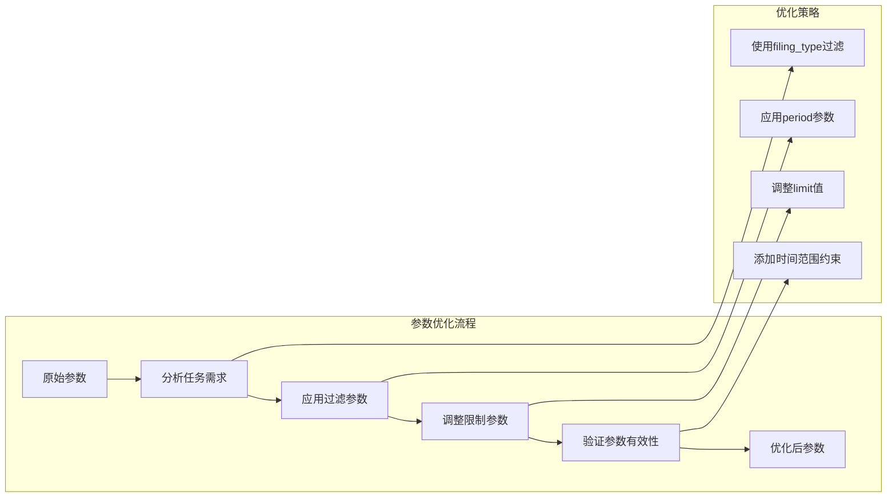

**图表来源**
- [agent.py](file://src/dexter/agent.py#L75-L105)

**章节来源**
- [model.py](file://src/dexter/model.py#L15-L45)
- [agent.py](file://src/dexter/agent.py#L58-L60)
- [agent.py](file://src/dexter/agent.py#L75-L105)

## 错误处理与边界情况

### 查询范围检测机制

当查询超出财务研究范围时，系统通过不返回任何工具调用来优雅地处理：

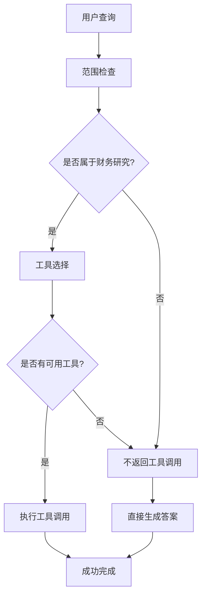

**图表来源**
- [prompts.py](file://src/dexter/prompts.py#L40-L45)

### 异常处理策略

动作决策机制实现了多层次的异常处理：

| 异常类型 | 处理策略 | 恢复机制 |
|---------|---------|---------|
| LLM调用失败 | 记录错误并返回默认消息 | 自动重试最多3次 |
| 工具执行失败 | 记录错误并继续执行 | 跳过失败工具，继续其他任务 |
| 参数验证失败 | 使用原始参数重新尝试 | 回退到默认配置 |
| 循环检测 | 中止执行并记录警告 | 返回部分结果 |

### 安全防护机制

系统实现了多层安全防护：

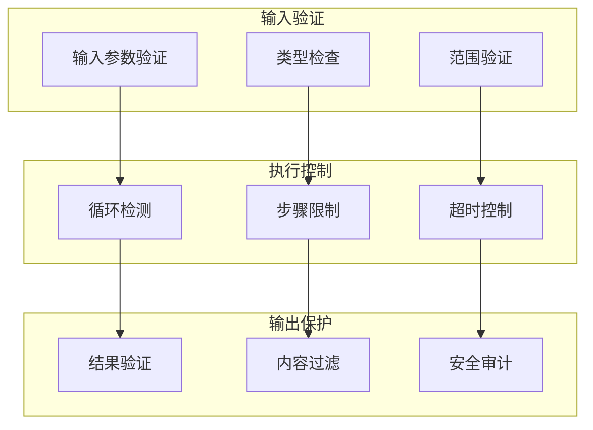

**图表来源**
- [agent.py](file://src/dexter/agent.py#L170-L190)

**章节来源**
- [agent.py](file://src/dexter/agent.py#L58-L62)
- [agent.py](file://src/dexter/agent.py#L170-L190)

## 性能优化策略

### 并发执行优化

动作决策系统支持并发工具执行，提高整体效率：

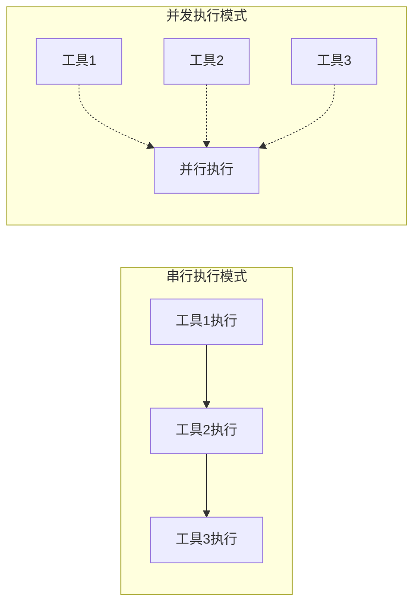

### 缓存和记忆机制

系统实现了智能缓存机制，避免重复计算：

| 缓存类型 | 存储内容 | 生命周期 | 触发条件 |
|---------|---------|---------|---------|
| 工具参数缓存 | 优化后的工具参数 | 会话级别 | 相同任务重复执行 |
| 结果缓存 | 已获取的数据 | 任务级别 | 相同查询重复出现 |
| 上下文缓存 | 历史执行信息 | 会话级别 | 复杂任务分解 |
| 配置缓存 | 系统配置参数 | 应用级别 | 首次加载时 |

### 资源管理策略

动作决策系统采用资源管理策略确保系统稳定性：

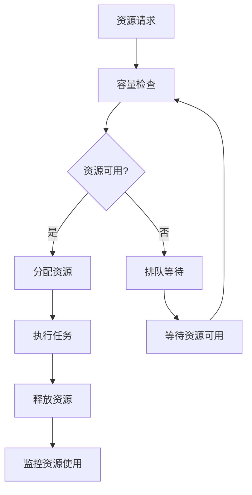

**图表来源**
- [agent.py](file://src/dexter/agent.py#L170-L190)

## 故障排除指南

### 常见问题诊断

| 问题症状 | 可能原因 | 解决方案 |
|---------|---------|---------|
| 不返回工具调用 | 查询超出范围 | 检查查询内容，确认是否属于财务研究领域 |
| 工具调用失败 | 参数不匹配 | 验证工具参数schema，确保参数类型正确 |
| LLM调用超时 | 网络连接问题 | 检查网络连接，确认API密钥有效 |
| 循环执行 | 任务逻辑问题 | 检查任务描述，确保有明确的完成标准 |

### 调试技巧

动作决策系统的调试可以通过以下方式进行：

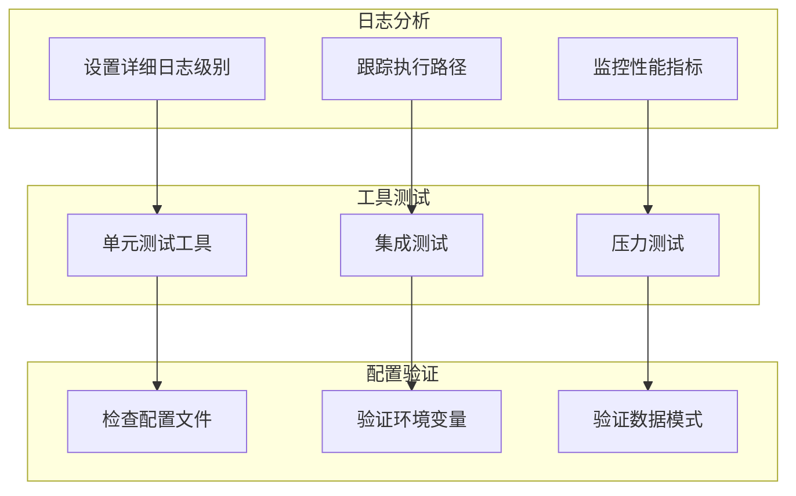

### 性能监控指标

动作决策系统的关键性能指标包括：

| 指标名称 | 正常范围 | 监控方法 | 优化目标 |
|---------|---------|---------|---------|
| 决策响应时间 | < 5秒 | 请求计时器 | 减少LLM调用延迟 |
| 工具成功率 | > 95% | 成功/失败计数 | 提高工具可靠性 |
| 循环检测率 | < 1% | 循环计数器 | 改进任务规划 |
| 资源利用率 | < 80% | 资源监控 | 优化资源分配 |

**章节来源**
- [agent.py](file://src/dexter/agent.py#L58-L62)
- [utils/logger.py](file://src/dexter/utils/logger.py#L1-L43)

## 总结

Dexter的动作决策机制代表了智能代理系统在金融研究领域的创新实践。通过`Agent.ask_for_actions()`方法，系统实现了以下核心能力：

### 技术优势

1. **智能工具选择**：基于上下文信息和历史结果的动态工具选择
2. **参数优化**：自动优化工具参数以提高查询效率和准确性
3. **范围控制**：智能识别查询范围，避免不相关的工具调用
4. **错误恢复**：完善的异常处理和重试机制

### 架构特点

1. **模块化设计**：清晰的职责分离和组件解耦
2. **可扩展性**：易于添加新工具和更新提示词
3. **安全性**：多层防护机制确保系统稳定运行
4. **可观测性**：完整的日志记录和监控体系

### 应用价值

动作决策机制使Dexter能够在复杂的金融研究环境中自主导航，为用户提供准确、及时的财务信息。该机制的成功实施证明了大型语言模型在专业领域应用的巨大潜力，特别是在需要精确工具选择和参数优化的场景中。

通过持续的优化和改进，动作决策机制将继续提升Dexter在金融研究领域的服务能力，为用户提供更加智能和高效的决策支持。