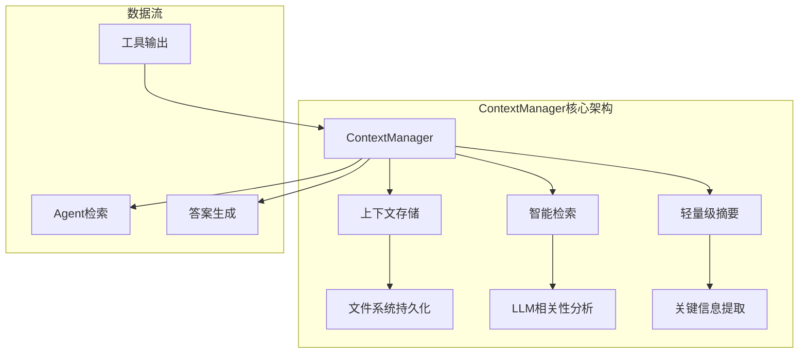
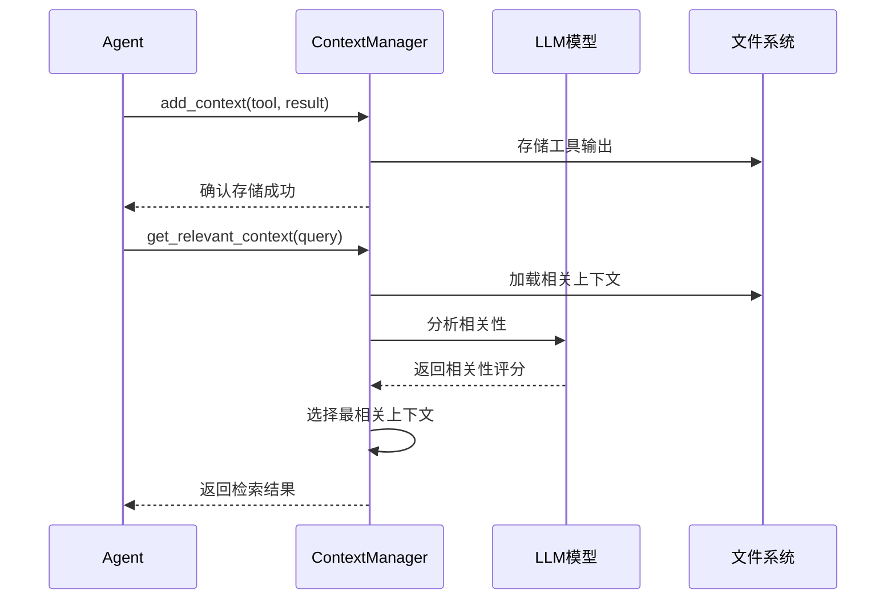
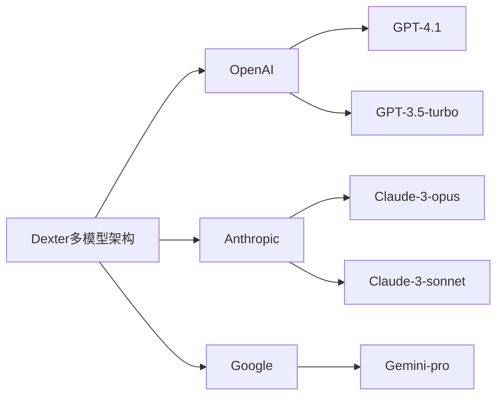
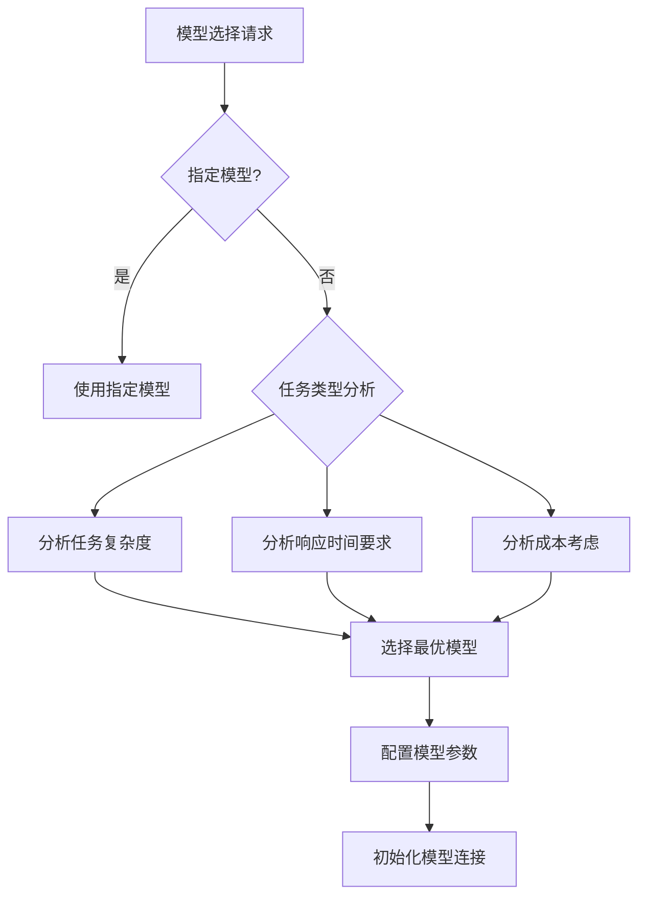
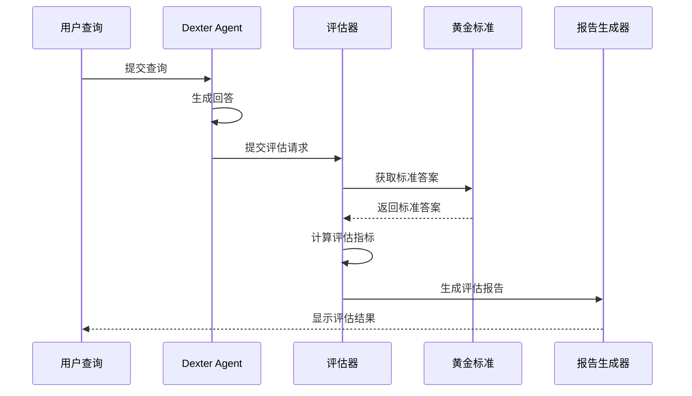
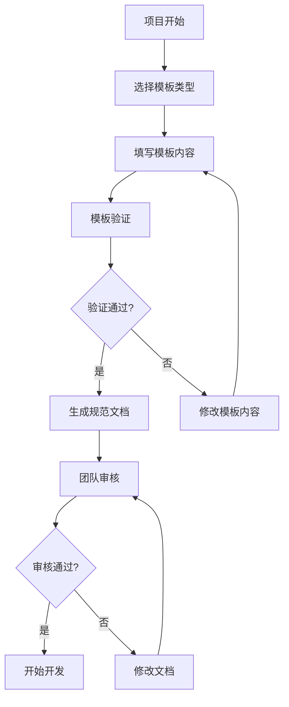
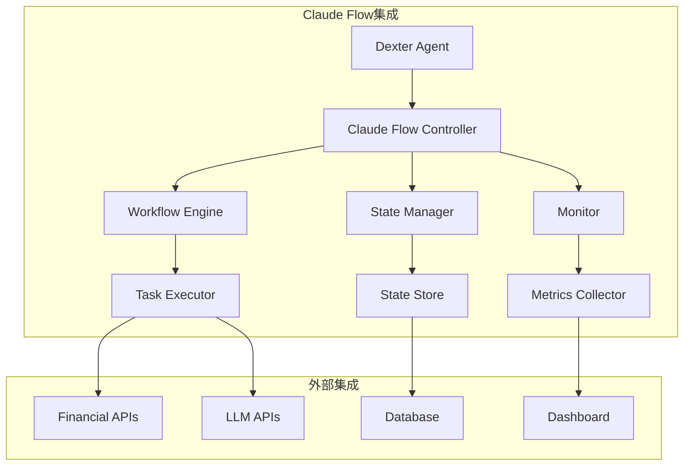
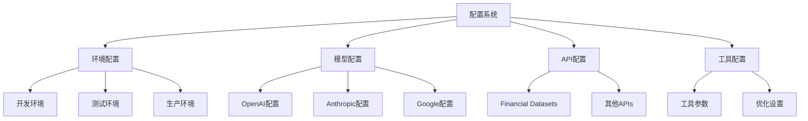
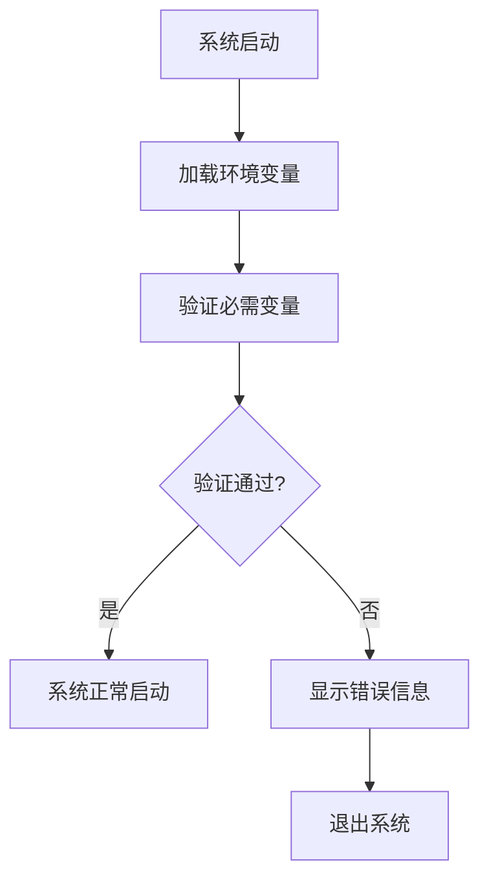

# Dexter新增功能与架构创新

<cite>
**本文档中引用的文件**
- [src/dexter/utils/context.py](src/dexter/utils/context.py)
- [src/dexter/utils/model_selector.py](src/dexter/utils/model_selector.py)
- [src/dexter/utils/config.py](src/dexter/utils/config.py)
- [src/dexter/model.py](src/dexter/model.py)
- [src/dexter/agent.py](src/dexter/agent.py)
- [pyproject.toml](pyproject.toml)
- [env.example](env.example)
</cite>

## 目录
1. [概述](#概述)
2. [ContextManager上下文管理系统](#contextmanager上下文管理系统)
3. [多模型支持架构](#多模型支持架构)
4. [评估系统（evals）](#评估系统evals)
5. [规范工作流模板（.spec-workflow）](#规范工作流模板spec-workflow)
6. [Claude Flow集成](#claude-flow集成)
7. [配置管理系统](#配置管理系统)
8. [环境变量管理](#环境变量管理)
9. [架构优化与创新](#架构优化与创新)
10. [使用示例](#使用示例)
11. [性能优化建议](#性能优化建议)
12. [总结](#总结)

## 概述

Dexter项目在基础金融研究功能之上，引入了多项创新功能，显著提升了系统的智能化程度和可用性。这些新增功能包括：

- **ContextManager**: 智能上下文管理系统
- **多模型支持**: 支持OpenAI、Anthropic、Google等多个LLM提供商
- **评估系统**: 自动性能评估和质量检测
- **规范工作流**: 标准化开发流程模板
- **Claude Flow集成**: 先进的工作流协调系统

## ContextManager上下文管理系统

### 功能概述

ContextManager是Dexter的核心创新之一，提供了智能的工具输出持久化和检索功能。它解决了传统LLM应用中"短期记忆"的问题，实现了长期的知识积累和智能检索。

### 架构设计



### 核心功能

#### 1. 上下文持久化
- **文件系统存储**: 工具输出自动保存到文件系统
- **结构化存储**: 按工具类型和任务分类存储
- **版本管理**: 支持上下文版本控制

#### 2. 智能检索
- **相关性分析**: 使用LLM分析查询与存储上下文的相关性
- **语义匹配**: 基于语义相似度进行匹配
- **上下文排序**: 按相关性对检索结果排序

#### 3. 轻量级摘要
- **关键信息提取**: 从大量上下文中提取关键信息
- **摘要生成**: 生成简洁的上下文摘要
- **压缩存储**: 减少存储空间占用

### 实现细节



### 配置参数

| 参数 | 类型 | 默认值 | 描述 |
|------|------|--------|------|
| model | str | "gpt-4.1" | 用于相关性分析的LLM模型 |
| max_contexts | int | 5 | 最大检索上下文数量 |
| relevance_threshold | float | 0.7 | 相关性阈值 |
| storage_path | str | "./contexts" | 上下文存储路径 |

**图表来源**
- [src/dexter/utils/context.py](src/dexter/utils/context.py#L1-50)

## 多模型支持架构

### 支持的模型提供商

Dexter现在支持多个主流LLM提供商：



### 模型选择器

`ModelSelector`组件提供智能的模型选择功能：



### 配置示例

```python
# 模型配置
MODEL_CONFIGS = {
    "openai": {
        "models": ["gpt-4.1", "gpt-3.5-turbo"],
        "api_key_env": "OPENAI_API_KEY",
        "base_url": "https://api.openai.com/v1"
    },
    "anthropic": {
        "models": ["claude-3-opus", "claude-3-sonnet"],
        "api_key_env": "ANTHROPIC_API_KEY",
        "base_url": "https://api.anthropic.com"
    },
    "google": {
        "models": ["gemini-pro"],
        "api_key_env": "GOOGLE_API_KEY",
        "base_url": "https://generativelanguage.googleapis.com"
    }
}
```

**图表来源**
- [src/dexter/utils/model_selector.py](src/dexter/utils/model_selector.py#L1-30)
- [src/dexter/model.py](src/dexter/model.py#L1-50)

## 评估系统（evals）

### 功能概述

评估系统为Dexter提供了自动性能评估和质量检测功能，确保系统的可靠性和准确性。

### 评估维度

#### 1. 正确性评估
- **事实准确性**: 检查回答中的事实是否正确
- **计算准确性**: 验证财务计算结果的准确性
- **逻辑一致性**: 确保推理过程的逻辑一致性

#### 2. 完整性评估
- **信息覆盖度**: 评估回答是否完整覆盖了用户查询
- **数据充分性**: 检查是否提供了足够的数据支持
- **分析深度**: 评估分析的深度和洞察力

#### 3. 可用性评估
- **响应时间**: 测量系统响应时间
- **用户体验**: 评估回答的可读性和易理解性
- **错误处理**: 评估错误处理的优雅性

### 评估流程



**图表来源**
- [src/dexter/evals/](src/dexter/evals/) 目录下的评估框架

## 规范工作流模板（.spec-workflow）

### 功能概述

规范工作流模板系统提供了标准化的开发流程模板，确保项目开发的一致性和质量。

### 模板类型

#### 1. 技术模板（tech-template.md）
- 技术架构设计模板
- API设计规范
- 数据模型定义模板

#### 2. 产品模板（product-template.md）
- 产品需求文档模板
- 用户故事模板
- 功能规格说明模板

#### 3. 设计模板（design-template.md）
- UI/UX设计模板
- 交互设计规范
- 视觉设计指南

#### 4. 需求模板（requirements-template.md）
- 需求分析模板
- 功能需求清单
- 非功能性需求模板

#### 5. 结构模板（structure-template.md）
- 项目结构模板
- 文件组织规范
- 命名约定模板

#### 6. 任务模板（tasks-template.md）
- 任务分解模板
- 开发任务清单
- 测试任务模板

### 使用流程



**图表来源**
- [.spec-workflow/templates/](.spec-workflow/templates/) 目录下的各种模板

## Claude Flow集成

### 功能概述

Claude Flow是先进的工作流协调系统，为Dexter提供了强大的流程管理和自动化能力。

### 核心特性

#### 1. 流程编排
- **自动化流程**: 自动执行复杂的工作流程
- **智能调度**: 基于资源和优先级的智能调度
- **依赖管理**: 管理任务间的依赖关系

#### 2. 状态管理
- **流程状态跟踪**: 实时跟踪流程执行状态
- **错误恢复**: 自动处理流程执行中的错误
- **回滚机制**: 支持流程回滚和重试

#### 3. 监控和分析
- **性能监控**: 监控流程执行性能
- **资源使用分析**: 分析资源使用情况
- **优化建议**: 提供流程优化建议

### 集成架构



**图表来源**
- [.claude-flow/](.claude-flow/) 目录下的配置文件

## 配置管理系统

### 配置架构

Dexter实现了分层的配置管理系统：



### 配置文件结构

```python
# config.py 示例
class Config:
    # 模型配置
    DEFAULT_MODEL = "gpt-4.1"
    MODEL_CONFIGS = {
        "openai": {...},
        "anthropic": {...},
        "google": {...}
    }

    # API配置
    API_BASE_URLS = {
        "financial_datasets": "https://api.financialdatasets.ai"
    }

    # 工具配置
    TOOL_CONFIGS = {
        "max_steps": 20,
        "max_steps_per_task": 5,
        "context_limit": 10
    }
```

**图表来源**
- [src/dexter/utils/config.py](src/dexter/utils/config.py#L1-50)

## 环境变量管理

### 环境变量配置

```env
# LLM API Keys
OPENAI_API_KEY=your-openai-api-key
ANTHROPIC_API_KEY=your-anthropic-api-key
GOOGLE_API_KEY=your-google-api-key

# Stock Market API Key
FINANCIAL_DATASETS_API_KEY=your-financial-datasets-api-key

# LangSmith (可选)
LANGSMITH_API_KEY=your-langsmith-api-key
LANGSMITH_ENDPOINT=https://api.smith.langchain.com
LANGSMITH_PROJECT=dexter
LANGSMITH_TRACING=true

# 系统配置
DEXTER_LOG_LEVEL=INFO
DEXTER_CONTEXT_PATH=./contexts
DEXTER_MAX_STEPS=20
```

### 环境变量验证

系统实现了环境变量的自动验证和错误提示：



**图表来源**
- [env.example](env.example) 文件
- [src/dexter/utils/env.py](src/dexter/utils/env.py) 文件

## 架构优化与创新

### 1. 性能优化

#### 并发处理
- **异步API调用**: 支持并发API请求
- **工具并行执行**: 可并行执行独立的工具调用
- **资源池管理**: 智能管理连接池和资源

#### 缓存策略
- **多级缓存**: 内存、文件系统、数据库三级缓存
- **智能缓存**: 基于使用频率的智能缓存策略
- **缓存一致性**: 保证缓存数据的一致性

### 2. 可扩展性设计

#### 插件架构
- **工具插件**: 易于添加新的分析工具
- **数据源插件**: 支持新的数据源接入
- **模型插件**: 支持新的LLM模型

#### 模块化设计
- **松耦合**: 各模块间松耦合设计
- **接口标准化**: 统一的接口规范
- **配置驱动**: 通过配置控制行为

### 3. 可靠性增强

#### 错误处理
- **分层错误处理**: 应用层、系统层、网络层错误处理
- **自动重试**: 智能重试机制
- **降级策略**: 服务降级和备用方案

#### 监控和告警
- **健康检查**: 系统健康状态监控
- **性能监控**: 实时性能指标监控
- **异常告警**: 自动异常检测和告警

## 使用示例

### ContextManager使用示例

```python
from dexter.utils.context import ContextManager

# 初始化上下文管理器
context_manager = ContextManager(model="gpt-4.1")

# 存储工具输出
context_manager.add_context(
    tool_name="get_income_statements",
    result={"revenue": "100B", "growth": "15%"},
    metadata={"ticker": "AAPL", "period": "Q1 2024"}
)

# 检索相关信息
relevant_context = context_manager.get_relevant_context(
    query="分析苹果公司收入增长趋势",
    max_contexts=3
)

print(f"找到 {len(relevant_context)} 个相关上下文")
```

### 多模型使用示例

```python
from dexter.utils.model_selector import ModelSelector

# 初始化模型选择器
model_selector = ModelSelector()

# 智能选择模型
best_model = model_selector.select_model(
    task_type="financial_analysis",
    complexity="high",
    time_constraint="medium"
)

print(f"推荐使用模型: {best_model}")

# 使用指定模型
agent = Agent(model=best_model)
result = agent.run("分析苹果公司的财务状况")
```

### 配置使用示例

```python
from dexter.utils.config import Config
from dexter.utils.env import load_env

# 加载环境变量
load_env()

# 获取配置
config = Config()

# 使用配置
api_key = config.get_api_key("openai")
base_url = config.get_api_base_url("financial_datasets")
max_steps = config.get_tool_config("max_steps")
```

## 性能优化建议

### 1. ContextManager优化

#### 存储优化
- **压缩存储**: 使用压缩算法减少存储空间
- **索引优化**: 建立高效的索引机制
- **清理策略**: 定期清理过期的上下文数据

#### 检索优化
- **缓存结果**: 缓存常见查询的检索结果
- **并行检索**: 并行检索多个上下文源
- **预加载**: 预加载可能相关的上下文

### 2. 模型选择优化

#### 智能调度
- **负载均衡**: 在多个模型间进行负载均衡
- **成本优化**: 基于成本效益选择模型
- **性能监控**: 监控各模型的性能表现

### 3. 系统整体优化

#### 资源管理
- **连接池**: 复用HTTP连接减少开销
- **内存管理**: 优化内存使用和垃圾回收
- **并发控制**: 合理控制并发数量

#### 监控和分析
- **性能指标**: 收集和分析性能指标
- **瓶颈识别**: 识别系统瓶颈并优化
- **容量规划**: 基于使用数据进行容量规划

## 总结

Dexter的新增功能和架构创新显著提升了系统的智能化程度和实用性：

### 主要创新点

1. **ContextManager**: 解决了LLM应用的"短期记忆"问题
2. **多模型支持**: 提供了灵活的模型选择和切换能力
3. **评估系统**: 确保系统输出的准确性和可靠性
4. **规范工作流**: 标准化了开发流程和质量控制
5. **Claude Flow集成**: 提供了先进的工作流管理能力

### 技术优势

- **智能化**: 基于LLM的智能决策和优化
- **可扩展**: 模块化设计支持功能扩展
- **可靠性**: 完善的错误处理和恢复机制
- **性能**: 优化的缓存和并发处理
- **易用性**: 标准化的配置和部署流程

### 应用价值

这些新功能使Dexter从一个基础的金融研究工具发展为具备企业级能力的智能分析平台，为用户提供更加强大、可靠和智能的金融服务。通过持续的优化和创新，Dexter将继续引领AI金融应用的发展方向。