# Dexter核心架构深度技术文档

<cite>
**本文档中引用的文件**
- [agent.py](file://src/dexter/agent.py)
- [model.py](file://src/dexter/model.py)
- [prompts.py](file://src/dexter/prompts.py)
- [schemas.py](file://src/dexter/schemas.py)
- [tools/__init__.py](file://src/dexter/tools/__init__.py)
- [tools/financials.py](file://src/dexter/tools/financials.py)
- [tools/filings.py](file://src/dexter/tools/filings.py)
- [tools/constants.py](file://src/dexter/tools/constants.py)
- [tools/api.py](file://src/dexter/tools/api.py)
- [utils/logger.py](file://src/dexter/utils/logger.py)
- [utils/ui.py](file://src/dexter/utils/ui.py)
- [cli.py](file://src/dexter/cli.py)
</cite>

## 目录
1. [引言](#引言)
2. [系统架构概览](#系统架构概览)
3. [Agent类核心架构](#agent类核心架构)
4. [多代理协作模式](#多代理协作模式)
5. [LLM集成与重试机制](#llm集成与重试机制)
6. [提示词系统与提示工程](#提示词系统与提示工程)
7. [工具集架构](#工具集架构)
8. [数据流与处理管道](#数据流与处理管道)
9. [错误处理与安全机制](#错误处理与安全机制)
10. [性能优化策略](#性能优化策略)
11. [总结](#总结)

## 引言

Dexter是一个自主的金融研究智能体，采用多代理架构模式，通过LLM驱动的任务分解、执行和验证机制，为用户提供深入的财务数据分析服务。该系统的核心创新在于将传统的单一Agent模式扩展为四个专门化的代理组件，每个代理负责特定的功能领域，实现了高度专业化和协作式的智能体架构。

## 系统架构概览

Dexter系统采用分层架构设计，从底层的数据访问层到顶层的用户交互界面，形成了一个完整的智能体生态系统。

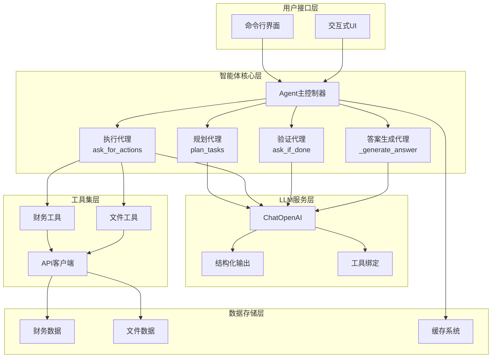

**图表来源**
- [agent.py](file://src/dexter/agent.py#L1-L253)
- [model.py](file://src/dexter/model.py#L1-L46)
- [cli.py](file://src/dexter/cli.py#L1-L33)

**章节来源**
- [agent.py](file://src/dexter/agent.py#L1-L50)
- [model.py](file://src/dexter/model.py#L1-L46)

## Agent类核心架构

Agent类是Dexter系统的核心控制器，采用面向对象的设计模式，封装了整个智能体的生命周期管理和任务协调功能。

### 类结构设计

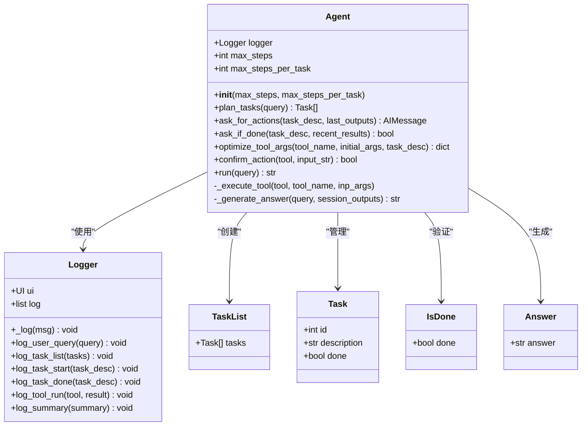

**图表来源**
- [agent.py](file://src/dexter/agent.py#L15-L253)
- [schemas.py](file://src/dexter/schemas.py#L1-L25)

### 核心属性与配置

Agent类的核心配置参数包括：
- **max_steps**: 全局最大步数限制，防止无限循环
- **max_steps_per_task**: 每个任务的最大执行步数
- **logger**: 日志记录器，提供完整的执行跟踪

这些配置参数确保了系统的稳定性和安全性，同时为调试和监控提供了必要的支持。

**章节来源**
- [agent.py](file://src/dexter/agent.py#L15-L25)

## 多代理协作模式

Dexter采用独特的多代理架构模式，将复杂的智能体功能分解为四个专门化的代理组件，每个代理都有明确的职责边界和专业能力。

### 规划代理（Plan Tasks）

规划代理负责将用户的自然语言查询分解为可执行的任务列表。这是整个系统的第一步，也是最关键的一步。

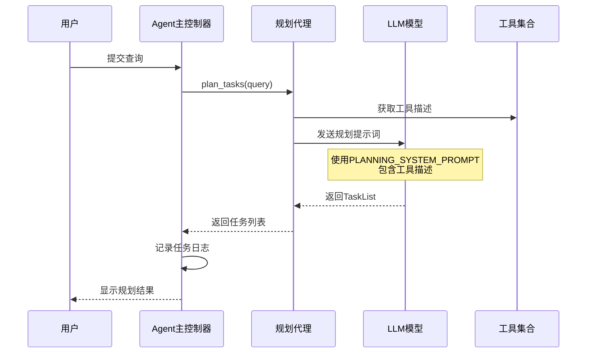

**图表来源**
- [agent.py](file://src/dexter/agent.py#L25-L45)
- [prompts.py](file://src/dexter/prompts.py#L10-L25)

规划代理的核心功能包括：
- **查询理解**: 分析用户查询的意图和范围
- **任务分解**: 将复杂查询拆解为多个子任务
- **工具匹配**: 根据任务需求选择合适的工具
- **优先级排序**: 确定任务的执行顺序

### 动作代理（Ask for Actions）

动作代理负责在每个任务执行过程中，根据当前状态和历史结果，决定下一步的最佳行动方案。

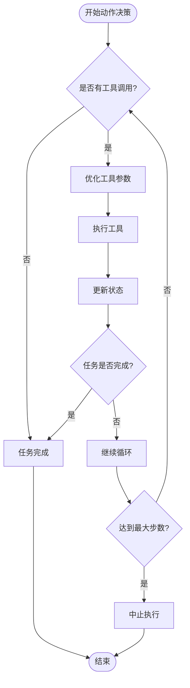

**图表来源**
- [agent.py](file://src/dexter/agent.py#L47-L65)
- [agent.py](file://src/dexter/agent.py#L120-L180)

动作代理的关键特性：
- **上下文感知**: 考虑历史执行结果和当前状态
- **工具选择**: 基于任务要求选择最合适的工具
- **参数优化**: 自动调整工具参数以提高效率
- **循环检测**: 防止重复无效的操作

### 验证代理（Ask if Done）

验证代理负责评估当前任务是否已经达到预期目标，这是一个关键的质量控制环节。

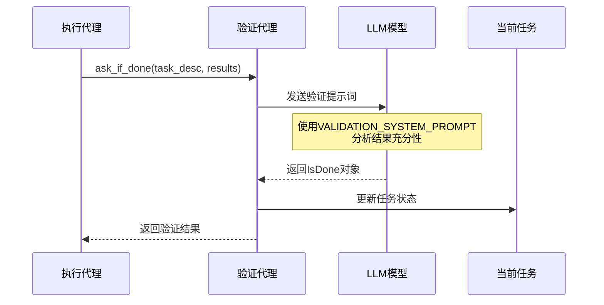

**图表来源**
- [agent.py](file://src/dexter/agent.py#L67-L80)
- [prompts.py](file://src/dexter/prompts.py#L35-L45)

验证代理的判断标准：
- **结果完整性**: 收集的数据是否足以回答任务要求
- **准确性验证**: 数据是否准确可靠
- **相关性检查**: 结果是否直接针对任务目标
- **阈值评估**: 是否达到预设的完成标准

### 答案生成代理（Generate Answer）

答案生成代理是系统的最终出口，负责整合所有收集到的信息，生成清晰、准确的回答。

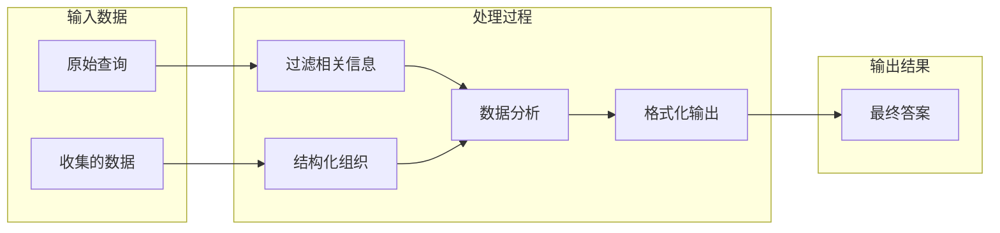

**图表来源**
- [agent.py](file://src/dexter/agent.py#L240-L253)

答案生成代理的特点：
- **信息整合**: 综合所有可用数据
- **逻辑推理**: 基于数据进行合理推断
- **表达优化**: 使用简洁明了的语言
- **格式规范**: 遵循统一的输出格式

**章节来源**
- [agent.py](file://src/dexter/agent.py#L25-L253)

## LLM集成与重试机制

Dexter系统通过精心设计的LLM集成架构，实现了可靠的自然语言理解和生成能力。核心的`call_llm`函数提供了强大的功能和鲁棒性。

### call_llm函数架构

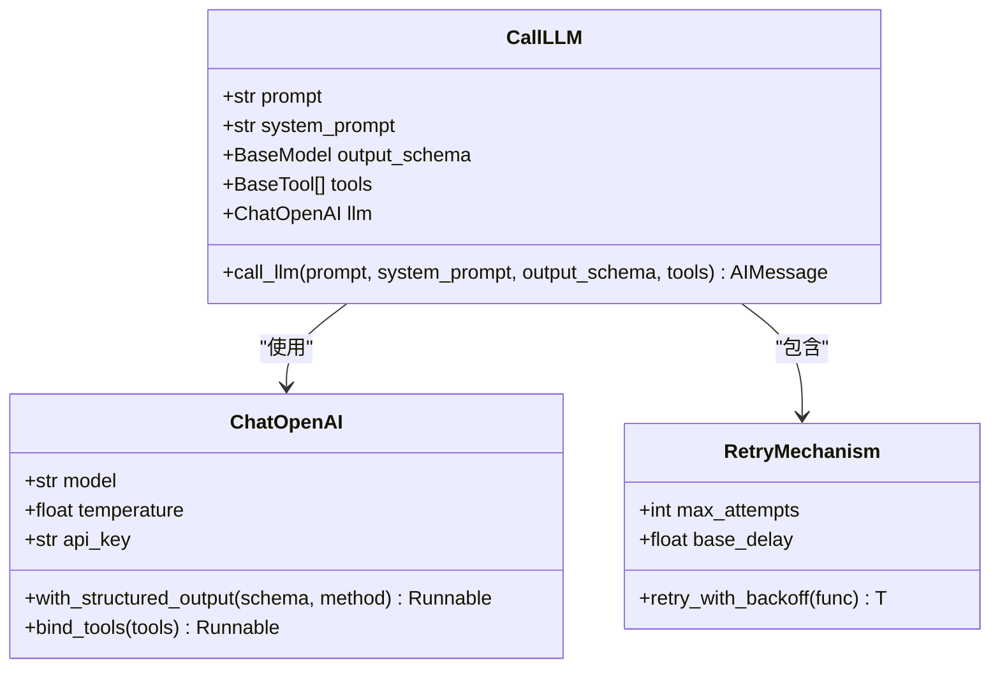

**图表来源**
- [model.py](file://src/dexter/model.py#L10-L46)

### 重试机制实现

`call_llm`函数实现了智能的重试机制，能够自动处理网络连接错误和其他临时性故障。

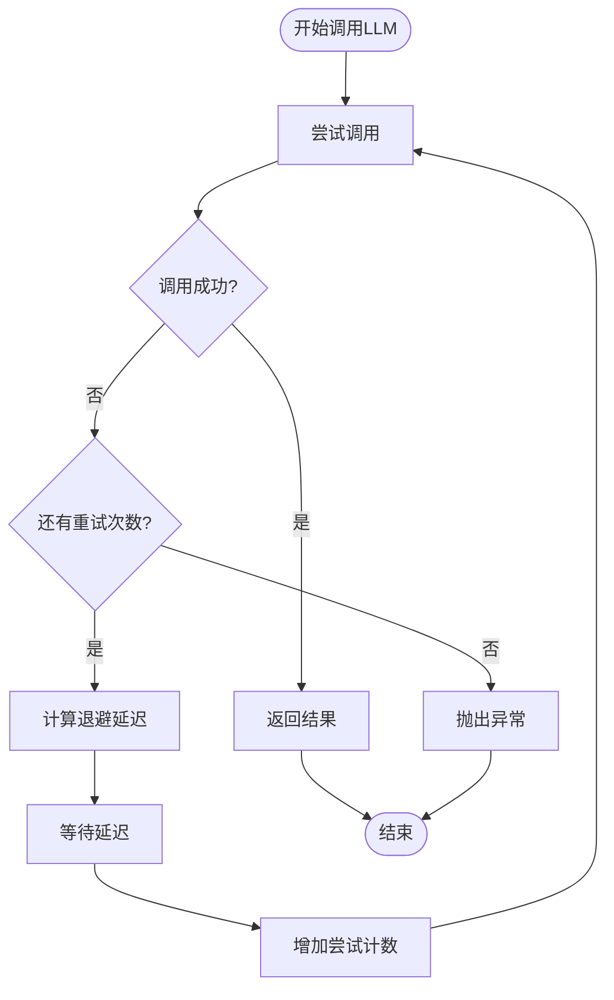

**图表来源**
- [model.py](file://src/dexter/model.py#L35-L46)

重试机制的关键特性：
- **指数退避**: 每次重试延迟时间逐渐增加
- **最大重试次数**: 限制重试上限，避免无限等待
- **错误类型识别**: 仅对可恢复的错误进行重试
- **透明处理**: 对上层调用者隐藏重试细节

### 结构化输出机制

Dexter支持通过`with_structured_output`实现结构化输出，确保LLM的响应符合预定义的数据模型。

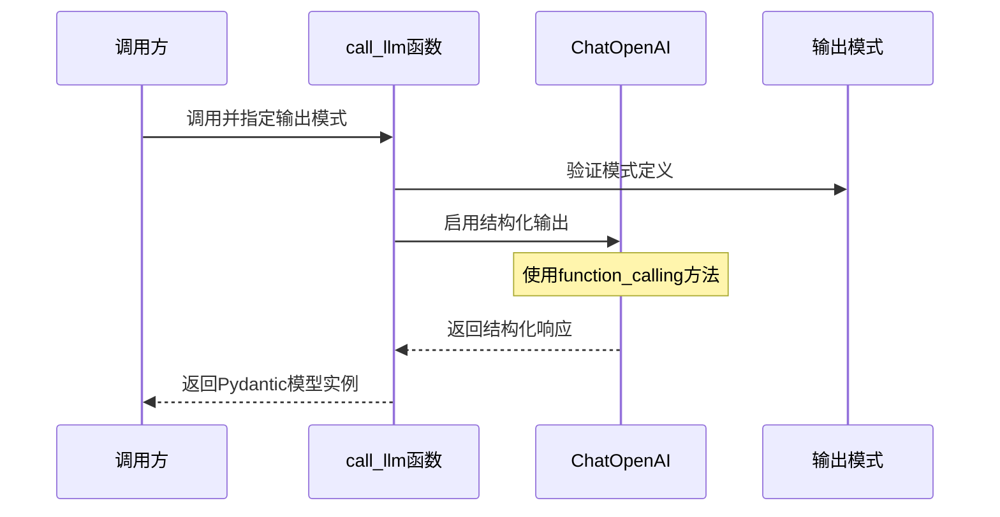

**图表来源**
- [model.py](file://src/dexter/model.py#L25-L35)

**章节来源**
- [model.py](file://src/dexter/model.py#L10-L46)

## 提示词系统与提示工程

Dexter的提示工程系统是其智能性的核心基础，通过精心设计的系统提示词模板，引导LLM在不同场景下表现出最佳的行为模式。

### 提示词架构体系

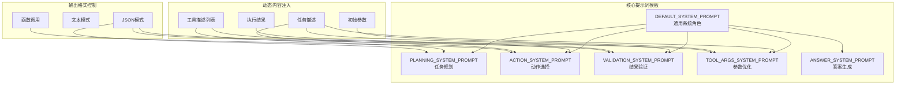

**图表来源**
- [prompts.py](file://src/dexter/prompts.py#L1-L103)

### 关键提示词模板分析

#### 默认系统提示词（DEFAULT_SYSTEM_PROMPT）
这是所有代理的基础角色定义，建立了Dexter作为金融研究智能体的身份认同。

#### 规划系统提示词（PLANNING_SYSTEM_PROMPT）
专门用于任务分解，强调逻辑性和工具导向的思维方式。

#### 动作系统提示词（ACTION_SYSTEM_PROMPT）
指导智能体在执行阶段做出最优的工具选择和参数配置决策。

#### 参数优化提示词（TOOL_ARGS_SYSTEM_PROMPT）
专注于工具参数的精细化调整，确保每次工具调用都能获得最相关的结果。

### 提示工程最佳实践

Dexter在提示工程方面采用了以下最佳实践：

1. **角色明确性**: 每个代理都有清晰的角色定位
2. **上下文丰富性**: 提供足够的背景信息和约束条件
3. **输出格式控制**: 使用JSON模式确保结构化输出
4. **错误处理指导**: 明确指示如何处理无法完成的情况
5. **工具使用指南**: 提供详细的工具参数说明和使用建议

**章节来源**
- [prompts.py](file://src/dexter/prompts.py#L1-L103)

## 工具集架构

Dexter的工具集是其核心功能的基础，涵盖了财务数据获取和SEC文件分析两大主要领域。

### 工具分类与组织

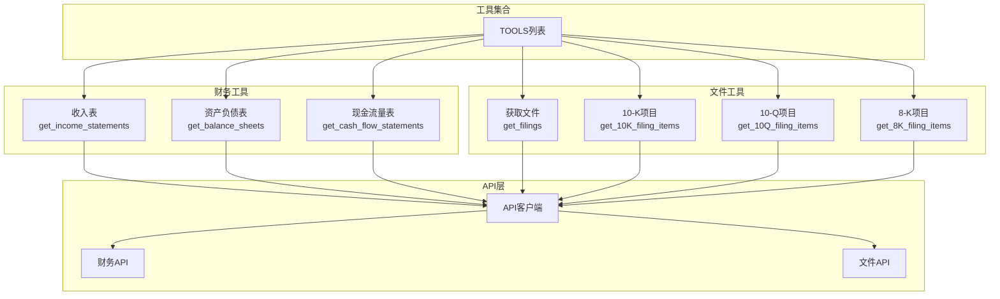

**图表来源**
- [tools/__init__.py](file://src/dexter/tools/__init__.py#L1-L19)
- [tools/financials.py](file://src/dexter/tools/financials.py#L1-L96)
- [tools/filings.py](file://src/dexter/tools/filings.py#L1-L201)

### 财务工具详解

财务工具提供公司财务报表的获取和分析功能：

| 工具名称 | 功能描述 | 主要参数 | 应用场景 |
|---------|---------|---------|---------|
| get_income_statements | 获取损益表 | ticker, period, limit | 盈利能力分析 |
| get_balance_sheets | 获取资产负债表 | ticker, period, limit | 财务状况评估 |
| get_cash_flow_statements | 获取现金流量表 | ticker, period, limit | 现金流健康度分析 |

### SEC文件工具详解

文件工具专门处理美国证券交易委员会的公开文件：

| 工具名称 | 文件类型 | 主要用途 | 关键参数 |
|---------|---------|---------|---------|
| get_filings | 文件元数据 | 查找特定文件 | ticker, filing_type, limit |
| get_10K_filing_items | 10-K年度报告 | 年度财务和业务分析 | ticker, year, item |
| get_10Q_filing_items | 10-Q季度报告 | 季度业绩分析 | ticker, year, quarter, item |
| get_8K_filing_items | 8-K当前报告 | 重大事件披露 | ticker, accession_number, item |

### 工具参数优化机制

Dexter实现了智能的工具参数优化系统，确保每次工具调用都能获得最相关的结果。

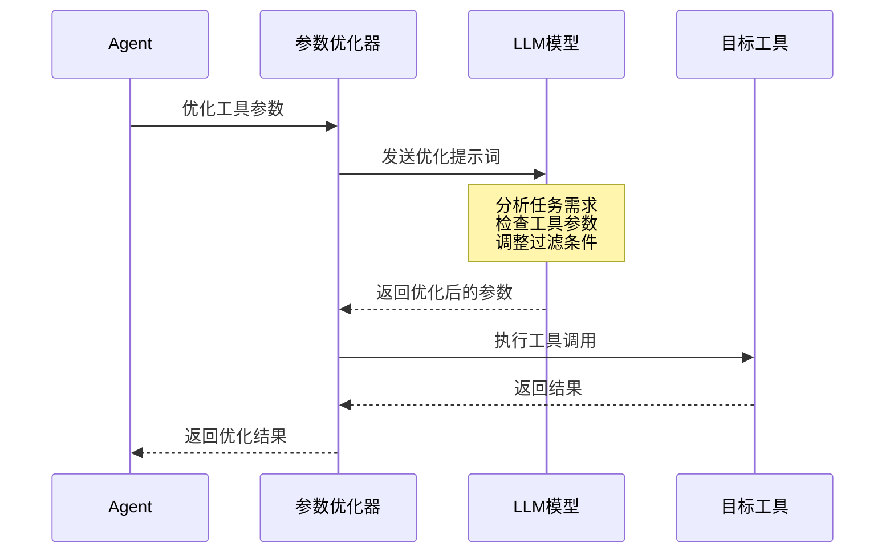

**图表来源**
- [agent.py](file://src/dexter/agent.py#L82-L110)

**章节来源**
- [tools/__init__.py](file://src/dexter/tools/__init__.py#L1-L19)
- [tools/financials.py](file://src/dexter/tools/financials.py#L1-L96)
- [tools/filings.py](file://src/dexter/tools/filings.py#L1-L201)

## 数据流与处理管道

Dexter的整个处理流程遵循严格的线性数据流模式，从用户输入到最终答案输出，每个阶段都有明确的数据转换和处理规则。

### 完整数据流架构

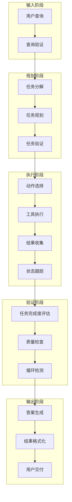

**图表来源**
- [agent.py](file://src/dexter/agent.py#L115-L253)

### 关键数据转换节点

#### 查询到任务的转换
用户自然语言查询被转换为结构化的任务列表，这一过程涉及语义理解、意图识别和任务分解。

#### 工具调用序列的管理
系统维护一个详细的工具调用序列，包括：
- 工具名称和参数
- 执行结果和错误信息
- 时间戳和状态标记
- 性能指标和资源消耗

#### 状态传播机制
系统状态在整个执行过程中持续传播和更新：
- 全局状态：系统级别的执行进度
- 任务状态：单个任务的完成情况
- 工具状态：当前活跃的工具调用
- 错误状态：异常和错误信息

### 并发控制与同步

虽然Dexter采用单线程执行模式，但系统内部实现了严格的并发控制机制：

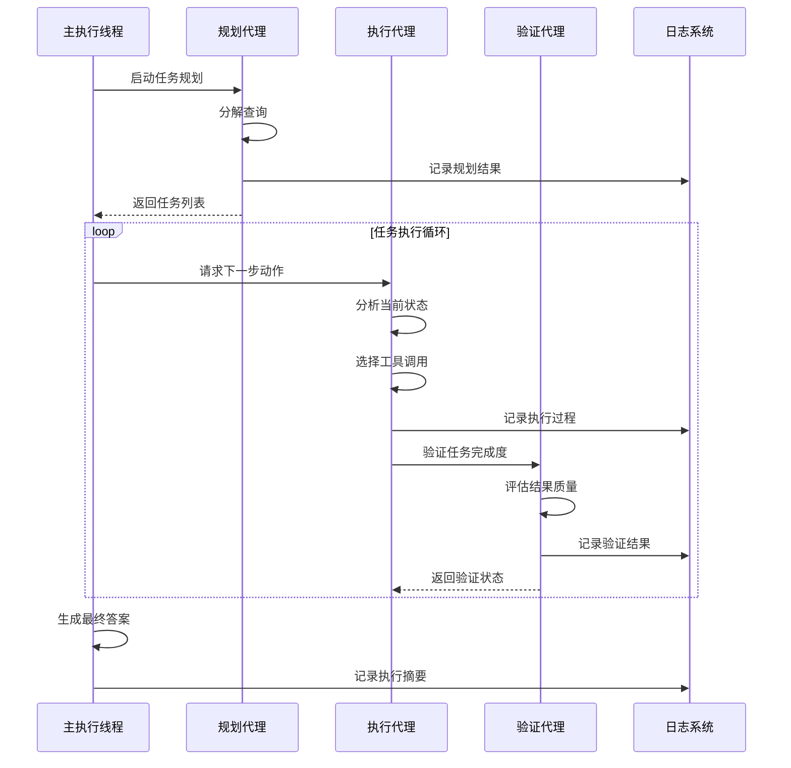

**图表来源**
- [agent.py](file://src/dexter/agent.py#L115-L253)

**章节来源**
- [agent.py](file://src/dexter/agent.py#L115-L253)

## 错误处理与安全机制

Dexter系统实现了多层次的安全防护和错误处理机制，确保系统的稳定性和可靠性。

### 错误处理层次结构

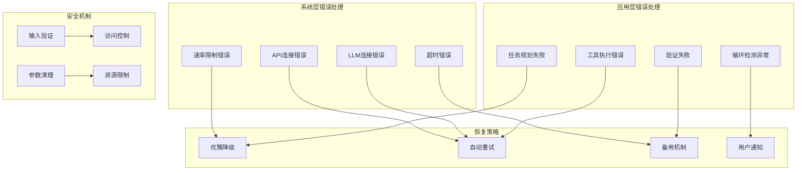

**图表来源**
- [agent.py](file://src/dexter/agent.py#L25-L45)
- [agent.py](file://src/dexter/agent.py#L67-L80)
- [model.py](file://src/dexter/model.py#L35-L46)

### 循环检测机制

系统实现了智能的循环检测机制，防止无限重复相同的操作：

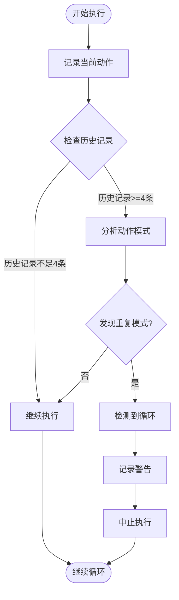

**图表来源**
- [agent.py](file://src/dexter/agent.py#L150-L170)

### 输入验证与安全控制

系统在多个层面实施安全控制：

1. **参数验证**: 确保所有工具参数符合预期格式
2. **权限检查**: 验证用户是否有权执行特定操作
3. **资源限制**: 限制单次执行的资源消耗
4. **输出过滤**: 清理敏感信息，防止数据泄露

**章节来源**
- [agent.py](file://src/dexter/agent.py#L25-L45)
- [agent.py](file://src/dexter/agent.py#L67-L80)
- [agent.py](file://src/dexter/agent.py#L150-L170)
- [model.py](file://src/dexter/model.py#L35-L46)

## 性能优化策略

Dexter系统采用了多种性能优化策略，确保在处理复杂查询时能够保持良好的响应时间和资源利用率。

### 缓存与记忆机制

系统实现了多层次的缓存策略：

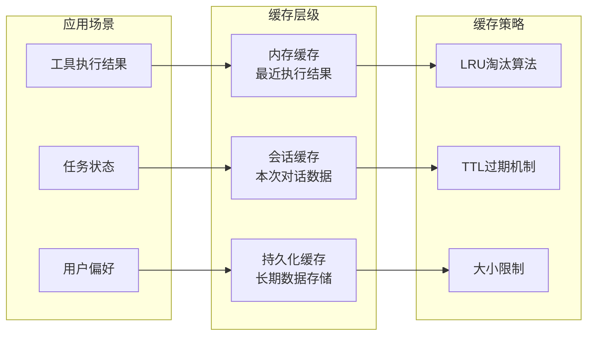

### 并发优化

虽然系统采用单线程执行模式，但在工具调用层面实现了并发优化：

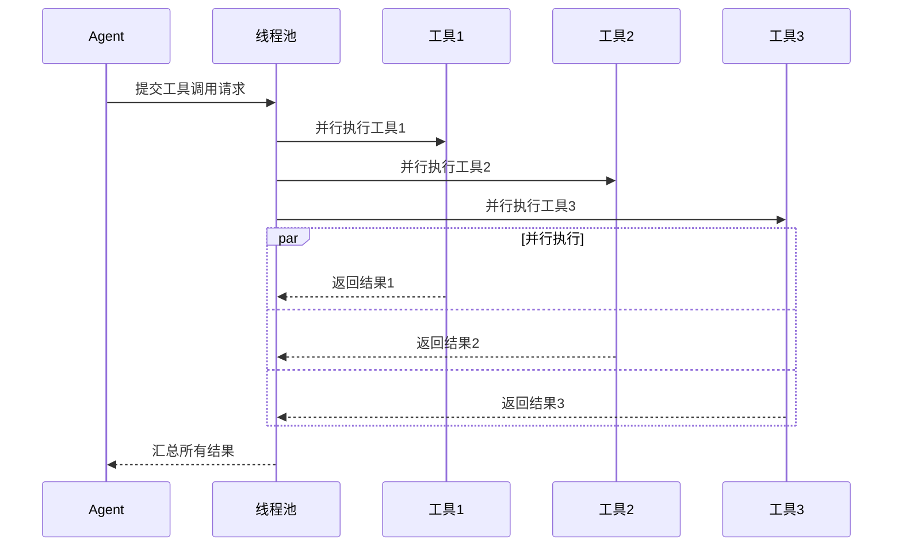

### 资源管理策略

系统实现了精细的资源管理：

1. **内存管理**: 及时释放不再需要的数据结构
2. **网络优化**: 复用HTTP连接，减少握手开销
3. **计算优化**: 使用向量化操作和批量处理
4. **存储优化**: 压缩大容量数据，优化I/O性能

### 性能监控与调优

系统内置了性能监控机制：

- **执行时间统计**: 记录各组件的执行时间
- **资源使用监控**: 跟踪内存和CPU使用情况
- **错误率追踪**: 监控各种错误的发生频率
- **用户体验指标**: 测量响应时间和成功率

## 总结

Dexter的核心架构体现了现代智能体系统设计的最佳实践，通过以下关键创新实现了高效的自主金融研究能力：

### 架构优势

1. **模块化设计**: 清晰的职责分离和组件边界
2. **专业化代理**: 每个代理专注于特定功能领域
3. **容错机制**: 完善的错误处理和恢复策略
4. **可扩展性**: 易于添加新工具和功能模块
5. **可观测性**: 全面的日志记录和监控能力

### 技术创新

- **多代理协作模式**: 实现了专业化和协作式的智能体架构
- **智能参数优化**: 自动调整工具参数以提高效率
- **循环检测机制**: 防止无效的重复操作
- **结构化输出**: 确保LLM响应的一致性和可靠性

### 应用价值

Dexter系统为金融研究领域提供了：
- **自动化程度高**: 减少人工干预和重复劳动
- **准确性保证**: 基于权威数据源和结构化验证
- **可解释性**: 清晰的任务分解和执行过程
- **可定制性**: 支持不同领域的特定需求

这个架构不仅解决了传统AI系统在复杂任务执行中的局限性，还为构建更高级别的智能体系统提供了重要的参考和借鉴价值。