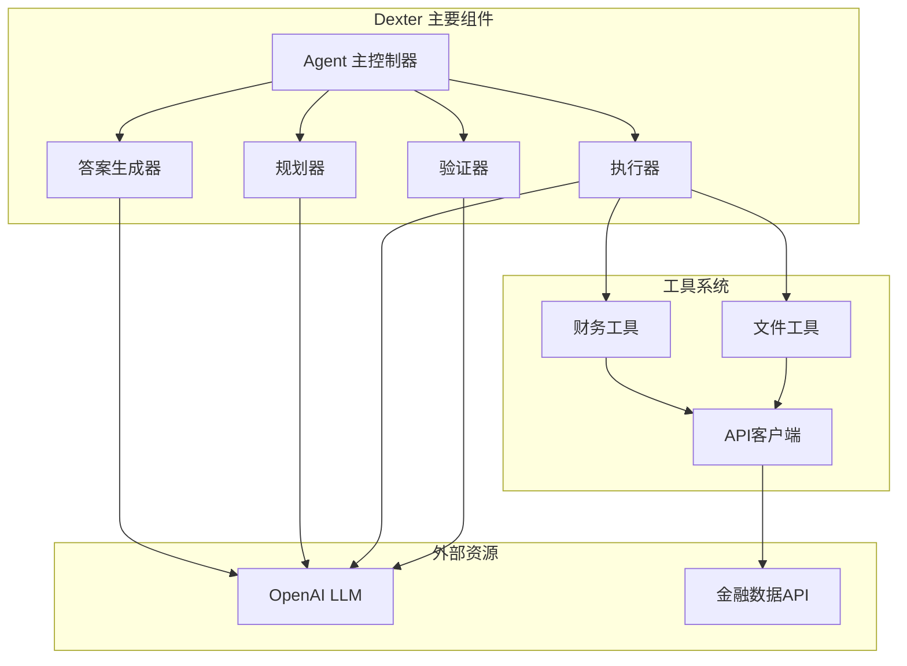
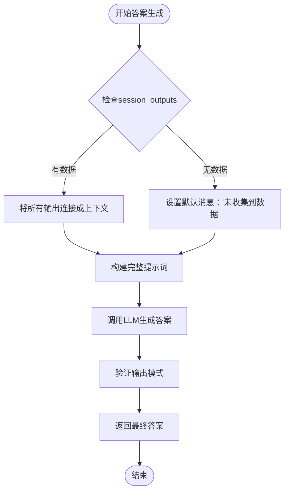
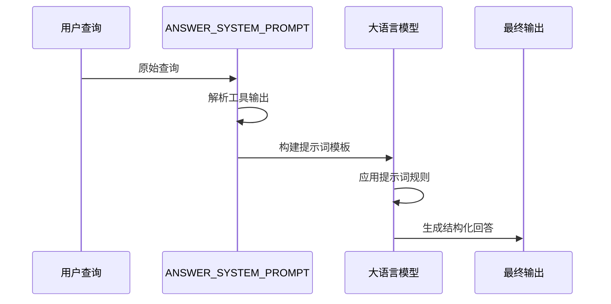
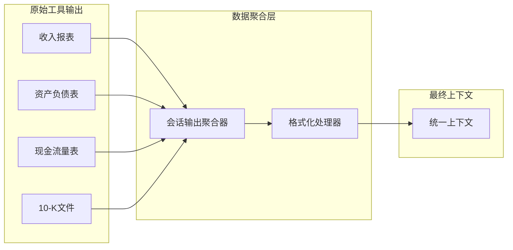
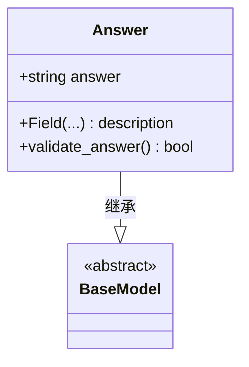
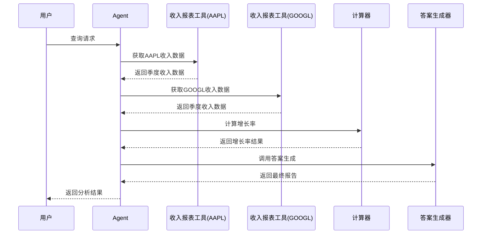
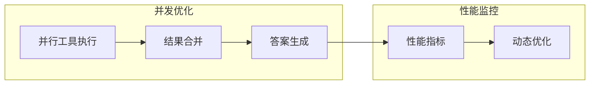

# 答案生成模块详细指南

<cite>
**本文档引用的文件**
- [agent.py](file://src/dexter/agent.py)
- [prompts.py](file://src/dexter/prompts.py)
- [schemas.py](file://src/dexter/schemas.py)
- [model.py](file://src/dexter/model.py)
- [tools/financials.py](file://src/dexter/tools/financials.py)
- [tools/filings.py](file://src/dexter/tools/filings.py)
- [utils/logger.py](file://src/dexter/utils/logger.py)
- [README.md](file://README.md)
</cite>

## 目录
1. [简介](#简介)
2. [系统架构概览](#系统架构概览)
3. [_generate_answer方法详解](#_generate_answer方法详解)
4. [提示词系统设计](#提示词系统设计)
5. [数据聚合与处理](#数据聚合与处理)
6. [输出结构化控制](#输出结构化控制)
7. [实际应用示例](#实际应用示例)
8. [性能优化考虑](#性能优化考虑)
9. [故障排除指南](#故障排除指南)
10. [总结](#总结)

## 简介

Dexter的答案生成模块是整个代理系统的核心组件，负责将分散的工具执行结果整合成一个连贯、简洁的最终回答。该模块作为代理流程的终点，接收所有中间结果并生成面向用户的最终输出，体现了Dexter作为自主金融研究代理的独特价值。

答案生成模块的核心功能包括：
- 将多个工具的输出结果整合为统一的上下文
- 使用专门设计的提示词指导LLM进行信息提炼
- 确保输出符合特定的质量标准和格式要求
- 提供结构化的、数据驱动的最终答案

## 系统架构概览

答案生成模块在Dexter的整体架构中扮演着关键角色，与其他组件紧密协作：



**图表来源**
- [agent.py](file://src/dexter/agent.py#L1-L253)
- [model.py](file://src/dexter/model.py#L1-L46)

**章节来源**
- [agent.py](file://src/dexter/agent.py#L1-L253)
- [README.md](file://README.md#L1-L130)

## _generate_answer方法详解

`Agent._generate_answer()`方法是答案生成模块的核心函数，负责将收集到的所有工具输出整合成最终的用户回答。

### 方法签名与参数

该方法接受两个主要参数：
- `query: str` - 用户的原始查询
- `session_outputs: list` - 包含所有工具执行结果的列表

### 执行流程



**图表来源**
- [agent.py](file://src/dexter/agent.py#L235-L251)

### 关键实现细节

1. **上下文构建**：使用双换行符(`\n\n`)连接所有工具输出，形成完整的上下文
2. **错误处理**：当没有收集到任何数据时，提供友好的默认响应
3. **LLM调用**：通过`call_llm`函数执行，指定专门的提示词和输出模式
4. **输出提取**：从返回的Pydantic对象中提取最终答案文本

**章节来源**
- [agent.py](file://src/dexter/agent.py#L235-L251)

## 提示词系统设计

答案生成模块使用专门设计的`ANSWER_SYSTEM_PROMPT`来指导LLM的行为，确保生成的回答符合预期的质量标准。

### 提示词核心要求

`ANSWER_SYSTEM_PROMPT`定义了以下关键要求：

1. **简洁性**：回答必须简洁明了，只包含直接相关的数据
2. **具体性**：包含具体的数字、百分比和财务数据
3. **可视化**：重要数值应清晰显示，便于理解
4. **分析性**：提供明确的推理和分析
5. **针对性**：直接回应用户的问题
6. **结果导向**：专注于数据和结果，而非过程描述

### 提示词结构



**图表来源**
- [prompts.py](file://src/dexter/prompts.py#L85-L102)

### 格式规范

提示词明确规定：
- 不使用Markdown格式（无粗体、斜体、星号等）
- 使用简单换行、间距和列表进行结构化
- 避免包含边缘信息或无关内容

**章节来源**
- [prompts.py](file://src/dexter/prompts.py#L85-L102)

## 数据聚合与处理

答案生成模块的核心优势在于其强大的数据聚合能力，能够将来自不同工具的异构数据整合为统一的上下文。

### 工具输出类型

系统支持多种类型的工具输出：

| 工具类别 | 输出格式 | 示例数据 |
|---------|---------|---------|
| 财务报表工具 | 结构化JSON数据 | 收入、支出、净利润等 |
| 文件检索工具 | 元数据列表 | 文件访问号、类型、日期 |
| 分析工具 | 计算结果 | 比率、增长率、趋势 |

### 数据处理流程



**图表来源**
- [tools/financials.py](file://src/dexter/tools/financials.py#L1-L98)
- [tools/filings.py](file://src/dexter/tools/filings.py#L1-L204)

### 上下文构建策略

1. **顺序连接**：按工具执行顺序连接输出
2. **格式标准化**：统一各工具输出的格式
3. **信息压缩**：去除冗余信息，保留关键数据
4. **关系建立**：识别不同数据之间的关联关系

**章节来源**
- [agent.py](file://src/dexter/agent.py#L197-L220)

## 输出结构化控制

答案生成模块通过Pydantic模型确保输出结构的一致性和可靠性。

### Answer模型设计



**图表来源**
- [schemas.py](file://src/dexter/schemas.py#L15-L17)

### 结构化输出的优势

1. **类型安全**：确保返回值始终是字符串类型
2. **验证机制**：自动验证输出格式的正确性
3. **一致性保证**：所有答案都遵循相同的结构
4. **错误处理**：提供清晰的错误信息和恢复机制

### 输出质量控制

系统通过以下机制确保输出质量：
- **模式绑定**：强制使用预定义的输出模式
- **重试机制**：在输出不符合预期时自动重试
- **格式验证**：检查输出是否符合提示词要求

**章节来源**
- [schemas.py](file://src/dexter/schemas.py#L15-L17)
- [model.py](file://src/dexter/model.py#L20-L35)

## 实际应用示例

为了更好地理解答案生成模块的工作原理，我们来看一个完整的输入到输出的转换示例。

### 示例场景

假设用户查询："比较苹果和谷歌在过去四个季度的收入增长率"

### 工具执行序列



**图表来源**
- [agent.py](file://src/dexter/agent.py#L174-L251)

### 输入数据示例

系统收集到的工具输出可能包括：

1. **AAPL收入数据**：
   ```
   Output of get_income_statements with args {'ticker': 'AAPL', 'period': 'quarterly', 'limit': 4}: 
   {
     "revenues": [120000000000, 110000000000, 105000000000, 98000000000],
     "dates": ["2024-Q1", "2023-Q4", "2023-Q3", "2023-Q2"]
   }
   ```

2. **GOOGL收入数据**：
   ```
   Output of get_income_statements with args {'ticker': 'GOOGL', 'period': 'quarterly', 'limit': 4}: 
   {
     "revenues": [85000000000, 78000000000, 72000000000, 68000000000],
     "dates": ["2024-Q1", "2023-Q4", "2023-Q3", "2023-Q2"]
   }
   ```

### 生成的最终答案

基于上述输入，答案生成模块可能产生如下输出：

```
在最近四个季度中，苹果公司(Apple Inc.)和谷歌公司(Google LLC)的收入增长率对比：

苹果公司：
- 2024-Q1 vs 2023-Q4: +9.09% 增长
- 2023-Q4 vs 2023-Q3: +5.26% 增长
- 2023-Q3 vs 2023-Q2: +5.88% 增长

谷歌公司：
- 2024-Q1 vs 2023-Q4: +8.97% 增长
- 2023-Q4 vs 2023-Q3: +8.33% 增长
- 2023-Q3 vs 2023-Q2: +5.88% 增长

总体趋势：
- 苹果公司在2023年第四季度表现出最强的增长动力
- 谷歌在2023年第三季度实现了最高的单季度增长
- 两家公司的收入均呈现稳定增长态势
```

### 数据洞察提取

LLM从原始数据中提取的关键洞察包括：

1. **定量分析**：计算具体的增长率数值
2. **趋势识别**：识别增长模式和异常点
3. **对比分析**：比较不同公司的表现
4. **时间维度**：按季度展示变化趋势
5. **结论归纳**：总结关键发现和意义

**章节来源**
- [agent.py](file://src/dexter/agent.py#L235-L251)

## 性能优化考虑

答案生成模块在设计时充分考虑了性能优化，确保在处理大量数据时仍能保持高效。

### 优化策略

1. **延迟加载**：只在需要时才执行答案生成
2. **缓存机制**：对相似查询的结果进行缓存
3. **批量处理**：合并多个小工具的输出
4. **内存管理**：及时清理不需要的中间数据

### 并发处理



### 资源管理

- **内存使用**：限制单次会话的最大输出大小
- **执行时间**：设置合理的超时阈值
- **API调用**：优化LLM调用频率和批处理大小

## 故障排除指南

### 常见问题及解决方案

1. **空输出问题**
   - **原因**：没有收集到任何工具数据
   - **解决方案**：检查工具执行状态和网络连接

2. **格式错误**
   - **原因**：LLM返回的结果不符合预期格式
   - **解决方案**：启用重试机制和输出验证

3. **性能问题**
   - **原因**：处理大量数据导致延迟
   - **解决方案**：实施数据采样和分页处理

### 调试技巧

1. **日志记录**：启用详细的执行日志
2. **状态监控**：跟踪每个阶段的执行状态
3. **错误捕获**：实现完善的异常处理机制

**章节来源**
- [agent.py](file://src/dexter/agent.py#L197-L220)
- [utils/logger.py](file://src/dexter/utils/logger.py#L1-L43)

## 总结

Dexter的答案生成模块代表了自主金融研究代理系统的核心创新。通过精心设计的架构和严格的控制机制，该模块成功地将分散的工具执行结果整合为连贯、准确、用户友好的最终答案。

### 关键优势

1. **智能聚合**：能够处理来自不同来源的异构数据
2. **质量保证**：通过提示词和模式验证确保输出质量
3. **用户体验**：提供简洁、具体、易于理解的分析报告
4. **可扩展性**：支持新工具和数据源的无缝集成

### 技术创新

- **多模态数据处理**：统一处理结构化和非结构化数据
- **自适应提示词**：根据输入动态调整生成策略
- **结构化输出**：确保结果的一致性和可靠性

### 应用前景

答案生成模块为金融研究领域提供了新的可能性，不仅提高了分析效率，还降低了专业门槛。随着技术的不断发展，该模块有望在更多领域发挥重要作用，成为自主智能系统的重要组成部分。