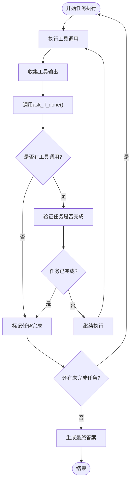
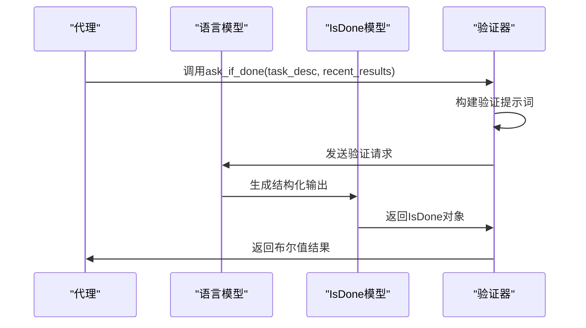
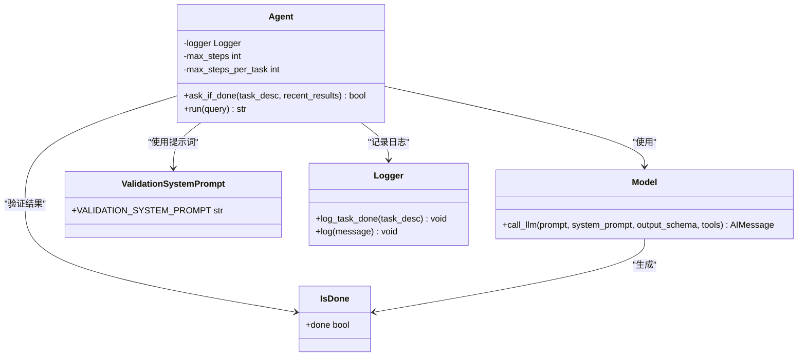
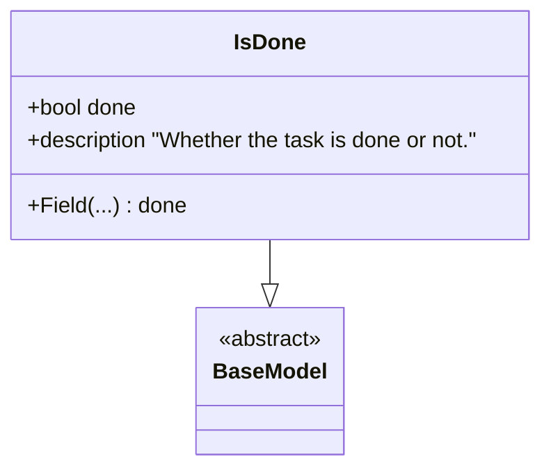
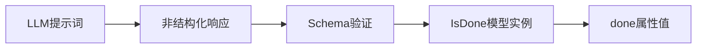
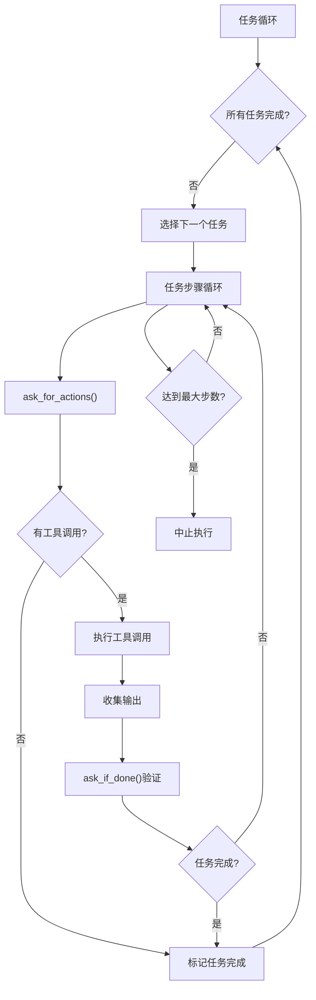
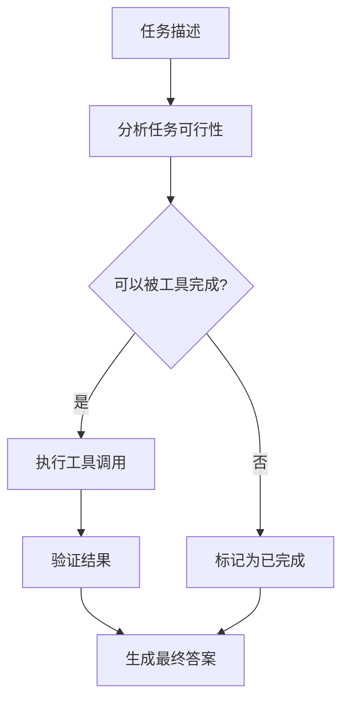

# Dexter自我验证机制全面文档

<cite>
**本文档中引用的文件**
- [agent.py](file://src/dexter/agent.py)
- [prompts.py](file://src/dexter/prompts.py)
- [schemas.py](file://src/dexter/schemas.py)
- [model.py](file://src/dexter/model.py)
- [tools/financials.py](file://src/dexter/tools/financials.py)
- [tools/__init__.py](file://src/dexter/tools/__init__.py)
- [utils/logger.py](file://src/dexter/utils/logger.py)
- [README.md](file://README.md)
</cite>

## 目录
1. [简介](#简介)
2. [自我验证机制概述](#自我验证机制概述)
3. [Agent.ask_if_done()方法详解](#agentask_if_done方法详解)
4. [验证系统架构](#验证系统架构)
5. [IsDone Pydantic模型](#isdone-pydantic模型)
6. [验证循环集成](#验证循环集成)
7. [边缘情况处理](#边缘情况处理)
8. [验证场景示例](#验证场景示例)
9. [性能考虑](#性能考虑)
10. [故障排除指南](#故障排除指南)
11. [总结](#总结)

## 简介

Dexter是一个自主的金融研究代理，采用多组件架构来处理复杂的财务查询。其核心创新在于自我验证机制，该机制通过`Agent.ask_if_done()`方法实现，能够智能地评估任务完成状态，确保代理在收集到充分信息后才生成最终答案。

## 自我验证机制概述

Dexter的自我验证机制是一个关键的安全和质量控制功能，它在每个任务执行周期结束后检查任务是否已经成功完成。这个机制通过以下方式工作：

1. **任务状态监控**：持续跟踪任务执行过程中的所有工具调用结果
2. **智能评估**：使用专门的验证提示词指导LLM评估任务完成状态
3. **结构化输出**：通过Pydantic模型确保验证结果的标准化
4. **循环控制**：在代理主循环中作为决策点，控制任务流程

**图表来源**
- [agent.py](file://src/dexter/agent.py#L222-L226)

## Agent.ask_if_done()方法详解

`Agent.ask_if_done()`方法是自我验证机制的核心实现，负责评估当前任务是否已经达到预期目标。

### 方法签名和参数

该方法接受两个参数：
- `task_desc: str` - 任务描述，说明需要完成的工作内容
- `recent_results: str` - 最近的工具执行结果历史

### 验证流程

**图表来源**
- [agent.py](file://src/dexter/agent.py#L64-L74)
- [model.py](file://src/dexter/model.py#L15-L44)

### 错误处理机制

该方法包含健壮的错误处理逻辑：
- **异常捕获**：捕获所有验证过程中的异常
- **默认返回值**：发生异常时返回`False`，确保验证不会中断流程
- **日志记录**：记录验证失败的详细信息

**节来源**
- [agent.py](file://src/dexter/agent.py#L64-L74)

## 验证系统架构

Dexter的验证系统采用分层架构设计，确保验证过程的可靠性和一致性。

### 组件关系图

**图表来源**
- [agent.py](file://src/dexter/agent.py#L11-L25)
- [model.py](file://src/dexter/model.py#L15-L44)
- [schemas.py](file://src/dexter/schemas.py#L13-L15)

### 提示词系统

验证系统使用专门的提示词模板`VALIDATION_SYSTEM_PROMPT`，该提示词具有以下特点：

- **明确的角色定义**：指定LLM扮演验证者的角色
- **严格的输出要求**：要求返回JSON格式的布尔值
- **边界情况处理**：特别说明无法通过工具完成的任务应视为已完成
- **上下文依赖**：基于任务描述和工具执行历史进行评估

**节来源**
- [prompts.py](file://src/dexter/prompts.py#L35-L45)

## IsDone Pydantic模型

`IsDone`模型是验证系统的数据契约，确保验证结果的结构化和标准化。

### 模型定义

**图表来源**
- [schemas.py](file://src/dexter/schemas.py#L13-L15)

### 结构化输出优势

1. **类型安全**：确保返回值始终为布尔类型
2. **验证一致性**：防止意外的字符串或数值返回
3. **错误检测**：自动捕获LLM输出格式问题
4. **调试友好**：清晰的字段命名便于问题诊断

### 输出映射机制

验证系统通过`call_llm`函数的`output_schema`参数自动将LLM响应映射到`IsDone`模型：

**图表来源**
- [model.py](file://src/dexter/model.py#L30-L32)

**节来源**
- [schemas.py](file://src/dexter/schemas.py#L13-L15)

## 验证循环集成

自我验证机制深度集成到Dexter的主执行循环中，在每次批量工具调用后执行验证检查。

### 主循环流程

**图表来源**
- [agent.py](file://src/dexter/agent.py#L158-L226)

### 验证时机

验证检查在以下情况下执行：

1. **批量工具调用后**：每次完成一组工具调用后立即验证
2. **任务状态更新**：根据验证结果更新任务完成状态
3. **循环控制**：决定是否继续执行当前任务或转向下一个任务

### 安全机制

验证系统包含多个安全特性：

- **最大步数限制**：防止无限循环
- **重复动作检测**：识别并避免重复执行相同操作
- **异常恢复**：验证失败时的安全降级

**节来源**
- [agent.py](file://src/dexter/agent.py#L158-L226)

## 边缘情况处理

Dexter的验证机制针对各种边缘情况进行了精心设计，确保系统的鲁棒性。

### 无法通过工具完成的任务

对于某些查询，LLM可能无法找到合适的工具来完成任务。在这种情况下，验证系统遵循以下规则：

**图表来源**
- [prompts.py](file://src/dexter/prompts.py#L40-L45)

### 工具执行失败

当工具执行失败时，验证系统采取以下措施：

1. **错误记录**：将错误信息记录到会话输出中
2. **验证继续**：即使工具失败也继续进行验证
3. **结果评估**：基于可用信息评估任务完成状态

### 异常处理策略

验证系统采用多层次的异常处理策略：

- **方法级异常捕获**：`ask_if_done()`方法内部捕获所有异常
- **默认值返回**：异常情况下返回`False`，表示任务未完成
- **日志记录**：详细记录异常信息用于调试

**节来源**
- [agent.py](file://src/dexter/agent.py#L64-L74)

## 验证场景示例

### 场景一：验证成功的示例

**任务描述**："分析苹果公司过去四个季度的收入增长率"

**工具执行历史**：
- 获取了Apple（AAPL）过去四个季度的收入数据
- 计算了各季度间的收入变化百分比
- 收集了相关的财务指标

**验证过程**：
1. LLM分析任务描述和工具执行历史
2. 确认已收集足够的数据来回答收入增长率问题
3. 评估数据质量和完整性
4. 基于以上分析得出结论

**验证结果**：`done = True`

### 场景二：验证失败的示例

**任务描述**："分析特斯拉的现金流量趋势"

**工具执行历史**：
- 获取了特斯拉（TSLA）最近两年的现金流量表
- 收集了部分季度数据
- 数据存在缺失和不一致

**验证过程**：
1. LLM识别数据不足的问题
2. 检查数据质量和完整性
3. 评估是否能够回答现金流量趋势问题
4. 基于评估得出结论

**验证结果**：`done = False`

### 特殊场景：无法通过工具完成的任务

**任务描述**："解释什么是财务杠杆"

**工具执行历史**：
- 无工具调用（该任务不需要工具支持）

**验证过程**：
1. LLM检测到没有工具调用
2. 根据任务描述判断需要提供概念解释
3. 由于任务不在金融数据分析范围内，标记为已完成

**验证结果**：`done = True`

**节来源**
- [agent.py](file://src/dexter/agent.py#L64-L74)
- [prompts.py](file://src/dexter/prompts.py#L35-L45)

## 性能考虑

### 验证频率优化

Dexter的验证机制在性能和准确性之间取得平衡：

- **批量验证**：在每次工具调用批次后进行验证，减少验证频率
- **条件跳过**：当没有工具调用时跳过验证，提高效率
- **快速失败**：验证失败时及时停止不必要的执行

### 内存管理

验证系统采用内存友好的设计：

- **增量收集**：只收集当前任务的工具输出
- **历史清理**：定期清理不再需要的历史数据
- **流式处理**：支持大型数据集的逐步验证

### 并发安全性

验证机制确保线程安全：

- **不可变输入**：验证输入参数在验证过程中保持不变
- **原子操作**：验证结果的读取和写入是原子操作
- **状态隔离**：不同任务的验证状态相互独立

## 故障排除指南

### 常见问题及解决方案

#### 验证结果总是False

**症状**：所有任务都被标记为未完成

**可能原因**：
1. 验证提示词配置错误
2. 工具执行结果格式不正确
3. LLM输出解析失败

**解决方案**：
1. 检查`VALIDATION_SYSTEM_PROMPT`的配置
2. 验证工具输出的数据格式
3. 查看日志中的异常信息

#### 验证结果总是True

**症状**：任务在第一次工具调用后就被标记为完成

**可能原因**：
1. 验证逻辑过于宽松
2. 任务描述不够具体
3. 工具执行结果过于简单

**解决方案**：
1. 调整验证提示词的严格程度
2. 提供更详细的任务描述
3. 增加工具调用的复杂度

#### 验证超时或失败

**症状**：验证过程经常超时或抛出异常

**可能原因**：
1. LLM服务不稳定
2. 网络连接问题
3. 输入数据过大

**解决方案**：
1. 实现重试机制
2. 优化网络连接
3. 分割大数据集

### 调试技巧

1. **启用详细日志**：使用`Logger`类记录详细的执行信息
2. **检查中间结果**：验证工具执行结果的格式和内容
3. **测试验证提示词**：单独测试验证提示词的效果
4. **监控资源使用**：观察内存和CPU使用情况

**节来源**
- [agent.py](file://src/dexter/agent.py#L64-L74)
- [utils/logger.py](file://src/dexter/utils/logger.py#L1-L43)

## 总结

Dexter的自我验证机制是一个精心设计的质量控制系统，通过`Agent.ask_if_done()`方法实现了智能的任务完成评估。该机制的关键优势包括：

1. **智能评估**：基于任务描述和工具执行历史的综合评估
2. **结构化输出**：通过Pydantic模型确保结果的一致性和可靠性
3. **安全控制**：在代理主循环中提供关键的流程控制点
4. **边缘处理**：优雅地处理各种异常和边界情况
5. **性能优化**：在准确性和效率之间取得良好平衡

这个验证机制不仅提高了Dexter的执行质量，还为其在复杂金融研究场景中的应用提供了可靠保障。通过持续的改进和优化，它将继续为Dexter的自主研究能力提供坚实的基础。