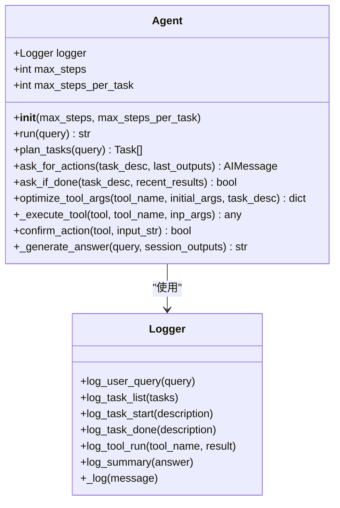
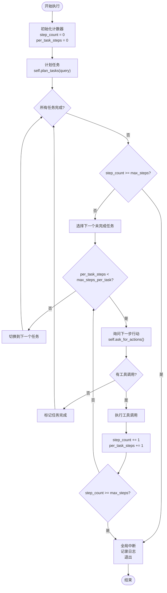
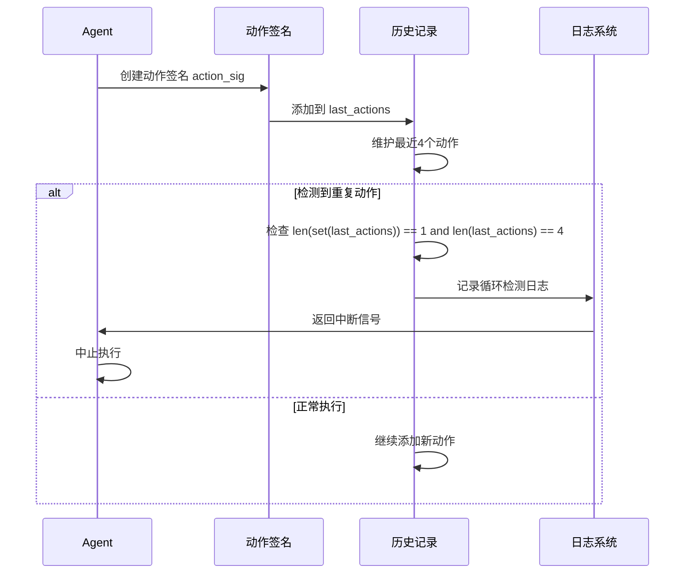
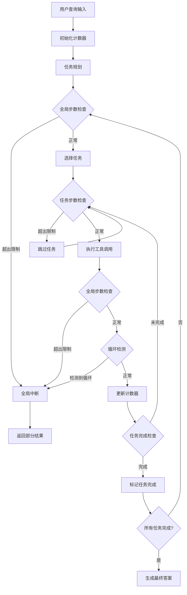
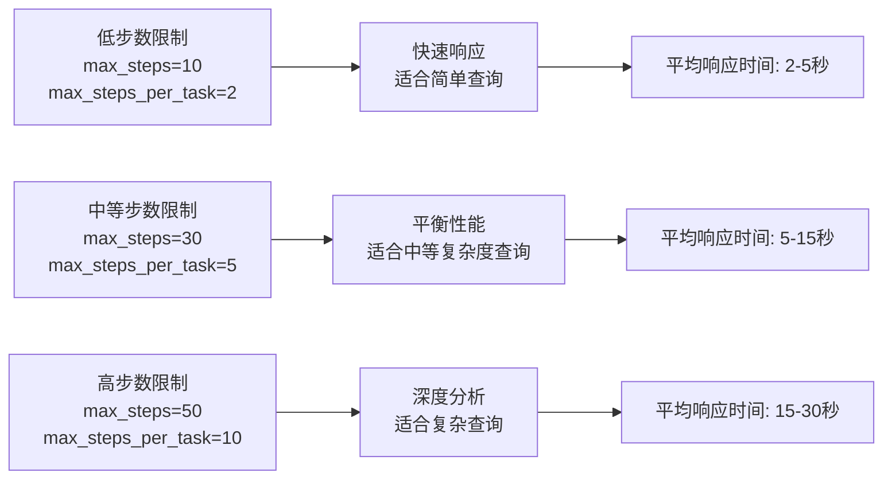

# 配置与参数

<cite>
**本文档中引用的文件**
- [agent.py](file://src/dexter/agent.py)
- [cli.py](file://src/dexter/cli.py)
- [model.py](file://src/dexter/model.py)
- [tools/__init__.py](file://src/dexter/tools/__init__.py)
- [README.md](file://README.md)
</cite>

## 目录
1. [简介](#简介)
2. [Agent类构造函数参数](#agent类构造函数参数)
3. [核心安全限制机制](#核心安全限制机制)
4. [参数行为详解](#参数行为详解)
5. [实际运行中的检查点](#实际运行中的检查点)
6. [参数调优指南](#参数调优指南)
7. [性能影响分析](#性能影响分析)
8. [最佳实践建议](#最佳实践建议)
9. [故障排除](#故障排除)

## 简介

Dexter是一个自主的金融研究代理，采用智能任务规划、自我反思和实时市场数据进行分析。为了确保系统的稳定性和安全性，Agent类提供了两个关键的安全限制参数：`max_steps`（全局最大步数）和`max_steps_per_task`（单任务最大步数）。这些参数共同构成了防止无限循环和资源耗尽的核心保护机制。

## Agent类构造函数参数

### 参数定义



**图表来源**
- [agent.py](file://src/dexter/agent.py#L18-L22)

### 默认值说明

| 参数名称 | 类型 | 默认值 | 描述 |
|---------|------|--------|------|
| `max_steps` | int | 20 | 全局安全上限，防止整个会话陷入无限循环 |
| `max_steps_per_task` | int | 5 | 单个任务的最大迭代次数，防止单一任务过度执行 |

**章节来源**
- [agent.py](file://src/dexter/agent.py#L18-L22)

## 核心安全限制机制

### 双层防护架构

Dexter采用了双层安全防护机制，通过两个独立的计数器来监控执行进度：



**图表来源**
- [agent.py](file://src/dexter/agent.py#L120-L252)

### 循环检测机制

除了步数限制外，系统还实现了智能的循环检测机制：



**图表来源**
- [agent.py](file://src/dexter/agent.py#L197-L205)

**章节来源**
- [agent.py](file://src/dexter/agent.py#L120-L252)

## 参数行为详解

### max_steps（全局最大步数）

#### 作用机制
`max_steps`参数作为整个会话的全局安全上限，防止系统在处理复杂查询时陷入无限循环或过度消耗资源。

#### 检查时机
- **任务规划阶段**：在开始任务分解前检查
- **任务执行阶段**：每次工具调用后检查
- **任务验证阶段**：在判断任务是否完成时检查

#### 中断逻辑
当达到`max_steps`限制时：
1. 系统记录警告日志："Global max steps reached — aborting to avoid runaway loop."
2. 跳出主循环，停止进一步的任务执行
3. 进入最终答案生成阶段，使用已收集的数据提供部分结果

### max_steps_per_task（单任务最大步数）

#### 作用机制
`max_steps_per_task`参数控制单个任务的最大迭代次数，防止某个特定任务占用过多资源或陷入死循环。

#### 检查时机
- **任务内部循环**：在每个工具调用批次后检查
- **动作选择阶段**：在请求下一步行动时检查

#### 中断逻辑
当单个任务达到`max_steps_per_task`限制时：
1. 系统继续当前任务的执行流程
2. 不会立即终止整个会话
3. 但会阻止该任务的进一步迭代

**章节来源**
- [agent.py](file://src/dexter/agent.py#L146-L172)
- [agent.py](file://src/dexter/agent.py#L174-L195)

## 实际运行中的检查点

### 主循环检查点分布



**图表来源**
- [agent.py](file://src/dexter/agent.py#L120-L252)

### 关键检查点代码路径

| 检查点位置 | 检查条件 | 处理方式 |
|-----------|----------|----------|
| 任务规划后 | `step_count >= self.max_steps` | 中断整个会话 |
| 任务选择后 | `step_count >= self.max_steps` | 跳过当前任务 |
| 工具调用后 | `step_count >= self.max_steps` | 停止当前任务 |
| 循环检测 | `len(set(last_actions)) == 1 and len(last_actions) == 4` | 立即中断 |

**章节来源**
- [agent.py](file://src/dexter/agent.py#L146-L172)
- [agent.py](file://src/dexter/agent.py#L174-L195)
- [agent.py](file://src/dexter/agent.py#L197-L205)

## 参数调优指南

### 复杂查询场景

对于涉及多个步骤、需要深入分析的复杂金融查询：

#### 推荐配置
```python
agent = Agent(max_steps=50, max_steps_per_task=10)
```

#### 适用场景
- 跨季度财务对比分析
- 多公司竞争分析
- 长期趋势研究
- 需要多种数据源验证的查询

#### 性能考虑
- 更高的`max_steps`允许更全面的数据收集
- 更高的`max_steps_per_task`支持更复杂的工具组合
- 可能增加响应时间，但提高结果质量

### 简单查询场景

对于直接的事实性查询或简单的计算：

#### 推荐配置
```python
agent = Agent(max_steps=10, max_steps_per_task=2)
```

#### 适用场景
- 单一指标查询（如"苹果公司去年的营收是多少？"）
- 基础财务比率计算
- 简单的历史数据查询

#### 性能考虑
- 较低的步数限制提高响应速度
- 减少不必要的工具调用
- 适合快速交互场景

### 中等复杂度场景

对于需要一定分析深度但不需要极端复杂性的查询：

#### 推荐配置
```python
agent = Agent(max_steps=30, max_steps_per_task=5)
```

#### 适用场景
- 季度业绩对比
- 行业平均水平比较
- 简单的趋势分析

**章节来源**
- [agent.py](file://src/dexter/agent.py#L18-L22)
- [cli.py](file://src/dexter/cli.py#L12)

## 性能影响分析

### 步数限制对执行效率的影响



### 资源消耗模式

| 参数配置 | CPU使用率 | 内存使用率 | 网络请求数量 | 适合场景 |
|---------|----------|-----------|-------------|----------|
| 低限制 | 低 | 低 | 少 | 简单事实查询 |
| 中等限制 | 中等 | 中等 | 中等 | 标准分析查询 |
| 高限制 | 高 | 高 | 多 | 复杂研究查询 |

### 循环检测的性能开销

循环检测机制虽然增加了额外的字符串比较操作，但其开销相对较小：
- 每次工具调用添加4字节的动作签名
- 最多维护4个动作历史，总内存占用约16字节
- 字符串比较操作的时间复杂度为O(n)，其中n为动作数量

**章节来源**
- [agent.py](file://src/dexter/agent.py#L197-L205)

## 最佳实践建议

### 生产环境配置

#### 推荐生产配置
```python
# 平衡安全性和功能性的配置
agent = Agent(max_steps=30, max_steps_per_task=5)

# 或者更保守的配置
agent = Agent(max_steps=20, max_steps_per_task=3)
```

#### 配置策略
1. **渐进式增强**：从保守配置开始，根据实际需求逐步调整
2. **监控驱动**：基于实际使用情况优化参数设置
3. **场景分类**：为不同类型的应用场景设置专门的配置

### 开发和测试配置

#### 开发环境配置
```python
# 快速反馈的配置
agent = Agent(max_steps=10, max_steps_per_task=2)
```

#### 测试环境配置
```python
# 完整功能测试配置
agent = Agent(max_steps=100, max_steps_per_task=20)
```

### 错误处理和恢复

#### 配置错误的处理
当遇到配置不当的情况时，系统会自动采取以下措施：
1. **步数超限**：记录详细日志，提供部分结果
2. **循环检测**：立即中断，防止资源浪费
3. **工具失败**：记录错误，继续执行其他任务

#### 恢复策略
```python
try:
    result = agent.run(complex_query)
except Exception as e:
    # 使用更保守的配置重试
    fallback_agent = Agent(max_steps=15, max_steps_per_task=3)
    result = fallback_agent.run(simplified_query)
```

**章节来源**
- [agent.py](file://src/dexter/agent.py#L146-L172)
- [agent.py](file://src/dexter/agent.py#L197-L205)

## 故障排除

### 常见问题及解决方案

#### 问题1：查询总是被提前中断
**症状**：复杂查询经常在收集少量数据后就停止
**原因**：`max_steps`设置过低
**解决方案**：
```python
# 增加全局步数限制
agent = Agent(max_steps=50, max_steps_per_task=5)
```

#### 问题2：响应时间过长
**症状**：系统响应缓慢，用户体验差
**原因**：`max_steps`设置过高
**解决方案**：
```python
# 减少步数限制，提高响应速度
agent = Agent(max_steps=15, max_steps_per_task=3)
```

#### 问题3：循环检测频繁触发
**症状**：系统频繁报告循环检测并中断
**原因**：`max_steps_per_task`设置过低或任务设计不合理
**解决方案**：
```python
# 增加单任务步数限制
agent = Agent(max_steps=30, max_steps_per_task=8)
```

### 调试技巧

#### 启用详细日志
```python
import logging
logging.basicConfig(level=logging.DEBUG)

# 观察步数使用情况
agent = Agent(max_steps=100, max_steps_per_task=20)
result = agent.run("复杂查询示例")
```

#### 监控步数使用
```python
# 自定义Agent类，添加步数统计
class MonitoredAgent(Agent):
    def run(self, query: str):
        step_count_before = self.max_steps
        result = super().run(query)
        step_count_after = self.max_steps
        print(f"步数使用情况: {step_count_before - step_count_after}/{step_count_before}")
        return result
```

### 性能监控指标

| 指标名称 | 目标值 | 监控方法 |
|---------|--------|----------|
| 平均响应时间 | < 15秒 | 计时器测量 |
| 步数使用率 | > 80% | 步数统计 |
| 循环检测频率 | < 5% | 日志分析 |
| 成功率 | > 95% | 结果统计 |

**章节来源**
- [agent.py](file://src/dexter/agent.py#L146-L172)
- [agent.py](file://src/dexter/agent.py#L197-L205)