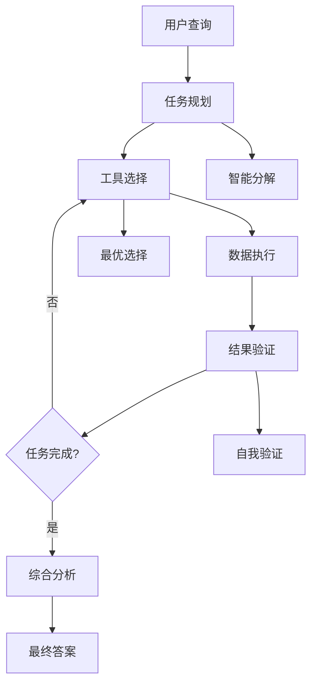
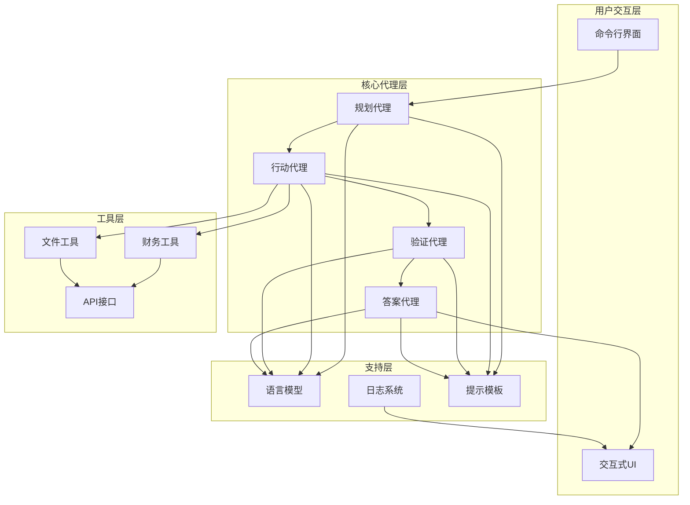
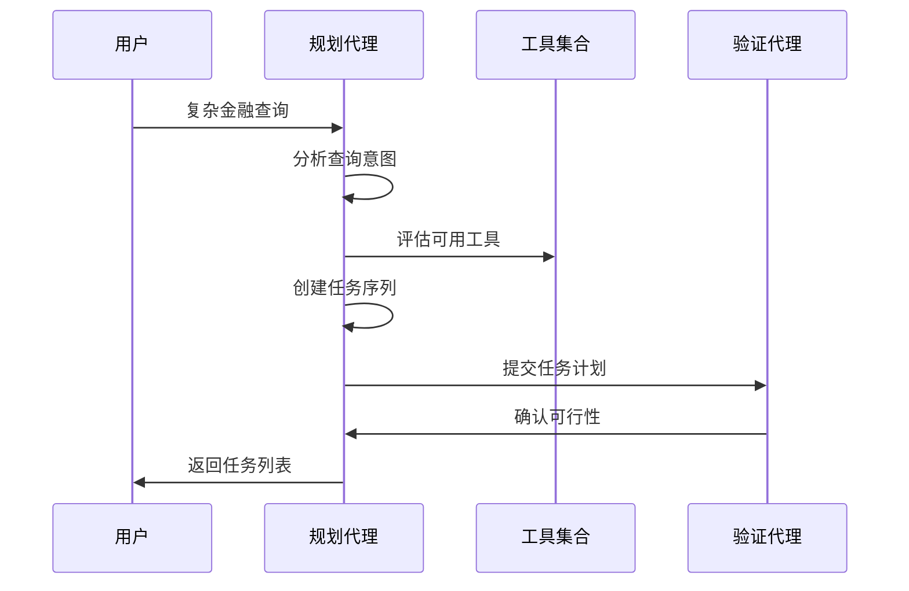
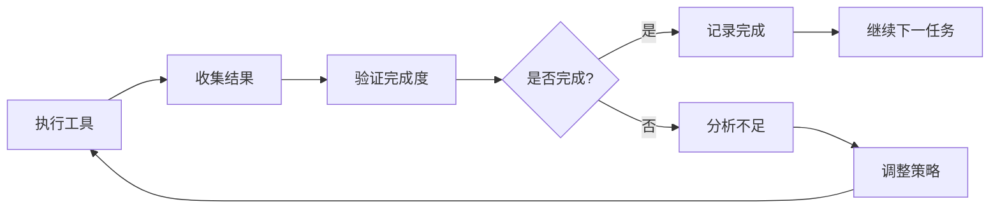
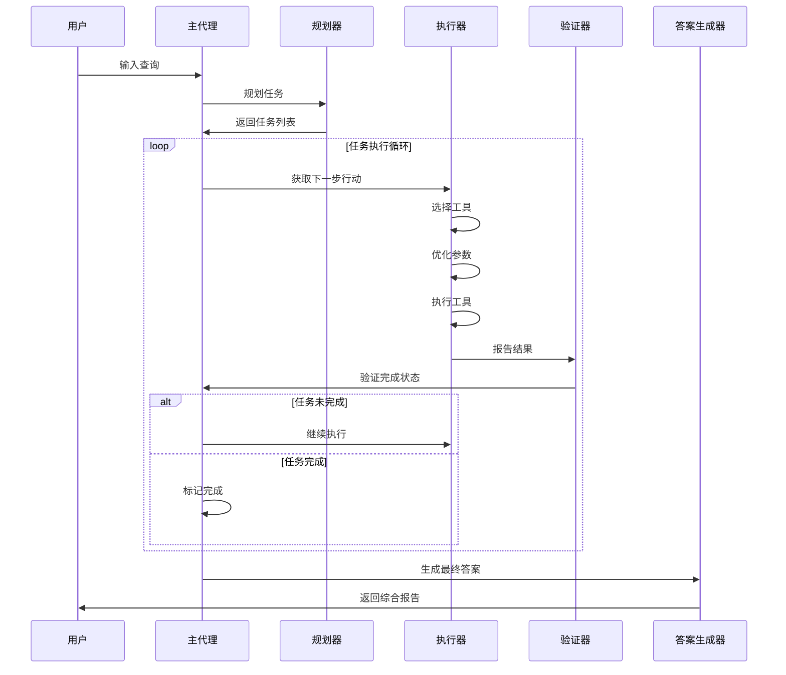
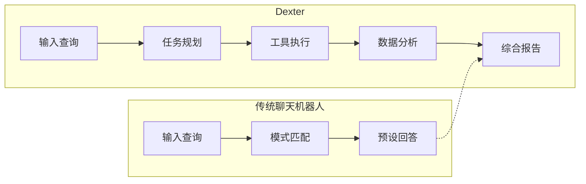
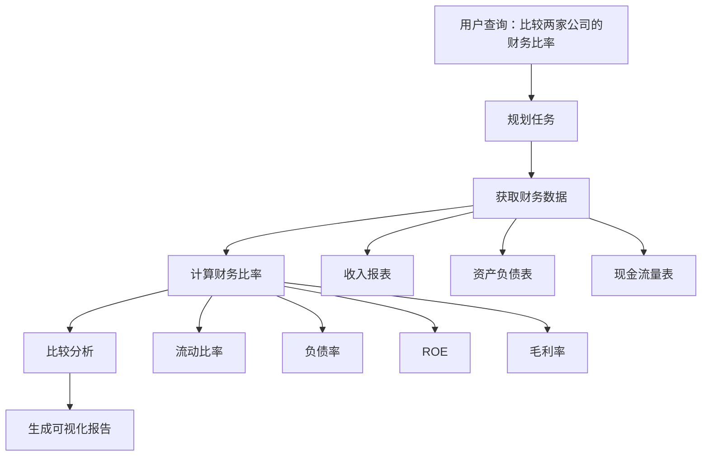
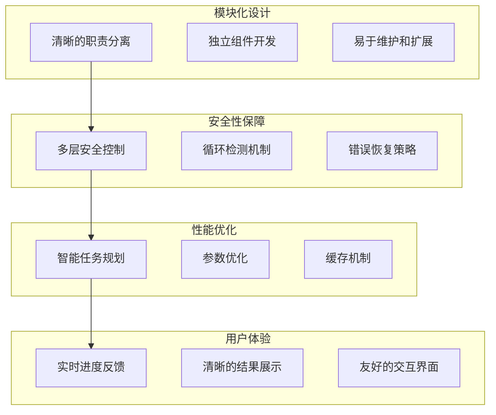

# Dexter项目概述

<cite>
**本文档中引用的文件**
- [README.md](file://README.md)
- [src/dexter/__init__.py](file://src/dexter/__init__.py)
- [src/dexter/agent.py](file://src/dexter/agent.py)
- [src/dexter/model.py](file://src/dexter/model.py)
- [src/dexter/prompts.py](file://src/dexter/prompts.py)
- [src/dexter/schemas.py](file://src/dexter/schemas.py)
- [src/dexter/cli.py](file://src/dexter/cli.py)
- [src/dexter/tools/__init__.py](file://src/dexter/tools/__init__.py)
- [src/dexter/tools/api.py](file://src/dexter/tools/api.py)
- [src/dexter/tools/financials.py](file://src/dexter/tools/financials.py)
- [src/dexter/tools/filings.py](file://src/dexter/tools/filings.py)
- [src/dexter/utils/logger.py](file://src/dexter/utils/logger.py)
- [src/dexter/utils/ui.py](file://src/dexter/utils/ui.py)
</cite>

## 目录
1. [项目简介](#项目简介)
2. [核心价值与定位](#核心价值与定位)
3. [技术架构概览](#技术架构概览)
4. [核心功能特性](#核心功能特性)
5. [多代理系统工作流程](#多代理系统工作流程)
6. [与传统聊天机器人的区别](#与传统聊天机器人的区别)
7. [典型使用场景](#典型使用场景)
8. [项目愿景与设计哲学](#项目愿景与设计哲学)
9. [技术优势分析](#技术优势分析)
10. [总结](#总结)

## 项目简介

Dexter是一个自主金融研究代理，能够像人类分析师一样思考、规划和学习。它通过任务规划、自我反思和实时市场数据执行分析，将复杂的金融问题转化为清晰的、分步骤的研究计划。Dexter不是普通的聊天机器人，而是一个能够在工作中自主思考、规划和学习的智能代理。

**章节来源**
- [README.md](file://README.md#L1-L10)

## 核心价值与定位

### 自主金融研究代理

Dexter的核心价值在于其作为自主金融研究代理的独特定位。它不仅仅是一个回答问题的工具，而是一个能够：

- **智能任务分解**：自动将复杂查询分解为结构化的研究步骤
- **自主执行**：选择并执行正确的工具来收集金融数据
- **自我验证**：检查自己的工作并在任务完成前不断迭代
- **实时数据访问**：访问资产负债表、利润表和现金流量表等实时财务数据
- **安全特性**：内置循环检测和步骤限制以防止失控执行

### 智能决策能力

Dexter的核心竞争力体现在其LLM驱动的智能决策机制上：

**图表来源**
- [src/dexter/agent.py](file://src/dexter/agent.py#L15-L50)
- [src/dexter/agent.py](file://src/dexter/agent.py#L120-L200)

**章节来源**
- [README.md](file://README.md#L11-L25)

## 技术架构概览

Dexter采用模块化的多代理架构，每个组件都有明确的职责分工：

**图表来源**
- [src/dexter/agent.py](file://src/dexter/agent.py#L1-L50)
- [src/dexter/cli.py](file://src/dexter/cli.py#L1-L33)
- [src/dexter/tools/__init__.py](file://src/dexter/tools/__init__.py#L1-L19)

### 核心组件说明

| 组件 | 职责 | 关键特性 |
|------|------|----------|
| 规划代理 | 分析查询并创建结构化任务列表 | 智能任务分解、逻辑序列生成 |
| 行动代理 | 选择适当工具并执行研究步骤 | 工具选择算法、参数优化 |
| 验证代理 | 验证任务完成度和数据充分性 | 自我检查机制、迭代控制 |
| 答案代理 | 将发现综合成全面响应 | 数据整合、洞察提取 |

**章节来源**
- [src/dexter/agent.py](file://src/dexter/agent.py#L15-L30)
- [src/dexter/prompts.py](file://src/dexter/prompts.py#L1-L50)

## 核心功能特性

### 智能任务规划

Dexter的智能任务规划能力是其核心优势之一。当接收到用户查询时，系统会：

1. **查询分析**：深入理解用户的金融研究需求
2. **任务分解**：将复杂问题拆解为可执行的子任务
3. **逻辑排序**：确保任务按照合理的顺序执行
4. **资源规划**：确定所需的工具和数据源

**图表来源**
- [src/dexter/agent.py](file://src/dexter/agent.py#L20-L45)
- [src/dexter/prompts.py](file://src/dexter/prompts.py#L5-L25)

### 自主工具执行

Dexter具备强大的自主工具执行能力：

- **工具识别**：根据任务需求自动选择最适合的工具
- **参数优化**：智能调整工具参数以获得最佳结果
- **执行监控**：实时监控工具执行状态
- **错误处理**：优雅处理执行过程中的异常情况

### 自我验证机制

系统的自我验证机制确保了结果的准确性和完整性：

**图表来源**
- [src/dexter/agent.py](file://src/dexter/agent.py#L80-L120)

**章节来源**
- [src/dexter/agent.py](file://src/dexter/agent.py#L20-L100)

## 多代理系统工作流程

Dexter的多代理系统遵循严格的协作流程，确保每个环节都得到充分考虑：

### 主要工作循环

**图表来源**
- [src/dexter/agent.py](file://src/dexter/agent.py#L120-L250)

### 安全控制机制

系统内置了多层安全控制以防止失控执行：

- **全局步数限制**：最大执行步数限制（默认20步）
- **单任务步数限制**：每个任务的最大迭代次数（默认5次）
- **循环检测**：检测重复动作循环并终止执行
- **错误恢复**：优雅处理各种异常情况

**章节来源**
- [src/dexter/agent.py](file://src/dexter/agent.py#L120-L250)

## 与传统聊天机器人的区别

### 核心差异对比

| 特性 | 传统聊天机器人 | Dexter |
|------|----------------|---------|
| 思考方式 | 基于模式匹配的响应 | 基于推理的任务规划 |
| 执行能力 | 仅提供预设答案 | 自主执行多种工具 |
| 数据访问 | 依赖静态知识库 | 实时访问金融数据 |
| 错误处理 | 简单错误提示 | 智能重试和恢复 |
| 输出质量 | 通用性回答 | 结构化数据分析 |

### 深度分析能力

Dexter具备传统聊天机器人所不具备的深度分析能力：

**图表来源**
- [src/dexter/agent.py](file://src/dexter/agent.py#L120-L200)

### 实时数据集成

Dexter能够实时访问和分析金融数据，这是传统聊天机器人无法实现的功能：

- **实时市场数据**：访问最新的财务报表和市场数据
- **动态计算**：基于最新数据进行实时计算和分析
- **趋势分析**：识别和分析长期趋势和短期波动
- **比较分析**：在同一时间点比较不同公司的表现

**章节来源**
- [README.md](file://README.md#L11-L25)

## 典型使用场景

### 收入增长分析

用户可以询问关于公司收入增长的具体问题，Dexter能够：

1. **数据收集**：获取目标公司的历史收入数据
2. **趋势分析**：识别收入增长趋势
3. **因素分析**：分析影响收入增长的关键因素
4. **预测展望**：基于历史数据预测未来趋势

### 财务比率比较

Dexter擅长进行复杂的财务比率比较：

**图表来源**
- [src/dexter/tools/financials.py](file://src/dexter/tools/financials.py#L1-L50)
- [src/dexter/tools/filings.py](file://src/dexter/tools/filings.py#L1-L50)

### 现金流趋势分析

系统能够深入分析公司的现金流状况：

- **经营现金流**：分析日常运营产生的现金流
- **投资现金流**：评估资本支出和投资活动
- **融资现金流**：分析债务和股权融资活动
- **自由现金流**：计算可用于再投资或分配给股东的现金流

### SEC文件分析

Dexter能够处理复杂的SEC文件分析：

- **10-K报告**：年度报告的详细分析
- **10-Q报告**：季度报告的财务分析
- **8-K公告**：重大事件的及时分析
- **特定项目提取**：从文件中提取特定段落

**章节来源**
- [README.md](file://README.md#L40-L55)

## 项目愿景与设计哲学

### 设计理念

Dexter的设计哲学体现了以下核心理念：

1. **自主性**：系统应该能够独立思考和决策
2. **透明性**：所有决策过程都应该清晰可见
3. **可靠性**：系统应该在各种情况下都能可靠运行
4. **扩展性**：架构应该支持新工具和功能的添加

### 项目愿景

Dexter的愿景是成为金融研究领域的革命性工具，通过：

- ** democratizing financial analysis**：让高质量的金融分析变得触手可及
- **增强决策质量**：为投资者和分析师提供更深入的洞察
- **推动技术创新**：在AI金融应用领域树立新的标准
- **促进金融教育**：帮助用户更好地理解复杂的金融概念

### 技术承诺

项目承诺持续的技术创新和改进：

- **持续学习**：系统能够从每次交互中学习和改进
- **性能优化**：不断优化执行效率和准确性
- **功能扩展**：定期添加新的工具和分析能力
- **用户体验**：持续改进用户界面和交互体验

**章节来源**
- [README.md](file://README.md#L1-L10)

## 技术优势分析

### 架构优势

Dexter的架构设计具有以下显著优势：

**图表来源**
- [src/dexter/agent.py](file://src/dexter/agent.py#L15-L30)
- [src/dexter/utils/ui.py](file://src/dexter/utils/ui.py#L1-L50)

### 技术创新点

1. **多代理协作**：独特的多代理架构实现了更好的分工协作
2. **自适应参数优化**：智能调整工具参数以提高执行效率
3. **实时数据集成**：无缝集成实时金融数据源
4. **智能错误处理**：先进的错误检测和恢复机制

### 可扩展性设计

系统设计考虑了未来的扩展需求：

- **插件式工具架构**：可以轻松添加新的分析工具
- **配置化管理**：通过配置文件管理各种参数
- **API标准化**：统一的工具调用接口
- **模块化组件**：独立开发和测试各个组件

**章节来源**
- [src/dexter/tools/__init__.py](file://src/dexter/tools/__init__.py#L1-L19)
- [src/dexter/schemas.py](file://src/dexter/schemas.py#L1-L25)

## 总结

Dexter作为一个自主金融研究代理，在多个维度上展现了其独特价值：

### 核心成就

1. **开创性的自主分析能力**：首次在金融领域实现真正的自主分析
2. **智能任务分解技术**：将复杂金融问题转化为可执行的步骤
3. **实时数据驱动分析**：基于最新数据提供准确的分析结果
4. **安全可靠的执行机制**：确保分析过程的安全性和稳定性

### 应用价值

对于不同类型的用户，Dexter提供了不同的价值：

- **初学者**：提供直观易懂的金融分析过程
- **投资者**：提供深入的投资决策支持
- **分析师**：提供高效的研究辅助工具
- **研究人员**：提供可靠的数据分析平台

### 未来发展

Dexter代表了AI金融应用的一个重要发展方向，其设计理念和技术实现为未来的金融AI产品提供了宝贵的参考。随着技术的不断发展，Dexter有望在金融分析领域发挥越来越重要的作用，为用户提供更加智能、准确和可靠的服务。

**章节来源**
- [README.md](file://README.md#L1-L130)
- [src/dexter/agent.py](file://src/dexter/agent.py#L1-L253)