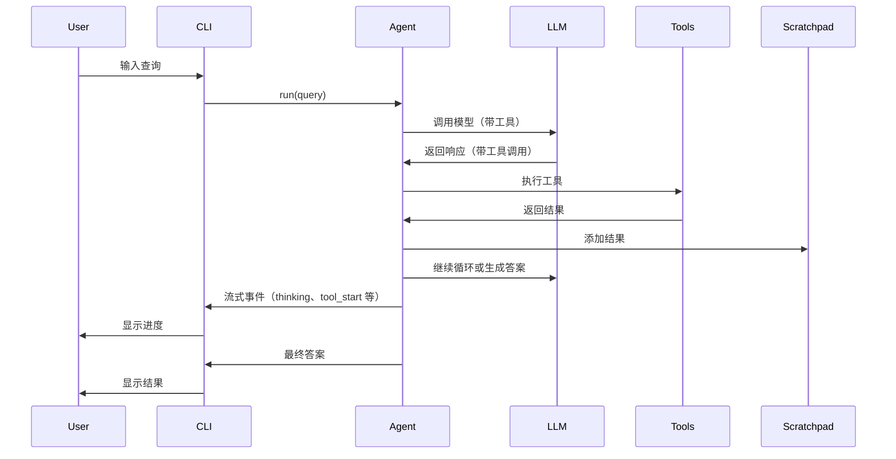

# Dexter - AI 金融研究代理

> 更新时间：2026-03-08 12:00:00

## 项目愿景

Dexter 是一个基于 CLI 的自主 AI 金融研究代理，采用任务规划、自我验证和实时市场数据分析技术来处理复杂的金融研究问题。项目采用 **TypeScript + pi-mono TUI + LangChain** 架构，专为金融领域深度研究设计。

**核心特性：**
- 智能任务规划：将复杂查询自动分解为结构化研究步骤
- 自主执行：选择并执行正确的工具以获取金融数据
- 自我验证：检查自身工作并迭代直到任务完成
- 实时金融数据：访问利润表、资产负债表和现金流量表
- 多渠道支持：WhatsApp 集成、群聊功能
- 公众情绪研究：x_search 工具分析社交媒体情绪
- 心跳功能：实时市场数据监控
- 安全特性：内置循环检测和步数限制以防止过度执行

---

## 项目结构图

```mermaid
graph TD
    A["(根) Dexter"] --> B["src/"];
    A --> C["配置与脚本"];
    A --> D["文档"];

    B --> E["agent/ - Agent 核心逻辑"];
    B --> F["components/ - pi-mono UI 组件"];
    B --> G["controllers/ - 控制器"];
    B --> H["gateway/ - Gateway 系统"];
    B --> I["model/ - LLM 抽象层"];
    B --> J["tools/ - 工具集"];
    B --> K["skills/ - 技能系统"];
    B --> L["utils/ - 工具函数"];
    B --> M["evals/ - 评估系统"];
    B --> N["cli.ts - CLI 入口"];

    J --> O["finance/ - 金融数据工具"];
    J --> P["search/ - 搜索工具"];
    J --> Q["browser/ - 浏览器自动化"];
    J --> R["fetch/ - 网络获取工具"];
    J --> S["filesystem/ - 文件系统工具"];
    J --> T["heartbeat/ - 心跳工具"];

    H --> U["channels/ - 渠道管理"];
    H --> V["group/ - 群聊功能"];
    H --> W["heartbeat/ - 心跳功能"];
    H --> X["routing/ - 路由解析"];

    K --> Y["dcf/ - DCF 估值技能"];
    K --> Z["x-research/ - X 搜索技能"];

    click E "./src/agent/CLAUDE.md" "查看 Agent 模块详情"
    click F "./src/components/CLAUDE.md" "查看 Components 模块详情"
    click G "./src/controllers/CLAUDE.md" "查看 Controllers 模块详情"
    click H "./src/gateway/CLAUDE.md" "查看 Gateway 模块详情"
    click I "./src/model/CLAUDE.md" "查看 Model 模块详情"
    click J "./src/tools/CLAUDE.md" "查看 Tools 模块详情"
    click K "./src/skills/CLAUDE.md" "查看 Skills 模块详情"
    click L "./src/utils/CLAUDE.md" "查看 Utils 模块详情"
    click M "./src/evals/CLAUDE.md" "查看 Evals 模块详情"
    click O "./src/tools/finance/CLAUDE.md" "查看 Finance 子模块详情"
    click P "./src/tools/search/CLAUDE.md" "查看 Search 子模块详情"
    click Q "./src/tools/browser/CLAUDE.md" "查看 Browser 子模块详情"
```



---

## 架构总览

### 技术栈

| 类别 | 技术 | 说明 |
|------|------|------|
| **运行时** | Bun (v1.0+) | 主要运行时环境 |
| **语言** | TypeScript | ESM 模式，严格类型检查 |
| **UI 框架** | pi-mono | 终端用户界面 |
| **AI 框架** | LangChain | LLM 抽象与工具绑定 |
| **浏览器自动化** | Playwright | 网页抓取与交互 |
| **测试框架** | Bun Test | 内置测试运行器 |
| **版本格式** | CalVer `YYYY.M.D` | 无零填充 |

### LLM 提供商支持

- **OpenAI** (默认): `gpt-5.4`, `gpt-5.2`
- **Anthropic**: `claude-*` 系列
- **Google**: `gemini-*` 系列
- **xAI (Grok)**: `grok-*` 系列
- **OpenRouter**: `openrouter:*` 前缀
- **Moonshot**: `kimi-*` 系列
- **DeepSeek**: `deepseek-*` 系列
- **Perplexity**: `perplexity-*` 系列（网络搜索）
- **Ollama**: 本地模型 `ollama:*` 前缀

**快速模型映射**（用于轻量级任务）：
- OpenAI: `gpt-4.1`
- Anthropic: `claude-haiku-4-5`
- Google: `gemini-3-flash-preview`
- xAI: `grok-4-1-fast-reasoning`

---

## 模块索引

| 模块路径 | 主要职责 | 关键文件 | 入口文件 |
|---------|---------|---------|---------|
| **agent** | Agent 循环核心、提示词、上下文管理（已重构） | `agent.ts`, `prompts.ts`, `scratchpad.ts`, `run-context.ts`, `tool-executor.ts` | `src/agent/index.ts` |
| **components** | pi-mono UI 组件 | `chat-log.ts`, `tool-event.ts`, `working-indicator.ts` | `src/components/index.ts` |
| **controllers** | 控制器层（Agent 运行、输入历史、模型选择） | `agent-runner.ts`, `input-history.ts`, `model-selection.ts` | `src/controllers/index.ts` |
| **gateway** | Gateway 系统（WhatsApp、群聊、心跳） | `gateway.ts`, `channels/manager.ts`, `routing/resolve-route.ts` | `src/gateway/index.ts` |
| **gateway/channels** | 渠道管理（WhatsApp） | `whatsapp/inbound.ts`, `whatsapp/outbound.ts` | `src/gateway/channels/index.ts` |
| **gateway/group** | 群聊功能（历史、成员追踪、@提及） | `history-buffer.ts`, `member-tracker.ts`, `mention-detection.ts` | `src/gateway/group/index.ts` |
| **gateway/heartbeat** | 心跳功能（实时数据监控） | `runner.ts`, `prompt.ts`, `suppression.ts` | `src/gateway/heartbeat/index.ts` |
| **model** | 多提供商 LLM 抽象层 | `llm.ts`, `providers.ts` | `src/model/llm.ts` |
| **tools** | 工具注册与实现 | `registry.ts`, `finance/*`, `browser/*`, `search/*`, `fetch/*`, `filesystem/*`, `heartbeat/*` | `src/tools/registry.ts` |
| **tools/browser** | Playwright 浏览器自动化 | `browser.ts` | `src/tools/browser/index.ts` |
| **tools/search** | 网络搜索（Exa/Tavily/Perplexity/x-search） | `exa.ts`, `tavily.ts`, `perplexity.ts`, `x-search.ts` | `src/tools/search/index.ts` |
| **tools/finance** | 金融数据工具 | `financial-search.ts`, `read-filings.ts`, `financial-metrics.ts`, `stock-price.ts` | `src/tools/finance/index.ts` |
| **tools/fetch** | 网络内容获取工具 | `web-fetch.ts`, `external-content.ts`, `cache.ts` | `src/tools/fetch/index.ts` |
| **tools/filesystem** | 文件系统工具（读/写/编辑） | `read-file.ts`, `write-file.ts`, `edit-file.ts` | `src/tools/filesystem/index.ts` |
| **tools/heartbeat** | 心跳工具 | `heartbeat-tool.ts` | `src/tools/heartbeat/index.ts` |
| **skills** | SKILL.md 工作流系统 | `registry.ts`, `loader.ts`, `dcf/SKILL.md`, `x-research/SKILL.md` | `src/skills/index.ts` |
| **utils** | 工具函数（缓存、错误处理、历史上下文） | `cache.ts`, `errors.ts`, `history-context.ts`, `model.ts` | `src/utils/index.ts` |
| **evals** | LangSmith 评估系统 | `run.ts`, `dataset/finance_agent.csv` | `src/evals/run.ts` |

---

## 运行与开发

### 环境配置

1. **安装 Bun**（如未安装）：
   ```bash
   curl -fsSL https://bun.com/install | bash
   ```

2. **安装依赖**：
   ```bash
   bun install
   ```

3. **配置环境变量**：
   ```bash
   cp env.example .env
   # 编辑 .env 添加 API 密钥
   ```

### 核心命令

| 命令 | 说明 |
|------|------|
| `bun start` | 运行交互式 CLI |
| `bun run src/cli.ts` | 直接运行入口文件 |
| `bun dev` | 监听模式（开发） |
| `bun run typecheck` | TypeScript 类型检查 |
| `bun test` | 运行测试套件 |
| `bun test --watch` | 监听模式测试 |
| `bun run src/evals/run.ts` | 运行完整评估 |
| `bun run src/evals/run.ts --sample 10` | 运行采样评估（10个问题） |
| `bash scripts/release.sh [version]` | 发布新版本（默认使用今日日期） |

### CI/CD

- **GitHub Actions**: `.github/workflows/ci.yml`
- **触发条件**: Push 到 main 分支 / PR 打开或更新
- **检查项**: `typecheck` 和 `test`
- **运行时**: `ubuntu-latest` + 最新版 Bun

---

## 编码规范

### 代码风格

- **语言**: TypeScript (ESM, strict mode)
- **类型**: 严格类型检查，避免 `any`
- **文件大小**: 保持简洁，提取助手函数而非重复代码
- **注释**: 为棘手或非显而易见的逻辑添加简短注释
- **日志**: 除非明确要求，否则不添加日志
- **文档**: 除非明确要求，否则不创建 README 或文档文件

### 测试规范

- **框架**: Bun 内置测试运行器（主要），Jest 配置用于遗留兼容性
- **测试文件**: 与源文件并列放置，命名为 `*.test.ts`
- **运行时机**: 在推送代码前，当您接触逻辑时运行 `bun test`

### 安全规范

- **API 密钥存储**: `.env` 文件（已 gitignore）
- **交互式输入**: 用户也可以通过 CLI 交互式输入密钥
- **配置存储**: `.dexter/settings.json`（已 gitignore）
- **禁止事项**: 永远不要提交或暴露真实的 API 密钥、令牌或凭据

---

## AI 使用指南

### 核心架构理解

#### Agent 循环（`src/agent/agent.ts`）

**架构重构（2026-03）**: Agent 模块已拆分为：
- `run-context.ts`: 运行时上下文管理
- `tool-executor.ts`: 工具执行逻辑
- `channels.ts`: 通道抽象层

1. **初始化**: 创建带工具的 Agent 实例
2. **迭代循环**（默认最多 10 次）：
   - 调用 LLM 获取响应
   - 如果有工具调用：通过 ToolExecutor 执行并添加到 Scratchpad
   - 如果无工具调用：生成最终答案
3. **上下文管理**: Anthropic 风格 - 超过阈值时清除最旧的工具结果
4. **事件流**: 实时生成 `thinking`、`tool_start`、`tool_end`、`done` 等事件用于 UI 更新

#### Scratchpad（`src/agent/scratchpad.ts`）

- **单一事实来源**: 所有工具结果的追加式记录本
- **格式**: JSONL（换行分隔的 JSON）用于弹性追加
- **持久化**: `.dexter/scratchpad/` 目录用于调试/历史记录
- **工具限制**: 软限制警告（每个工具每次查询最多 3 次调用）
- **查询相似度**: 防止重复循环的相似度检测

#### 工具系统（`src/tools/`）

**核心工具**:
- `financial_search`: 金融数据查询主入口（价格、指标、文件）
- `financial_metrics`: 直接指标查找（收入、市值等）
- `read_filings`: SEC 文件阅读器（10-K、10-Q、8-K）
- `web_search`: 通用网络搜索（Exa 优先，Tavily/Perplexity 回退）
- `x_search`: X (Twitter) 搜索，公众情绪分析
- `web_fetch`: 网页内容获取工具
- `read_file`/`write_file`/`edit_file`: 文件系统操作
- `heartbeat`: 心跳工具（实时数据监控）
- `browser`: 基于 Playwright 的网页抓取
- `skill`: 调用 SKILL.md 定义的工作流

**工具注册**（`src/tools/registry.ts`）:
- 根据环境变量条件包含工具
- 工具描述已内联到工具定义，移除 descriptions/ 目录

#### 技能系统（`src/skills/`）

- **定义**: `SKILL.md` 文件与 YAML frontmatter（`name`、`description`）
- **发现**: 启动时扫描 `src/skills/`、`~/.dexter/skills/`、`.dexter/skills/`
- **执行**: 通过 `skill` 工具调用
- **去重**: 每个技能每次查询最多执行一次

**内置技能**:
- `dcf-valuation`: DCF 估值分析（`src/skills/dcf/SKILL.md`）
- `x-research`: X (Twitter) 公众情绪研究（`src/skills/x-research/SKILL.md`）

### 开发工作流程

#### 添加新工具

1. 在 `src/tools/finance/`（或其他类别）创建工具文件
2. 使用 LangChain 的 `DynamicStructuredTool` 或 `StructuredTool`
3. 在 `src/tools/registry.ts` 中注册工具
4. 工具描述直接内联在工具定义中
5. 更新 `README.md`（如需要）

#### 添加新技能

1. 在 `src/skills/` 创建新目录（如 `my-skill/`）
2. 创建 `SKILL.md` 文件：
   ```yaml
   ---
   name: my-skill
   description: 技能描述，触发条件
   ---
   # 技能标题

   ## 工作流程检查清单

   - [ ] 步骤 1
   - [ ] 步骤 2
   ```
3. 技能将自动被发现并可用

#### 添加新 LLM 提供商

1. 在 `src/model/llm.ts` 的 `MODEL_PROVIDERS` 中添加前缀映射
2. 在 `FAST_MODELS` 中添加快速模型映射
3. 在 `env.example` 中添加 API 密钥变量
4. 在 `src/utils/env.ts` 中更新提供商显示名称映射

### 调试指南

#### Scratchpad 检查

位置: `.dexter/scratchpad/`

格式: 每个查询一个 JSONL 文件
```json
{"type":"init","timestamp":"2026-01-30T11:14:00.000Z","content":"Analyze AAPL"}
{"type":"tool_result","timestamp":"2026-01-30T11:14:05.123Z","toolName":"get_income_statements","args":{...},"result":{...}}
{"type":"thinking","timestamp":"2026-01-30T11:14:10.456Z","content":"Analyzing the financial data..."}
```

#### LangSmith 追踪

设置环境变量：
- `LANGSMITH_API_KEY`
- `LANGSMITH_ENDPOINT=https://api.smith.langchain.com`
- `LANGSMITH_PROJECT=dexter`
- `LANGSMITH_TRACING=true`

#### 评估系统

运行评估以测试代理性能：
```bash
bun run src/evals/run.ts              # 完整数据集
bun run src/evals/run.ts --sample 10  # 随机 10 个问题
```

评估使用 LLM-as-judge 方法并通过 LangSmith 跟踪。

### 常见问题

#### Q: 如何切换 LLM 提供商？
A: 在 CLI 中使用 `/model` 命令交互式选择，或编辑 `.dexter/settings.json`

#### Q: 如何添加自定义技能？
A: 在 `~/.dexter/skills/` 或项目 `.dexter/skills/` 创建包含 `SKILL.md` 的目录

#### Q: 工具调用限制是什么？
A: 每个工具每次查询最多 3 次调用（软限制 - 警告但不阻止）

#### Q: 如何禁用特定工具？
A: 在 `src/tools/registry.ts` 中注释掉或移除工具注册

#### Q: Scratchpad 文件会变得太大吗？
A: 上下文管理系统会在超过阈值时清除最旧的结果，保持合理大小

---

## 数据流图



---

## 变更记录

### 2026-03-08 12:00:00 - Upstream 同步与重大架构更新
- 从 virattt/dexter upstream 同步 76 个新提交
- **重大架构变更**: Ink UI 迁移到 pi-mono TUI
- **Agent 模块重构**: 拆分为 run-context 和 tool-executor
- **新增 Gateway 系统**: WhatsApp 渠道支持、群聊功能、路由解析
- **新功能**:
  - x_search 工具和 x-research 技能（公众情绪研究）
  - Perplexity 搜索提供商支持
  - gpt-5.4 模型支持
  - 心跳功能（实时市场数据监控）
  - 文件系统工具（read/write/edit-file）
  - web-fetch 工具（外部内容获取）
- **移除模块**: React Hooks（被控制器替代）
- **移除模块**: tools/descriptions/（描述内联到工具定义）
- **新增模块**: controllers/、gateway/、tools/fetch/、tools/filesystem/、tools/heartbeat/
- **版本更新**: v2026.3.5

### 2026-02-10 19:00:00 - 文档完善与子模块覆盖
- 创建 Hooks 模块独立文档（`src/hooks/CLAUDE.md`）
- 创建 Browser 工具子模块文档（`src/tools/browser/CLAUDE.md`）
- 创建 Search 工具子模块文档（`src/tools/search/CLAUDE.md`）
- 更新项目结构图，添加子模块链接
- 更新模块索引，包含所有子模块
- 更新索引文件，覆盖率提升至 100%

### 2026-02-10 18:45:19 - 初始化文档
- 创建根级 CLAUDE.md
- 生成项目结构图（Mermaid）
- 完整模块索引与架构总览
- AI 使用指南与开发工作流程
- 数据流图与调试指南

### 2025-01-21 - 项目发布
- Dexter v1.0 发布
- 初始功能集：Agent 循环、工具系统、技能系统
- LangSmith 评估集成

---

## 相关链接

- **仓库**: https://github.com/virattt/dexter
- **问题反馈**: GitHub Issues
- **许可证**: MIT License

*本文档由 AI 上下文初始化系统自动生成，最后更新：2026-03-08 12:00:00*
