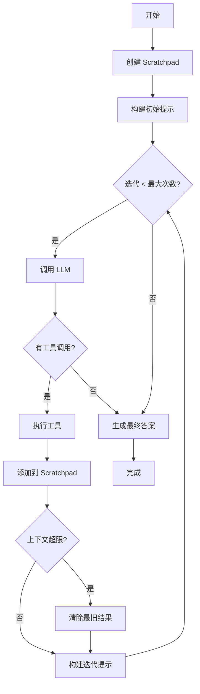

# Agent 模块

[根目录](../../CLAUDE.md) > **agent**

## 模块职责

Agent 模块是 Dexter 的核心引擎，实现自主研究代理的循环逻辑。负责任务规划、工具执行、上下文管理和最终答案生成。

---

## 入口与启动

### 主入口
- **文件**: `src/agent/index.ts`
- **主类**: `Agent` (`src/agent/agent.ts`)
- **创建方式**: `Agent.create(config)` 静态方法

### 初始化流程
```typescript
import { Agent } from './agent.js';

const agent = Agent.create({
  model: 'gpt-5.2',
  modelProvider: 'openai',
  maxIterations: 10,
  signal: abortSignal
});
```

---

## 对外接口

### Agent 类

**核心方法**:
- `create(config: AgentConfig): Agent` - 静态工厂方法，创建带工具的 Agent 实例
- `run(query: string, inMemoryChatHistory?): AsyncGenerator<AgentEvent>` - 运行代理并流式返回事件

**事件类型**（`src/agent/types.ts`）:
- `thinking` - 代理思考中
- `tool_start` - 工具执行开始
- `tool_progress` - 工具执行进度更新
- `tool_end` - 工具执行完成
- `tool_error` - 工具执行错误
- `tool_limit` - 工具调用限制警告
- `context_cleared` - 上下文被清除（超过阈值）
- `answer_start` - 最终答案生成开始
- `done` - 代理完成，返回最终答案

### 类型定义

**AgentConfig**:
```typescript
interface AgentConfig {
  model?: string;              // 默认 'gpt-5.2'
  modelProvider?: string;      // 默认 'openai'
  maxIterations?: number;      // 默认 10
  signal?: AbortSignal;        // 取消信号
}
```

**AgentEvent** - 联合类型，包含所有事件类型

---

## 关键依赖与配置

### 依赖项
- `@langchain/core` - LangChain 核心（消息、工具、运行时）
- `../model/llm.ts` - LLM 调用抽象
- `../tools/registry.ts` - 工具注册表
- `../utils/tokens.ts` - 令牌估算

### 配置
- **默认最大迭代次数**: 10
- **上下文阈值**: `CONTEXT_THRESHOLD` (在 `tokens.ts` 中定义)
- **保留工具使用次数**: `KEEP_TOOL_USES` (默认 3)

---

## 数据模型

### Scratchpad（`src/agent/scratchpad.ts`）

**职责**: 单一事实来源，跟踪代理在查询上的所有工作

**核心类**:
```typescript
class Scratchpad {
  constructor(query: string)
  addToolResult(toolName: string, args: Record<string, unknown>, result: string): void
  addThinking(message: string): void
  getToolResults(): string
  formatToolUsageForPrompt(): string
  getFullContexts(): ToolContext[]
  clearOldestToolResults(keepCount: number): number
  hasExecutedSkill(skillName: string): boolean
  recordToolCall(toolName: string, query?: string): void
  canCallTool(toolName: string, query?: string): ToolUsageStatus
}
```

**持久化**:
- 位置: `.dexter/scratchpad/`
- 格式: JSONL（换行分隔的 JSON）
- 文件命名: `YYYY-MM-DD-HHMMSS_hash.jsonl`

### TokenCounter（`src/agent/token-counter.ts`）

**职责**: 跟踪 LLM 使用统计

**接口**:
```typescript
class TokenCounter {
  add(usage?: TokenUsage): void
  getUsage(): TokenUsage
  getTokensPerSecond(totalTime: number): number
}
```

---

## 核心架构

### Agent 循环流程



### 上下文管理策略（Anthropic 风格）

- **全量保留**: 迭代期间保留所有工具结果
- **阈值清理**: 超过 `CONTEXT_THRESHOLD` 时清除最旧结果
- **保留策略**: 保留最近 N 次工具使用（`KEEP_TOOL_USES`）
- **最终答案**: 使用完整的 Scratchpad 上下文生成

### 工具限制机制

**软限制**（警告，不阻止）:
- 每个工具每次查询最多 3 次调用
- 查询相似度检测（阈值 0.7）
- 发出 `tool_limit` 事件以指导 LLM

---

## 测试与质量

### 测试文件
- 当前无专门测试文件（集成测试在 `src/evals/` 中）

### 测试策略
- 通过 LangSmith 评估系统进行端到端测试
- 使用 LLM-as-judge 方法验证答案正确性

### 质量指标
- 迭代次数（应合理收敛）
- 工具调用次数（避免重复）
- Token 使用效率
- 最终答案准确性（通过评估系统）

---

## 常见问题 (FAQ)

### Q: 为什么使用 AsyncGenerator 而不是 Promise？
A: AsyncGenerator 允许实时流式事件（`thinking`、`tool_start` 等）到 UI，提供更好的用户体验。

### Q: Scratchpad 和 ChatHistory 的区别？
A:
- **Scratchpad**: 单次查询的工作记录（工具结果、思考）
- **ChatHistory**: 跨查询的对话历史（用户消息）

### Q: 上下文清除机制如何工作？
A: 当估算的上下文令牌超过阈值时，保留最近 3 次工具使用，清除其他结果。这是 Anthropic 风格的上下文管理。

### Q: 如何调整最大迭代次数？
A: 在 `AgentConfig` 中设置 `maxIterations`，或修改 `DEFAULT_MAX_ITERATIONS` 常量。

### Q: 工具调用限制是硬限制还是软限制？
A: 软限制。系统会发出警告，但不会阻止工具调用。这有助于引导 LLM 而不会中断执行。

---

## 相关文件清单

### 核心文件
- `src/agent/agent.ts` - Agent 类实现
- `src/agent/index.ts` - 模块导出
- `src/agent/types.ts` - 类型定义（AgentConfig、AgentEvent 等）
- `src/agent/prompts.ts` - 系统提示词构建
- `src/agent/scratchpad.ts` - Scratchpad 实现
- `src/agent/token-counter.ts` - Token 统计

### 关键常量
- `DEFAULT_MAX_ITERATIONS = 10` - 默认最大迭代次数
- `CONTEXT_THRESHOLD` - 在 `../utils/tokens.ts` 中定义
- `KEEP_TOOL_USES` - 在 `../utils/tokens.ts` 中定义

---

## 变更记录

### 2026-02-10 18:45:19 - 模块文档创建
- 创建 Agent 模块 CLAUDE.md
- 完整的接口、类型和架构文档
- 数据流图和常见问题解答


<claude-mem-context>
# Recent Activity

<!-- This section is auto-generated by claude-mem. Edit content outside the tags. -->

### Feb 10, 2026

| ID | Time | T | Title | Read |
|----|------|---|-------|------|
| #2309 | 6:49 PM | ✅ | Created Agent module CLAUDE.md documentation | ~350 |
| #2308 | " | ✅ | Created comprehensive CLAUDE.md AI context documentation | ~326 |
</claude-mem-context>