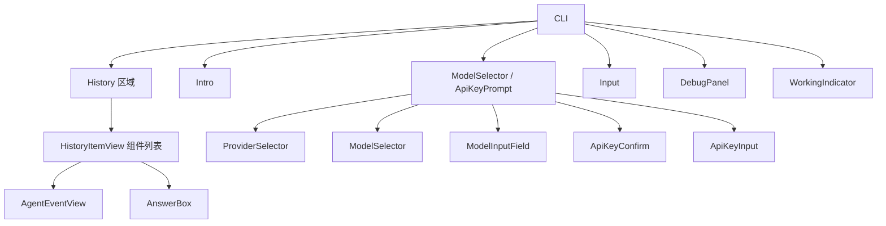

# Components 模块

[根目录](../../CLAUDE.md) > **components**

## 模块职责

Components 模块提供基于 Ink（React for CLI）的终端 UI 组件，实现交互式命令行界面，包括输入处理、模型选择、历史记录显示和实时事件流展示。

---

## 入口与启动

### 主入口
- **文件**: `src/components/index.ts`
- **主组件**: `CLI` (在 `src/cli.tsx` 中)
- **渲染方式**: Ink `render()` 函数

### 启动流程
```typescript
// src/index.tsx
import { render } from 'ink';
import { CLI } from './cli.js';

const { waitUntilExit } = render(<CLI />);
await waitUntilExit();
```

---

## 对外接口

### 组件列表

| 组件 | 文件 | 职责 |
|------|------|------|
| **CLI** | `src/cli.tsx` | 主应用组件，协调所有其他组件 |
| **Input** | `src/components/Input.tsx` | 用户输入框，支持多行和历史导航 |
| **Intro** | `src/components/Intro.tsx` | 欢迎屏幕和使用说明 |
| **ModelSelector** | `src/components/ModelSelector.tsx` | 模型/提供商选择 UI |
| **ApiKeyPrompt** | `src/components/ApiKeyPrompt.tsx` | API 密钥交互式输入 |
| **AgentEventView** | `src/components/AgentEventView.tsx` | 显示 Agent 事件流 |
| **AnswerBox** | `src/components/AnswerBox.tsx` | 最终答案显示 |
| **HistoryItemView** | `src/components/HistoryItemView.tsx` | 历史记录项显示 |
| **WorkingIndicator** | `src/components/WorkingIndicator.tsx` | 工作状态指示器 |
| **DebugPanel** | `src/components/DebugPanel.tsx` | 调试信息面板 |
| **CursorText** | `src/components/CursorText.tsx` | 光标文本组件 |

### 导出类型
```typescript
// src/components/index.ts
export type { HistoryItem, WorkingState };
export { Intro } from './Intro.js';
export { Input } from './Input.js';
// ... 其他导出
```

---

## 关键依赖与配置

### 依赖项
- **Ink**: `^6.5.1` - React for CLI
- **React**: `^19.2.0` - UI 框架
- **ink-text-input**: `^6.0.0` - 文本输入组件
- **ink-spinner**: `^5.0.0` - 加载动画

### Hooks 依赖
- `../hooks/useAgentRunner.ts` - Agent 运行逻辑
- `../hooks/useModelSelection.ts` - 模型选择逻辑
- `../hooks/useInputHistory.ts` - 输入历史管理

---

## 数据模型

### HistoryItem
```typescript
interface HistoryItem {
  id: string;
  query: string;
  answer?: string;
  status: 'processing' | 'completed' | 'error';
  events: EventEntry[];
  activeToolId?: string;
  error?: string;
  timestamp?: string;
  iterations?: number;
  totalTime?: number;
  tokenUsage?: TokenUsage;
}
```

### WorkingState
```typescript
type WorkingState =
  | { status: 'idle' }
  | { status: 'thinking' }
  | { status: 'tool'; toolName: string }
  | { status: 'answer' };
```

### EventEntry
```typescript
interface EventEntry {
  id: string;
  event: AgentEvent;
  completed: boolean;
}
```

---

## 核心架构

### CLI 组件结构



### 状态管理

**CLI 状态**:
```typescript
// 在 CLI 组件中
const {
  selectionState,      // 'provider' | 'model' | 'custom-model' | 'apikey' | 'none'
  provider,            // 当前选择的提供商
  model,               // 当前选择的模型
  inMemoryChatHistoryRef,
  // ... 处理函数
} = useModelSelection(setError);

const {
  history,             // HistoryItem[]
  workingState,
  error,
  isProcessing,
  runQuery,
  cancelExecution,
  setError,
} = useAgentRunner(agentConfig, inMemoryChatHistoryRef);
```

### 输入处理

**支持的命令**:
- `/model` - 打开模型选择器
- `/exit` - 退出应用
- `/clear` - 清除历史记录
- `/debug` - 切换调试面板

**键盘快捷键**:
- `Ctrl+C` - 取消当前执行或退出
- `Up/Down` - 导航输入历史
- `Enter` - 提交查询
- `Ctrl+U` - 清除输入

---

## 组件详解

### ModelSelector

**状态流**:
1. `provider` → 选择提供商
2. `model` → 选择模型（预设列表）
3. `custom-model` → 输入自定义模型名称
4. `apikey` → 输入 API 密钥（如需要）

**支持的提供商**:
- OpenAI
- Anthropic
- Google
- xAI (Grok)
- OpenRouter
- Moonshot
- DeepSeek
- Ollama

### Input

**特性**:
- 多行输入支持
- 历史记录导航（上下箭头）
- 自动聚焦
- 命令识别（以 `/` 开头）

### AgentEventView

**显示的事件类型**:
- `thinking` - 显示思考内容
- `tool_start` - 显示工具名称和参数
- `tool_progress` - 显示进度消息
- `tool_end` - 显示工具执行结果摘要
- `tool_error` - 显示错误消息
- `tool_limit` - 显示限制警告

---

## 测试与质量

### 测试文件
- 当前无专门测试文件（UI 测试通过手动测试进行）

### 测试策略
- 手动 UI 测试
- 通过 E2E 评估系统验证集成

### 质量考虑
- 响应式设计（适配不同终端尺寸）
- 无障碍性（清晰的文本对比度）
- 性能（避免不必要的重新渲染）

---

## 常见问题 (FAQ)

### Q: 如何添加新的键盘快捷键？
A: 在 `Input.tsx` 的 `useInput` hook 中添加新的键处理逻辑。

### Q: 如何自定义欢迎屏幕？
A: 编辑 `src/components/Intro.tsx` 组件。

### Q: 如何更改主题颜色？
A: 编辑 `src/theme.ts` 文件，定义颜色常量。

### Q: 为什么使用 Ink 而不是其他 CLI 框架？
A: Ink 允许使用 React 组件模型，使得状态管理和 UI 组合更加直观和可维护。

### Q: 如何添加新的命令？
A: 在 `Input.tsx` 中的 `handleSubmit` 函数中添加新的命令处理逻辑。

---

## 相关文件清单

### 核心组件
- `src/cli.tsx` - 主 CLI 组件
- `src/components/Input.tsx` - 输入组件
- `src/components/Intro.tsx` - 欢迎屏幕
- `src/components/ModelSelector.tsx` - 模型选择器
- `src/components/ApiKeyPrompt.tsx` - API 密钥提示
- `src/components/AgentEventView.tsx` - 事件视图
- `src/components/AnswerBox.tsx` - 答案框
- `src/components/HistoryItemView.tsx` - 历史记录视图
- `src/components/WorkingIndicator.tsx` - 工作指示器
- `src/components/DebugPanel.tsx` - 调试面板
- `src/components/CursorText.tsx` - 光标文本
- `src/components/index.ts` - 导出

### 主题
- `src/theme.ts` - 颜色和样式定义

---

## 变更记录

### 2026-02-10 18:45:19 - 模块文档创建
- 创建 Components 模块 CLAUDE.md
- 完整的组件列表和数据模型
- UI 架构图和状态管理说明


<claude-mem-context>
# Recent Activity

<!-- This section is auto-generated by claude-mem. Edit content outside the tags. -->

### Feb 10, 2026

| ID | Time | T | Title | Read |
|----|------|---|-------|------|
| #2310 | 6:49 PM | ✅ | Created Components module CLAUDE.md documentation | ~347 |
</claude-mem-context>