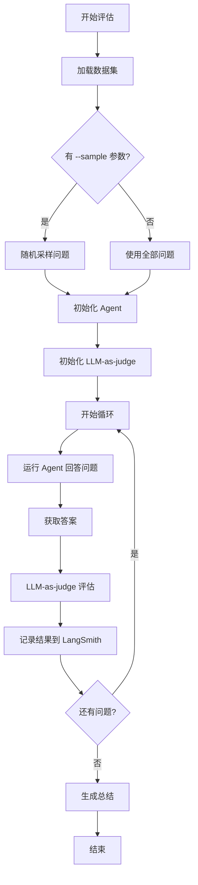

# Evals 模块

[根目录](../../CLAUDE.md) > **evals**

## 模块职责

Evals 模块提供基于 LangSmith 的评估系统，使用 LLM-as-judge 方法测试 Agent 在金融问题上的性能。包括实时 UI 展示进度、当前问题、准确率统计等功能。

---

## 入口与启动

### 主入口
- **文件**: `src/evals/run.ts`
- **执行方式**: `bun run src/evals/run.ts [options]`

### 使用示例
```bash
# 运行完整评估
bun run src/evals/run.ts

# 运行采样评估（10个问题）
bun run src/evals/run.ts --sample 10

# 运行特定数量的问题
bun run src/evals/run.ts --sample 50
```

---

## 对外接口

### 命令行参数
- `--sample <n>`: 随机采样 n 个问题（可选）

### 组件导出
- `EvalApp` - 主评估应用组件
- `EvalProgress` - 进度展示组件
- `EvalCurrentQuestion` - 当前问题展示组件
- `EvalStats` - 统计信息组件
- `EvalRecentResults` - 最近结果展示组件

---

## 关键依赖与配置

### 依赖项
- **langsmith**: `^0.4.10` - LangSmith SDK
- **Ink**: CLI UI 框架
- **@langchain/openai**: LLM-as-judge 评估

### 环境变量
- `LANGSMITH_API_KEY` - LangSmith API 密钥（必需）
- `LANGSMITH_ENDPOINT` - LangSmith 端点（默认 `https://api.smith.langchain.com`）
- `LANGSMITH_PROJECT` - LangSmith 项目名（默认 `dexter`）
- `LANGSMITH_TRACING` - 是否启用追踪（`true`/`false`）

---

## 数据模型

### Example
```typescript
interface Example {
  inputs: { question: string };
  outputs: { answer: string };
}
```

### EvaluationResult
```typescript
interface EvaluationResult {
  question: string;
  expected: string;
  actual: string;
  score: number;
  feedback: string;
}
```

### EvalProgressEvent
```typescript
type EvalProgressEvent =
  | { type: 'start'; total: number }
  | { type: 'progress'; current: number; total: number; question: string }
  | { type: 'result'; result: EvaluationResult }
  | { type: 'done'; summary: EvalSummary };
```

### EvalSummary
```typescript
interface EvalSummary {
  total: number;
  correct: number;
  incorrect: number;
  accuracy: number;
}
```

---

## 核心架构

### 评估流程



### CSV 解析器

**特点**:
- 处理多行引用字段
- 跳过空行
- 提取问题和标准答案

**数据集位置**: `src/evals/dataset/finance_agent.csv`

**格式**:
```csv
question,answer
"What is the price of AAPL?","The current price of AAPL is..."
```

### LLM-as-Judge

**评估标准**:
- 答案正确性
- 信息完整性
- 数据准确性

**评分**:
- 二元评分（正确/不正确）
- 提供反馈解释

### UI 组件

**EvalApp**: 主应用组件，协调所有其他组件

**EvalProgress**: 进度条
- 显示当前/总数
- 百分比进度

**EvalCurrentQuestion**: 当前问题
- 显示问题文本
- 显示 Agent 正在处理

**EvalStats**: 统计信息
- 总数
- 正确数
- 不正确数
- 准确率

**EvalRecentResults**: 最近结果
- 显示最近 N 个结果
- 每个结果的问题和分数

---

## 评估数据集

### finance_agent.csv

**内容**: 金融相关问题

**示例问题**:
- 股票价格查询
- 财务指标分析
- 公司基本面信息
- 行业比较

**更新**: 可通过添加新行来扩展数据集

---

## 测试与质量

### 测试文件
- 当前无专门测试文件

### 测试策略
- 通过运行评估来测试系统
- 手动验证评估结果的准确性

### 质量指标
- 准确率（目标 > 80%）
- 评估一致性
- LangSmith 追踪完整性

---

## 常见问题 (FAQ)

### Q: 如何添加新问题到数据集？
A: 在 `src/evals/dataset/finance_agent.csv` 中添加新行，格式为 `question,answer`。

### Q: 评估结果存储在哪里？
A: 评估结果通过 LangSmith SDK 自动上传到 LangSmith 平板，可在那里查看详细分析。

### Q: 如何修改评估标准？
A: 在 `run.ts` 中修改 `evaluateResult` 函数的评估提示词。

### Q: 可以使用不同的 LLM-as-judge 吗？
A: 可以。修改 `run.ts` 中的 `judgeModel` 初始化。

### Q: 如何调试单个问题？
A: 可以使用 `--sample 1` 运行单个问题，或在代码中硬编码特定问题。

### Q: 评估会影响生产 API 配额吗？
A: 会。评估会调用 LLM API（Agent + Judge），请留意配额使用。

---

## 相关文件清单

### 核心文件
- `src/evals/run.ts` - 评估运行器
- `src/evals/dataset/finance_agent.csv` - 评估数据集

### UI 组件
- `src/evals/components/EvalApp.tsx` - 主应用组件
- `src/evals/components/EvalProgress.tsx` - 进度组件
- `src/evals/components/EvalCurrentQuestion.tsx` - 当前问题组件
- `src/evals/components/EvalStats.tsx` - 统计组件
- `src/evals/components/EvalRecentResults.tsx` - 最近结果组件
- `src/evals/components/index.ts` - 组件导出

---

## 变更记录

### 2026-02-10 18:45:19 - 模块文档创建
- 创建 Evals 模块 CLAUDE.md
- 完整的评估系统架构说明
- 数据集格式和 LLM-as-judge 说明
- UI 组件列表


<claude-mem-context>
# Recent Activity

<!-- This section is auto-generated by claude-mem. Edit content outside the tags. -->

### Feb 10, 2026

| ID | Time | T | Title | Read |
|----|------|---|-------|------|
| #2312 | 6:50 PM | ✅ | Created Evals module CLAUDE.md documentation | ~323 |
</claude-mem-context>