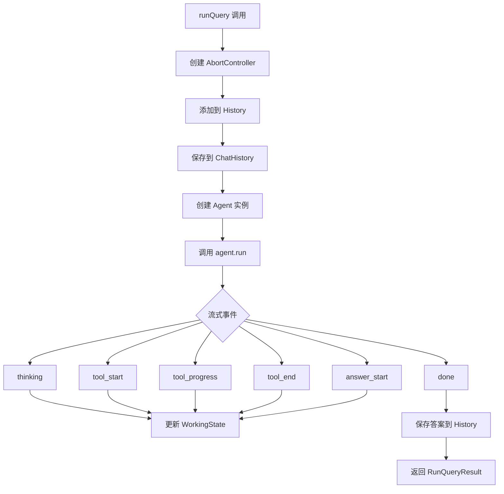
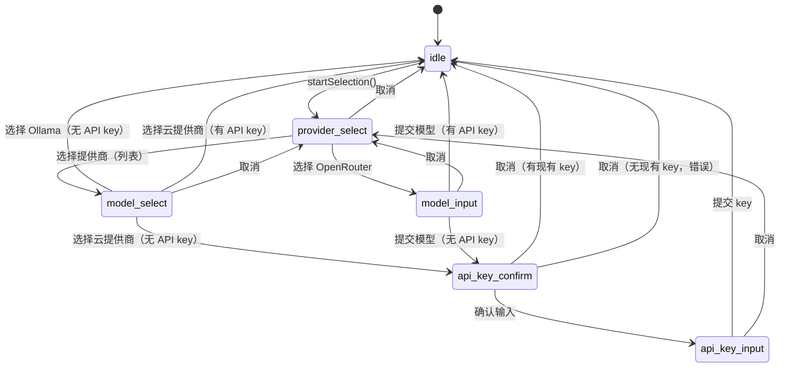

# Hooks 模块

[根目录](../../CLAUDE.md) > **hooks**

## 模块职责

Hooks 模块提供 React Hooks，封装 Agent 运行、模型选择、输入历史、调试日志和文本缓冲等核心逻辑，供 Ink CLI 组件使用。

---

## 入口与启动

### 主入口
- **目录**: `src/hooks/`
- **无统一入口文件**: 各 hook 独立导出

### 使用示例
```typescript
import { useAgentRunner } from './hooks/useAgentRunner.js';
import { useModelSelection } from './hooks/useModelSelection.js';
import { useInputHistory } from './hooks/useInputHistory.js';

// 在组件中使用
const { history, runQuery, cancelExecution } = useAgentRunner(config, chatHistoryRef);
const { provider, model, startSelection } = useModelSelection(setError);
const { historyValue, navigateUp, saveMessage } = useInputHistory();
```

---

## 对外接口

### Hook 列表

| Hook | 文件 | 职责 |
|------|------|------|
| **useAgentRunner** | `useAgentRunner.ts` | Agent 运行与事件流管理 |
| **useModelSelection** | `useModelSelection.ts` | 模型/提供商选择流程 |
| **useInputHistory** | `useInputHistory.ts` | 输入历史导航 |
| **useDebugLogs** | `useDebugLogs.ts` | 调试日志订阅 |
| **useTextBuffer** | `useTextBuffer.ts` | 文本缓冲与光标管理 |

---

## 关键依赖与配置

### 依赖项
- **React**: `^19.2.0` - Hooks 框架
- **../agent/agent.ts** - Agent 核心逻辑
- **../model/llm.ts** - LLM 抽象层
- **../utils/** - 配置、缓存、聊天历史等工具

### 环境配置
- 依赖 `.dexter/settings.json` 持久化模型选择
- 依赖环境变量进行 API 密钥验证

---

## 数据模型

### UseAgentRunnerResult
```typescript
interface UseAgentRunnerResult {
  // 状态
  history: HistoryItem[];
  workingState: WorkingState;
  error: string | null;
  isProcessing: boolean;

  // 操作
  runQuery: (query: string) => Promise<RunQueryResult | undefined>;
  cancelExecution: () => void;
  setError: (error: string | null) => void;
}
```

### ModelSelectionState
```typescript
interface ModelSelectionState {
  appState: AppState;
  pendingProvider: string | null;
  pendingModels: Model[];
}

type AppState = 'idle' | 'provider_select' | 'model_select' |
                'model_input' | 'api_key_confirm' | 'api_key_input';
```

### UseInputHistoryResult
```typescript
interface UseInputHistoryResult {
  historyValue: string | null;  // null = 用户正在输入
  navigateUp: () => void;
  navigateDown: () => void;
  saveMessage: (message: string) => Promise<void>;
  updateAgentResponse: (response: string) => Promise<void>;
  resetNavigation: () => void;
}
```

### TextBufferActions
```typescript
interface TextBufferActions {
  insert: (text: string) => void;
  deleteBackward: () => void;
  deleteWordBackward: () => void;
  moveCursor: (position: number) => void;
  clear: () => void;
  setValue: (value: string, cursorAtEnd?: boolean) => void;
}
```

---

## 核心架构

### useAgentRunner 流程



**状态管理**:
- 使用 `useState` 管理 history、workingState、error
- 使用 `useRef` 存储 AbortController 避免重渲染
- `updateLastHistoryItem` 高效更新最新条目

**取消执行**:
- 调用 `abortController.abort()`
- 捕获 `AbortError`，标记为 `interrupted` 而非错误

### useModelSelection 状态机



**特殊处理**:
- **OpenRouter**: 自由文本输入模型名称（支持任何 OpenRouter 模型）
- **Ollama**: 跳过 API key 流程，直接完成切换
- **云提供商**: 检查现有 API key，如需要则提示输入

### useInputHistory 堆栈导航

**索引规则**（堆栈顺序，最新在前）:
- `historyIndex = -1`: 用户正在输入（不在历史中）
- `historyIndex = 0`: 最最近的消息
- `historyIndex = N`: 往前 N 条消息

**导航逻辑**:
- `navigateUp()`: 向历史深处移动（更旧的消息）
- `navigateDown()`: 向当前移动（更新的消息）
- 到达边界时停留在最旧/最新消息

### useTextBuffer 光标管理

**实现细节**:
- 使用 `useRef` 存储缓冲区和光标位置，避免快速输入时的竞态条件
- `forceRender` 触发重渲染
- 支持多行输入（保留换行符）
- `deleteWordBackward` 使用 `findPrevWordStart` 智能删除

---

## Hook 详解

### useAgentRunner

**核心职责**:
- Agent 生命周期管理
- 事件流处理与 UI 状态更新
- 取消执行与错误处理
- 聊天历史集成

**事件处理**:
- `thinking`: 更新 workingState，添加到 events
- `tool_start`: 激活工具，添加未完成事件
- `tool_progress`: 更新活动工具的进度消息
- `tool_end/tool_error`: 标记工具完成，更新 workingState
- `done`: 保存最终答案，更新统计信息

### useModelSelection

**核心职责**:
- 模型/提供商选择状态管理
- API key 验证与收集
- 持久化设置到 `.dexter/settings.json`
- 共享 InMemoryChatHistory 引用

**完整模型切换流程**:
```typescript
const completeModelSwitch = useCallback((newProvider, newModelId) => {
  setProvider(newProvider);
  setModel(newModelId);
  setSetting('provider', newProvider);
  setSetting('modelId', newModelId);
  inMemoryChatHistoryRef.current.setModel(newModelId);
  // 清理待处理状态
  setPendingProvider(null);
  setPendingModels([]);
  setAppState('idle');
}, []);
```

### useInputHistory

**核心职责**:
- 加载/保存长期聊天历史
- 历史导航（上下箭头）
- Agent 响应更新

**存储**:
- 使用 `LongTermChatHistory` 类
- 持久化到 `.dexter/chat-history.jsonl`

### useDebugLogs

**核心职责**:
- 订阅日志流
- 返回当前日志条目

**实现**:
- 使用 `logger.subscribe()` 订阅
- 组件卸载时自动取消订阅

### useTextBuffer

**核心职责**:
- 文本缓冲管理
- 光标位置跟踪
- 文本操作（插入、删除、移动）

**性能优化**:
- 使用 refs 避免快速输入时的状态竞态
- 仅在内容变化时触发重渲染

---

## 测试与质量

### 测试文件
- 当前无专门测试文件

### 测试策略
- 通过集成测试验证 hooks 行为
- 手动 UI 测试

### 质量考虑
- 使用 `useCallback` 优化性能
- 使用 `useRef` 避免不必要的重渲染
- 正确处理异步操作和清理

---

## 常见问题 (FAQ)

### Q: 为什么 useAgentRunner 返回 AsyncGenerator？
A: Agent.run() 返回 AsyncGenerator 以流式传输事件，提供实时 UI 反馈。

### Q: 如何添加新的选择状态？
A: 在 `SELECTION_STATES` 数组中添加新状态，更新 `AppState` 类型，并添加相应的处理函数。

### Q: useInputHistory 的堆栈顺序为何？
A: 堆栈顺序（最新在前）提供 O(1) 访问最近消息的性能，符合用户期望的行为。

### Q: useTextBuffer 为什么使用 refs 而不是 state？
A: 快速输入时 setState 可能导致竞态条件和输入丢失，refs 提供同步访问。

### Q: 如何共享 InMemoryChatHistory？
A: 通过 `useRef` 在 `useModelSelection` 中创建，传递给 `useAgentRunner`，确保两者访问同一实例。

---

## 相关文件清单

### 核心 Hooks
- `src/hooks/useAgentRunner.ts` - Agent 运行管理
- `src/hooks/useModelSelection.ts` - 模型选择管理
- `src/hooks/useInputHistory.ts` - 输入历史管理
- `src/hooks/useDebugLogs.ts` - 调试日志订阅
- `src/hooks/useTextBuffer.ts` - 文本缓冲管理

### 依赖模块
- `../agent/agent.ts` - Agent 类
- `../model/llm.ts` - LLM 调用
- `../utils/config.ts` - 配置管理
- `../utils/env.ts` - 环境变量
- `../utils/long-term-chat-history.ts` - 长期历史
- `../utils/in-memory-chat-history.ts` - 内存历史

---

## 变更记录

### 2026-02-10 19:00:00 - Hooks 模块文档创建
- 创建 Hooks 模块 CLAUDE.md
- 完整的 Hook 列表和数据模型
- 状态机和流程图说明
- 架构详解与常见问题解答
