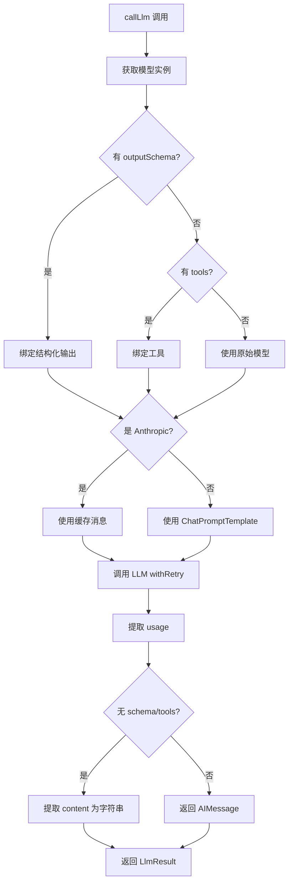

# Model 模块

[根目录](../../CLAUDE.md) > **model**

## 模块职责

Model 模块提供多提供商 LLM 抽象层，支持 OpenAI、Anthropic、Google、xAI、OpenRouter、Moonshot、DeepSeek 和 Ollama，统一接口调用不同的大语言模型。

---

## 入口与启动

### 主入口
- **文件**: `src/model/llm.ts`
- **主函数**: `callLlm(prompt, options)` - 调用 LLM 并返回结果
- **工厂函数**: `getChatModel(modelName, streaming)` - 获取聊天模型实例

### 使用示例
```typescript
import { callLlm, getChatModel } from './model/llm.js';

// 简单调用
const result = await callLlm('What is the price of AAPL?', {
  model: 'gpt-5.2',
  systemPrompt: 'You are a financial analyst.',
});

// 带工具调用
const resultWithTools = await callLlm(prompt, {
  model: 'claude-sonnet-4-20250514',
  tools: [financialSearchTool, webSearchTool],
});

// 获取模型实例
const model = getChatModel('gpt-5.2', false);
```

---

## 对外接口

### 核心函数

#### `callLlm(prompt, options)`
调用 LLM 并返回响应。

**参数**:
```typescript
interface CallLlmOptions {
  model?: string;                // 默认 'gpt-5.2'
  systemPrompt?: string;         // 默认使用 DEFAULT_SYSTEM_PROMPT
  outputSchema?: z.ZodType;      // 结构化输出模式
  tools?: StructuredToolInterface[]; // 工具列表
  signal?: AbortSignal;          // 取消信号
}
```

**返回**:
```typescript
interface LlmResult {
  response: AIMessage | string;
  usage?: TokenUsage;
}
```

#### `getChatModel(modelName, streaming)`
获取聊天模型实例。

**参数**:
- `modelName`: 模型名称（如 'gpt-5.2', 'claude-sonnet-4-20250514'）
- `streaming`: 是否启用流式输出

**返回**: `BaseChatModel` 实例

#### `getFastModel(provider, fallbackModel)`
获取指定提供商的快速模型变体。

**参数**:
- `provider`: 提供商名称
- `fallbackModel`: 如果没有快速模型则使用此模型

**返回**: 快速模型名称字符串

---

## 关键依赖与配置

### 依赖项
- `@langchain/openai` - OpenAI 集成
- `@langchain/anthropic` - Anthropic 集成
- `@langchain/google-genai` - Google Gemini 集成
- `@langchain/ollama` - Ollama 本地模型集成
- `@langchain/core` - LangChain 核心
- `zod` - 模式验证

### 环境变量
- `OPENAI_API_KEY` - OpenAI API 密钥
- `ANTHROPIC_API_KEY` - Anthropic API 密钥
- `GOOGLE_API_KEY` - Google API 密钥
- `XAI_API_KEY` - xAI API 密钥
- `OPENROUTER_API_KEY` - OpenRouter API 密钥
- `MOONSHOT_API_KEY` - Moonshot API 密钥
- `DEEPSEEK_API_KEY` - DeepSeek API 密钥
- `OLLAMA_BASE_URL` - Ollama 基础 URL（默认 `http://127.0.0.1:11434`）

---

## 数据模型

### TokenUsage
```typescript
interface TokenUsage {
  inputTokens: number;
  outputTokens: number;
  totalTokens: number;
}
```

### LlmResult
```typescript
interface LlmResult {
  response: AIMessage | string;
  usage?: TokenUsage;
}
```

---

## 核心架构

### 提供商检测

基于模型名称前缀自动检测提供商：

| 前缀 | 提供商 | 示例 |
|------|--------|------|
| `claude-` | Anthropic | `claude-sonnet-4-20250514` |
| `gemini-` | Google | `gemini-2.0-flash-exp` |
| `grok-` | xAI | `grok-2-1212` |
| `openrouter:` | OpenRouter | `openrouter:anthropic/claude-3.5-sonnet` |
| `kimi-` | Moonshot | `kimi-k2-5` |
| `deepseek-` | DeepSeek | `deepseek-chat` |
| `ollama:` | Ollama | `ollama:llama3` |
| *(其他)* | OpenAI | `gpt-5.2` |

### 快速模型映射

用于轻量级任务（如摘要）的快速模型：

```typescript
const FAST_MODELS: Record<string, string> = {
  openai: 'gpt-4.1',
  anthropic: 'claude-haiku-4-5',
  google: 'gemini-3-flash-preview',
  xai: 'grok-4-1-fast-reasoning',
  openrouter: 'openrouter:openai/gpt-4o-mini',
  moonshot: 'kimi-k2-5',
  deepseek: 'deepseek-chat',
};
```

### 重试机制

内置指数退避重试（最多 3 次）：
```typescript
async function withRetry<T>(fn: () => Promise<T>, maxAttempts = 3): Promise<T>
```

### Anthropic 提示缓存

Anthropic 模型使用 `cache_control` 实现提示缓存，减少后续调用的输入令牌成本约 90%：
```typescript
function buildAnthropicMessages(systemPrompt: string, userPrompt: string) {
  return [
    new SystemMessage({
      content: [{
        type: 'text',
        text: systemPrompt,
        cache_control: { type: 'ephemeral' },
      }],
    }),
    new HumanMessage(userPrompt),
  ];
}
```

---

## 使用流程



---

## 测试与质量

### 测试文件
- 当前无专门测试文件

### 测试策略
- 通过集成测试验证不同提供商
- 在 Evals 中验证端到端功能

### 质量指标
- API 调用成功率
- 重试次数（应较少）
- Token 使用准确性

---

## 常见问题 (FAQ)

### Q: 如何添加新的 LLM 提供商？
A:
1. 在 `MODEL_PROVIDERS` 中添加前缀映射
2. 在 `FAST_MODELS` 中添加快速模型
3. 在 `env.example` 中添加 API 密钥变量
4. 在 `../utils/env.ts` 中更新显示名称

### Q: 为什么 Anthropic 使用特殊的消息格式？
A: 为了使用 `cache_control` 实现提示缓存，这可以减少后续调用的成本约 90%。

### Q: 如何切换到本地模型（Ollama）？
A: 设置 `OLLAMA_BASE_URL` 环境变量（默认 `http://127.0.0.1:11434`），然后使用 `ollama:模型名` 格式。

### Q: 什么是快速模型？
A: 用于轻量级任务（如摘要）的较小/较快的模型变体，以降低成本和延迟。

### Q: 如何处理 API 密钥缺失？
A: 函数会抛出错误，提示缺少特定的环境变量。上层调用者应捕获并处理。

---

## 相关文件清单

### 核心文件
- `src/model/llm.ts` - 主要实现

### 关键常量
- `DEFAULT_PROVIDER = 'openai'`
- `DEFAULT_MODEL = 'gpt-5.2'`
- `FAST_MODELS` - 快速模型映射
- `MODEL_PROVIDERS` - 提供商工厂映射

---

## 变更记录

### 2026-02-10 18:45:19 - 模块文档创建
- 创建 Model 模块 CLAUDE.md
- 完整的提供商列表和配置说明
- 架构图和使用流程


<claude-mem-context>
# Recent Activity

<!-- This section is auto-generated by claude-mem. Edit content outside the tags. -->

### Feb 10, 2026

| ID | Time | T | Title | Read |
|----|------|---|-------|------|
| #2311 | 6:49 PM | ✅ | Created Model module CLAUDE.md documentation | ~371 |
| #2308 | " | ✅ | Created comprehensive CLAUDE.md AI context documentation | ~326 |
</claude-mem-context>