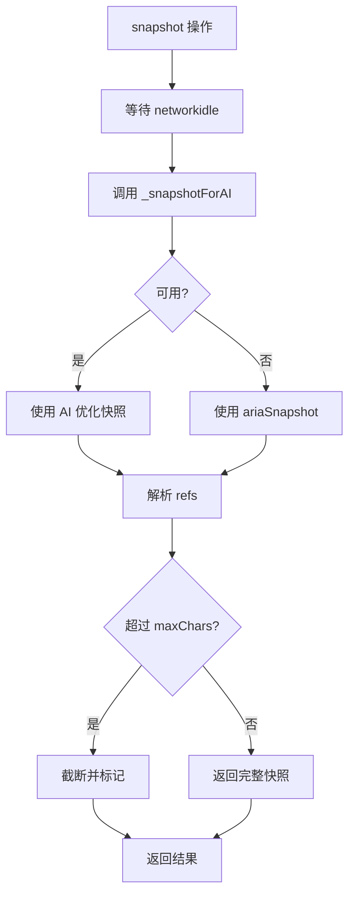
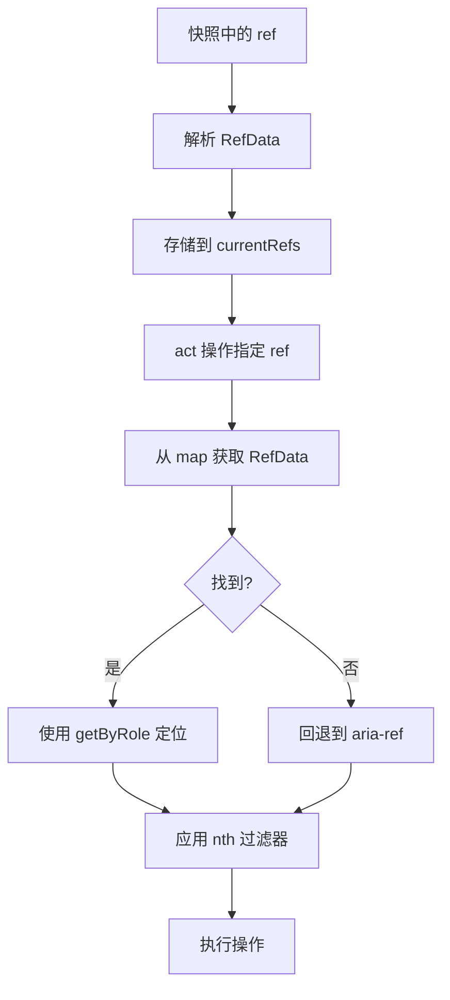
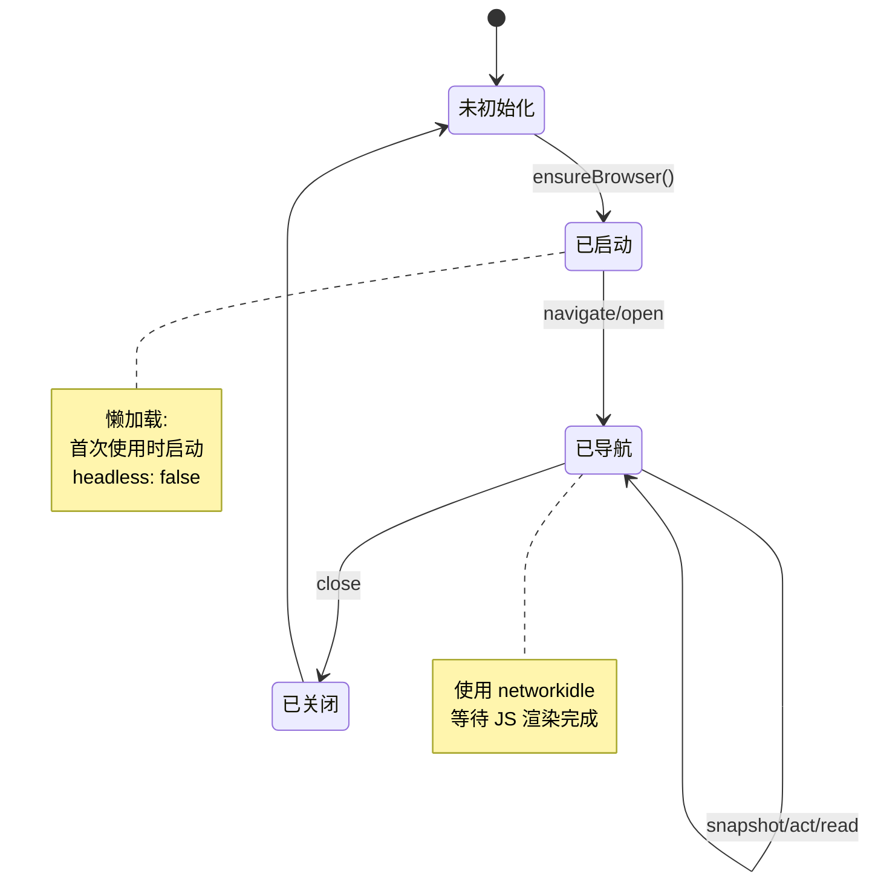

# Browser 工具子模块

[根目录](../../../CLAUDE.md) > [tools](../CLAUDE.md) > **browser**

## 模块职责

Browser 子模块提供基于 Playwright 的浏览器自动化工具，支持网页导航、内容读取和元素交互，用于访问需要 JavaScript 渲染的动态网站。

---

## 入口与启动

### 主入口
- **文件**: `src/tools/browser/index.ts`
- **导出**: `browserTool` - DynamicStructuredTool 实例

### 使用示例
```typescript
import { browserTool } from './tools/browser/index.js';

// 绑定到 LLM
const llmWithTools = llm.bindTools([browserTool]);

// 或直接调用
const result = await browserTool.invoke({
  action: 'navigate',
  url: 'https://example.com'
});
```

---

## 对外接口

### browserTool

**工具名称**: `browser`

**描述**: Navigate websites, read content, and interact with pages. Use for accessing company websites, earnings reports, and dynamic content.

**操作类型** (action):
| 操作 | 说明 | 参数 |
|------|------|------|
| `navigate` | 导航到 URL | `url` |
| `open` | 在新标签页打开 URL | `url` |
| `snapshot` | 获取页面结构快照 | `maxChars?` |
| `act` | 执行页面交互 | `request` |
| `read` | 读取页面文本内容 | - |
| `close` | 关闭浏览器 | - |

### act 操作类型 (kind)

| 类型 | 说明 | 必需参数 |
|------|------|----------|
| `click` | 点击元素 | `ref` |
| `type` | 输入文本 | `ref`, `text` |
| `press` | 按键 | `key` |
| `hover` | 悬停 | `ref` |
| `scroll` | 滚动页面 | `direction?` |
| `wait` | 等待 | `timeMs?` |

---

## 关键依赖与配置

### 依赖项
- **playwright**: 浏览器自动化
- **@langchain/core**: LangChain 工具基类
- **zod**: 模式验证

### 浏览器配置
- **类型**: Chromium
- **模式**: `headless: false` (可见窗口)
- **等待策略**: `networkidle` (等待网络空闲)

---

## 数据模型

### BrowserToolInput
```typescript
interface BrowserToolInput {
  action: 'navigate' | 'open' | 'snapshot' | 'act' | 'read' | 'close';
  url?: string;
  maxChars?: number;
  request?: ActRequest;
}
```

### ActRequest
```typescript
interface ActRequest {
  kind: 'click' | 'type' | 'press' | 'hover' | 'scroll' | 'wait';
  ref?: string;          // 元素引用 (如 e12)
  text?: string;         // 输入的文本
  key?: string;          // 按键 (如 Enter, Tab)
  direction?: 'up' | 'down'; // 滚动方向
  timeMs?: number;       // 等待毫秒数
}
```

### RefData
```typescript
interface RefData {
  role: string;      // 元素角色 (button, link 等)
  name?: string;     // 元素名称
  nth?: number;      // 第 n 个匹配项
}
```

---

## 核心架构

### 快照系统



**Ref 解析**:
- 从快照中提取 `[ref=eN]` 模式
- 存储 `role`、`name`、`nth` 信息
- 用于后续 `act` 操作的元素定位

### Ref 解析与定位



**定位策略**:
1. 优先使用 `getByRole(role, { name, exact: true })`
2. 支持 `nth` 选择第 N 个匹配元素
3. 回退到 `aria-ref` 选择器

### 浏览器生命周期



---

## 操作详解

### navigate
导航到指定 URL。

```typescript
{
  action: 'navigate',
  url: 'https://ir.apple.com'
}
```

**返回**:
```json
{
  "ok": true,
  "url": "https://ir.apple.com",
  "title": "Apple Investor Relations",
  "hint": "Page loaded. Call snapshot to see page structure..."
}
```

### open
在新标签页打开 URL 并切换到该标签页。

### snapshot
获取页面的 AI 优化快照。

```typescript
{
  action: 'snapshot',
  maxChars: 50000  // 默认
}
```

**返回**:
```json
{
  "url": "...",
  "title": "...",
  "snapshot": "- button \"Submit\" [ref=e12]\n- link \"About\" [ref=e15]...",
  "truncated": false,
  "refCount": 15,
  "refs": { "e12": { "role": "button", "name": "Submit" } },
  "hint": "Use act with kind=\"click\" and ref=\"eN\"..."
}
```

### act
执行页面交互操作。

**点击示例**:
```typescript
{
  action: 'act',
  request: { kind: 'click', ref: 'e12' }
}
```

**输入示例**:
```typescript
{
  action: 'act',
  request: { kind: 'type', ref: 'e20', text: 'hello' }
}
```

**滚动示例**:
```typescript
{
  action: 'act',
  request: { kind: 'scroll', direction: 'down' }
}
```

### read
提取页面的主要文本内容。

- 优先选择 `<main>`、`<article>`、`[role="main"]`
- 回退到 `<body>`
- 返回 `innerText`

### close
关闭浏览器并清理状态。

---

## 测试与质量

### 测试文件
- 当前无专门测试文件

### 测试策略
- 通过集成测试验证浏览器操作
- 手动测试验证复杂交互

### 质量考虑
- 超时保护 (导航 30s，操作 8s)
- 错误处理和友好错误消息
- 截断过大的快照 (默认 50000 字符)

---

## 常见问题 (FAQ)

### Q: 为什么使用 headless: false？
A: 可见窗口模式允许用户看到浏览器操作，有助于调试和验证行为。

### Q: 如何处理动态加载的内容？
A: 使用 `networkidle` 等待策略，等待网络请求完成后再操作。

### Q: Ref 解析失败时会发生什么？
A: 回退到 `aria-ref` 选择器，如果仍然失败则返回错误。

### Q: 支持哪些浏览器？
A: 当前使用 Chromium，Playwright 也支持 Firefox 和 WebKit。

### Q: 如何处理弹窗和对话框？
A: 当前实现不处理弹窗，需要手动关闭或添加特定处理逻辑。

---

## 相关文件清单

### 核心文件
- `src/tools/browser/browser.ts` - 主要实现
- `src/tools/browser/index.ts` - 导出

### 依赖模块
- `../types.ts` - 工具类型和格式化函数

---

## 变更记录

### 2026-02-10 19:00:00 - Browser 子模块文档创建
- 创建 Browser 工具子模块 CLAUDE.md
- 完整的操作列表和数据模型
- Ref 解析系统说明
- 架构详解与常见问题解答
