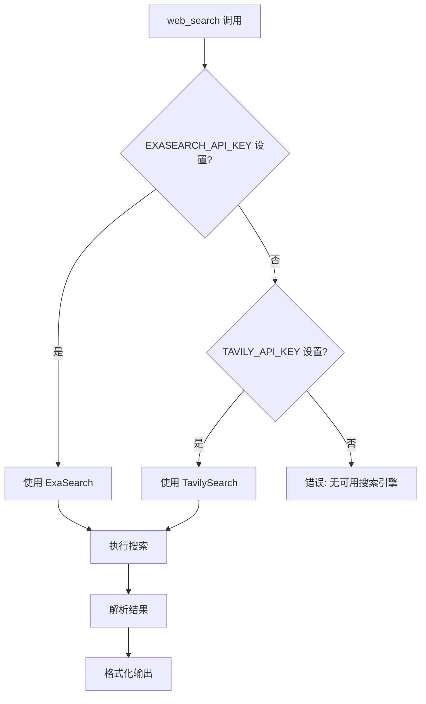

# Search 工具子模块

[根目录](../../../CLAUDE.md) > [tools](../CLAUDE.md) > **search**

## 模块职责

Search 子模块提供网络搜索功能，支持 Exa（优先）和 Tavily 两种搜索引擎，用于获取实时信息和通用网络内容。

---

## 入口与启动

### 主入口
- **文件**: `src/tools/search/index.ts`
- **导出**: `exaSearch`, `tavilySearch` - DynamicStructuredTool 实例

### 使用示例
```typescript
import { exaSearch, tavilySearch } from './tools/search/index.js';

// 绑定到 LLM
const llmWithTools = llm.bindTools([exaSearch]);

// 或直接调用
const result = await exaSearch.invoke({
  query: 'AAPL latest earnings'
});
```

---

## 对外接口

### web_search 工具

**工具名称**: `web_search` (两个实现共享相同名称)

**描述**: Search the web for current information on any topic. Returns relevant search results with URLs and content snippets.

**输入模式**:
```typescript
{
  query: string;  // 搜索查询
}
```

**实现选择**:
- **优先**: Exa (如果设置了 `EXASEARCH_API_KEY`)
- **回退**: Tavily (如果设置了 `TAVILY_API_KEY`)

---

## 关键依赖与配置

### 依赖项

#### Exa
- **@langchain/exa**: LangChain Exa 集成
- **exa-js**: Exa SDK (v2.x)

#### Tavily
- **@langchain/tavily**: LangChain Tavily 集成

### 环境变量
- `EXASEARCH_API_KEY` - Exa API 密钥（优先）
- `TAVILY_API_KEY` - Tavily API 密钥（回退）

### 配置
- **最大结果数**: 5
- **文本内容**: 启用 (`text: true`)

---

## 数据模型

### SearchResult
```typescript
interface SearchResult {
  title: string;
  url: string;
  snippet?: string;
  content?: string;
}
```

### FormattedToolResult
```typescript
{
  data: SearchResult[] | Record<string, unknown>;
  sourceUrls?: string[];
}
```

---

## 核心架构

### 搜索引擎选择



### 实现差异

| 特性 | Exa | Tavily |
|------|-----|--------|
| **SDK 版本** | exa-js v2.x (root) | @langchain/tavily |
| **初始化** | 手动创建 client | 使用内置类 |
| **结果格式** | ExaSearchResults | TavilySearch |
| **兼容性** | 需要 `as any` 转换 | 直接兼容 |

---

## 实现详解

### Exa 搜索

**懒加载模式**:
```typescript
let exaTool: ExaSearchResults | null = null;

function getExaTool(): ExaSearchResults {
  if (!exaTool) {
    const client = new Exa(process.env.EXASEARCH_API_KEY);
    exaTool = new ExaSearchResults({
      client: client as any,  // 兼容性转换
      searchArgs: { numResults: 5, text: true },
    });
  }
  return exaTool!;
}
```

**特殊处理**:
- `exa-js@2.x` 与 `@langchain/exa` 内部使用的 `v1.x` 有私有字段不兼容
- 使用 `as any` 进行类型转换（运行时兼容）

### Tavily 搜索

**懒加载模式**:
```typescript
let tavilyClient: TavilySearch | null = null;

function getTavilyClient(): TavilySearch {
  if (!tavilyClient) {
    tavilyClient = new TavilySearch({ maxResults: 5 });
  }
  return tavilyClient;
}
```

**直接使用**:
- 使用 LangChain 内置的 `TavilySearch` 类
- 无需额外配置

### 结果解析

两者都使用 `parseSearchResults` 工具函数：
```typescript
import { parseSearchResults } from '../types.js';

const result = await searchTool.invoke({ query });
const { parsed, urls } = parseSearchResults(result);
return formatToolResult(parsed, urls);
```

---

## 测试与质量

### 测试文件
- 当前无专门测试文件

### 测试策略
- 通过集成测试验证搜索功能
- 验证两个实现的输出格式一致性

### 质量考虑
- 懒加载避免启动时 API 密钥错误
- 两个实现提供相同接口
- 结果格式统一处理

---

## 常见问题 (FAQ)

### Q: 为什么优先使用 Exa 而不是 Tavily？
A: Exa 通常提供更相关的搜索结果和更好的内容提取。

### Q: 可以同时使用两个搜索引擎吗？
A: 当前实现只选择一个（优先 Exa）。可以修改 `registry.ts` 来同时包含两者。

### Q: 为什么需要 `as any` 转换？
A: `exa-js@2.x` 与 `@langchain/exa` 依赖的 v1.x 有不兼容的私有字段，但运行时兼容。

### Q: 如何更改最大结果数？
A: 修改 `searchArgs: { numResults: N }` 或 `new TavilySearch({ maxResults: N })`。

### Q: 搜索失败时会发生什么？
A: 工具会返回错误信息，Agent 可以尝试其他工具或重试。

---

## 相关文件清单

### 核心文件
- `src/tools/search/exa.ts` - Exa 搜索实现
- `src/tools/search/tavily.ts` - Tavily 搜索实现
- `src/tools/search/index.ts` - 导出

### 依赖模块
- `../types.ts` - 工具类型和解析函数
- `../registry.ts` - 工具注册（选择逻辑）

---

## 变更记录

### 2026-02-10 19:00:00 - Search 子模块文档创建
- 创建 Search 工具子模块 CLAUDE.md
- Exa 和 Tavily 实现说明
- 搜索引擎选择逻辑
- 架构详解与常见问题解答
